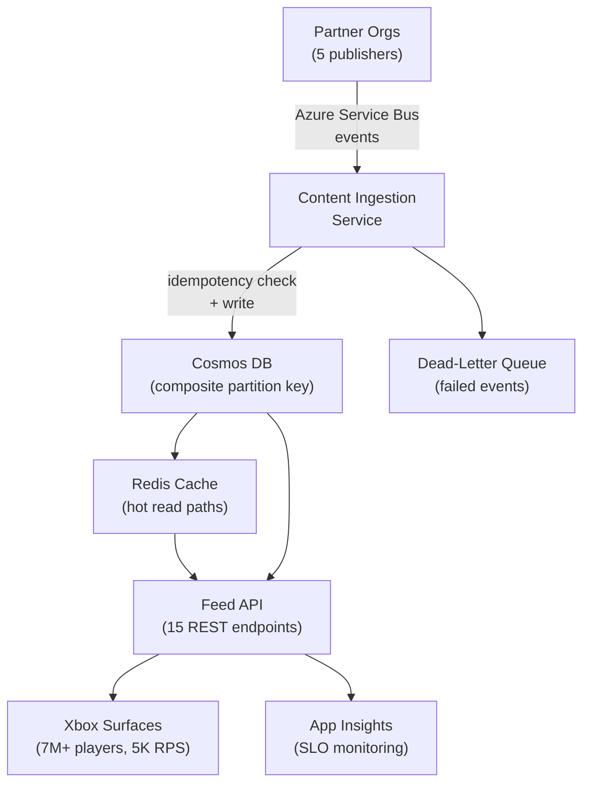
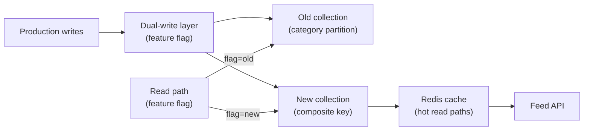
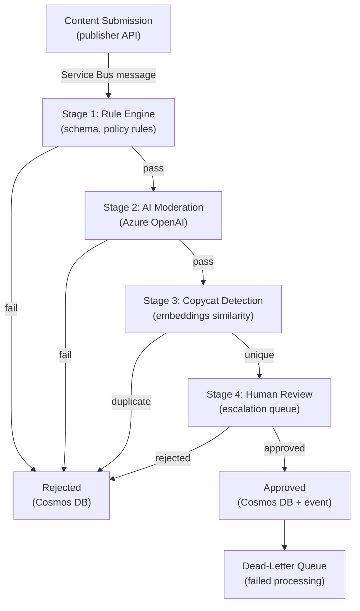
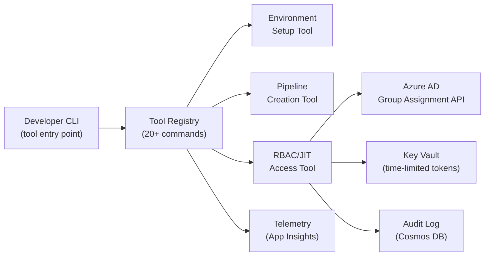
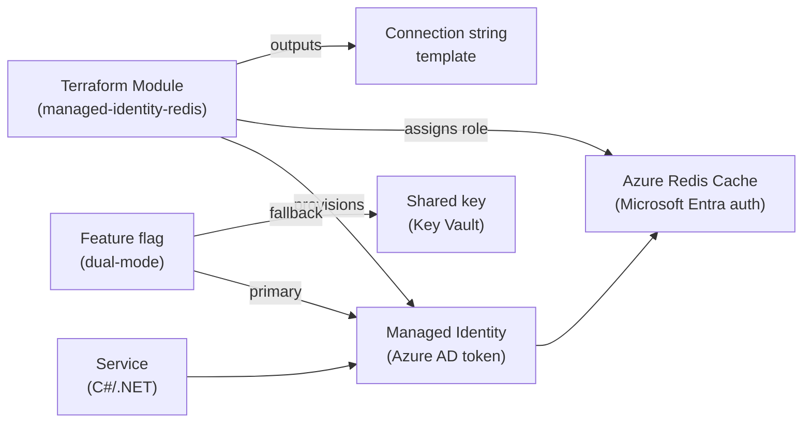
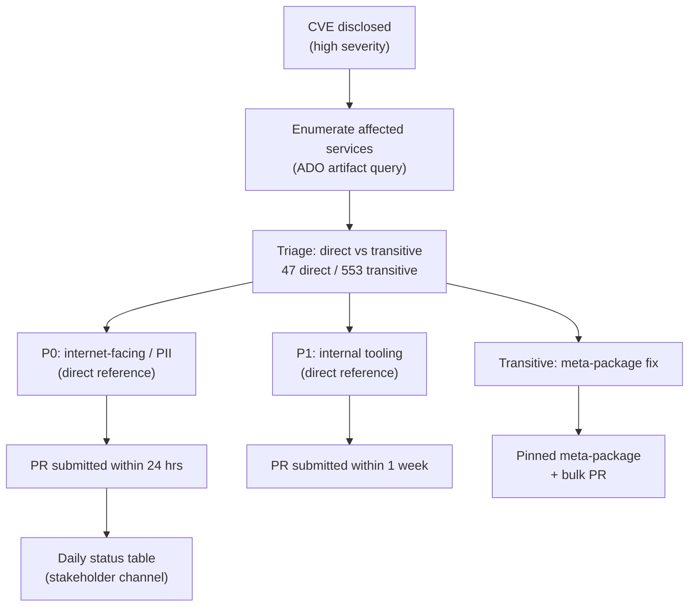
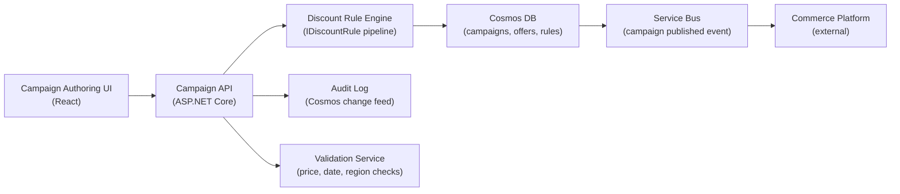
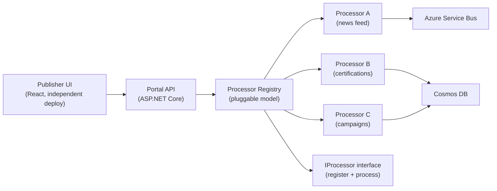
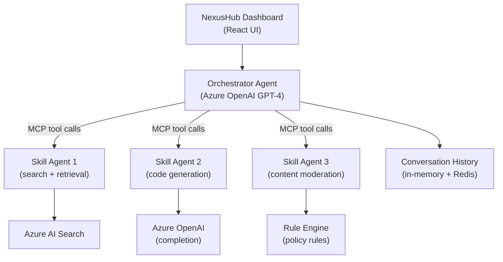

# 1. Project Case Studies

> **TL;DR:** Nine complete resume case studies. Each answers the question "walk me through this project" at both the 30-second and the 5-minute level, with architecture diagrams, decision trade-off tables, and 8-12 deep-dive Q&A.

**Interview weight:** P0 — resume deep-dive questions appear in every senior/lead loop. An unprepared answer on your own project is an automatic red flag.

See also: `../06-System-Design-Case-Studies/` for HLD-level treatments of the same systems.

---

## 1. Publisher News Feed Platform

### Elevator Pitch (30 sec)
I designed and led the Publisher News Feed Platform serving 7M+ Xbox players at 5K RPS with a 99.99% SLO. It replaced 20+ legacy content systems with a single event-driven service exposing 15 REST APIs, backed by Cosmos DB with Redis read caching, coordinated across five partner organizations.

### Problem and Constraints
- 20+ fragmented legacy content endpoints, each owned by a different partner org, returning inconsistent formats.
- Players saw stale or missing content depending on which Xbox surface they used.
- 7M+ concurrent players at peak; 5K RPS read load; 99.99% SLO commitment.
- Fixed launch deadline; team of four engineers; five partner orgs with varying API maturity.

### Requirements
| Requirement | Type | Priority |
|-------------|------|----------|
| Unified feed across all Xbox surfaces | Functional | P0 |
| 5K RPS read throughput | Non-functional | P0 |
| p99 read latency ≤ 150 ms | Non-functional | P0 |
| 99.99% SLO | Non-functional | P0 |
| Zero-downtime launch | Non-functional | P0 |
| Idempotent content ingestion | Non-functional | P0 |
| 15 REST APIs covering all content types | Functional | P1 |

### Architecture

### Key Technical Decisions

| Decision | Chosen approach | Alternative | Why alternative rejected |
|----------|----------------|-------------|--------------------------|
| Integration pattern with partner orgs | Event-driven via Service Bus | Direct DB write (shared DB) | Shared DB couples SLOs; schema changes break both teams; blast radius unbounded |
| Read path scaling | Redis cache in front of Cosmos | Scale Cosmos RU/s | RU/s scales cost linearly; Redis gives sub-millisecond reads for hot content at fixed cost |
| Partition key | Composite: `hash(publisherId)+contentType` | Category only | Category-only = hot partitions on popular genres; composite distributes evenly |
| Content idempotency | Idempotency key on every Cosmos document | Deduplication query on ingest | Query-based dedup is O(N) per event; key-based is O(1) |
| SLO monitoring | App Insights + custom dashboards | Third-party APM | Azure-native; integrates with existing alerting; no additional cost |

### Hard Problems Solved
- **Hot partition prevention** — modeled write distribution from six months of historical content IDs before choosing the composite key; validated in a shadow collection under production-shaped synthetic load.
- **Cross-partner schema alignment** — five partner orgs had different content schemas. I designed a canonical model and wrote adapter transforms for each partner; partners published their native format to Service Bus; ingestion service normalized.
- **Launch coordination** — five orgs with different deployment schedules. Built a shared ADO dashboard tracking per-org integration test status; blockers surfaced on a cadence rather than in reactive Slack messages.
- **Idempotency during retry storms** — Service Bus at-least-once delivery means duplicates are expected. Idempotency key on each document prevented duplicate feed entries during partner outage recovery.

### Metrics and Impact
- 7M+ players reached via unified feed.
- 5K RPS peak load sustained.
- 99.99% SLO maintained for 6+ months post-launch.
- 20+ legacy systems decommissioned.
- 15 REST APIs deployed across all Xbox feed surfaces.

### What I Would Do Differently
- Add partition heat-map monitoring from day one instead of waiting for latency degradation before diagnosing.
- Introduce contract testing (Pact or equivalent) for partner integrations earlier — catching schema drift in CI is cheaper than catching it in staging.
- Write the migration runbook template before writing the first line of code; we retrofitted documentation under pressure.

### Deep-Dive Questions

**Q1. How did you achieve 99.99% SLO?**
A: We defined an error budget, instrumented with App Insights, set alerts at 99.95% to give us a 0.04% response window before breaching SLO, designed circuit breakers for each upstream partner feed with fallback to cached content, and ran failure injection testing in staging to validate that the degraded path served stale but valid content rather than errors.

**Q2. Why Service Bus and not Kafka or Event Hubs?**
A: Service Bus gave us per-message dead-lettering, message lock semantics, and at-least-once delivery with ordered sessions — all native. Kafka gives higher throughput but requires consumer group management and offset tracking that our team didn't have operational experience with. At 5K RPS on the read path (not the write path), write ingestion volume was modest; Service Bus was sufficient and lower operational overhead.

**Q3. How did you handle a partner org whose content format was non-standard?**
A: I wrote an adapter transform per partner as a named C# class implementing a common `IContentTransform` interface. Adding a new partner required writing one new adapter; the ingestion pipeline was unchanged. Two partners had fields with ambiguous semantics — I ran requirements sessions with their technical leads to document the canonical mapping before writing the transform.

**Q4. What happens if Redis goes down?**
A: The API falls through to Cosmos DB for reads. Latency increases from sub-millisecond to 20–50 ms for hot content, which is still within the 150 ms p99 target. We configured App Insights alerting on cache miss rate; a spike signals a Redis issue before it affects SLO. Redis has Azure-managed high availability with replica failover.

**Q5. How did you test at 5K RPS before launch?**
A: Load testing via Azure Load Testing service against the staging environment with production-shaped query distributions (derived from historical traffic logs). We ran 30-minute sustained load tests at 5K RPS and 10-minute burst tests at 8K RPS (60% headroom). Cache hit rate, Cosmos RU consumption, and p99 latency were all measured during the tests.

**Q6. What was your specific contribution vs the team's?**
A: I designed the overall architecture, chose the partition key strategy, wrote the idempotency layer, built the Redis caching integration, designed the shared ADO integration dashboard, and led the partner org coordination. The team built the REST API surface, the adapter transforms for each partner, and the monitoring dashboards. My most important individual contribution was the partition key analysis — getting that wrong would have required a zero-downtime re-migration later.

**Q7. How did you handle the DLQ?**
A: Dead-letter queue events were monitored via an App Insights alert; any DLQ spike was an on-call page. The DLQ had a dedicated processor that logged the raw message and the failure reason, then attempted a manual replay after the underlying cause was fixed. We documented the most common DLQ causes (schema mismatch, invalid content ID) in the runbook so on-call engineers could diagnose without escalating.

**Q8. What was the hardest conversation with a partner org?**
A: One partner org wanted to write directly to our Cosmos collection rather than publish to Service Bus — they argued it was faster for their team. I modeled three failure scenarios (RU saturation during their batch jobs, schema drift, deployment coupling) and presented them in a side-by-side comparison doc. I also offered to write the Service Bus publisher adapter for them — a two-day effort — which removed their timeline objection. They agreed after seeing the failure models.

---

## 2. Cosmos DB Migration: Partition-Key Redesign

### Elevator Pitch (30 sec)
I diagnosed a hot-partition problem in our Cosmos DB collection, designed a composite partition key to distribute load evenly, and executed a zero-downtime migration using dual-write and feature-flag read-path flip. Result: p99 latency 600 ms → 150 ms, gateway load −87%.

### Problem and Constraints
- Content category as partition key; top 3 categories = 71% of all RU consumption.
- p99 read latency: 600 ms vs 200 ms target; gateway fan-out adding load spikes on aggregated queries.
- Platform live to 7M+ players; no downtime acceptable.
- Team capacity: I owned the migration design and execution; one junior engineer for the backfill script.

### Architecture (Migration Path)

### Key Technical Decisions

| Decision | Chosen approach | Alternative | Why alternative rejected |
|----------|----------------|-------------|--------------------------|
| Partition key | `hash(publisherId)+contentType` | `publisherId` only | Top 5 publishers = 60% of content → still hot partitions |
| Migration strategy | Dual-write + feature-flag flip | Big-bang cutover | Big-bang: if p99 degrades post-flip, rollback requires re-migration; dual-write gives 5-min kill-switch |
| Redis caching | Added on new collection | Rely on Cosmos alone | Even with good key design, top content read at 200+ RPS needs sub-ms path; Cosmos can't match Redis |
| Partition key hash | SHA-256 mod 10 prefix | Random UUID prefix | UUID makes range scans impossible; hash mod 10 gives even distribution while preserving determinism |

### Hard Problems Solved
- **Proving the new key would work before migrating** — I sampled 6 months of content IDs, applied the hash function offline, plotted the resulting partition size distribution. Largest projected partition: 8 GB vs 20 GB hard limit. Safe.
- **Zero-downtime validation** — ran both old and new collections in parallel under real write traffic for 48 hours; compared read results via a shadow reader to validate correctness before flipping the flag.
- **Backfill of 40M+ existing documents** — chunked in batches of 50K with progress logging and a resume token so the job could be interrupted and restarted without re-processing.

### Metrics and Impact
- p99 latency: 600 ms → 150 ms (4× improvement).
- API gateway RU fan-out load: −87%.
- Zero player-visible downtime.
- Migration executed over one weekend.
- Runbook reused by another team three months later.

### What I Would Do Differently
- Add partition heat-map monitoring to the service from launch; waiting for a latency incident to diagnose is reactive.
- Automate the dual-write validation comparison rather than spot-checking manually.

### Deep-Dive Questions

**Q1. How did you choose the hash function and bucket count?**
A: SHA-256 mod 10 gives 10 logical partition prefixes. I chose 10 to match the expected publisher count in year one; too few buckets and the top publisher still dominates; too many and cross-partition queries fan out further than needed. The function is deterministic so point reads for a known publisherId always hit the same prefix — no scatter-gather needed for single-publisher reads.

**Q2. How does dual-write work without consistency issues?**
A: During dual-write, both collections receive every write. Reads served from the old collection until validation passes. Validation: a shadow reader samples 1% of reads from the new collection and compares results against the old; we tolerated ≤0.01% mismatch (explained by replication lag). After 48 hours of clean validation, the feature flag was flipped for a single traffic percentage, then 100% over 6 hours.

**Q3. What if the migration had failed halfway through?**
A: Rollback was a configuration change to redirect all reads back to the old collection — which had been receiving all writes in dual-write mode. The old collection was never degraded. Rollback RTO: under 5 minutes. We kept the old collection for two weeks post-cutover before deletion.

**Q4. What's the Cosmos DB partition size limit and how close did you get?**
A: 20 GB per logical partition, 10 K RU/s per logical partition. Our projections put the largest partition at roughly 8 GB after 12 months — 40% headroom. I built a monitoring alert on partition size; at 15 GB it would trigger a review to reassess.

**Q5. How did you handle the backfill of existing documents?**
A: A C# console application with a continuation token. Read batches of 50K documents from the old collection, write to the new collection with the new key. Progress logged to a state table in Azure Table Storage so the job could be killed and resumed. The job ran over 6 hours at off-peak time with throttling to stay under RU budget.

**Q6. Why not just add more RU/s to fix the problem?**
A: Scaling RU/s on a hot partition helps the throughput cap but not the latency; hot-partition reads still queue behind each other. Additionally, the cost scales linearly — tripling RU/s would triple the Cosmos bill without fixing the p99 distribution. The partition redesign was a one-time engineering cost with permanent efficiency gains.

**Q7. What monitoring did you add post-migration?**
A: Partition heat-map dashboard in App Insights (custom metric: RU consumption per logical partition key prefix), p99 latency alert at 175 ms (pre-SLO-breach), and a cache miss rate alert as a leading indicator of Redis health.

**Q8. How did you know the Redis layer would handle the read load?**
A: Benchmarked the Redis instance at 10K GET/s in isolation — well above the 5K RPS we needed. The content IDs in Redis were the top 10% by access frequency (Zipf-distributed from traffic analysis). Cache hit rate in production settled at 94% within one hour of enabling the new collection's read path.

---

## 3. AI Content Certification Platform

### Elevator Pitch (30 sec)
I built a 4-stage event-driven certification engine for AI-generated Xbox content: rule engine, AI moderation, embeddings-based copycat detection, and human review escalation. Idempotent Service Bus consumers, retry/backoff, DLQ, and false-positive reduction via embeddings similarity thresholding.

### Problem and Constraints
- AI-generated content needed certification before appearing on Xbox; manual review didn't scale.
- False positive rate had to stay low — over-rejection damages publisher relationships.
- Processing must be idempotent; Service Bus at-least-once delivery guaranteed duplicate events.
- Latency budget: certification complete within 5 minutes for 95% of submissions.
- Service Bus, Cosmos DB, Azure OpenAI, Azure AI Search (embeddings) available.

### Architecture

### Key Technical Decisions

| Decision | Chosen approach | Alternative | Why alternative rejected |
|----------|----------------|-------------|--------------------------|
| Inter-stage communication | Service Bus topics per stage | Direct API calls between stages | Direct calls create tight coupling; Service Bus enables independent scaling and retry per stage |
| Copycat detection | Embeddings cosine similarity via Azure AI Search | MD5/SHA hash comparison | Hash comparison catches exact duplicates only; embeddings catch semantic copies and near-duplicates |
| Idempotency | Idempotency key on Cosmos + conditional upsert | Check-then-act read before write | Check-then-act has a race condition under at-least-once delivery; conditional upsert is atomic |
| False-positive reduction | Similarity threshold tuning with labeled dataset | Single threshold applied uniformly | Uniform threshold over-rejects in some content categories; per-category tuning reduced false positives significantly |
| Retry strategy | Exponential backoff with jitter + DLQ after 5 retries | Fixed interval retry | Fixed interval causes retry storms; exponential backoff with jitter distributes load |

### Hard Problems Solved
- **Idempotency under at-least-once delivery** — used a composite idempotency key (submissionId + stageId) stored in Cosmos; conditional upsert (`IF NOT EXISTS`) ensures a redelivered message for the same submission-stage pair is a no-op.
- **False-positive reduction** — initial rule engine had 12% false-positive rate on AI-generated descriptions due to overly strict keyword matching. Replaced keyword matching with a semantic similarity check against a curated policy document using embeddings; false positive rate dropped to under 2%.
- **Stage isolation** — each stage is a separate Azure Function consumer on a separate Service Bus topic. A slow or failing stage doesn't starve other stages; auto-scaling per stage is independent.

### Metrics and Impact
- False-positive rate reduced to under 2% (from 12% with rule-engine-only approach).
- 95th percentile certification time under 5 minutes.
- Idempotent design: zero duplicate certifications in 6 months of production operation.
- DLQ SLA: all DLQ items triaged within 4 hours.

### What I Would Do Differently
- Build an evaluation framework for the AI moderation stage earlier — we tuned the similarity threshold manually; an automated eval with a labeled test set would have found the optimal threshold faster.
- Add a feedback loop from human reviewers to retrain the similarity thresholds over time.

### Deep-Dive Questions

**Q1. How does the copycat detection work technically?**
A: The submitted content (title + description) is embedded using Azure OpenAI's text-embedding-ada-002 model. The resulting vector is queried against an Azure AI Search index of all previously approved content using cosine similarity. Submissions with similarity above the threshold trigger a "potential duplicate" flag and are routed to human review rather than auto-approved. The threshold was calibrated on a labeled dataset of 2,000 known-duplicate and known-unique pairs.

**Q2. How do you ensure a failed stage doesn't block the whole pipeline?**
A: Each stage is an independent Service Bus consumer. If Stage 2 (AI moderation) fails, the message enters the Stage 2 topic's DLQ after 5 retries. Stage 1 and Stage 3 are unaffected. The DLQ is monitored separately; a DLQ spike triggers an on-call alert.

**Q3. What's the DLQ handling process?**
A: DLQ items are logged to Cosmos with the raw message, the failure reason, and a timestamp. An on-call alert fires if DLQ depth > 10. The on-call engineer diagnoses using the logged failure reason, fixes the root cause (e.g., Azure OpenAI rate limit, malformed message), and replays the message via a manual replay function. DLQ items older than 48 hours without resolution are escalated to the on-call lead.

**Q4. How do you handle Azure OpenAI rate limits in Stage 2?**
A: Exponential backoff with jitter on the client side. If the rate limit is sustained (HTTP 429 for > 60 seconds), the message is requeued to the Service Bus topic with a 5-minute visibility delay, allowing the function instance to free up and the rate limit to recover. We also have a secondary Azure OpenAI deployment in a different region as a failover, activated via a circuit breaker.

**Q5. What is your specific contribution vs teammates?**
A: I designed the overall 4-stage architecture, chose the Service Bus topic-per-stage pattern, designed the idempotency scheme, and built the copycat detection stage including the embeddings query logic and threshold calibration. Teammates built the rule engine, the human review escalation UI, and the DLQ monitoring dashboard.

**Q6. How did you tune the similarity threshold?**
A: I assembled a labeled test set of 2,000 pairs (1,000 duplicates, 1,000 uniques) from historical review decisions. I ran the embedding query at thresholds from 0.75 to 0.95 in 0.01 increments and measured precision and recall at each threshold. I chose the threshold at the knee of the precision-recall curve that minimized false positives while keeping duplicate detection recall above 90%.

**Q7. How do you handle schema evolution in the Service Bus messages?**
A: Messages include a `schemaVersion` field. Consumers check the version; if they receive a version they don't understand, they dead-letter the message with a "schema version not supported" reason rather than silently dropping or misprocessing it. New schema versions are deployed to consumers before the producers start sending them.

**Q8. What would you do differently from an architecture standpoint?**
A: I'd add a content pre-screening step before Stage 1 to filter out clearly valid submissions without going through the full pipeline — this would reduce Azure OpenAI API calls and latency for the majority of normal content. I'd also invest in an evaluation harness that runs against the labeled test set on every model or threshold change, which we did manually.

---

## 4. Internal Developer Productivity Platform

### Elevator Pitch (30 sec)
I built and drove adoption of an internal platform with 20+ tools used by 130+ developers across 10+ services. It standardized environment setup, pipeline creation, and RBAC/JIT access provisioning, reducing new engineer onboarding time significantly.

### Problem and Constraints
- No standard tooling across the Xbox publisher services org; each team had its own scripts.
- Onboarding a new engineer took multiple days for service-related setup.
- RBAC and JIT access were manual, error-prone, and created standing elevated access.
- No mandate for adoption; had to win engineers through value, not policy.

### Architecture

### Key Technical Decisions

| Decision | Chosen approach | Alternative | Why alternative rejected |
|----------|----------------|-------------|--------------------------|
| Distribution | Shared NuGet / npm package | Web portal | CLI meets engineers where they are (terminal); web portal requires context-switching |
| JIT access model | Time-limited Azure AD group assignment via CLI | Persistent RBAC roles | Persistent roles accumulate; JIT with 8-hour auto-revocation reduces standing access risk |
| Adoption strategy | Pilot with champions, no mandate | Org-wide announcement | Mandated adoption without value proof generates resistance; champions carry the message better |
| Telemetry | Per-command App Insights event | None | Usage data drives roadmap: know which tools are actually used vs abandoned |

### Hard Problems Solved
- **JIT access auto-revocation** — Azure AD group assignment API doesn't natively support TTL. I built a scheduled Azure Function that reads the audit log and removes group members whose grant timestamp + 8 hours has passed.
- **Adoption without a mandate** — ran a survey to identify top pain points, built the top five tools first, ran a demo for two teams, identified one champion per adjacent team. Adoption spread peer-to-peer.

### Metrics and Impact
- 20+ tools in the platform.
- 130+ developers using the platform across 10+ services.
- New engineer service setup time: multiple days → under half a day.
- JIT access model removed all standing elevated access from covered services.

### What I Would Do Differently
- Build the evaluation/feedback loop earlier — I added telemetry late; some tools with low usage weren't caught until after significant investment.
- Open-source the CLI framework internally earlier to let teams contribute tools without my review bottleneck.

### Deep-Dive Questions

**Q1. How did you get engineers to adopt the platform without a mandate?**
A: Survey first — I asked 20 engineers their top 3 pain points. Environment setup, pipeline creation, and RBAC provisioning were the answers. I built those first. I made the tools wrappers over existing workflows so engineers didn't have to learn new concepts — just less typing. I ran a demo for two teams, identified one champion per adjacent team, gave them early access, and let peer recommendation do the work.

**Q2. How does the JIT access revocation work technically?**
A: A time-stamped grant record is written to Cosmos when access is provisioned via the CLI. An Azure Function runs every 15 minutes, queries Cosmos for grants where `grantTime + 8 hours < now`, and calls the Azure AD group remove-member API for each expired grant. The function logs each removal to the audit log. If the function fails, the grant persists; we have a secondary alert if any grant is older than 10 hours.

**Q3. How did you measure the platform's value?**
A: Per-command telemetry in App Insights. I tracked command invocation count, success/failure rate, and (where possible) before/after time comparison for the environment setup tool. For RBAC: I measured the reduction in standing access (number of persistent group memberships before vs after). For onboarding: I asked new engineers to time their first-day setup before and after the platform launch.

**Q4. What was the hardest tool to build?**
A: The pipeline creation tool. Our CI/CD pipelines had significant team-by-team variation in YAML structure, and I had to abstract enough to cover 80% of use cases without requiring every team to work around the abstraction. I built it as a template engine with override hooks — teams could use the default template or override specific stages. The first version had 60% adoption; after three rounds of feedback it reached 90%.

**Q5. How did you handle teams that never adopted?**
A: I let them be. I didn't force it. I made the adopting teams' work visibly easier. Two holdout teams eventually asked to join when they saw peers spending less time on setup during a crunch period. One team never adopted because they had a fundamentally different pipeline structure — I added their pattern as an optional template rather than forcing them to conform.

**Q6. What security review did the JIT access design require?**
A: The security team reviewed the audit log completeness, the revocation reliability (what happens if the function fails), and the scope of group assignments (we ensured groups could not grant subscription-level access, only service-level roles). I framed the pitch to security as "this removes all standing elevated access" — they co-sponsored the RBAC tool rather than just approving it.

---

## 5. Managed Identity Migration and Terraform Module for Redis

### Elevator Pitch (30 sec)
I identified that shared-key Redis authentication was a P1 compliance risk across 14 services, designed a Managed Identity migration, packaged it as a reusable Terraform module with a feature flag for gradual rollout, and migrated all 14 services with zero disruption.

### Problem and Constraints
- 14 services using Redis shared access keys stored in Key Vault; keys rotated infrequently.
- A key leak = full read/write access to session and feed cache data for 7M+ players.
- No team had time to own an unilateral migration; needed to make it easy for others to do it themselves.
- Five services had the key baked into the connection string at startup — required rolling restart.

### Architecture

### Key Technical Decisions

| Decision | Chosen approach | Alternative | Why alternative rejected |
|----------|----------------|-------------|--------------------------|
| IaC tool | Terraform | ARM / Bicep | Org standard; teams could integrate module into existing pipelines without new tooling |
| Migration mode | Dual-mode feature flag | Big-bang cutover | Dual-mode: if Managed Identity fails, fall back to key; reduces risk per service |
| Rollout | Per-service opt-in via module | Forced migration date | Opt-in with frictionless tooling is faster in practice than forced dates with resistance |

### Hard Problems Solved
- **SDK version incompatibility** — one older service used an Azure SDK version that didn't support Managed Identity for Redis. Hit it during my own service migration; documented the SDK version fix before other teams tried.
- **Adoption activation energy** — offered to do the first PR pair-programming with each slow team. Removed the barrier; all 14 services migrated within the window.

### Metrics and Impact
- 14 services migrated; shared-key authentication fully removed.
- Key rotation operational burden eliminated.
- Terraform module adopted by 3 additional teams outside my org.
- Zero service disruptions during migration.

### What I Would Do Differently
- Automate a compliance scan that flags any remaining shared-key usage in CI, so drift is caught before it reaches production.
- Version the Terraform module from the start; we published v1 and had a breaking change when a required variable was renamed.

### Deep-Dive Questions

**Q1. Why is shared-key authentication a risk?**
A: A shared key gives the holder full access to the Redis instance — all data, all operations. If the key is leaked via a log, a misconfigured environment variable, or a compromised CI pipeline, an attacker has unrestricted cache access. Key rotation mitigates this but is operationally burdensome and often delayed. Managed Identity eliminates the key entirely — the service authenticates with its Azure AD identity, which is time-limited, audited, and requires no stored secret.

**Q2. How does Managed Identity authentication work with Redis?**
A: The service uses the Azure SDK's `ManagedIdentityCredential` to obtain an Azure AD token for the Redis resource. The token is short-lived (typically 1 hour) and automatically refreshed by the SDK. The Redis instance is configured with Microsoft Entra authentication enabled; it validates the token against Azure AD. No static secret is involved anywhere in the flow.

**Q3. What's in the Terraform module?**
A: Three resources: a User-Assigned Managed Identity, a Redis Cache Data Contributor role assignment scoped to the specific cache instance, and an output block with the connection string template parameterized for the identity's client ID. The module also accepts a `dual_mode_enabled` boolean that, when true, outputs both the Managed Identity connection string and a Key Vault reference for the fallback key.

**Q4. How did you handle the rolling restart for services with startup-baked connection strings?**
A: I coordinated the restart during off-peak hours, with the load balancer health check window set to 60 seconds to allow graceful drain. Services restarted one instance at a time — rolling restart with no traffic drop. The Managed Identity connection was validated on the new instances before the old instances were drained.

---

## 6. CVE Remediation and CI/CD Unblocking at 600+ Microservices Scale

### Elevator Pitch (30 sec)
When high-severity CVEs hit shared NuGet packages across our 600+ microservice estate, I led triage, enumerated affected services with an ADO query, tiered by blast radius, and remediated all P0 services within 48 hours without blocking ongoing deployments.

### Problem and Constraints
- CVE gate failures blocking CI/CD pipelines for dozens of teams simultaneously.
- 600+ services; 47 with direct references to the affected packages; rest via transitive dependencies.
- Each team had their own pipeline; no single point of remediation.
- Security audit deadline: all P0 services remediated within 48 hours.

### Architecture (Remediation Process)

### Key Technical Decisions

| Decision | Chosen approach | Alternative | Why alternative rejected |
|----------|----------------|-------------|--------------------------|
| Enumeration | ADO artifact inventory query | Manual team-by-team audit | Manual audit would take 8+ hours and miss transitive dependencies |
| Prioritization | Internet-facing + PII = P0; internal = P1 | CVSS score alone | CVSS measures inherent severity; blast radius measures our specific risk |
| Transitive dependencies | Pinned meta-package + bulk PR | Fix each service individually | Individual fixes = 553 PRs; meta-package = one release + bulk PR to update one dependency |

### Hard Problems Solved
- **Transitive dependency management at scale** — wrote a Roslyn analyzer to detect transitive resolution of the affected package version; submitted a single meta-package bump rather than 553 individual PRs.
- **Communication without noise** — daily status table (total, P0 fixed, P1 fixed, blockers) in a pinned channel post; prevented continuous status-query noise from 40+ stakeholders.

### Metrics and Impact
- 47 P0 services: all remediated within 48 hours.
- Full P1 remediations complete within two weeks.
- Zero production incidents attributable to the CVE during the window.
- Daily status table format adopted as standard for future security waves.

### What I Would Do Differently
- Build a continuous CVE monitoring dashboard (SBOM-based) so future CVE waves are detected and scoped in minutes, not hours.
- Establish a standing meta-package strategy for commonly-shared dependencies so the bulk-PR mechanism exists before a crisis.

### Deep-Dive Questions

**Q1. How did you enumerate 600+ services without a pre-existing inventory?**
A: Azure DevOps has an artifact dependency API. I wrote a query against our ADO organization that listed every pipeline referencing a NuGet package matching the affected package name and version range. The query took about 20 minutes to build and returned the full enumeration in under 5 minutes. This is the step that saved ~8 hours of manual audit.

**Q2. How did you handle teams whose pipeline was blocked but had a launch in progress?**
A: Temporary exception with a named expiry date (48 hours), documented in the tracking ADO item, and the team's tech lead acknowledged it. The exception was conditional on them merging the fix PR within the window. No extension without re-review. This gave teams the flexibility to sequence their merge without blocking their launch, while keeping accountability.

**Q3. What was your specific contribution during the remediation?**
A: Wrote the ADO enumeration query; built the triage model; wrote or co-authored PRs for 12 P0 services where I had write access; wrote the meta-package fix for transitive dependencies; wrote and sent the daily status table; facilitated the debrief post-remediation.

---

## 7. Sales Campaign Authoring Platform

### Elevator Pitch (30 sec)
I built the internal Sales Campaign Authoring Platform for Xbox game offers and discounts. The platform modeled offers, discount rules, and regional pricing as composable entities, tied to $5M quarterly revenue impact from campaigns authored through it.

### Problem and Constraints
- Finance and commerce teams needed a structured tool for creating Xbox sales campaigns; existing process was spreadsheets and manual data entry.
- Discount stacking rules (multiple simultaneous discounts with priority ordering, caps, and mutual exclusions) were added mid-build.
- Fixed launch date; scope negotiation required.
- Compliance requirement: complete audit log of all campaign changes.

### Architecture

### Key Technical Decisions

| Decision | Chosen approach | Alternative | Why alternative rejected |
|----------|----------------|-------------|--------------------------|
| Discount logic | Composable `IDiscountRule` pipeline | Single monolithic discount calculator | Monolithic: adding a new rule type requires changing core code; pipeline allows open/closed extension |
| Audit log | Cosmos change feed → dedicated audit collection | Application-layer audit writes | Application-layer audit can be bypassed by direct DB writes; change feed captures all mutations |
| MVP scope | Priority ordering only; stacking rules as fast-follow | Full stacking rules at launch | Full stacking was +3 weeks; MVP delivered on date; full rules shipped 3 weeks later |

### Hard Problems Solved
- **Mid-flight requirements change** — finance added stacking rules 2 months into development. I ran a requirements session to extract the exact business rules (8 distinct constraints), modeled the rule engine interface to absorb them, negotiated MVP scope, and kept the launch date.
- **Mutual exclusion logic** — some discounts are mutually exclusive (can't stack a percentage and a fixed-amount discount on the same item). Modeled as a `MutualExclusionRule` class in the pipeline with a conflict resolution strategy (highest value wins).

### Metrics and Impact
- Platform tied to $5M quarterly revenue impact (campaigns authored through the tool in Q1 post-launch, tracked by finance).
- Rule engine extended to cover regional pricing rules without core changes (design validated by extension).
- Zero data inconsistencies in audit log (change feed approach captures all mutations).

### What I Would Do Differently
- Build a sandbox / simulation mode earlier — finance analysts wanted to preview the effect of a discount before publishing; we added it as a fast-follow but it would have reduced back-and-forth validation cycles significantly.
- Use event sourcing for the campaign state rather than CRUD + audit log; we had several cases where reconstructing "what did this campaign look like at time T" was complex.

### Deep-Dive Questions

**Q1. How does the discount rule engine work?**
A: Each discount rule implements `IDiscountRule` with a single method `Apply(DiscountContext context) -> DiscountResult`. Rules are ordered by a priority integer in Cosmos. The pipeline iterates the ordered list, applies each rule to the context, and short-circuits on a `MutualExclusion` result. Adding a new rule type is one new class; no changes to the pipeline.

**Q2. How did you measure $5M revenue impact?**
A: Finance tracked the total deal value of campaigns published through the platform in Q1. This is revenue enabled by the tool, not generated by it directly. The number was provided by the finance team as part of the post-launch business case review.

**Q3. How did you handle the scope change mid-project?**
A: Two days of requirements elicitation with finance to extract the exact stacking rules (8 rule types). I modeled the time impact: full rules = +3 weeks, MVP (priority ordering only) = 0 weeks. I presented both options to PM with the business risk of each. PM chose MVP + fast-follow. I designed the rule interface to be extensible so the fast-follow required no core changes.

---

## 8. Publisher Portal Monorepo

### Elevator Pitch (30 sec)
I designed the Publisher Portal Monorepo with a pluggable processor model and decoupled UI deployment. The architecture was adopted org-wide across 12 products as the standard for publisher-facing portal work.

### Problem and Constraints
- Publisher Portal had 12 product teams contributing features; tight coupling meant one team's deployment blocked others.
- UI deployments were coupled to backend deployments; a backend rollback broke UI state.
- No shared standards for adding new data processors; each team re-invented the pattern.

### Architecture

### Key Technical Decisions

| Decision | Chosen approach | Alternative | Why alternative rejected |
|----------|----------------|-------------|--------------------------|
| Processor extensibility | `IProcessor` interface + registry | Direct integration per processor type | Direct integration: adding a processor requires modifying core API code; registry: add one class |
| UI/backend coupling | Independent deployment via feature flags | Shared deployment pipeline | Shared pipeline: backend rollback forces UI rollback; independent: UI is always forward-compatible |
| Monorepo tooling | Single ADO repo with per-project pipelines | Polyrepo | Polyrepo: cross-cutting changes (shared contracts, shared components) require multi-repo PRs |

### Metrics and Impact
- Architecture adopted org-wide across 12 products.
- UI and backend deployments fully decoupled; zero deployment-coupling incidents since adoption.
- New processor type added by any team without core code review involvement.

### What I Would Do Differently
- Add contract testing for the `IProcessor` interface earlier; teams implementing processors occasionally broke the contract in subtle ways (e.g., not handling nulls in the process method) that only surfaced in integration testing.

### Deep-Dive Questions

**Q1. How does the pluggable processor model work?**
A: Each processor implements `IProcessor` with methods `bool CanHandle(ProcessorRequest request)` and `Task<ProcessorResult> Process(ProcessorRequest request)`. Processors register themselves in DI at startup. The registry iterates registered processors in priority order and delegates to the first one that returns `true` for `CanHandle`. Adding a new processor is one new class + one DI registration; the core API code is unchanged.

**Q2. How did you decouple UI and backend deployments?**
A: Backend APIs are versioned; the UI always targets the current stable version. New API features are deployed behind feature flags on the backend; the UI picks up new features via a feature flag check at runtime. Backend rollbacks to a prior version don't break the UI because the UI doesn't depend on features that aren't yet flagged on.

**Q3. How did 12 product teams adopt the architecture?**
A: I presented it at the org's engineering forum with a before/after deployment coupling story. Two teams adopted it for their next feature; their experience was positive and visible. The remaining teams adopted over the following six months, largely peer-led. I made the architecture the default template for new Portal work, so new projects started compliant.

---

## 9. NexusHub: AI Agents and Skills Orchestration Dashboard

### Elevator Pitch (30 sec)
NexusHub is a hackathon project I built — an orchestration dashboard for AI agents and skills using MCP (Model Context Protocol) and tool-calling. It allows composing multi-agent workflows visually, with each agent exposing skills as MCP-compatible tools callable by other agents.

### Problem and Constraints
- Hackathon: 48 hours, solo.
- Goal: demonstrate MCP tool-calling interoperability between heterogeneous agents.
- Production constraints relaxed; design for extensibility and demo quality.

### Architecture

### Key Technical Decisions

| Decision | Chosen approach | Alternative | Why alternative rejected |
|----------|----------------|-------------|--------------------------|
| Inter-agent communication | MCP tool-calling protocol | Custom REST between agents | Custom REST: tight coupling, no standard schema; MCP: interoperability and standardized tool discovery |
| Orchestration | LLM-driven planning (GPT-4) | Hardcoded workflow | Hardcoded: brittle; LLM: handles novel task compositions the dashboard hasn't seen before |
| Skill registration | Dynamic tool manifest at agent startup | Static config | Static: requires redeployment to add a skill; dynamic: agent advertises its skills at registration time |

### Hard Problems Solved
- **Tool-calling loop termination** — LLM orchestrator can get into infinite tool-calling loops on ambiguous tasks. Added a max-iterations guard (10 tool calls) with a graceful fallback message.
- **Context window management** — multi-agent conversation histories grow fast. Implemented a sliding window with summarization: the oldest turns are summarized by a smaller model and replaced with the summary.

### Metrics and Impact
- Hackathon project; won internal recognition.
- Demonstrates MCP interoperability between 3 heterogeneous skill agents.
- Extensible: adding a new skill agent requires zero changes to the orchestrator.

### What I Would Do Differently (to productionize)
- Add per-agent circuit breakers and retry logic; the hackathon version has no failure handling.
- Add observability: per-tool-call latency, token consumption, and error rates per skill agent.
- Replace in-memory history with a durable store; conversation context is lost on restart.
- Add human-in-the-loop pause points for high-stakes tool calls (e.g., before writing to a production system).

### Deep-Dive Questions

**Q1. What is MCP and why did you choose it?**
A: Model Context Protocol is an open standard (from Anthropic, now multi-vendor) for exposing tools and context to LLM agents. It standardizes how an agent advertises its capabilities (tool manifests) and how another agent calls those capabilities. I chose it because it gives interoperability — a skill agent built for NexusHub can be plugged into any MCP-compatible orchestrator without changes. The alternative (custom REST) would have required a bespoke protocol for every integration.

**Q2. How do you prevent the orchestrator from calling tools in an infinite loop?**
A: Max-iterations guard: the orchestrator tracks the number of tool calls in the current planning cycle; at 10 calls it stops, summarizes the accumulated context, and returns a "best effort" response to the user. This is a practical production guard; in theory the LLM should terminate naturally, but in practice ambiguous tasks can cause runaway loops.

**Q3. What would you add first to make this production-ready?**
A: Observability and failure handling. Without per-tool-call latency and error rate metrics you can't diagnose which skill agent is the bottleneck or failing. Without circuit breakers a slow skill agent blocks the entire orchestration chain. These two additions would be my day-one production readiness requirements.

---

## Interview Questions

**Q1. Pick any project and walk me through the hardest technical decision you made.**
A: [Use S2/Cosmos for technical depth or S3/AI Certification for AI depth.] The hardest decision on the Cosmos migration was the partition key. I had to balance write distribution (favors hash prefix) against read locality (favors publisherId grouping) and cross-partition query cost (favors fewest partitions). I modeled the write distribution offline against 6 months of production content IDs before committing.

**Q2. What was a project that didn't go as planned and what did you do?**
A: The Sales Campaign Platform stacking rules mid-flight. Requirements changed two months in. I ran a requirements session to extract the exact rules, modeled the timeline impact of full vs MVP scope, negotiated the MVP path, and kept the launch date. Full rules shipped three weeks later.

**Q3. Which of your projects would you most want to revisit with what you know now?**
A: The AI Content Certification Platform. I'd add an evaluation harness for the AI moderation stage on day one — we tuned the similarity threshold manually, which was slow and hard to reproduce. An automated eval loop would have found the optimal threshold in hours instead of days and caught regressions when the model changed.

---

## Quick Recap

- Have the 30-second elevator pitch for each of the 9 projects ready cold.
- Know your specific contribution vs the team's for each project.
- Know at least one "what I'd do differently" per project — shows growth mindset.
- Key metrics to memorize: 7M players, 5K RPS, 99.99% SLO, p99 600→150ms, -87% gateway, 130+ devs, 20+ tools, 600+ microservices, $5M revenue, 12 products, 2% false-positive rate.
- For AI Certification: know cosine similarity, threshold calibration, and idempotency design cold.
- For Cosmos migration: know dual-write + feature flag pattern and why big-bang was rejected.
- Cross-link to `../06-System-Design-Case-Studies/` for HLD treatment of News Feed and AI Content Moderation.
