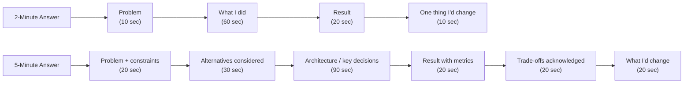

# 2. Resume Bullet Drilldown Checklist

> **TL;DR:** Every resume bullet is an attack surface. Prepare a 2-minute and a 5-minute version of each; know the metrics cold; have an alternative you rejected ready to name; identify the one thing you'd change.

**Interview weight:** P0 — interviewers at senior/lead level spend 20-30 minutes on resume deep-dive. An unprepared bullet on your own project is an immediate credibility hit.

---

## Core Concepts

- **The drill** — for every resume bullet: 2-minute version (problem + what I did + result) and 5-minute version (adds: constraints, alternatives considered, architecture, trade-offs, what I'd change).
- **The five axes** — problem, constraints, alternatives, architecture/trade-offs, metrics. A bullet without all five is not interview-ready.
- **Your contribution** — describe what YOU decided, built, or changed. Use "I" for decisions; "we" only for team execution.
- **Estimation discipline** — if you lack an exact number, say so and provide a reasoned estimate with stated assumptions.

---

## Checklist Table

| Resume bullet | 2-min ready | 5-min ready | Metrics verified | Alternatives ready | Weakness identified |
|---------------|-------------|-------------|-----------------|-------------------|---------------------|
| Publisher News Feed Platform (7M+ players, 5K RPS, 99.99% SLO, 15 REST APIs, Redis read paths) | ☐ | ☐ | ☐ | ☐ | ☐ |
| Cosmos DB migration (partition-key redesign, p99 600→150ms, -87% gateway load, zero-downtime) | ☐ | ☐ | ☐ | ☐ | ☐ |
| AI Content Certification Platform (4-stage, Service Bus, idempotency, DLQ, embeddings copycat detection, false-positive reduction) | ☐ | ☐ | ☐ | ☐ | ☐ |
| Internal Developer Productivity Platform (20+ tools, 130+ devs, 10+ services, RBAC/JIT access) | ☐ | ☐ | ☐ | ☐ | ☐ |
| Managed Identity migration for Redis + Terraform module (shared-key risk removal, 14 services) | ☐ | ☐ | ☐ | ☐ | ☐ |
| CVE remediation and CI/CD unblocking (600+ microservices, 48-hour P0 window) | ☐ | ☐ | ☐ | ☐ | ☐ |
| Sales Campaign Authoring Platform (offer/discount modeling, $5M quarterly revenue impact) | ☐ | ☐ | ☐ | ☐ | ☐ |
| Publisher Portal Monorepo (pluggable processor model, decoupled UI deployment, 12 products) | ☐ | ☐ | ☐ | ☐ | ☐ |
| NexusHub: AI Agents and Skills Orchestration Dashboard (MCP/tool-calling, hackathon) | ☐ | ☐ | ☐ | ☐ | ☐ |

**Print or copy this table and check off each box after you've spoken the answer aloud at least once.**

---

## Standard Interrogation Questions Interviewers Use

Every bullet on every resume gets probed with some subset of these. Prepare answers for all of them for each project.

| Question | What the interviewer is testing |
|----------|--------------------------------|
| "Why did you choose X over Y?" | Technical judgment, awareness of alternatives |
| "What was the hardest part?" | Depth of experience; ability to distinguish hard from merely time-consuming |
| "What broke in production?" | Honesty; on-call experience; failure handling |
| "How did you measure it?" | Rigor; comfort with metrics; understanding of success criteria |
| "What was your specific contribution vs the team's?" | Individual ownership; ability to separate "I" from "we" |
| "What would you change if you did it again?" | Growth mindset; honest self-assessment |
| "How did you handle X edge case?" | Design depth; corner-case thinking |
| "What were the constraints you operated under?" | Contextual awareness; trade-off reasoning |
| "How did it scale?" | Distributed systems thinking |
| "What does the architecture look like?" | Communication; ability to explain design |
| "How did you get stakeholders/partners aligned?" | Leadership and communication |
| "What was the business impact?" | Product sense; ability to connect engineering to outcomes |

---

## Answering "What Was YOUR Contribution?" When Work Was a Team Effort

This is the most commonly fumbled question. Interviewers are scoring you, not your team.

**Framework:**
1. Acknowledge the team briefly: "This was a team of four — here's what I personally owned."
2. Name your specific decisions: architecture choices, design proposals, trade-off calls, escalations, cross-org negotiations.
3. Name your specific code if relevant: "I built the idempotency layer and the Redis caching integration."
4. Name what you led vs what you reviewed: "I led the design review; the team built the REST API surface."
5. Do not claim the team's work as yours; interviewers can tell and will probe it.

**Template answer:**
> "The team of four built this together, but my specific contributions were: I designed the partition key strategy and ran the production traffic simulation to validate it before we committed. I built the dual-write migration framework and the feature-flag flip logic. I led the cross-org coordination with the five partner teams and ran the weekly integration review. The REST API surface and the monitoring dashboards were built by the team."

---

## How to Handle a Bullet You Cannot Fully Defend

Sometimes a bullet represents work you were tangentially involved in, or work done long enough ago that you've lost the details.

**Do:**
- Be honest about your role: "I was the reviewer / architect / consumer of this, not the primary builder."
- Speak to what you do know: the problem, the outcome, the trade-off you remember.
- Acknowledge the gap: "I don't remember the exact implementation details, but here's the design reasoning at the time..."

**Do not:**
- Make up technical details. Senior interviewers know when you're reconstructing.
- Over-claim involvement in work you didn't do. This is a trust failure if caught.

**If you genuinely didn't own the work:** consider removing it from your resume or moving it to a "contributions" section with honest framing. An interviewer who asks you to go deep on a bullet you can't defend is worse than a missing bullet.

---

## Quantifying Impact When You Lack Exact Numbers

Not every metric is available. Use estimation with explicit assumptions.

**Framework:**
1. State what you know: "I don't have the exact figure, but here's how I'd estimate it..."
2. Name your inputs: "We had approximately 5K RPS read load. Redis handles roughly 10K GET/s on our instance size. So at 94% cache hit rate, Cosmos was absorbing roughly 300 RPS."
3. State the assumption: "This assumes a uniform cache hit rate across all content IDs, which was approximately true — our top 10% of content IDs accounted for about 90% of reads."
4. Give the estimate as a range, not a false precision: "Somewhere between 250 and 350 RPS to Cosmos."

**Phrases that work:**
- "I don't have the exact number, but here's how I'd estimate it..."
- "Based on [known input] and [assumption], my estimate is [range]."
- "The metric I do have is [X]; from that you can derive [Y]."

**Phrases that fail:**
- Making up a specific number with false confidence.
- "I don't know" with no follow-up reasoning.

---

## Red Flags Interviewers Listen For

| Red flag | What it signals |
|----------|----------------|
| "We did X" — no "I" anywhere in the story | Can't separate own contribution; possibly peripheral to the work |
| No metrics on a high-scale project | Didn't pay attention to outcomes; or exaggerating the scale |
| Can't name an alternative that was rejected | Didn't think through the design; chose the first idea |
| "It just worked" / no production issues mentioned | Lack of honesty; or low stakes / low scale |
| No weakness or "what I'd change" | Low self-awareness; defensive about mistakes |
| Inconsistent numbers (e.g., 5K RPS in one answer, "millions of requests per second" in another) | Either exaggerating or doesn't know the actual scale |
| Over-claiming on others' work | Trust issue; will be probed into collapse |
| "I don't know" with no reasoning attempt | Gives up instead of problem-solving |
| Defensive on failure questions | Doesn't take ownership; low growth mindset |

---

## Self-Audit Scoring Rubric

Score yourself 1-5 on each dimension for each resume bullet. Target: all bullets at 4+.

| Dimension | 1 — Weak | 3 — Acceptable | 5 — Strong |
|-----------|----------|----------------|-----------|
| Problem clarity | Vague statement of "there was a problem" | Describes the problem with some context | States the problem with scale, constraints, and stakes in under 30 seconds |
| Metrics | No numbers | Has some numbers but can't verify them | Has specific, verified numbers ready cold |
| Your contribution | Uses "we" throughout | Identifies some "I" moments | Clearly separates "I designed/built/decided" from "the team executed" |
| Alternatives | Cannot name any | Names one alternative | Names 2+ alternatives with explicit rejection reasons |
| Weakness / what I'd change | "Nothing, it went great" | Identifies a process weakness | Identifies a concrete technical or architectural decision that could have been better |
| Technical depth | Surface-level description | Can answer one follow-up | Can handle 5 minutes of probing on the hardest technical decision |
| Business impact | No connection to business outcome | Mentions the impact vaguely | Connects the technical work to a specific, quantified business outcome |

---

## Comparison: 2-Minute vs 5-Minute Answer Structure

---

## 20-Question Rapid-Fire Self-Quiz

Answer each question aloud, targeting under 60 seconds per answer. Check answers against `01-Project-Case-Studies.md`.

**Publisher News Feed Platform**
1. What problem did the Publisher News Feed solve, and what was the scale?
2. Why event-driven over polling for partner integrations?
3. How did you choose the Cosmos partition key, and what alternatives did you consider?
4. What was your specific contribution vs the team's?

**Cosmos DB Migration**
5. What was the root cause of the 600ms p99 latency?
6. Walk me through the dual-write migration strategy in under 60 seconds.
7. What would have happened if you'd done a big-bang cutover?

**AI Content Certification Platform**
8. How does the copycat detection work technically?
9. How do you ensure idempotency in the Service Bus consumers?
10. How did you reduce the false-positive rate?

**Developer Productivity Platform**
11. How did you drive adoption without a mandate?
12. How does JIT access revocation work?

**Managed Identity Migration**
13. Why is shared-key authentication a security risk?
14. What's in the Terraform module you built?

**CVE Remediation**
15. How did you enumerate all 600+ affected services?
16. How did you prioritize P0 vs P1 services?

**Sales Campaign Platform**
17. How did you handle the mid-flight scope change from finance?
18. How does the discount rule engine work?

**Publisher Portal Monorepo**
19. How does the pluggable processor model work?
20. How did you decouple UI and backend deployments?

---

**Model answers are in `01-Project-Case-Studies.md` — cross-reference each answer with the relevant deep-dive Q&A section.**

---

## Interview Questions

**Q1. Walk me through how you prepare to defend a resume bullet.**
A: I prepare a 2-minute and a 5-minute version of each bullet. The 2-minute version covers problem, what I did, and result with metrics. The 5-minute version adds constraints, alternatives I rejected, the key architecture decision, and what I'd change. I practice the 2-minute version aloud to make sure it's actually 2 minutes and not 4. I identify the metric I'll name first — that anchors the credibility of the story.

**Q2. How do you handle a question about a project where you weren't the primary engineer?**
A: I'm honest about my role: "I was the reviewer / architect / consumer of this, not the primary builder." Then I speak to what I do know — the problem, the trade-off reasoning, the business outcome. I don't claim ownership I don't have; senior interviewers probe specific implementation details and will catch a false claim quickly.

**Q3. How do you estimate impact when you don't have exact metrics?**
A: I state the inputs I know, name my assumptions, and give a reasoned range. For example: "I don't have the exact RPS figure, but I know we had 7M+ players and our load tests validated 5K RPS — so that's a measured number, not an estimate." If I genuinely have to estimate, I say "my estimate, with the assumption that..., is roughly X." A reasoned estimate with honest caveats is far stronger than a confident wrong number.

---

## Quick Recap

- Checklist: every bullet needs 2-min version, 5-min version, metrics verified, alternatives ready, weakness identified.
- The five axes: problem, constraints, alternatives, architecture/trade-offs, metrics. A missing axis is an attack surface.
- "What was YOUR contribution?" — name specific decisions, specific code, specific negotiations. Use "I."
- Estimation: state inputs + assumptions + range. Never fabricate a specific number.
- Red flags: "we" only, no metrics, no alternatives, no weakness, inconsistent numbers.
- Self-audit target: 4+ on all seven dimensions for every bullet before the interview.
- Rapid-fire quiz: 20 questions → all in under 60 seconds each → you're ready.
