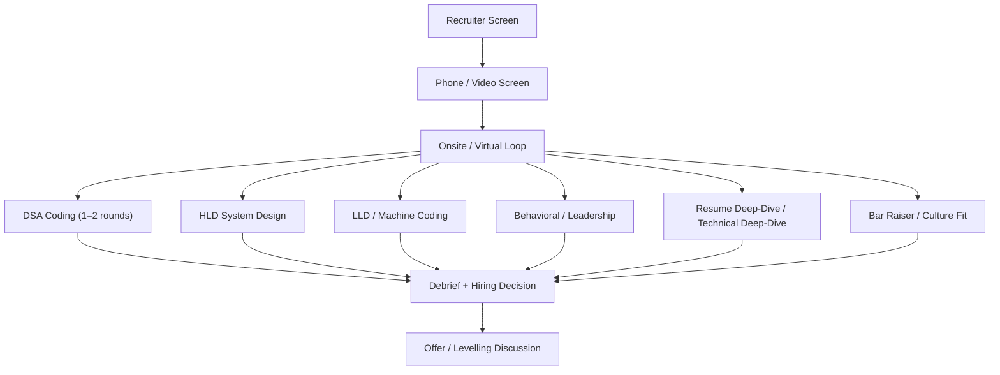
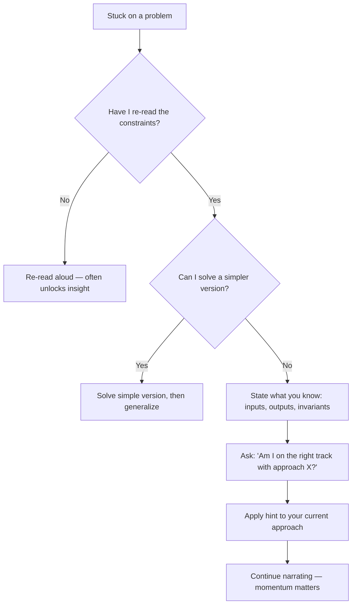

# 1. Round-by-Round Playbook

> **TL;DR:** Every interview round has a predictable structure. Knowing the rules of each game—and rehearsing the playbook—is the highest-ROI use of your last 24 hours.

**Interview weight:** P0 — interviewers at senior/staff level use round structure to calibrate level; not knowing the meta-game costs points before you answer a single question.

---

## Typical Senior Loop Flowchart

---

## Universal Principles

- **Think out loud** — narrate your reasoning. Silence = no signal = no hire.
- **Clarify before coding/designing** — 2–3 targeted questions save 10 minutes of rework.
- **Time-box ruthlessly** — state your time budget for each phase out loud.
- **Recover gracefully** — if stuck, say "I'm going to step back, re-read the constraint, and try a different angle." Never freeze silently.
- **"I don't know"** — say "I don't know off the top of my head, but my first principle reasoning says X." Intellectual honesty + reasoning > bluffing.
- **Ask for hints correctly** — "I'm exploring approach X. Am I on the right track, or is there a constraint I'm missing?" (not "Can you give me a hint?").

---

## Virtual Interview Logistics

| Item | Recommendation |
|------|---------------|
| Editor | VS Code or your IDE with C# extension. Have a scratch file open. |
| Whiteboard tool | Excalidraw or miro tab pre-opened. |
| Screen share | Share a single window, not whole desktop. |
| Environment | `dotnet new console` project ready; `dotnet run` tested. |
| Internet | Wired or 5GHz Wi-Fi. Use phone hotspot as backup. |
| Camera & audio | Test 30 min before. Headphones prevent echo. |
| Backup plan | "My internet dropped — I'll rejoin in 60 seconds." Pre-communicate. |

---

## Senior vs Staff Signal Table

| Dimension | Senior answer | Staff answer |
|-----------|--------------|--------------|
| Problem scoping | Clarifies happy path | Asks about failure modes, SLOs, abuse patterns |
| Design decisions | Proposes correct solution | Proposes, evaluates 2–3 alternatives, articulates trade-offs |
| Scale reasoning | "We'll add more servers" | Capacity-models the bottleneck, names exact thresholds |
| Ambiguity handling | Asks for clarification | Drives to a decision, states assumption, moves forward |
| Unknowns | Struggles to continue | Applies first principles, estimates, flags risk |
| Cross-team impact | Describes own work | Explains how decision affects adjacent teams / org |
| Failure modes | Mentions them if asked | Proactively identifies top 3, with mitigations |

---

## Round Playbooks

### Phone Screen

**What it tests:** basic technical communication, seniority signal, culture fit pre-filter.  
**Time budget:** 30–45 min; usually 5 min intro + 15–20 min technical + 10 min Q&A.

**Playbook:**
1. Elevator pitch: name, company, current role, one flagship project (30 sec).
2. For any question: answer → evidence → impact (metric).
3. For any light technical question: state the trade-off, not just the definition.
4. Ask 2–3 targeted questions (see "Questions to Ask" section).

| Strong hire | No hire |
|-------------|---------|
| Clear metrics in every story | Vague "I helped the team" |
| Names the tech stack and explains *why* | Lists tech without rationale |
| Asks smart questions about the role | Generic "What's the culture like?" |

**Red flags:** talking too long on one topic, not asking any questions, salary discussion before offer.  
**Files to revise:** `../16-Behavioral-and-Leadership/01-STAR-Framework-and-Story-Bank.md`

---

### DSA Coding Round

**What it tests:** problem-solving speed, code quality, pattern recognition, communication.  
**Time budget:** 45–60 min; budget: 5 min clarify, 5 min approach, 25 min code, 10 min test/fix, 5 min optimize.

**Playbook:**
1. Repeat the problem in your own words. Confirm constraints (n ≤ 10^5? integers only?).
2. Work through 1–2 examples on paper/whiteboard.
3. State brute-force in one sentence, then immediately improve: "Brute force is O(n²) scan. With a hash set I can get O(n)."
4. Narrate your code as you type. Name variables clearly.
5. Trace through your own test cases before saying "done."
6. After working solution: mention time/space complexity and one possible optimization.

| Strong hire | No hire |
|-------------|---------|
| Correct solution, clean code, explains complexity | Correct solution, spaghetti, silent |
| Handles edge cases before asked | Misses null/empty/overflow |
| Improves approach after first pass | Stops at brute force |
| Recovers from hint gracefully | Needs step-by-step spoon-feeding |

**Red flags:** jumping straight to code, not testing your own code.  
**Files to revise:** `../01-DSA/01-Complexity-and-Problem-Solving-Framework.md`, `../01-DSA/16-Pattern-Cheatsheet-and-Problem-List.md`

---

### Machine Coding / Low-Level Implementation Round

**What it tests:** real code quality, OOP, abstractions, working software in 60–90 min.  
**Time budget:** 10 min clarify/design, 50–60 min code, 10–15 min demo + extension.

**Playbook:**
1. Clarify: scope MVP, confirm data types, note what's out of scope.
2. Sketch interfaces and classes (2–3 min on paper/whiteboard).
3. Code core data structures first, then business logic, then I/O.
4. Compile and run early — a running stub beats perfect uncompiled code.
5. Demo with a simple `Main` that exercises all paths.
6. Point out extension hooks proactively ("To add persistence I'd swap the in-memory store for a repository interface here").

**Files to revise:** `02-Machine-Coding-and-Debugging-Rounds.md`

---

### HLD System Design Round

**What it tests:** architectural thinking, trade-off reasoning, distributed systems fluency, scale intuition.  
**Time budget:** 45–60 min; budget: 5 min requirements, 5 min estimation, 10 min API+data model, 20 min architecture, 10 min deep dive + trade-offs, 5 min Q&A.

**Playbook:**
1. **Requirements:** functional (2–3 core features), non-functional (QPS, latency, availability, durability), out of scope.
2. **Estimation:** DAU → QPS → storage/bandwidth. State assumptions. (See `../99-Cheatsheets/01-Numbers-and-Latency-Cheatsheet.md`)
3. **API:** 2–3 key endpoints with request/response shapes.
4. **Data model:** key entities, partition/index strategy.
5. **Architecture:** draw boxes left-to-right: client → LB → API → service layer → DB/cache/queue.
6. **Deep dive:** pick the hardest component (consistency, fan-out, real-time delivery) and go deep.
7. **Trade-offs:** proactively name what you'd sacrifice and why.

| Strong hire | No hire |
|-------------|---------|
| Drives requirements → design coherently | Jumps to DB without requirements |
| Capacity-models the bottleneck | Hand-waves scale |
| Names specific technologies with rationale | Says "use a database" |
| Identifies top 3 failure modes | Only covers happy path |
| Makes explicit trade-off calls | Tries to have it all |

**Red flags:** premature optimization, ignoring non-functional requirements, not asking about scale.  
**Files to revise:** `../05-System-Design-HLD/01-System-Design-Interview-Framework.md`, `../99-Cheatsheets/02-System-Design-One-Pager.md`

---

### LLD / OOD Round

**What it tests:** SOLID, design patterns, clean abstractions, extensibility.  
**Time budget:** 45–60 min; budget: 5 min requirements, 10 min class sketch, 25 min code, 10 min extend + review.

**Playbook:**
1. Identify entities, relationships, and behaviors. Draw a quick class diagram.
2. Name interfaces before implementations — shows SOLID instinct.
3. Choose a design pattern explicitly and say so: "I'll use Strategy here to make eviction policies pluggable."
4. Code the core classes with real method signatures, not pseudocode.
5. Discuss what would change if requirement X were added.

| Strong hire | No hire |
|-------------|---------|
| Interfaces + implementations, SOLID by default | One big class, no interfaces |
| Pattern chosen explicitly with rationale | Pattern used accidentally |
| Open-closed: adding feature = new class | Adding feature = editing existing class |
| Single method ~10 lines, descriptive names | 80-line methods, `var x = ...` everywhere |

**Files to revise:** `../07-LLD-and-Design-Patterns/01-LLD-Interview-Framework-and-UML.md`, `02-Machine-Coding-and-Debugging-Rounds.md`

---

### Debugging / Live-Site Troubleshooting Round

**What it tests:** systematic thinking under pressure, reading errors, forming hypotheses.  
**Time budget:** 45 min. Budget: 5 min read, 10 min hypothesize, 20 min investigate, 10 min fix + explain.

**Playbook:**
1. Read the error/alert completely before touching anything.
2. State your top 3 hypotheses ranked by probability.
3. Test the most likely hypothesis with the least invasive probe first.
4. Bisect: "If I rule out the DB, then it must be the service layer."
5. Fix, verify, and state what monitoring you'd add to catch this earlier.

**Files to revise:** `02-Machine-Coding-and-Debugging-Rounds.md`, `../12-Testing-and-Debugging/03-Debugging-Profiling-and-Production-Incidents.md`

---

### Code Review Round

**What it tests:** code quality standards, mentoring ability, constructive feedback.  
**Time budget:** 30–45 min; 10 min read, 20 min feedback, 5 min discussion.

**Playbook:**
1. Scan for correctness first (bugs, null refs, concurrency issues).
2. Then readability and maintainability (naming, SRP, method length).
3. Then performance (N+1, missing index, unnecessary allocation).
4. Give feedback as "I'd suggest…" / "Have you considered…" — not "this is wrong."
5. Acknowledge what's done well.

| Strong hire | No hire |
|-------------|---------|
| Finds real bugs, explains root cause | Only catches style issues |
| Positive + constructive tone | Blunt, no suggestions |
| Thinks about testability and extension | Reviews only the code as written |

---

### Deep Technical / Language Round (C#/.NET)

**What it tests:** language internals, platform knowledge, performance reasoning.  
**Time budget:** 45–60 min.

**Playbook:**
1. For any "what is X" question: definition + when to use + gotcha.
2. For any "why" question: explain the mechanism, not just the effect. E.g., async/await state machine.
3. For any performance question: name allocations, GC pressure, and cache behavior.
4. Bridge to real experience: "In our Xbox service we saw this exact issue when..."

**High-yield topics:** `async`/`await` internals, value vs reference types, `Span<T>`, DI lifetimes, GC generations, LINQ deferred execution, concurrent collections, `IDisposable`/finalizers.  
**Files to revise:** `../02-CSharp-DotNet/00-README.md`, `../99-Cheatsheets/03-CSharp-DotNet-One-Pager.md`

---

### Behavioral / Leadership Round

**What it tests:** STAR storytelling, growth mindset, conflict resolution, team impact.  
**Time budget:** 45–60 min, typically 4–6 questions.

**Playbook:**
1. Open with context (2 sentences), the challenge (1 sentence), then your actions (bulk), then result with metric.
2. Always end with: "And the longer-term impact was X."
3. Have 8–10 STAR stories ready; each story should be reusable across multiple question types.
4. For "failure" questions: own the failure cleanly, focus on learning and system change.

**Story-to-question mapping:**

| Question type | Lead story |
|---------------|-----------|
| Technical leadership | Publisher News Feed: 4 engineers, 5 partner orgs, 7M+ players |
| Performance win | p99 latency 600→150ms; gateway load -87% |
| Platform impact | Developer Productivity Platform: 130+ devs, 10+ services |
| Security/reliability | Managed Identity migration, CVE remediation at 600+ microservices |
| Mentoring | Xbox hiring interviewer; mentored junior engineers |
| Conflict/disagreement | Cosmos DB partition-key decision against team preference |
| Cross-team influence | 5 partner orgs, org-wide adoption across 12 products |
| Failure & learning | Any on-call incident story with clear RCA and process change |
| Ambiguity | AI Content Certification scoping from scratch |

**Files to revise:** `../16-Behavioral-and-Leadership/01-STAR-Framework-and-Story-Bank.md`, `../17-Resume-Deep-Dive/02-Resume-Bullet-Drilldown-Checklist.md`

---

### Resume Deep-Dive Round

**What it tests:** depth of ownership, technical mastery of your own work.  
**Time budget:** 45–60 min.

**Playbook:**
1. For each project: problem → constraints → alternatives considered → architecture → key trade-offs → metrics → what you'd do differently.
2. Anticipate "why not X" for every choice on your resume.
3. Know every number: 7M players, 5K RPS, 99.99% SLO, p99 600→150ms, 87% gateway reduction, 130+ devs, 600+ microservices.
4. For AI projects: be ready to go deep on the embedding/RAG pipeline, not just "we used AI."

**Files to revise:** `../17-Resume-Deep-Dive/01-Project-Case-Studies.md`, `../17-Resume-Deep-Dive/02-Resume-Bullet-Drilldown-Checklist.md`

---

### Bar Raiser / Culture Fit

**What it tests:** values alignment, intellectual curiosity, growth mindset, org-level thinking.  
**Time budget:** 45–60 min; often harder behavioral questions + one technical curveball.

**Playbook:**
1. "Raise the bar" questions probe for exceptional: "Tell me about the hardest technical decision you've made" — push to a real difficult call, not a safe story.
2. Values questions: be specific. "We value ownership" → concrete ownership story, not "I take ownership."
3. For the technical curveball: think out loud, apply first principles, admit uncertainty — they're testing reasoning process.

**Phrases that signal bar-raiser level:**
- "The first-order impact was X, but the second-order effect I wasn't anticipating was Y."
- "In hindsight, the decision I'd revisit is Z, because we now know W."
- "I looked at this from the perspective of the team two years from now, not just the next sprint."

---

### Hiring Manager Round

**What it tests:** team fit, leadership style, ambition, manager's perspective on your strengths.  
**Time budget:** 45–60 min; usually more conversational.

**Playbook:**
1. Ask about team structure, current challenges, and tech direction early — this is dialogue, not interrogation.
2. Show strategic thinking: connect your experience to their problems.
3. Ask about growth, promotion criteria, and how success is measured in the first 90 days.
4. Be honest about what excites you and what you're less excited about — authenticity scores well.

---

### Candidate's Questions (End of Every Round)

**Always have 3 questions ready per interviewer type.** Not asking questions signals low interest.

| Interviewer type | Strong questions |
|-----------------|-----------------|
| Engineer peer | "What's the biggest source of technical debt you deal with daily?" "What does a typical on-call incident look like?" |
| Tech lead / EM | "What would make someone in this role a 10x contributor vs a solid contributor?" "How does the team balance feature velocity and reliability?" |
| Bar raiser | "What's the most important value the team looks for that doesn't show up in job descriptions?" |
| Hiring manager | "What are the top 3 outcomes you'd want from this role in the first 6 months?" "How does the team approach disagreements on architectural direction?" |
| Recruiter | "What's the typical timeline from offer to start?" "Is the level flexible based on how the loop goes?" |

---

## How to Recover When Stuck

---

## How to Ask for Hints Without Losing Points

- GOOD: "I'm trying approach X. I see it handles case Y but I'm not sure it handles Z — am I missing a constraint?"
- GOOD: "My instinct is a sliding window here. Does the problem have the monotonicity property I'd need for that?"
- BAD: "I'm stuck, can you give me a hint?"
- BAD: Silent pause for 2+ minutes.

---

## Time Management Inside a Round

| Phase | DSA (60 min) | HLD (60 min) | LLD (60 min) |
|-------|-------------|-------------|-------------|
| Clarify | 5 min | 5 min | 5 min |
| Design / approach | 5 min | 5 min | 10 min |
| Core work | 30 min | 25 min | 30 min |
| Test / demo | 10 min | 10 min | 10 min |
| Extend / trade-offs | 5 min | 10 min | 5 min |
| Buffer / Q&A | 5 min | 5 min | — |

---

## Interview Questions

**Q1. What separates a Senior SWE answer from a Staff SWE answer in system design?**  
A: Staff candidates proactively model failure modes, quantify bottlenecks, evaluate 2–3 alternatives with trade-offs, and connect the decision to org-level concerns (team ownership, operational burden, cost). Senior candidates propose correct solutions; Staff candidates argue for them.

**Q2. How do you handle a question you genuinely don't know in a technical interview?**  
A: "I don't know the exact answer, but reasoning from first principles: [X]. I'd want to verify [Y] after the interview." Interviewers value intellectual honesty + reasoning process over memorized facts.

**Q3. You have 10 minutes left in a system design and haven't covered availability. What do you do?**  
A: Say "I want to flag availability — I haven't covered it yet. At high level: [replication, failover, health checks]. I can go deeper if you want or we can cover trade-offs first." Signal awareness and let interviewer steer.

**Q4. How do you demonstrate leadership in a coding round?**  
A: Proactively propose the test plan, identify edge cases the interviewer didn't mention, suggest an extension point, and say "if this were production code I'd also add X." Shows you think beyond the task.

**Q5. What's the best way to ask for a hint without signalling weakness?**  
A: Frame it as hypothesis validation: "I'm considering a two-pointer approach assuming the array is sorted. Am I interpreting the constraint correctly?" This shows reasoning and invites targeted feedback.

---

## Quick Recap

- Every round has a meta-game — know it before you walk in.
- Clarify first, code/design second. Silence costs more than a wrong question.
- Think out loud: interviewers can only evaluate what they can hear.
- Use the stuck recovery flowchart — momentum beats perfection.
- Always ask 3 targeted questions; no questions = low interest signal.
- Senior = correct solution. Staff = correct solution + trade-offs + failure modes + org impact.
- Prep the night before by reading the specific playbook section + the linked notebook file.
