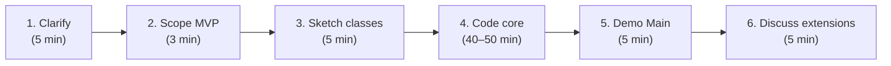
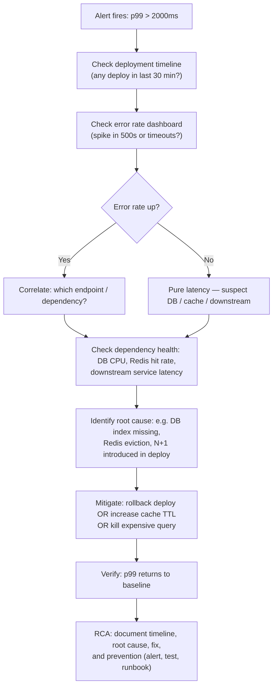

# 2. Machine Coding and Debugging Rounds

> **TL;DR:** Machine coding = build a working mini-system in 60–90 min with clean OOP. Debugging = hypothesis-driven bisecting, not random guessing. Both reward systematic thinking over speed.

**Interview weight:** P0 — common at companies that run a "practical coding" round instead of pure DSA. Directly probes production engineering instincts.

---

## Machine Coding Round

### The Repeatable Approach



**Clarify:** confirm data types, thread-safety expectations, persistence (in-memory OK?), what's out of scope.  
**Scope MVP:** name the 3 things that MUST work; defer the rest.  
**Sketch classes:** write interface names and key method signatures before any implementation.  
**Code core:** data structures first, then business logic, then I/O/demo.  
**Demo:** run a `Main` that exercises all core paths including an error path.  
**Discuss extensions:** proactively name the extension seams you left.

---

### What Graders Score

| Dimension | Weight | What "good" looks like |
|-----------|--------|----------------------|
| Working code | High | Compiles and runs; core feature demonstrated |
| Clean abstractions | High | Interfaces, SRP, meaningful names |
| Extensibility | High | New feature = new class, not edit to existing |
| Correctness | High | Edge cases handled (null, empty, capacity) |
| Tests / testability | Medium | At least basic self-test in Main; methods are unit-testable |
| No over-engineering | Medium | No DI container, no async, no DB for an in-memory problem |
| Code speed | Low | Completion matters more than style |

---

### C# Project Skeleton

```csharp
// dotnet new console -n MachineCoding --framework net8.0
// Structure your single file or split:
//   IStore.cs        <- interfaces only
//   LruCache.cs      <- core implementation
//   Program.cs       <- Main demo

// Useful in-memory persistence patterns:
//   Dictionary<TKey, TValue>          plain store
//   LinkedList<T> + Dictionary        O(1) LRU eviction
//   SortedDictionary<TKey, TValue>    ordered by key
//   ConcurrentDictionary              thread-safe store
//   PriorityQueue<T, TPriority>       min/max heap (.NET 6+)
```

---

### Time Allocation

| Phase | Time |
|-------|------|
| Clarify + sketch | 8–10 min |
| Core data structure + logic | 30–40 min |
| Error handling + edge cases | 10 min |
| Demo (Main) | 5 min |
| Extension discussion | 5–10 min |

---

## Worked Solution A — In-Memory Key-Value Store with TTL and LRU Eviction

```csharp
public interface ICache<TKey, TValue>
{
    void Put(TKey key, TValue value, TimeSpan? ttl = null);
    bool TryGet(TKey key, out TValue value);
    void Remove(TKey key);
    int Count { get; }
}

public class LruTtlCache<TKey, TValue> : ICache<TKey, TValue> where TKey : notnull
{
    private readonly int _capacity;
    private readonly Dictionary<TKey, LinkedListNode<CacheEntry>> _map;
    private readonly LinkedList<CacheEntry> _lruList;
    private readonly Lock _lock = new();

    public LruTtlCache(int capacity)
    {
        _capacity = capacity;
        _map = new Dictionary<TKey, LinkedListNode<CacheEntry>>(capacity);
        _lruList = new LinkedList<CacheEntry>();
    }

    public void Put(TKey key, TValue value, TimeSpan? ttl = null)
    {
        lock (_lock)
        {
            if (_map.TryGetValue(key, out var node))
            {
                _lruList.Remove(node);
                _map.Remove(key);
            }
            else if (_map.Count >= _capacity)
            {
                Evict();
            }
            var entry = new CacheEntry(key, value,
                ttl.HasValue ? DateTime.UtcNow + ttl.Value : (DateTime?)null);
            var newNode = _lruList.AddFirst(entry);
            _map[key] = newNode;
        }
    }

    public bool TryGet(TKey key, out TValue value)
    {
        lock (_lock)
        {
            if (_map.TryGetValue(key, out var node))
            {
                if (node.Value.IsExpired())
                {
                    _lruList.Remove(node);
                    _map.Remove(key);
                    value = default!;
                    return false;
                }
                _lruList.Remove(node);
                _lruList.AddFirst(node);
                value = node.Value.Value;
                return true;
            }
            value = default!;
            return false;
        }
    }

    public void Remove(TKey key)
    {
        lock (_lock)
        {
            if (_map.TryGetValue(key, out var node))
            {
                _lruList.Remove(node);
                _map.Remove(key);
            }
        }
    }

    public int Count => _map.Count;

    private void Evict()
    {
        var tail = _lruList.Last;
        if (tail is null) return;
        _lruList.RemoveLast();
        _map.Remove(tail.Value.Key);
    }

    private record CacheEntry(TKey Key, TValue Value, DateTime? Expiry)
    {
        public bool IsExpired() => Expiry.HasValue && DateTime.UtcNow > Expiry.Value;
    }
}

// Main demo
var cache = new LruTtlCache<string, string>(3);
cache.Put("a", "alpha", TimeSpan.FromSeconds(5));
cache.Put("b", "beta");
cache.Put("c", "gamma");
cache.Put("d", "delta");                      // evicts LRU = "a" (or expired)
Console.WriteLine(cache.TryGet("b", out var v) ? v : "miss");  // beta
Console.WriteLine(cache.Count);               // 3
```

---

## Worked Solution B — Rate Limiter with Pluggable Strategies

```csharp
public interface IRateLimiter
{
    bool Allow(string clientId);
}

// Strategy 1: Token Bucket
public class TokenBucketLimiter : IRateLimiter
{
    private readonly int _capacity;
    private readonly double _refillRate; // tokens per second
    private readonly Dictionary<string, BucketState> _buckets = new();
    private readonly Lock _lock = new();

    public TokenBucketLimiter(int capacity, double refillRate)
    {
        _capacity = capacity;
        _refillRate = refillRate;
    }

    public bool Allow(string clientId)
    {
        lock (_lock)
        {
            if (!_buckets.TryGetValue(clientId, out var state))
                state = _buckets[clientId] = new BucketState(_capacity, DateTime.UtcNow);

            var now = DateTime.UtcNow;
            var elapsed = (now - state.LastRefill).TotalSeconds;
            var tokens = Math.Min(_capacity, state.Tokens + elapsed * _refillRate);

            if (tokens < 1) return false;
            _buckets[clientId] = state with { Tokens = tokens - 1, LastRefill = now };
            return true;
        }
    }

    private record BucketState(double Tokens, DateTime LastRefill);
}

// Strategy 2: Fixed Window Counter
public class FixedWindowLimiter : IRateLimiter
{
    private readonly int _limit;
    private readonly TimeSpan _window;
    private readonly Dictionary<string, WindowState> _windows = new();
    private readonly Lock _lock = new();

    public FixedWindowLimiter(int limit, TimeSpan window)
    {
        _limit = limit;
        _window = window;
    }

    public bool Allow(string clientId)
    {
        lock (_lock)
        {
            var now = DateTime.UtcNow;
            if (!_windows.TryGetValue(clientId, out var w) || now >= w.WindowEnd)
                _windows[clientId] = w = new WindowState(0, now + _window);

            if (w.Count >= _limit) return false;
            _windows[clientId] = w with { Count = w.Count + 1 };
            return true;
        }
    }

    private record WindowState(int Count, DateTime WindowEnd);
}

// Factory / context
public class RateLimiterFactory
{
    public static IRateLimiter Create(string strategy, int limit, TimeSpan window) =>
        strategy switch
        {
            "token_bucket" => new TokenBucketLimiter(limit, limit / window.TotalSeconds),
            "fixed_window" => new FixedWindowLimiter(limit, window),
            _ => throw new ArgumentException($"Unknown strategy: {strategy}")
        };
}

// Main demo
var limiter = RateLimiterFactory.Create("token_bucket", 5, TimeSpan.FromSeconds(10));
for (int i = 0; i < 7; i++)
    Console.WriteLine($"Request {i+1}: {(limiter.Allow("user1") ? "ALLOWED" : "DENIED")}");
```

---

## Worked Solution C — Parking Lot System

```csharp
public enum VehicleType { Motorcycle, Car, Bus }
public enum SpotSize   { Small, Medium, Large }

public class Vehicle(string plate, VehicleType type)
{
    public string Plate  { get; } = plate;
    public VehicleType Type { get; } = type;
    public SpotSize Required => type switch
    {
        VehicleType.Motorcycle => SpotSize.Small,
        VehicleType.Car        => SpotSize.Medium,
        VehicleType.Bus        => SpotSize.Large,
        _ => throw new ArgumentOutOfRangeException()
    };
}

public class ParkingSpot(int id, SpotSize size)
{
    public int      Id       { get; } = id;
    public SpotSize Size     { get; } = size;
    public bool     IsOccupied { get; private set; }
    public Vehicle? Occupant   { get; private set; }

    public bool CanFit(Vehicle v) => !IsOccupied && Size >= v.Required;

    public void Park(Vehicle v)   { Occupant = v; IsOccupied = true; }
    public void Vacate()          { Occupant = null; IsOccupied = false; }
}

public interface IParkingLot
{
    ParkingSpot? Park(Vehicle vehicle);
    bool Vacate(string plate);
    int AvailableSpots(SpotSize size);
}

public class ParkingLot : IParkingLot
{
    private readonly List<ParkingSpot> _spots;
    private readonly Dictionary<string, ParkingSpot> _occupied = new();

    public ParkingLot(int small, int medium, int large)
    {
        _spots = new List<ParkingSpot>();
        int id = 0;
        for (int i = 0; i < small;  i++) _spots.Add(new ParkingSpot(id++, SpotSize.Small));
        for (int i = 0; i < medium; i++) _spots.Add(new ParkingSpot(id++, SpotSize.Medium));
        for (int i = 0; i < large;  i++) _spots.Add(new ParkingSpot(id++, SpotSize.Large));
    }

    public ParkingSpot? Park(Vehicle v)
    {
        var spot = _spots.FirstOrDefault(s => s.CanFit(v));
        if (spot is null) return null;
        spot.Park(v);
        _occupied[v.Plate] = spot;
        return spot;
    }

    public bool Vacate(string plate)
    {
        if (!_occupied.TryGetValue(plate, out var spot)) return false;
        spot.Vacate();
        _occupied.Remove(plate);
        return true;
    }

    public int AvailableSpots(SpotSize size) =>
        _spots.Count(s => s.Size == size && !s.IsOccupied);
}

// Main demo
var lot = new ParkingLot(small: 2, medium: 2, large: 1);
var car  = new Vehicle("ABC-123", VehicleType.Car);
var moto = new Vehicle("XYZ-789", VehicleType.Motorcycle);
var spot = lot.Park(car);
Console.WriteLine($"Parked {car.Plate} at spot {spot?.Id}");
Console.WriteLine($"Medium available: {lot.AvailableSpots(SpotSize.Medium)}");
lot.Vacate(car.Plate);
Console.WriteLine($"Medium available after exit: {lot.AvailableSpots(SpotSize.Medium)}");
```

---

## Debugging Round

### Approach to Unfamiliar Broken Code

1. Read the error message and stack trace completely — top frame is the crash site, bottom frames give context.
2. Form 3 hypotheses before touching code. Rank by probability.
3. Isolate: add a targeted breakpoint or `Console.WriteLine` at the boundary of suspicion.
4. Bisect: confirm or rule out each hypothesis with the minimum change.
5. Fix, re-run, verify all paths.
6. State: "To prevent this in production I'd add X metric/alert."

### Stack Trace Reading

```
System.NullReferenceException: Object reference not set to an instance of an object.
   at OrderService.Process(Order order)   <-- crash site
   at CartController.Checkout(CartDto dto) <-- caller
   at ...
```

- Crash site tells you *what* failed.
- Callers tell you *why* (what was passed in).
- Always check if `order` or any field on it is null before the crash line.

---

### Classic Planted Bugs in .NET

| Bug | Symptom | Fix |
|-----|---------|-----|
| Off-by-one (`< n` vs `<= n`) | Last/first element skipped or `IndexOutOfRange` | Check loop bounds; use `foreach` where possible |
| Async deadlock via `.Result` / `.Wait()` | Thread hangs, timeout | Replace `.Result` with `await`; never block on async in ASP.NET |
| Captured loop variable in lambda | All closures see last value of `i` | Capture in local: `var local = i; () => local` |
| Mutable struct copy | Field update silently lost | Change struct to class, or mark struct `readonly` |
| `Dictionary` with mutable key | Key not found after mutation | Use immutable key types; override `GetHashCode`/`Equals` correctly |
| Missing `await` on async call | Task discarded; exception swallowed | Always `await` or explicitly track the `Task` |
| Disposed `DbContext` in closure | `ObjectDisposedException` at query | Pass needed data before disposal; don't capture context in background tasks |
| Race on shared state | Intermittent wrong results | Use `Interlocked`, `lock`, or `ConcurrentDictionary` |
| Incorrect `Equals`/`GetHashCode` | HashSet/Dictionary misbehaves | Override both together; ensure same fields compared |
| N+1 query | Slow page; 1000 DB calls for 100 items | Use `Include`/`JOIN`; load eagerly |
| Swallowed exception `catch {}` | Silent failure, no error logged | At minimum `log.Error(ex)`; rethrow if can't recover |
| Thread-pool starvation | High latency under load; all threads blocked | Avoid sync-over-async; use `async`/`await` throughout; check `ThreadPool.GetAvailableThreads` |
| `StringBuilder` vs `+` in loop | O(n²) allocation | Use `StringBuilder` for >3 concatenations in a loop |
| `DateTime.Now` vs `DateTime.UtcNow` | Time-zone bugs in distributed systems | Always store/compare `UtcNow` |

---

### Live-Site Scenario Walkthrough

**Scenario:** PagerDuty alert — `OrderService` p99 latency spiked from 80ms to 4s at 14:30.



**Alert → Triage → Mitigate → RCA:**
- **Alert:** p99 > 2000ms for 5 min.
- **Triage:** correlate with deploy; check DB slow query log; check Application Insights dependency calls.
- **Mitigate:** if deploy-related → rollback; if DB → kill/optimize query, enable query store. Communicate ETA to stakeholders.
- **RCA:** 5-why analysis. Fix root cause. Add metric threshold alert and integration test to catch regression.

See also: [`../12-Testing-and-Debugging/03-Debugging-Profiling-and-Production-Incidents.md`](../12-Testing-and-Debugging/03-Debugging-Profiling-and-Production-Incidents.md)

---

## Comparison — Machine Coding vs LLD Round

| Aspect | Machine Coding | LLD / OOD |
|--------|---------------|-----------|
| Output | Working, runnable code | Class diagrams + some code |
| Time | 60–90 min | 45–60 min |
| Focus | Correctness + clean code | Design + patterns |
| Depth | Full implementation | Interface + key methods |
| Tests | Basic in-Main demo | Discussed, not implemented |
| Extension | Leave hooks, discuss in demo | Design for extensibility, show in diagram |

---

## Thread-Safety Expectations in Machine Coding

| Scenario | Approach |
|----------|----------|
| Single-threaded (most in-person rounds) | `Dictionary` + `LinkedList` fine; mention thread-safety as extension |
| Explicitly multi-threaded | `lock` on a single object OR `ConcurrentDictionary` |
| High-concurrency (if asked) | `ReaderWriterLockSlim` for read-heavy; Channels for producer-consumer |

---

## Interview Questions

**Q1. In your LRU cache, why use a doubly linked list + dictionary rather than just a sorted structure?**  
A: O(1) get + O(1) move-to-front requires knowing both the node location (dictionary) and its neighbours (doubly linked list). A sorted structure gives O(log n) at best.

**Q2. How would you add persistence to your in-memory KV store without changing the consumer code?**  
A: Extract `ICache<K,V>` interface. Add `PersistentCache` decorator that writes to disk/DB on `Put` and hydrates on startup. Consumer only sees `ICache` — open/closed principle.

**Q3. Your rate limiter uses an in-process dictionary. What breaks in a multi-instance deployment?**  
A: Each instance has independent counters; a client could exceed the limit by hitting different instances. Fix: use Redis as shared counter with `INCR` + `EXPIRE`; ensures atomic increment across instances.

**Q4. When approaching unfamiliar broken code, what's your first move?**  
A: Read the full error message and stack trace. Identify the crash site and the caller chain. Form 3 hypotheses ranked by probability. Test the most likely one with the smallest possible probe.

**Q5. What is async deadlock via `.Result` and how does it happen in ASP.NET Core?**  
A: `Task.Result` blocks the calling thread. In classic ASP.NET with a single-threaded `SynchronizationContext`, the continuation is posted back to the same thread that's blocked → deadlock. In ASP.NET Core there's no `SynchronizationContext` by default so `.Result` doesn't deadlock — but it still starves thread pool threads under load. Always `await`.

---

## Quick Recap

- Machine coding: clarify → sketch interfaces → code core → demo → extensions. Never skip interface definition.
- Graders want working code + clean abstractions + extension seams; not perfect code.
- LRU = doubly linked list (O(1) reorder) + dictionary (O(1) lookup).
- Rate limiter: token bucket for burst tolerance; fixed window for simplicity; sliding window log for precision.
- Planted bugs to spot: `.Result` deadlock, captured loop var, missing `await`, race on shared state, N+1.
- Live-site: alert → correlate with deploy/dependency → mitigate first → RCA after.
