# 3. Two-Day and Two-Week Revision Plans

> **TL;DR:** With 1–2 days left, hit P0 only. With 2 weeks, rotate through all priorities with spaced repetition and at least 3 mock interviews.

**Interview weight:** P0 — planning the revision itself is the highest-leverage action before an interview.

---

## Priority Map (from Super-List Section 0)

| Priority | Areas | Key Files |
|----------|-------|-----------|
| **P0** | System Design HLD+LLD | `05-System-Design-HLD/`, `06-System-Design-Case-Studies/`, `07-LLD-and-Design-Patterns/` |
| **P0** | C# deep internals + ASP.NET Core | `02-CSharp-DotNet/`, `03-AspNet-Core/` |
| **P0** | Distributed systems patterns, Caching, Cosmos DB | `05-System-Design-HLD/09-Distributed-Systems-Patterns.md`, `08-Caching/`, `04-Databases/07-Cosmos-DB-Deep-Dive.md` |
| **P0** | Leadership + Behavioral | `16-Behavioral-and-Leadership/`, `17-Resume-Deep-Dive/` |
| **P0** | Security basics | `09-Security/01-OAuth2-OIDC-JWT-and-Session-Security.md`, `09-Security/02-Authorization-RBAC-ABAC-and-Least-Privilege.md` |
| **P1** | DSA medium-level | `01-DSA/` (focus: 03, 06, 07, 10, 11, 16) |
| **P1** | Microservices + Message Queues | `05-System-Design-HLD/06-Message-Queues-and-Pub-Sub.md`, `05-System-Design-HLD/10-Microservices-Architecture.md` |
| **P1** | Design Patterns | `07-LLD-and-Design-Patterns/03-Creational-Patterns.md` to `05-Behavioral-Patterns.md` |
| **P1** | Concurrency + Testing + Azure | `02-CSharp-DotNet/06-Threading-Synchronization-and-Concurrent-Collections.md`, `12-Testing-and-Debugging/`, `11-Cloud-DevOps-Azure/` |
| **P2** | React | `14-Frontend-React/` |
| **P2** | OS/Networking internals | `10-OS-Networking-Concurrency/` |
| **P2** | AI/Agentic AI deep theory | `15-AI-Engineering/` |
| **P2** | DevOps tooling depth | `11-Cloud-DevOps-Azure/04-Infrastructure-as-Code-and-Terraform.md` |

---

## 2-Day Emergency Plan (Hour by Hour)

### Two-Day Plan at a Glance

```mermaid
gantt
    dateFormat HH:mm
    axisFormat %H:%M
    title 2-Day Emergency Revision Plan

    section Day 1
    System Design Framework         :a1, 08:00, 1h
    HLD Case Studies x3             :a2, 09:00, 2h
    C# Internals Pass               :a3, 11:00, 1h30m
    Break                           :a4, 12:30, 30m
    ASP.NET Core + Security         :a5, 13:00, 1h
    Cosmos DB + Caching             :a6, 14:00, 1h30m
    Behavioral Stories Polish       :a7, 15:30, 1h
    Resume Deep-Dive                :a8, 16:30, 1h
    DSA: P1 patterns review         :a9, 17:30, 1h
    Self-mock: HLD                  :a10, 18:30, 1h
    Review cheatsheets              :a11, 19:30, 30m

    section Day 2
    LLD Framework + Patterns        :b1, 08:00, 1h
    Machine Coding practice         :b2, 09:00, 1h30m
    DSA: Solve 5 LeetCode mediums   :b3, 10:30, 1h30m
    Break                           :b4, 12:00, 30m
    Behavioral mock                 :b5, 12:30, 1h
    Distributed systems patterns    :b6, 13:30, 1h
    Second HLD case study           :b7, 14:30, 1h
    Night-before checklist          :b8, 15:30, 30m
```

### Day 1 Table

| Block | Time | Topic | Files | Output / Exercise |
|-------|------|-------|-------|-------------------|
| 1 | 08:00–09:00 | System Design Framework | `05-System-Design-HLD/01-System-Design-Interview-Framework.md`, `99-Cheatsheets/02-System-Design-One-Pager.md` | Write the 6-step framework from memory |
| 2 | 09:00–11:00 | HLD Case Studies × 3 | `06-System-Design-Case-Studies/01-URL-Shortener.md`, `06-System-Design-Case-Studies/03-Notification-System.md`, `06-System-Design-Case-Studies/05-News-Feed.md` | Sketch architecture for News Feed (your resume project) in 10 min |
| 3 | 11:00–12:30 | C# Internals | `02-CSharp-DotNet/05-Async-Await-and-TPL.md`, `02-CSharp-DotNet/07-Memory-Management-and-GC.md`, `99-Cheatsheets/03-CSharp-DotNet-One-Pager.md` | Recite 10 async pitfalls from memory |
| 4 | 12:30–13:00 | Break | — | — |
| 5 | 13:00–14:00 | ASP.NET Core + Security | `03-AspNet-Core/02-Dependency-Injection-and-Lifetimes.md`, `09-Security/01-OAuth2-OIDC-JWT-and-Session-Security.md` | Draw DI lifetime table; explain JWT flow |
| 6 | 14:00–15:30 | Cosmos DB + Caching | `04-Databases/07-Cosmos-DB-Deep-Dive.md`, `08-Caching/01-Caching-Strategies-and-Patterns.md`, `08-Caching/02-Redis-and-Distributed-Caching.md` | Design a partition key for a game leaderboard |
| 7 | 15:30–16:30 | Behavioral Stories | `16-Behavioral-and-Leadership/01-STAR-Framework-and-Story-Bank.md` | Say each story out loud; time yourself at 2 min |
| 8 | 16:30–17:30 | Resume Deep-Dive | `17-Resume-Deep-Dive/01-Project-Case-Studies.md`, `17-Resume-Deep-Dive/02-Resume-Bullet-Drilldown-Checklist.md` | Answer "Why did you choose Cosmos DB partition key X?" |
| 9 | 17:30–18:30 | DSA Patterns | `01-DSA/16-Pattern-Cheatsheet-and-Problem-List.md`, `99-Cheatsheets/04-DSA-Patterns-One-Pager.md` | Recall pattern → template for: two-pointer, sliding window, BFS, Dijkstra |
| 10 | 18:30–19:30 | Self-mock HLD | `18-Interview-Formats-and-Study-Plan/01-Round-by-Round-Playbook.md` | Time-box: design a notification system in 45 min solo |
| 11 | 19:30–20:00 | Cheatsheet review | `99-Cheatsheets/` | Flip through all 5 cheatsheets |

### Day 2 Table

| Block | Time | Topic | Files | Output / Exercise |
|-------|------|-------|-------|-------------------|
| 1 | 08:00–09:00 | LLD + Design Patterns | `07-LLD-and-Design-Patterns/01-LLD-Interview-Framework-and-UML.md`, `07-LLD-and-Design-Patterns/05-Behavioral-Patterns.md` | Sketch Strategy + Observer pattern from memory |
| 2 | 09:00–10:30 | Machine Coding practice | `18-Interview-Formats-and-Study-Plan/02-Machine-Coding-and-Debugging-Rounds.md` | Code LRU cache from scratch (30 min, no notes) |
| 3 | 10:30–12:00 | DSA × 5 problems | `01-DSA/03-Two-Pointers-and-Sliding-Window.md`, `01-DSA/10-Graphs.md` | LeetCode: 2-sum, longest substring without repeating, number of islands, course schedule, meeting rooms |
| 4 | 12:00–12:30 | Break | — | — |
| 5 | 12:30–13:30 | Behavioral mock | `99-Cheatsheets/05-Behavioral-and-Trade-off-One-Pager.md` | Answer "Tell me about a time you led a complex project" on video (watch back) |
| 6 | 13:30–14:30 | Distributed systems | `05-System-Design-HLD/09-Distributed-Systems-Patterns.md`, `05-System-Design-HLD/07-Event-Driven-Architecture-CQRS-and-Event-Sourcing.md` | Explain saga pattern out loud |
| 7 | 14:30–15:30 | Second HLD case study | `06-System-Design-Case-Studies/09-Payment-and-Commerce-Platform.md` | Your Sales Campaign Platform — 10-min design |
| 8 | 15:30–16:00 | Night-before checklist | This file — checklist section | Tick off every item |

---

## 1-Week Plan

| Day | AM (2h) | PM (2h) | Evening (1h) |
|-----|---------|---------|--------------|
| Mon | System Design framework + estimation | HLD: 4 case studies | DSA patterns review |
| Tue | C# internals (async, memory, GC) | ASP.NET Core deep dive | Behavioral stories × 5 |
| Wed | Databases: SQL + Cosmos DB + CAP | Caching + Distributed systems patterns | LLD framework + 2 patterns |
| Thu | LLD: design patterns + clean architecture | Machine coding: code LRU + rate limiter | DSA: 5 problems |
| Fri | Security + messaging (Service Bus) | HLD: 3 more case studies | Resume deep-dive |
| Sat | Mock interview: HLD (45 min) + behavioral (30 min) | Review feedback; revisit weak spots | Cheatsheets |
| Sun | Light review: cheatsheets + night-before checklist | Rest + logistics prep | Night-before routine |

---

## 2-Week Plan

| Week | Days | Focus | Priority |
|------|------|-------|----------|
| 1 | Mon–Tue | System Design (HLD framework, estimation, 6 case studies) | P0 |
| 1 | Wed–Thu | C# / ASP.NET Core / Concurrency / Memory | P0 |
| 1 | Fri | Databases: SQL tuning + Cosmos DB + CAP | P0 |
| 1 | Sat | LLD + design patterns | P1 |
| 1 | Sun | DSA daily practice start (2 problems/day rhythm) | P1 |
| 2 | Mon | Caching + messaging + distributed systems patterns | P0/P1 |
| 2 | Tue | Security + Azure services overview | P0/P1 |
| 2 | Wed | Behavioral stories polish + resume deep-dive | P0 |
| 2 | Thu | Machine coding practice (all 3 worked examples) | P0 |
| 2 | Fri | 6 more HLD case studies + trade-off fluency | P0 |
| 2 | Sat | **Mock interview day:** HLD + behavioral (with a peer or self-mock) | P0 |
| 2 | Sun | Cheatsheets + night-before checklist + logistics | P0 |

**Daily DSA practice (throughout both weeks):** 2 medium LeetCode problems per day. Prioritise: two pointers, sliding window, graphs (BFS/DFS), DP (knapsack, house robber), heaps.

---

## Spaced Repetition Guidance

- Day 1 read → Day 3 recall from memory → Day 7 explain to someone → Day 14 teach it.
- For each file: read once, then write the key points on paper without looking. Compare.
- Use `## Quick Recap` bullets as flashcards.
- High-error topics (async pitfalls, Cosmos DB consistency levels, CAP theorem edge cases) get a second read cycle.

---

## Mock Interview Schedule and How to Run a Self-Mock

**Ideal schedule:** 2–3 HLD mocks + 1–2 behavioral mocks in the final week.

**Self-mock (solo):**
1. Pick a problem (e.g., "Design a ride-hailing dispatch system").
2. Set a 45-minute timer. No notes.
3. Speak out loud throughout — record on your phone.
4. After timer: score yourself against the "strong hire" checklist in `01-Round-by-Round-Playbook.md`.
5. Identify 1–2 weakest areas; read those files that same evening.

**With a peer:**
1. Peer asks the question; gives you the same feedback an interviewer would.
2. Rotate: you play interviewer next — reviewing someone else clarifies your own gaps.

---

## 60-Topic Self-Assessment Checklist

Tick each topic you can explain fluently in 2 minutes. Topics with ❌ after self-test → prioritise reading.

| # | Topic | Area | Can I explain in 2 min? |
|---|-------|------|------------------------|
| 1 | System Design 6-step framework | HLD | ☐ |
| 2 | CAP theorem + partition tolerance | HLD | ☐ |
| 3 | Consistency models: strong, eventual, session | HLD | ☐ |
| 4 | Back-of-envelope: QPS, storage, bandwidth | HLD | ☐ |
| 5 | Load balancer types + health checks | HLD | ☐ |
| 6 | CDN: push vs pull, cache invalidation | HLD | ☐ |
| 7 | Consistent hashing + virtual nodes | HLD | ☐ |
| 8 | Rate limiting: token bucket vs sliding window | HLD | ☐ |
| 9 | Leader election + distributed locks | HLD | ☐ |
| 10 | Saga pattern + compensating transactions | HLD | ☐ |
| 11 | CQRS + Event Sourcing | HLD | ☐ |
| 12 | Circuit breaker + bulkhead + retry | HLD | ☐ |
| 13 | Kafka vs Azure Service Bus trade-offs | HLD | ☐ |
| 14 | Idempotency keys + at-least-once delivery | HLD | ☐ |
| 15 | Cosmos DB partition key design | DB | ☐ |
| 16 | Cosmos DB consistency levels (5 levels) | DB | ☐ |
| 17 | SQL indexing: B-tree, covering, composite | DB | ☐ |
| 18 | ACID vs BASE, isolation levels | DB | ☐ |
| 19 | Sharding vs partitioning vs replication | DB | ☐ |
| 20 | Normalisation vs denormalisation trade-offs | DB | ☐ |
| 21 | Cache-aside vs write-through vs write-back | Caching | ☐ |
| 22 | LRU vs LFU eviction | Caching | ☐ |
| 23 | Redis data structures + use cases | Caching | ☐ |
| 24 | Thundering herd + stampede protection | Caching | ☐ |
| 25 | Cache invalidation strategies | Caching | ☐ |
| 26 | async/await state machine in C# | C# | ☐ |
| 27 | ConfigureAwait(false) — why and when | C# | ☐ |
| 28 | Value vs reference types, boxing | C# | ☐ |
| 29 | Struct vs class vs record | C# | ☐ |
| 30 | GC generations + LOH | C# | ☐ |
| 31 | IDisposable + using + finalizers | C# | ☐ |
| 32 | Span<T> vs Memory<T> use cases | C# | ☐ |
| 33 | LINQ deferred execution + IQueryable | C# | ☐ |
| 34 | ConcurrentDictionary + thread-safety | C# | ☐ |
| 35 | lock vs Monitor vs Semaphore | C# | ☐ |
| 36 | DI lifetimes: Singleton vs Scoped vs Transient | ASP.NET | ☐ |
| 37 | Middleware pipeline order + filters | ASP.NET | ☐ |
| 38 | JWT structure + validation + refresh | Security | ☐ |
| 39 | OAuth 2.0 flows: auth code, client creds | Security | ☐ |
| 40 | RBAC vs ABAC | Security | ☐ |
| 41 | OWASP Top 10 — name the top 5 | Security | ☐ |
| 42 | Managed Identity — why vs shared keys | Security | ☐ |
| 43 | SOLID — one sentence each | LLD | ☐ |
| 44 | Factory vs Builder vs Singleton patterns | LLD | ☐ |
| 45 | Strategy vs State vs Command patterns | LLD | ☐ |
| 46 | Repository + Unit of Work | LLD | ☐ |
| 47 | Clean Architecture layers | LLD | ☐ |
| 48 | Two-pointer pattern — template + example | DSA | ☐ |
| 49 | Sliding window — template + example | DSA | ☐ |
| 50 | BFS vs DFS — when to use which | DSA | ☐ |
| 51 | Dijkstra — complexity + when to use | DSA | ☐ |
| 52 | Topological sort — use case | DSA | ☐ |
| 53 | DP: 0/1 knapsack — state + transition | DSA | ☐ |
| 54 | Monotonic stack — problem smell | DSA | ☐ |
| 55 | Publisher News Feed — architecture + metrics | Behavioral | ☐ |
| 56 | Cosmos DB migration — trade-offs + zero-downtime | Behavioral | ☐ |
| 57 | AI Content Certification — event-driven design | Behavioral | ☐ |
| 58 | Developer Productivity Platform — RBAC design | Behavioral | ☐ |
| 59 | STAR framework — 3 core stories polished | Behavioral | ☐ |
| 60 | Questions to ask each interviewer type | Meta | ☐ |

---

## Night-Before Checklist

- [ ] Cheatsheets read: numbers, system design, C#, DSA patterns, behavioral.
- [ ] Top 3 STAR stories rehearsed out loud.
- [ ] Editor / IDE open, `dotnet new console` tested.
- [ ] Excalidraw / whiteboard tool tab open and logged in.
- [ ] Interview time confirmed in calendar with correct time zone.
- [ ] Camera, microphone, and screen share tested.
- [ ] Phone hotspot ready as backup internet.
- [ ] 3 questions per interviewer type written on sticky note.
- [ ] Alarm set for 90 min before interview start.
- [ ] Sleep by 22:30.

## Morning-Of Checklist

- [ ] Eat and hydrate before interview.
- [ ] 15 min before: read `01-Round-by-Round-Playbook.md` summary for today's round type.
- [ ] 10 min before: open editor, open whiteboard tool, silence phone.
- [ ] 5 min before: join waiting room / video link. Test audio.
- [ ] Reminder: speak first, code/draw second.

---

## 15 Minutes Before the Interview

1. Read the "Universal Principles" block in `01-Round-by-Round-Playbook.md` (takes 90 seconds).
2. Recall your top story metrics: 7M players, 5K RPS, 99.99% SLO, p99 600→150ms, 87% gateway reduction.
3. Deep breath. Posture upright. Camera angle at eye level.
4. Remind yourself: they want you to succeed. Thinking out loud is the job.

---

## Interview Questions

**Q1. What's the highest-ROI activity in the last 4 hours before an interview?**  
A: Rehearse 3 core STAR stories out loud + read the system design one-pager. Don't learn new material — consolidate what you know and calibrate your verbal delivery.

**Q2. How do you decide which topics to skip when time is extremely limited?**  
A: P0 first. If a P2 topic comes up, say "I'm less familiar with the internals here — my understanding is X, but I'd verify Y." Partial credit beats silence; admitting gaps is fine at senior level.

**Q3. What's wrong with studying only LeetCode for a senior backend interview?**  
A: Senior roles weight System Design, Distributed Systems, and Behavioral far more than DSA. Pure LeetCode prep leaves the highest-weight rounds uncovered. DSA should be ~20% of prep time for this target level.

---

## Quick Recap

- P0 in 2 days: System Design, C#, Cosmos DB+Caching, Behavioral. Everything else is bonus.
- Self-assessment checklist: 60 topics, tick what you can explain — unticked = read it now.
- Self-mock: 45-min timed, spoken aloud, recorded → review → fix weakest 2 areas.
- Night before: cheatsheets + stories + logistics. No new material.
- Morning of: 15-min refresh only. Metrics from memory. Think out loud.
