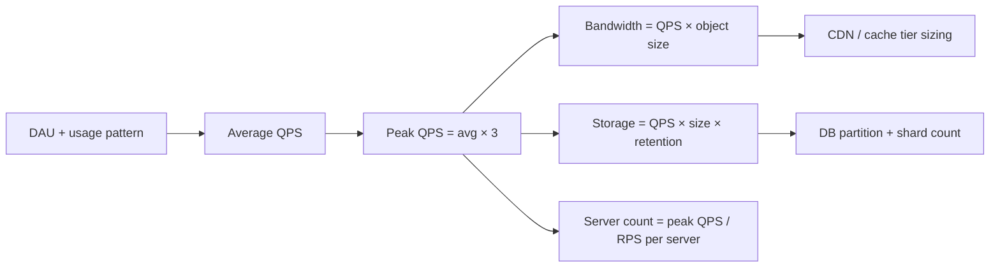

# 1. Numbers and Latency Cheatsheet

> **TL;DR:** Know these numbers cold. Back-of-envelope answers without them are guesses; with them they're credible engineering estimates.

**Interview weight:** P0 — estimation questions appear in every HLD round; interviewers use your numbers to calibrate whether you've operated systems at scale.

---

## Core Latency Numbers

| Operation | Approximate Latency | Notes |
|-----------|-------------------|-------|
| L1 cache read | 0.5 ns | CPU register-level |
| L2 cache read | 5 ns | — |
| RAM read | 100 ns | 200× L1 |
| SSD random read | 100 µs (0.1 ms) | NVMe: 50 µs |
| HDD seek + read | 10 ms | 100× SSD |
| Redis GET (same DC) | 0.5–1 ms | In-process: ~1 µs |
| DB query, indexed, same DC | 1–5 ms | No join, warm cache |
| DB query, complex / cross-shard | 10–100 ms | Joins, cold cache |
| HTTP call, same region | 1–10 ms | Internal service mesh |
| HTTP call, cross-region (US→EU) | 70–150 ms | Transcontinental RTT |
| Kafka produce + consumer read | 5–15 ms | Batch flush tuning |
| Azure Service Bus send + receive | 10–50 ms | Premium tier |
| DNS resolution, cached | < 1 ms | — |
| DNS resolution, uncached | 20–120 ms | — |

**Rule of thumb:** 1 ms = 1,000 µs = 1,000,000 ns. When in doubt, memory ≈ 0.1 ms, disk ≈ 10 ms, network cross-region ≈ 100 ms.

---

## Data Size Powers of Two

| Power | Value | Human label |
|-------|-------|-------------|
| 2^10 | 1,024 | 1 KB |
| 2^20 | 1,048,576 | 1 MB |
| 2^30 | 1,073,741,824 | 1 GB |
| 2^40 | ~1.1 × 10^12 | 1 TB |
| 2^50 | ~1.1 × 10^15 | 1 PB |

**Common object sizes:**
- ASCII char: 1 byte. Unicode char: 2 bytes. UUID: 36 bytes (string) / 16 bytes (binary).
- Int32: 4 bytes. Int64: 8 bytes.
- HTTP request header: ~0.5–1 KB.
- Image thumbnail: ~10–100 KB. HD photo: ~3–5 MB. 1-minute 720p video: ~50–80 MB.
- Tweet / short message: ~280 bytes (text) → ~1 KB with metadata.

---

## Throughput Reference

| System | Throughput |
|--------|-----------|
| Single web server (8 core, .NET) | 10K–50K simple RPS |
| Redis (single node) | 100K–1M ops/sec |
| Kafka single broker | 100–500 MB/s write |
| SQL Server / Azure SQL (OLTP) | 1K–10K TPS (simple queries) |
| Cosmos DB, single partition | Up to 10K RU/s / 10 GB |
| Azure Service Bus, Premium | 1K–2K msg/sec per queue |
| CDN edge node | 1–10 Gbps |
| Single SSD NVMe | 3–7 GB/s sequential read |

**Cost anchors (Cosmos DB):**
- Point read (1 KB doc): 1 RU.
- Write (1 KB doc): ~5 RU.
- Cross-partition query: 10–100+ RU depending on fan-out.
- 1K RU/s capacity ≈ $58/month (single region).

---

## Availability Nines

| SLA | Downtime per year | Downtime per month |
|-----|------------------|--------------------|
| 99% | 3.65 days | 7.3 hours |
| 99.9% | 8.7 hours | 43 minutes |
| 99.99% | 52 minutes | 4.3 minutes |
| 99.999% | 5.2 minutes | 26 seconds |

**Your target:** 99.99% SLO (Xbox Publisher service). That's ≤52 min/year. Requires multi-region, health checks, auto-failover, and zero-downtime deploys.

---

## QPS / Storage / Bandwidth Estimation Formulas

```
QPS   = DAU × avg_requests_per_user_per_day / 86400
Peak  = QPS × 2 to 3   (traffic spike factor)

Storage_per_day = QPS × avg_object_size_bytes × 86400
Storage_total   = Storage_per_day × retention_days

Bandwidth_in    = QPS × avg_request_size_bytes
Bandwidth_out   = QPS × avg_response_size_bytes × read_amplification
```

**86400 seconds in a day** (memorise this).

---

## Rules of Thumb

| Rule | Value |
|------|-------|
| Cache hit rate target | ≥ 80–90% (Pareto: 20% of keys = 80% of reads) |
| Peak traffic vs average | 2–3× average |
| Read / write ratio (typical news feed) | 10:1 to 100:1 |
| Single core can handle | ~5–10K simple HTTP RPS |
| 1 MB/s sustained write → daily storage | ~86 GB/day |
| p99 ≈ p95 × 1.5 (rough) | Use for headroom planning |
| DB connection pool per app instance | 10–50 connections |
| Redis memory for 1M keys (100 byte value) | ~200–300 MB |

---

## Worked Estimation — 5K RPS / 7M User Service (Your Resume)

```
Service: Publisher News Feed (Xbox)

DAU assumption: 7M total players, ~30% daily active = 2.1M DAU
Avg requests/DAU/day: ~20 (browse feed, load content, click, telemetry)

QPS = 2.1M × 20 / 86400 ≈ 486 RPS (average)
Peak QPS = 486 × 3 = ~1,500 RPS  (or up to 5K RPS at game launch)

Feed item size: ~2 KB per item, 20 items per page → 40 KB per feed page response
Read bandwidth = 5,000 × 40 KB = 200 MB/s peak read

Write rate (new feed items): 5% of RPS = ~250 writes/sec at peak
Write storage / day = 250 writes × 2 KB × 86400 = ~43 GB/day

Cache: Redis, targeting 90% hit rate → only 500 RPS hit DB (manageable with Cosmos DB)
Cosmos DB: 500 RPS × 1 RU/read = 500 RU/s needed (well within 10K RU/s per partition)

SLO: 99.99% → ≤ 52 min downtime/year → multi-region, auto-failover, rolling deploys
```

---

## Estimation Flow



---

## Comparison — Storage Systems by Throughput and Latency

| System | Latency (p50) | Write throughput | Read throughput | Best for |
|--------|--------------|-----------------|----------------|----------|
| Redis | < 1 ms | 100K ops/s | 100K+ ops/s | Hot path cache, counters, leaderboard |
| Cosmos DB | 1–5 ms | 10K RU/s/partition | 10K RU/s/partition | Document, global distribution |
| Azure SQL | 1–10 ms | 10K TPS | 10K TPS | Relational, ACID |
| Azure Blob | 10–50 ms | GB/s aggregate | GB/s aggregate | Files, media, backups |
| Kafka / Event Hubs | 5–15 ms | 100s MB/s | 100s MB/s | Streaming, audit log |

---

## Interview Questions

**Q1. How many servers do you need to handle 100K RPS?**  
A: A well-tuned .NET service on a modern 8-core machine handles ~20–50K RPS for lightweight endpoints. For 100K RPS: 3–5 servers with a load balancer + headroom. Add Redis cache to keep DB load at ~10–20% of that.

**Q2. How long would it take to transmit 1 GB over a 1 Gbps network link?**  
A: 1 GB = 8 Gb. At 1 Gbps = 8 seconds. Rule: data_bits / link_bandwidth.

**Q3. A Cosmos DB partition is limited to 10 GB / 10K RU/s. How do you design for a 1 TB dataset?**  
A: Choose a partition key with high cardinality to spread data. 1 TB / 10 GB = minimum 100 logical partitions required. Pick a key that distributes writes evenly (e.g., userId hash prefix, not a status field with 3 values).

---

## Quick Recap

- L1=0.5ns, RAM=100ns, SSD=0.1ms, Redis=1ms, DB=1–10ms, cross-region=100ms.
- QPS = DAU × requests/day / 86400. Peak = × 3.
- 99.99% SLO = ≤52 min downtime/year.
- Cosmos partition: 10 GB / 10K RU/s — design partition key for cardinality.
- Cache hit target ≥ 80%. 1 core ≈ 5–10K simple HTTP RPS.
