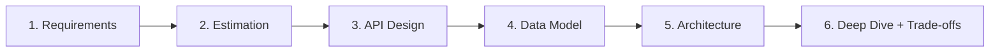
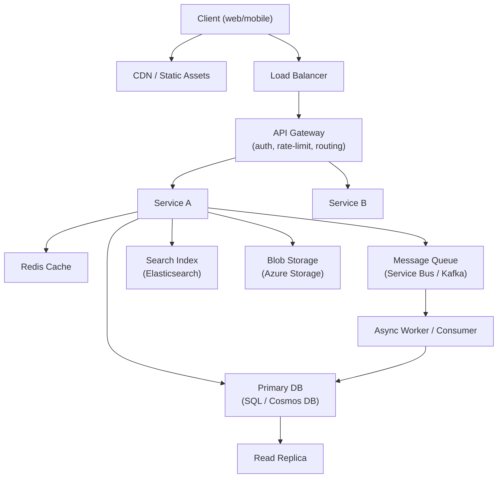

# 2. System Design One-Pager

> **TL;DR:** The 6-step framework + decision tables. Run through this checklist in your head at the start of every HLD round.

**Interview weight:** P0 — interviewers score you on whether you structure the discussion or drift.

---

## The 6-Step Framework

| Step | Time | Key outputs |
|------|------|-------------|
| 1. Requirements | 5 min | Functional (3 core), non-functional (QPS, latency, availability, durability), out of scope |
| 2. Estimation | 5 min | QPS, storage/day, bandwidth, cache ratio |
| 3. API Design | 5 min | 2–3 key endpoints, request/response shapes |
| 4. Data Model | 5 min | Key entities, partition/index strategy, schema |
| 5. Architecture | 20 min | Diagram left-to-right: client → LB → API → services → DB/cache/queue |
| 6. Deep Dive | 10 min | Pick hardest component; trade-offs; failure modes; monitoring |

---

## Clarifying Questions Checklist

- **Scale:** DAU? Peak QPS? Read/write ratio?
- **Latency:** p50 / p99 target? Acceptable for writes vs reads?
- **Availability:** SLO (99.9%? 99.99%)? Single region or multi-region?
- **Durability:** Can we lose data (e.g., cache miss OK)? Or zero data loss?
- **Consistency:** Strong or eventual? Does user see stale data?
- **Security:** Auth required? PII data involved?
- **Scale over time:** Current size and 5-year projection?
- **Existing system:** Greenfield or extension? Existing tech stack?

---

## Reference Architecture

---

## Requirement → Component Mapping

| Requirement | Component |
|-------------|-----------|
| Serve static content globally | CDN (Azure Front Door, CloudFront) |
| Auth + rate limiting at edge | API Gateway |
| Low-latency reads (< 5 ms) | Redis cache |
| Durable writes, ACID | SQL (Azure SQL, PostgreSQL) |
| Flexible schema, global distribution | Cosmos DB |
| Async decoupling, ordered messages | Azure Service Bus / Kafka |
| Full-text search, faceted filtering | Elasticsearch / Azure AI Search |
| Large binary files (video, images) | Azure Blob Storage / S3 |
| Real-time push (chat, live feed) | WebSockets / Server-Sent Events |
| Time-series metrics | InfluxDB / Azure Monitor |
| Fan-out to millions (notifications) | Pub/Sub + fan-out workers |
| Exactly-once processing | Idempotency key + DB dedup table |

---

## Decision Table — SQL vs NoSQL vs Cache vs Queue vs Blob vs Search

| Need | Choose |
|------|--------|
| ACID transactions, complex joins | SQL |
| Flexible schema, horizontal scale, multi-region | Cosmos DB / DynamoDB |
| Sub-millisecond reads, counters, sorted sets | Redis |
| Async decoupling, retries, DLQ | Service Bus / SQS |
| Large unstructured files | Blob / S3 |
| Full-text / semantic search | Elasticsearch / Azure AI Search |
| Append-only event log, high throughput streaming | Kafka / Event Hubs |
| Graph relationships | Cosmos DB Gremlin / Neo4j |
| Time-series telemetry | Azure Monitor / InfluxDB |

---

## Consistency Choice Table

| Scenario | Consistency level | Why |
|----------|-----------------|-----|
| Financial transaction | Strong | No stale reads on balance |
| User profile read | Session | User sees their own writes |
| News feed / social | Eventual | Staleness tolerable for scale |
| Leaderboard display | Bounded staleness | Slight lag acceptable |
| Chat messages (ordering) | Session or strong per partition | Message order must be preserved |
| Search index | Eventual | Indexing lag (seconds) is acceptable |

---

## Scaling Levers Table

| Bottleneck | Lever |
|-----------|-------|
| High read QPS | Read replicas, Redis cache, CDN |
| High write QPS | Sharding / partitioning, async queue, CQRS write path |
| Large DB table | Partition (Cosmos) or shard (SQL) by high-cardinality key |
| Slow queries | Add indexes, materialized views, denormalize hot paths |
| Hot partition | Composite partition key, random suffix for write keys |
| Service overload | Rate limiting, circuit breaker, bulkhead isolation |
| Latency cross-region | Multi-region active-active, geo-routing |
| Fan-out bottleneck | Pre-compute and push to storage (news feed); async workers |

---

## Failure Mode Checklist

- [ ] What happens if the DB is down? (Circuit breaker, fallback to cache, retry queue)
- [ ] What happens if the cache is down? (Cache-aside degrades to DB; spike protection)
- [ ] What happens if a message is processed twice? (Idempotency key + dedup)
- [ ] What happens if a service instance crashes mid-write? (WAL, 2PC, saga compensating tx)
- [ ] What happens if network partition isolates a region? (Eventual consistency, local read)
- [ ] What if a consumer falls behind? (DLQ, alert, backpressure)
- [ ] What if a hot partition gets overloaded? (Write spreading, hierarchical routing)

---

## Trade-off Phrases to Use Out Loud

- "I'm choosing X over Y because at this scale, [latency/consistency/cost] matters more than [Y's advantage]."
- "The trade-off here is: strong consistency costs [50–100ms extra latency]; eventual is fine for this use case."
- "This introduces a fan-out problem at write time — I'd mitigate with [pull model / pre-aggregation / async]."
- "I'm denormalizing here to avoid a cross-partition query; the trade-off is eventual consistency on reads."
- "Kafka gives us replay and ordering; the trade-off vs Service Bus is operational complexity."

---

## Case Study One-Liners

| System | Core insight |
|--------|-------------|
| URL Shortener | Base62 ID + KV store (Redis/Cosmos); redirect via 301/302; analytics async |
| Rate Limiter | Token bucket (burst) or sliding window log (precision); Redis INCR atomic counter |
| Notification System | Fan-out on write (push) vs pull; per-channel workers; DLQ for retries |
| Chat Application | WebSocket per user; ordered messages per conversation; presence via heartbeat |
| News Feed | Fan-out on write (celeb problem → fan-out on read hybrid); Redis sorted set per user |
| Video Streaming | CDN for segments; adaptive bitrate; async transcoding pipeline; blob storage |
| Ride Hailing | Geospatial quad-tree or S2 cells; driver location stream; matching service |
| Collaborative Doc | CRDT or OT for conflict resolution; WebSocket; event log as source of truth |
| Payment Platform | Idempotency keys; saga pattern; two-phase commit or outbox pattern |
| Distributed File Storage | Chunk split; metadata server; consistent hashing for chunk placement |
| Search / Autocomplete | Trie for autocomplete; inverted index for full-text; rank by frequency |
| AI Content Moderation | Event-driven pipeline; async ML inference; human-in-the-loop for low-confidence |

---

## Interview Questions

**Q1. What are the first 3 questions you ask in a system design interview?**  
A: (1) What are the 3 core features (functional requirements)? (2) What's the scale — DAU, peak QPS, read/write ratio? (3) What's the availability / latency SLO?

**Q2. When do you choose Cosmos DB over Azure SQL?**  
A: Cosmos DB when you need: flexible/evolving schema, horizontal scale beyond a single machine, multi-region active-active writes, or a document/entity model that maps naturally to JSON. SQL when you need: strong ACID across entities, complex relational joins, or existing tooling around a relational model.

**Q3. How would you handle a hot partition in Cosmos DB?**  
A: Add a random suffix or hash shard prefix to the partition key to spread writes. For reads, use a write-through cache in Redis so hot items never hit Cosmos for reads.

---

## Quick Recap

- 6 steps: Requirements → Estimation → API → Data model → Architecture → Deep dive.
- Ask scale + SLO first; they drive every other decision.
- Diagram: client → CDN / LB → API Gateway → services → DB + cache + queue.
- Know when to use Redis vs Cosmos vs SQL vs Kafka — and why.
- Every decision is a trade-off; say it out loud.
