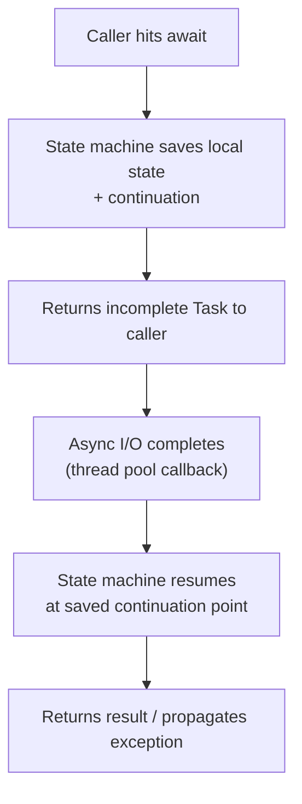

# 3. C# / .NET One-Pager

> **TL;DR:** The highest-yield C#/.NET facts for a senior backend interview. Memorise the tables; understand the gotchas.

**Interview weight:** P0 — C# internals are directly probed at every senior backend role where .NET is the primary stack.

---

## Value vs Reference Types

| Aspect | Value type (`struct`, `int`, `bool`) | Reference type (`class`, `interface`, `delegate`) |
|--------|--------------------------------------|--------------------------------------------------|
| Storage | Stack (usually) or inline in containing object | Heap; variable holds a reference |
| Copy semantics | Full copy on assignment | Copy of reference only |
| Null | Not nullable by default (`int?` uses `Nullable<T>`) | Nullable by default |
| GC pressure | None (stack-allocated) | GC tracks; more pressure with many short-lived objects |
| Equality default | `Equals` compares value (field-by-field for struct) | `Equals` compares reference (unless overridden) |
| Inheritance | None (except `object` / interfaces) | Full inheritance |

---

## Struct vs Class vs Record

| | `struct` | `class` | `record class` | `record struct` |
|--|---------|---------|---------------|----------------|
| Allocation | Stack / inline | Heap | Heap | Stack / inline |
| Mutability default | Mutable | Mutable | Immutable (`init`) | Mutable |
| Equality | Value (if overridden) | Reference | Value (auto) | Value (auto) |
| `with` expression | No | No | Yes | Yes |
| Inheritance | No | Yes | Yes (records) | No |
| Use case | Small, cheap, frequently copied value | Most domain objects | DTOs, value objects, return types | Tiny value with equality |

---

## Collection Complexities

| Collection | Get/lookup | Add | Remove | Notes |
|-----------|-----------|-----|--------|-------|
| `List<T>` | O(1) by index | O(1) amortised | O(n) | Shift on remove |
| `Dictionary<K,V>` | O(1) avg | O(1) avg | O(1) avg | Hash collision → O(n) worst |
| `HashSet<T>` | O(1) avg | O(1) avg | O(1) avg | No duplicates |
| `SortedDictionary<K,V>` | O(log n) | O(log n) | O(log n) | Red-black tree |
| `SortedList<K,V>` | O(log n) binary search | O(n) | O(n) | Array-backed; better memory |
| `Queue<T>` | O(1) Peek | O(1) Enqueue | O(1) Dequeue | FIFO |
| `Stack<T>` | O(1) Peek | O(1) Push | O(1) Pop | LIFO |
| `LinkedList<T>` | O(n) | O(1) given node | O(1) given node | Good for LRU |
| `ConcurrentDictionary<K,V>` | O(1) avg | O(1) avg | O(1) avg | Lock striping; thread-safe |
| `PriorityQueue<T,P>` | O(1) Peek | O(log n) | O(log n) | .NET 6+, min-heap |

---

## Async / Await Pitfalls

| Pitfall | Symptom | Fix |
|---------|---------|-----|
| `.Result` / `.Wait()` on async code | Deadlock (classic ASP.NET); thread starvation | Always `await` throughout |
| `async void` | Exceptions unobservable; can crash process | Use `async Task`; `async void` only for event handlers |
| Missing `await` | Task discarded; exception swallowed | Always `await` or store + await task |
| `ConfigureAwait(false)` missing in library | Context capture overhead; potential deadlock in classic ASP.NET | Use `ConfigureAwait(false)` in library code; not needed in ASP.NET Core apps (no sync context) |
| `async` in constructor | Constructors can't be async | Use factory method: `public static async Task<T> CreateAsync()` |
| `CancellationToken` not threaded through | Long work can't be cancelled; resource leak | Accept `CancellationToken` in every async method and pass down |
| Parallelism via `async` without `Task.WhenAll` | Sequential awaits; no parallelism | `await Task.WhenAll(task1, task2)` |
| Fire-and-forget without error handling | Exception swallowed | Log errors; use `_ = Task.Run(...).ContinueWith(err handler)` |

---

## DI Lifetimes

| Lifetime | Instance scope | Gotcha |
|----------|---------------|--------|
| `Singleton` | One per app lifetime | Don't inject `Scoped` into Singleton — captured dependency bug |
| `Scoped` | One per HTTP request | Don't use in background thread without creating a new scope |
| `Transient` | New instance every injection | Avoid for heavy objects; can cause excessive allocations |

**Classic bug:** `Singleton` service holds a `Scoped` `DbContext` → all requests share one context → concurrency issues + stale data.

---

## GC Generations

| Generation | What lives here | Collected when |
|-----------|----------------|----------------|
| Gen 0 | New, short-lived objects | Most frequently; < 1ms |
| Gen 1 | Survived one Gen 0 collection | Buffer between Gen 0 and Gen 2 |
| Gen 2 | Long-lived objects (singletons, caches) | Infrequently; can pause app |
| LOH | Objects > 85 KB | Only with Gen 2; NOT compacted by default |

**Key point:** LOH fragmentation is a common cause of memory pressure in high-throughput services. Use `ArrayPool<T>` and `MemoryPool<T>` to avoid repeated LOH allocations.

---

## LINQ — Deferred Execution

```csharp
// Deferred: query not executed until iterated
IEnumerable<int> q = list.Where(x => x > 5);  // no work yet
var result = q.ToList();                         // executes now

// IQueryable: expression tree, executed at DB
IQueryable<User> q = dbCtx.Users.Where(u => u.Active);
// vs
IEnumerable<User> q = dbCtx.Users.AsEnumerable().Where(u => u.Active);
// Second form: loads ALL users to memory, filters in .NET — avoid!
```

| | `IEnumerable<T>` | `IQueryable<T>` |
|--|-----------------|----------------|
| Execution | In-memory, .NET | Translated to SQL / provider query |
| Composition | After materialisation | Builds expression tree, single trip |
| Use | In-memory collections | EF Core, Cosmos LINQ |

---

## Thread-Safety Primitives

| Primitive | Use case |
|-----------|---------|
| `lock (obj)` | Simple mutual exclusion; prefer `Lock` in .NET 9 |
| `Monitor.Enter/Exit` | Same as lock, manual control |
| `Mutex` | Cross-process lock |
| `SemaphoreSlim` | Limit concurrent access (async-compatible) |
| `ReaderWriterLockSlim` | Multiple readers, exclusive write |
| `Interlocked` | Atomic increment/compare-exchange on primitives |
| `ConcurrentDictionary` | Thread-safe dictionary; prefer over `Dictionary + lock` |
| `Channel<T>` | Producer-consumer pipelines; async-friendly |

---

## Common Gotchas — Quick Table

| Gotcha | What happens | Fix |
|--------|-------------|-----|
| Boxing `struct` in `object` | Heap allocation + GC pressure | Use generics `<T>` instead |
| Captured loop variable in lambda | All lambdas see last value of `i` | `var captured = i; () => captured` |
| Mutable struct in collection | Mutation on copy, not original | Use class or `readonly struct` |
| `string` concatenation in loop | O(n²) allocations | `StringBuilder` or `string.Join` |
| Disposing `HttpClient` per request | Socket exhaustion | Singleton / `IHttpClientFactory` |
| EF Core: `AsNoTracking` forgotten | Extra memory, slower queries | Always use for read-only queries |
| `DateTime.Now` in distributed code | Time-zone bugs | Always `DateTime.UtcNow` |
| `Task.Run` inside async controller | Wastes thread-pool threads | Just `await asyncMethod()` directly |

---

## Async/Await State Machine



---

## Interview Questions — 25 Rapid-Fire

**Q1. What is boxing?**  
A: Converting a value type to `object` — causes heap allocation. Avoid in hot paths.

**Q2. Difference between `==` and `Equals` for strings?**  
A: Both compare value for strings; `==` is overloaded. For custom classes, `==` is reference by default unless overloaded.

**Q3. What does `readonly` on a field do?**  
A: Field can only be set in constructor or field initializer. Use for immutable values.

**Q4. What's the purpose of `IDisposable`?**  
A: Deterministically release unmanaged resources (file handles, DB connections). Always use `using` or `await using`.

**Q5. Difference between `Finalize` and `Dispose`?**  
A: `Finalize` (destructor) is non-deterministic, called by GC. `Dispose` is deterministic, called by developer. Implement both via dispose pattern for classes holding unmanaged resources.

**Q6. What is `Span<T>`?**  
A: Stack-allocated view over contiguous memory (array, stack memory, string). Zero-copy slicing. Cannot be stored on heap.

**Q7. What does `ConfigureAwait(false)` do?**  
A: Tells the runtime not to capture the current `SynchronizationContext`. Avoids deadlock in classic ASP.NET; reduces context-switching overhead in library code.

**Q8. What is `CancellationToken`?**  
A: Cooperative cancellation mechanism. Pass to async methods; check `.IsCancellationRequested` or call `.ThrowIfCancellationRequested()`.

**Q9. Difference between `Task.Run` and `Task.Factory.StartNew`?**  
A: `Task.Run` is the safe default — queues to thread pool, unwraps nested tasks. `StartNew` has more options but dangerous defaults; avoid unless you need them.

**Q10. What is `ValueTask<T>` and when to use it?**  
A: A struct-based alternative to `Task<T>` for methods that frequently return synchronously (cache hit path). Avoids heap allocation. Only use in hot-path library code; don't use `await` twice on same `ValueTask`.

**Q11. What is `record` in C#?**  
A: A reference type with compiler-generated value equality, `ToString`, `with` expression. Ideal for DTOs and immutable value objects.

**Q12. What is covariance in generics?**  
A: `IEnumerable<Derived>` is assignable to `IEnumerable<Base>` because `IEnumerable<out T>` is covariant. Only safe for read-only producers.

**Q13. What is the difference between `IEnumerable` and `IQueryable`?**  
A: `IEnumerable` executes in memory. `IQueryable` builds an expression tree translated to a server-side query (e.g., SQL). Mixing them accidentally pulls entire tables into memory.

**Q14. What is deferred execution in LINQ?**  
A: Query is not executed when created — only when iterated (`foreach`, `.ToList()`, etc.). Allows composition without multiple passes.

**Q15. What is a closure in C#?**  
A: A lambda that captures a variable from its enclosing scope. The captured variable is shared — mutation after capture is visible in the lambda.

**Q16. What is the difference between `Mutex` and `SemaphoreSlim`?**  
A: `Mutex` is OS-level, cross-process, not async-compatible. `SemaphoreSlim` is in-process, async-compatible, used to limit concurrency.

**Q17. What is `lock` implemented as?**  
A: `Monitor.Enter`/`Monitor.Exit` with a try/finally to guarantee exit on exception.

**Q18. What is the LOH and why does it matter?**  
A: Large Object Heap — objects ≥ 85 KB. Collected only with Gen 2; not compacted by default → fragmentation. Use `ArrayPool<byte>` for large buffers.

**Q19. Difference between `Scoped` and `Transient` DI lifetimes?**  
A: `Scoped`: one instance per request (shared within request). `Transient`: new instance per injection. Use `Transient` for stateless, lightweight services.

**Q20. What is the `outbox pattern`?**  
A: Write to DB and a local outbox table in the same transaction. A background job publishes from the outbox to the message bus. Ensures at-least-once delivery without 2PC.

**Q21. What does `async void` do to exceptions?**  
A: Exceptions are raised on the `SynchronizationContext`; not catchable at the call site. Can crash the process. Only acceptable for event handlers.

**Q22. What is `IHostedService`?**  
A: Interface for background tasks in ASP.NET Core. `StartAsync` / `StopAsync` called by the host lifecycle. Use `BackgroundService` (abstract base) for long-running tasks.

**Q23. What is pattern matching in C#?**  
A: `switch` expressions and `is` patterns that match type, property values, and tuples. `obj is Order { Status: OrderStatus.Paid } order` — concise type guard + binding.

**Q24. What is the difference between `throw` and `throw ex` in a catch block?**  
A: `throw` re-throws preserving original stack trace. `throw ex` resets the stack trace to the current line — loses root cause. Always use bare `throw`.

**Q25. What is `Nullable<T>` and how does `??` work?**  
A: `Nullable<T>` wraps value types to allow null. `x ?? defaultValue` returns `x` if not null, else `defaultValue`. `??=` assigns only if null.

---

## Quick Recap

- Value type = stack / inline copy; reference type = heap reference.
- `record` = compiler-generated value equality + `with`.
- Never `.Result`/`.Wait()` on async — always `await`.
- DI lifetime mismatch: Singleton holding Scoped = bug.
- GC Gen 0 = fast; Gen 2 = slow; LOH = no compaction by default.
- `IQueryable` = server-side query; `IEnumerable` = in-memory.
- `ConfigureAwait(false)` in library code; not needed in ASP.NET Core.
