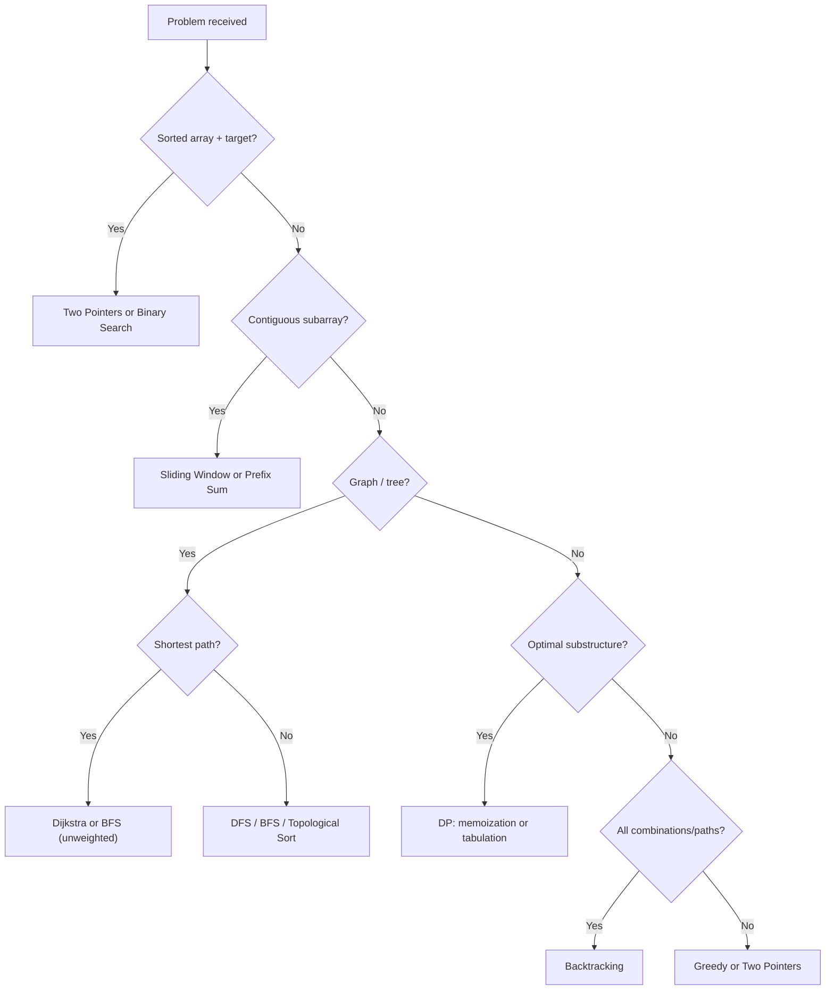

# 4. DSA Patterns One-Pager

> **TL;DR:** Map problem smell → pattern → template → complexity. Don't grind random problems; recognise which pattern applies in 60 seconds.

**Interview weight:** P1 — DSA rounds exist at every company; at senior level you're expected to be solid on medium-difficulty problems with clean code and correct complexity analysis.

---

## Problem Smell → Pattern → Template → Complexity

| Problem smell | Pattern | Key idea | Time | Space |
|--------------|---------|---------|------|-------|
| Sorted array, find pair/triplet with sum | Two Pointers | Converge from both ends | O(n) | O(1) |
| Contiguous subarray, window condition | Sliding Window | Expand right, shrink left | O(n) | O(k) |
| Prefix sum queries, range sum | Prefix Sum | `pre[i] = pre[i-1] + a[i]` | O(n) build, O(1) query | O(n) |
| "Find if path exists" / "minimum hops" | BFS | Queue; level-by-level | O(V+E) | O(V) |
| "All paths" / "connected components" | DFS | Stack/recursion | O(V+E) | O(V) |
| Tasks with prerequisites, ordering | Topological Sort | Kahn's BFS + in-degree | O(V+E) | O(V) |
| Shortest path, non-negative weights | Dijkstra | Min-heap + relaxation | O((V+E) log V) | O(V) |
| Shortest path, negative weights | Bellman-Ford | Relax all edges V-1 times | O(VE) | O(V) |
| Dynamic connectivity, cycle detection | DSU / Union-Find | Path compression + rank | O(α(n)) per op | O(n) |
| All subsets / permutations | Backtracking | Choose-Explore-Unchoose | O(2^n) or O(n!) | O(n) depth |
| Optimal substructure + overlapping subproblems | Dynamic Programming | Memoize or tabulate | Varies | Varies |
| Max/min of subarray or next greater element | Monotonic Stack | Maintain invariant stack | O(n) | O(n) |
| Kth largest/smallest or top-k | Heap (Priority Queue) | Min-heap of size k | O(n log k) | O(k) |
| String pattern match | KMP / Z-algorithm | Failure function / Z-array | O(n+m) | O(m) |
| Longest prefix/string grouping | Trie | Insert char-by-char | O(L) per op | O(L × alphabet) |
| Binary search on answer (monotone predicate) | Binary Search on Answer | `lo`, `hi`, check mid | O(log(range) × check) | O(1) |

---

## Constraint Size → Algorithm

| Input size n | Viable complexity | Example |
|-------------|-----------------|---------|
| n ≤ 20 | O(2^n) or O(n!) | Backtracking, meet-in-middle |
| n ≤ 100 | O(n³) | Floyd-Warshall, brute-force DP |
| n ≤ 1,000 | O(n²) | Bubble sort, naive DP |
| n ≤ 10^5 | O(n log n) | Sort, heap, BFS/DFS, segment tree |
| n ≤ 10^6 | O(n) or O(n log n) | Two pointers, sliding window, hash |
| n ≤ 10^9 | O(log n) | Binary search |

---

## C# Snippets — 10 Most Reusable Templates

### 1. Binary Search Bounds
```csharp
// Find leftmost index where nums[i] >= target
int lo = 0, hi = nums.Length;
while (lo < hi) {
    int mid = lo + (hi - lo) / 2;
    if (nums[mid] < target) lo = mid + 1;
    else hi = mid;
}
// lo = first index >= target (nums.Length if none)
```

### 2. Sliding Window (variable size)
```csharp
int left = 0, maxLen = 0;
var seen = new Dictionary<char, int>();
for (int right = 0; right < s.Length; right++) {
    seen[s[right]] = seen.GetValueOrDefault(s[right]) + 1;
    while (seen[s[right]] > 1) {          // window invalid
        seen[s[left]]--;
        if (seen[s[left]] == 0) seen.Remove(s[left]);
        left++;
    }
    maxLen = Math.Max(maxLen, right - left + 1);
}
```

### 3. BFS
```csharp
var queue = new Queue<int>();
var visited = new HashSet<int>();
queue.Enqueue(start); visited.Add(start);
while (queue.Count > 0) {
    int node = queue.Dequeue();
    foreach (var nei in graph[node]) {
        if (visited.Add(nei)) queue.Enqueue(nei);
    }
}
```

### 4. DFS (iterative)
```csharp
var stack = new Stack<int>();
var visited = new HashSet<int>();
stack.Push(start);
while (stack.Count > 0) {
    int node = stack.Pop();
    if (!visited.Add(node)) continue;
    foreach (var nei in graph[node]) stack.Push(nei);
}
```

### 5. Topological Sort (Kahn's)
```csharp
int[] inDegree = new int[n];
foreach (var (u, v) in edges) inDegree[v]++;
var queue = new Queue<int>(Enumerable.Range(0, n).Where(i => inDegree[i] == 0));
var order = new List<int>();
while (queue.Count > 0) {
    int node = queue.Dequeue();
    order.Add(node);
    foreach (var nei in graph[node]) if (--inDegree[nei] == 0) queue.Enqueue(nei);
}
// order.Count == n iff no cycle
```

### 6. Dijkstra
```csharp
var dist = new int[n]; Array.Fill(dist, int.MaxValue); dist[src] = 0;
var pq = new PriorityQueue<int, int>(); pq.Enqueue(src, 0);
while (pq.Count > 0) {
    pq.TryDequeue(out int u, out int d);
    if (d > dist[u]) continue;
    foreach (var (v, w) in graph[u])
        if (dist[u] + w < dist[v]) { dist[v] = dist[u] + w; pq.Enqueue(v, dist[v]); }
}
```

### 7. DSU (Union-Find)
```csharp
int[] parent = Enumerable.Range(0, n).ToArray();
int[] rank = new int[n];
int Find(int x) => parent[x] == x ? x : parent[x] = Find(parent[x]);
bool Union(int x, int y) {
    int px = Find(x), py = Find(y); if (px == py) return false;
    if (rank[px] < rank[py]) (px, py) = (py, px);
    parent[py] = px; if (rank[px] == rank[py]) rank[px]++;
    return true;
}
```

### 8. Backtracking
```csharp
void Backtrack(int start, List<int> current, List<List<int>> result, int[] nums) {
    result.Add(new List<int>(current));
    for (int i = start; i < nums.Length; i++) {
        current.Add(nums[i]);
        Backtrack(i + 1, current, result, nums);
        current.RemoveAt(current.Count - 1);
    }
}
```

### 9. 0/1 Knapsack
```csharp
// dp[i][w] = max value using first i items with capacity w
int[,] dp = new int[n + 1, W + 1];
for (int i = 1; i <= n; i++)
    for (int w = 0; w <= W; w++) {
        dp[i, w] = dp[i - 1, w];
        if (weights[i-1] <= w)
            dp[i, w] = Math.Max(dp[i, w], dp[i-1, w - weights[i-1]] + values[i-1]);
    }
```

### 10. Monotonic Stack (next greater element)
```csharp
var stack = new Stack<int>(); // indices
var result = new int[nums.Length]; Array.Fill(result, -1);
for (int i = 0; i < nums.Length; i++) {
    while (stack.Count > 0 && nums[stack.Peek()] < nums[i])
        result[stack.Pop()] = nums[i];
    stack.Push(i);
}
```

---

## Complexity Quick Reference

| Algorithm | Time | Space |
|-----------|------|-------|
| Binary search | O(log n) | O(1) |
| Merge sort | O(n log n) | O(n) |
| Quick sort | O(n log n) avg, O(n²) worst | O(log n) |
| Heap sort | O(n log n) | O(1) |
| BFS / DFS | O(V + E) | O(V) |
| Dijkstra (min-heap) | O((V+E) log V) | O(V) |
| Bellman-Ford | O(VE) | O(V) |
| Floyd-Warshall | O(V³) | O(V²) |
| Kruskal MST | O(E log E) | O(V) |
| Trie insert/search | O(L) | O(L × alphabet) |
| Segment tree build | O(n) | O(n) |
| Segment tree query/update | O(log n) | — |

---

## Pattern Selection Flowchart



---

## 30-Problem Must-Solve List

| # | Problem | Pattern |
|---|---------|---------|
| 1 | Two Sum | Hash map |
| 2 | Best Time to Buy and Sell Stock | Sliding window / greedy |
| 3 | Contains Duplicate | HashSet |
| 4 | Longest Substring Without Repeating Characters | Sliding window |
| 5 | 3Sum | Two pointers |
| 6 | Merge Intervals | Sort + greedy |
| 7 | Product of Array Except Self | Prefix / suffix product |
| 8 | Binary Search | Binary search |
| 9 | Search in Rotated Sorted Array | Binary search |
| 10 | Find Minimum in Rotated Sorted Array | Binary search |
| 11 | Reverse Linked List | Two pointers / iterative |
| 12 | Merge Two Sorted Lists | Two pointers |
| 13 | Detect Cycle in Linked List | Floyd's tortoise and hare |
| 14 | Validate BST | DFS + bounds |
| 15 | Level Order Traversal | BFS |
| 16 | Lowest Common Ancestor of BST | Tree DFS |
| 17 | Number of Islands | BFS / DFS |
| 18 | Clone Graph | DFS + hash map |
| 19 | Course Schedule | Topological sort |
| 20 | Pacific Atlantic Water Flow | Multi-source BFS |
| 21 | Kth Largest Element | Heap |
| 22 | Merge K Sorted Lists | Min-heap |
| 23 | Coin Change | DP |
| 24 | Longest Increasing Subsequence | DP / binary search |
| 25 | House Robber | DP |
| 26 | Word Search | Backtracking |
| 27 | Combination Sum | Backtracking |
| 28 | Daily Temperatures | Monotonic stack |
| 29 | Trapping Rain Water | Two pointers / monotonic stack |
| 30 | LRU Cache | LinkedList + HashMap |

---

## Interview Questions

**Q1. Array has n elements; what algorithm can you guarantee O(n) time and O(1) space for sorting?**  
A: Counting sort (if elements are bounded integers). Radix sort (for integers). Quick sort is O(n log n) average, O(1) extra space. In general, comparison-based O(n) sorting is impossible.

**Q2. When do you use BFS over DFS?**  
A: BFS for shortest path (unweighted), level-by-level traversal, and problems where you want to find the closest/fewest-steps answer. DFS for exhaustive search (all paths, backtracking), topological sort, detecting cycles.

**Q3. What is the time complexity of DSU operations?**  
A: O(α(n)) amortized with path compression + union by rank, where α is the inverse Ackermann function — practically O(1).

---

## Quick Recap

- Sorted array → two pointers / binary search. Subarray → sliding window.
- Graph shortest path → BFS (unweighted) or Dijkstra (weighted).
- All combinations → backtracking. Optimal value → DP.
- Next greater element / running maximum → monotonic stack.
- Constraint n ≤ 10^5 → think O(n log n) or better.
- In C#: `PriorityQueue<T,P>` for heap, `HashSet<T>` for O(1) set.
