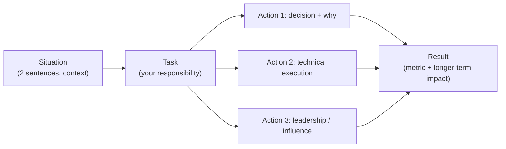

# 5. Behavioral and Trade-off One-Pager

> **TL;DR:** Behavioral rounds at senior/staff level are 50% of the hire decision. STAR is the frame; metrics are the differentiator; seniority signals are the language.

**Interview weight:** P0 — behavioral rounds are weighed equally with technical rounds at Senior/Staff/TL level.

---

## STAR Skeleton

```
Situation  — 1–2 sentences: context, team, timeline.
Task       — 1 sentence: your specific responsibility.
Action     — 3–5 bullets: what YOU did (not "we"). Emphasise decisions, trade-offs, and leadership.
Result     — 1–3 metrics: quantitative impact. Then: "The longer-term effect was X."
```

**Timing:** 2 minutes per story (tight). 4–5 minutes when prompted for depth.

---

## 10-Story Index

| # | Story Hook | Key Metrics | Themes |
|---|-----------|-------------|--------|
| 1 | Publisher News Feed Platform — led 4 engineers, replaced 20+ legacy systems, 5 partner orgs | 7M+ players, 5K RPS, 99.99% SLO, 15 REST APIs | Leadership, scale, delivery |
| 2 | Cosmos DB partition-key redesign + caching — p99 4× improvement | p99 latency 600→150ms, -87% gateway load | Perf win, technical depth |
| 3 | AI Content Certification Platform — 4-stage event-driven engine built from scratch | Idempotent SB consumers, DLQ, retry/backoff, AI moderation + embeddings | Architecture, AI, event-driven |
| 4 | Developer Productivity Platform — 20+ internal tools, RBAC/JIT design | 130+ devs, 10+ services adopted | Platform engineering, adoption |
| 5 | Managed Identity migration + Terraform module | Replaced shared-key auth across Redis; Terraform module reused team-wide | Security, reliability, IaC |
| 6 | CVE remediation at scale — CI/CD unblocking | 600+ microservices unblocked in < 2 weeks | Security, process, org impact |
| 7 | Sales Campaign Authoring Platform — offer modeling, discount logic | $5M quarterly revenue impact | Commerce, business impact |
| 8 | Publisher Portal Monorepo — pluggable processor model | Adopted across 12 products, 6 teams | Extensibility, org-wide adoption |
| 9 | NexusHub — AI Agents & Skills Orchestration (hackathon → portfolio) | MCP/tool-calling, multi-agent architecture | AI, agentic, innovation |
| 10 | 6-year Culture Champion + Xbox hiring interviewer | Mentored X engineers, ran Y interview loops | Leadership, culture, mentoring |

---

## 25 Behavioral Questions → Story Mapping

| Question | Lead story | Backup story |
|----------|-----------|--------------|
| Tell me about yourself | #1 News Feed (scope + impact) | #4 Dev Productivity |
| Biggest technical challenge | #1 News Feed (20+ legacy systems) | #3 AI Certification (from scratch) |
| Technical decision you're proud of | #2 Cosmos DB redesign | #3 SB idempotency design |
| Led a complex project end-to-end | #1 News Feed | #3 AI Certification |
| Influenced without authority | #4 Dev Productivity adoption | #8 Monorepo across 6 teams |
| Conflict or disagreement | #2 (partition-key decision against preference) | #5 Managed Identity (security vs convenience) |
| Drove adoption across teams | #4 Dev Productivity | #8 Publisher Portal |
| Failure and what you learned | On-call incident story → RCA → process change | CVE not caught in #6 — post-mortem |
| Handled ambiguous requirements | #3 AI Certification (scoped from vague brief) | #1 News Feed (5 partner orgs, conflicting reqs) |
| Delivered under tight deadline | #6 CVE remediation (600+ microservices, < 2 weeks) | #1 News Feed launch |
| Performance improvement | #2 (p99 600→150ms, -87% gateway) | — |
| Security decision | #5 Managed Identity + Terraform | #6 CVE remediation |
| Mentored or grew a junior | #10 Culture Champion + hiring | #4 Dev Productivity (pair programming) |
| Received hard feedback | Honest reflection story — process change | — |
| Made a decision with incomplete info | #3 AI (new tech, no blueprint) | #1 News Feed (5 partner orgs, evolving reqs) |
| Prioritised under constraints | #6 CVE triage (which 600 services first) | #1 News Feed MVP scoping |
| Built something for reuse / platform | #8 Monorepo pluggable processor | #4 Dev Productivity Platform |
| Worked with non-technical stakeholders | #1 News Feed (5 partner orgs) | #7 Sales Campaign ($5M) |
| Took ownership outside your role | #10 Culture Champion | #5 Terraform module (team-wide reuse) |
| Drove a culture change | #10 6-yr Culture Champion | #6 CVE remediation process |
| Most impactful project | #1 News Feed | #3 AI Certification |
| Navigated technical debt | #2 Cosmos migration (legacy partition key) | #8 Monorepo (20+ legacy systems) |
| Balanced speed vs quality | #1 News Feed (99.99% SLO + fast delivery) | #7 Sales Campaign ($5M in sprint) |
| Scaled a system under pressure | #2 5K RPS under load test | #1 News Feed launch day |
| Why this role / company | Personal + #9 NexusHub AI direction | — |

---

## Phrases That Signal Seniority

| Instead of... | Say... |
|---------------|--------|
| "We built X" | "I designed X and led the team to implement it" |
| "It was a hard problem" | "The constraint was X; I evaluated options A, B, C and chose A because..." |
| "We fixed the bug" | "I identified the root cause as N+1 query introduced in PR #X; mitigated with a Redis cache read path, then fixed the query and added a regression test" |
| "I helped with security" | "I owned the Managed Identity migration end-to-end — Terraform module, rollout plan, and validation" |
| "Things went wrong" | "We hit a p99 regression in prod; I led the incident, identified the root cause in 20 minutes, and initiated a post-mortem that changed our deployment gate" |

**Senior signal phrases:**
- "The second-order effect I didn't anticipate was..."
- "I made that call knowing the trade-off was X — in hindsight I'd revisit Y because..."
- "I aligned three teams on this by..."
- "The metric we used to validate the decision was..."
- "I structured the work so any team member could own it after me."

---

## Phrases to Avoid

| Phrase | Why bad |
|--------|---------|
| "I'm a perfectionist" (when asked about weakness) | Cliché; not credible |
| "We just did X" (without your specific contribution) | No signal on your role |
| "It was easy" / "straightforward" | Undersells complexity; wastes interview time |
| "I'm not sure that's a good question" | Defensive; signals poor self-awareness |
| "I don't really have a good example of that" | Always have a fallback story |
| Hedging: "I think maybe we might have..." | Lack of conviction; project confidence |

---

## The "Explain a Trade-off" Template

```
Context:    We needed to choose between [A] and [B].
Constraint: The binding constraint was [latency / cost / consistency / time-to-market].
Option A:   [Benefits], but [drawback at scale/in this context].
Option B:   [Benefits], but [drawback in this context].
Decision:   We chose [A] because [constraint] mattered most here.
            The trade-off we accepted was [drawback of A].
Validation: We validated the decision by [metric or experiment].
Reflection: If I were to do it again, I'd [tweak] because [new insight].
```

---

## STAR Flow



---

## Questions to Ask Interviewers (by type)

| Interviewer | Top question |
|------------|-------------|
| Engineer peer | "What's the biggest source of technical debt you deal with daily?" |
| Tech lead | "What would make someone in this role a 10× contributor vs a solid one?" |
| Engineering manager | "What are the top 3 outcomes you'd want from this role in 90 days?" |
| Bar raiser | "What's the most important value the team looks for that doesn't show up in job descriptions?" |
| Recruiter | "Is the level flexible based on how the loop goes?" |

---

## Interview Questions

**Q1. How do you answer "What's your biggest weakness?"**  
A: Pick a real, genuine weakness that is not a core competency for the role, show self-awareness, and describe the system you've built to mitigate it. E.g., "I used to under-communicate design decisions across teams. I now write a one-page design doc for any decision that affects more than one team, even when it feels like overkill."

**Q2. How do you handle a behavioral question for which you don't have a perfect story?**  
A: Use your closest story, acknowledge the gap: "The closest example I have is X — it's not a perfect fit, but the relevant aspects are Y." This is more credible than forcing a mismatch.

**Q3. How do you stand out in a behavioral round as a Technical Lead candidate?**  
A: Quantify every result. Show org-level impact (not just team impact). Demonstrate that you influenced outcomes through people and systems, not just your own code. Name the trade-offs you made consciously.

---

## Quick Recap

- STAR: Situation (context) → Task (your role) → Action (your decisions, 3–5 bullets) → Result (metric + longer-term).
- Always quantify: 7M players, 5K RPS, p99 600→150ms, $5M revenue, 600+ microservices, 130+ devs.
- 10 stories cover all 25 questions in the table above — learn the mapping.
- Senior signal = metric + trade-off + reflection. Staff signal = org-level impact + second-order effects.
- Ask 3 targeted questions per interviewer; "no questions" = low engagement signal.
