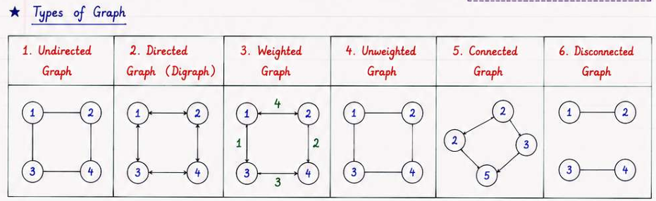
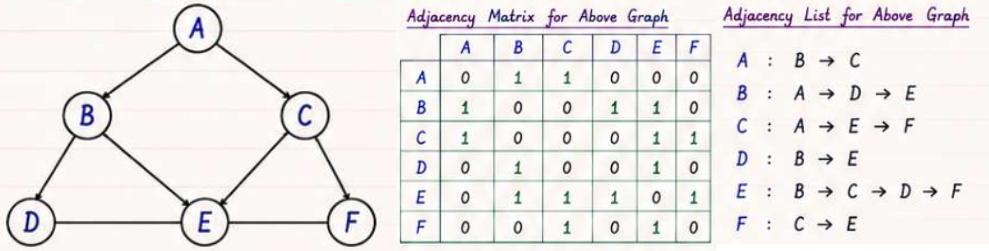
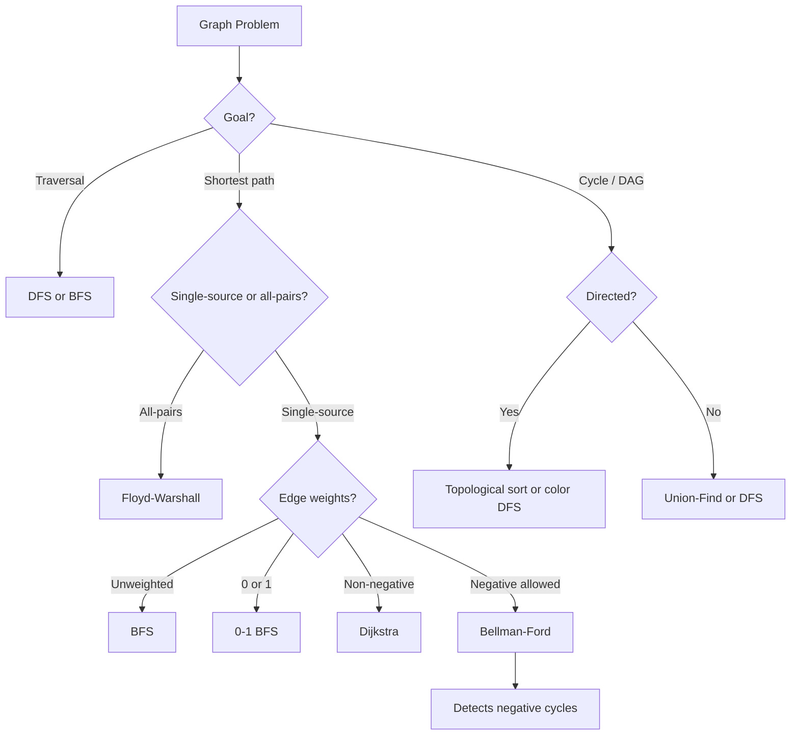

# Graphs

A graph is a non-linear data structure consisting of nodes (vertices) and the edges that connect them.

- $G = (V, E)$, where $V$ is the set of vertices and $E$ is the set of edges.

## Terminology

- **Vertex:** A node in the graph.
- **Edge:** A connection between two vertices.
- **Degree:** The number of edges connected to a vertex.
- **Weight:** A value associated with an edge, representing cost, distance, or capacity.
- **In-degree:** The number of edges entering a vertex in a directed graph.
- **Out-degree:** The number of edges leaving a vertex in a directed graph.
- **Path:** A sequence of edges connecting a sequence of vertices.
- **Cycle:** A path that starts and ends at the same vertex.

## Types of Graphs

## Graph Representation

| Property           | **Adjacency Matrix** | **Adjacency List**        |
| ------------------ | -------------------- | ------------------------- |
| **Structure**      | `V × V` array        | Neighbors for each vertex |
| **Check Edge**     | **O(1)**             | O(degree)                 |
| **Find Neighbors** | O(V)                 | **O(degree)**             |
| **Add Edge**       | O(1)                 | O(1)                      |
| **Space**          | O(V²)                | **O(V + E)**              |
| **Best For**       | Dense graphs         | Sparse graphs             |

## Graph Traversal

Traversal is the process of systematically visiting the vertices and edges of a graph.

| Property             | **Depth-First Search (DFS)**                                     | **Breadth-First Search (BFS)**                                                                 |
| -------------------- | ---------------------------------------------------------------- | ---------------------------------------------------------------------------------------------- |
| **Approach**         | Explore as far as possible along each branch before backtracking | Explore all neighbors at the present depth prior to moving on to nodes at the next depth level |
| **Data Structure**   | Stack (recursion or explicit)                                    | Queue                                                                                          |
| **Time Complexity**  | O(V + E)                                                         | O(V + E)                                                                                       |
| **Space Complexity** | O(V)                                                             | O(V)                                                                                           |
| **Use Cases**        | Topological sorting, cycle detection, pathfinding in mazes       | Shortest path in unweighted graphs, level order traversal                                      |

> BFS goes wide and DFS goes deep.

## Algorithm Selection Guide

