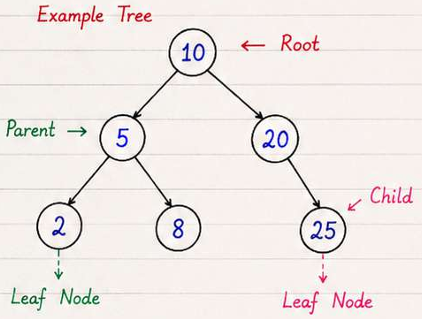
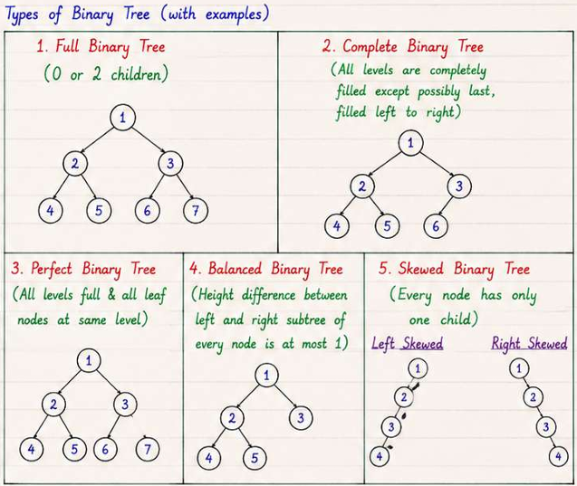
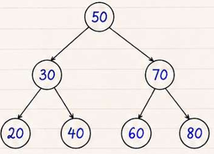

# Trees

Tree is a hierarchical data structure that consists of nodes connected by edges.
It has a root node and zero or more child nodes, forming a parent-child relationship.



**Terminology:**

- _Root_: The topmost node in a tree.
- _Parent_: A node that has child nodes.
- _Child_: A node that has a parent node.
- _Sibling_: Nodes that share the same parent.
- _Leaf_: A node that has no children.
- _Internal Node_: A node that has at least one child.
- _Level_: The depth of a node in the tree, starting from the root at level 0.
- _Depth_: The length of the path from the root to a node.
- _Height_: The length of the longest path from a node to a leaf.
- _Subtree_: A tree formed by a node and all its descendants.
- _Degree_: The number of children a node has.

**Usage of Trees:**

- Represent hierarchical data (e.g., file systems, organizational structures)
- Facilitate efficient searching and sorting (e.g., binary search trees)
- Enable efficient data storage and retrieval (e.g., heaps, tries)

### Binary Tree

Tree in which each node has at most two children, referred to as the left child and the right child.



```cs
class TreeNode {
    int val;
    TreeNode left;
    TreeNode right;
    TreeNode(int x) { val = x; }
}
```

### Traversal of Binary Tree

```text
        1
       / \
      2   3
     / \
    4   5
```

| Traversal Type | Order of Nodes Visited | Example       | Type | Time Complexity | Space Complexity |
| -------------- | ---------------------- | ------------- | ---- | --------------- | ---------------- |
| Preorder       | Root → Left → Right    | 1, 2, 4, 5, 3 | DFS  | O(n)            | O(h)             |
| Inorder        | Left → Root → Right    | 4, 2, 5, 1, 3 | DFS  | O(n)            | O(h)             |
| Postorder      | Left → Right → Root    | 4, 5, 2, 3, 1 | DFS  | O(n)            | O(h)             |
| Level Order    | Level by Level         | 1, 2, 3, 4, 5 | BFS  | O(n)            | O(w)             |

- n = number of nodes, h = height of the tree, w = maximum width of the tree

### Binary Search Tree (BST)

- Values in left subtree < Node < Values in right subtree
- No duplicates allowed
- Inorder traversal of BST gives sorted order of elements
- Time Complexity:
  - Average Case: O(log n)
  - Worst Case: O(n) (when the tree is skewed)



```cs
SEARCH(root, key):
    if root == null:
        return null
    if key == root.value:
        return root
    if key < root.value:
        return SEARCH(root.left, key)
    return SEARCH(root.right, key)

INSERT(root, key):
    if root == null:
        return new Node(key)
    if key < root.value:
        root.left = INSERT(root.left, key)
    else if key > root.value:
        root.right = INSERT(root.right, key)
    return root

DELETE...
```

### AVL Tree - Self-Balancing Binary Search Tree

- Balance factor of each node = height(left subtree) - height(right subtree)
- Balance factor ∈ {-1, 0, 1} for all nodes i.e Height of left and right subtrees differ by at most 1
- Rotations (LL, RR, LR, RL) are used to maintain balance
- Height of AVL tree = O(log n)
  
- Applications: Databases, File Systems, Memory Management

```cs
HEIGHT(node):
    if node == null:
        return 0
    return max(HEIGHT(node.left), HEIGHT(node.right)) + 1

BALANCE_FACTOR(node):
    if node == null:
        return 0
    return HEIGHT(node.left) - HEIGHT(node.right)

RIGHT_ROTATE(y):
    x = y.left
    T = x.right
    x.right = y
    y.left = T

    y.height = 1 + MAX(HEIGHT(y.left), HEIGHT(y.right))
    x.height = 1 + MAX(HEIGHT(x.left), HEIGHT(x.right))

    return x

LEFT_ROTATE(x):
    y = x.right
    T = y.left
    y.left = x
    x.right = T

    x.height = 1 + MAX(HEIGHT(x.left), HEIGHT(x.right))
    y.height = 1 + MAX(HEIGHT(y.left), HEIGHT(y.right))

    return y

INSERT(root, key):
    // Normal BST insertion
    if root == null:
        return new Node(key)

    if key < root.value:
        root.left = INSERT(root.left, key)
    else if key > root.value:
        root.right = INSERT(root.right, key)
    else:
        return root              // duplicate

    // Update height
    root.height = 1 + MAX(
        HEIGHT(root.left),
        HEIGHT(root.right)
    )

    balance = BALANCE_FACTOR(root)

    // LL Case
    if balance > 1 and key < root.left.value:
        return RIGHT_ROTATE(root)

    // RR Case
    if balance < -1 and key > root.right.value:
        return LEFT_ROTATE(root)

    // LR Case
    if balance > 1 and key > root.left.value:
        root.left = LEFT_ROTATE(root.left)
        return RIGHT_ROTATE(root)

    // RL Case
    if balance < -1 and key < root.right.value:
        root.right = RIGHT_ROTATE(root.right)
        return LEFT_ROTATE(root)

    return root
```

### B-Tree

- Nodes can have multiple children
- All leaf nodes at same level
- Each node can have m/2 to m keys
- Keys within nodes are sorted

## AVL vs Red-Black vs B-Tree

| Aspect                  | AVL                      | Red-Black                            | B-Tree                     |
| ----------------------- | ------------------------ | ------------------------------------ | -------------------------- |
| Balance condition       | Height diff ≤ 1          | Approx height ≤ 2×min                | All leaves same depth      |
| Lookup                  | O(log n)                 | O(log n)                             | O(log_t n)                 |
| Insert/delete rotations | More (strictly balanced) | Fewer (2-3 rotations max)            | Split/merge nodes          |
| Read-heavy              | Better (lower height)    | OK                                   | Excellent (high fanout)    |
| Write-heavy             | OK                       | Better                               | Excellent (sequential I/O) |
| Disk/block storage      | Poor (small nodes)       | Poor                                 | Designed for it            |
| Use case                | In-memory sorted maps    | JVM `TreeMap`, Linux scheduler (CFS) | DB indexes, file systems   |
