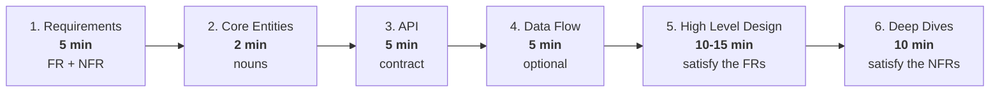
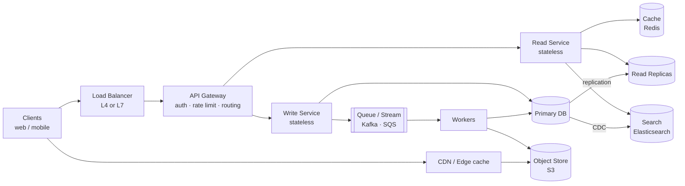
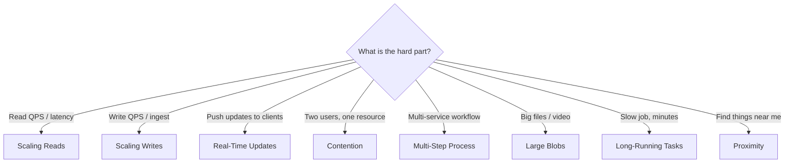
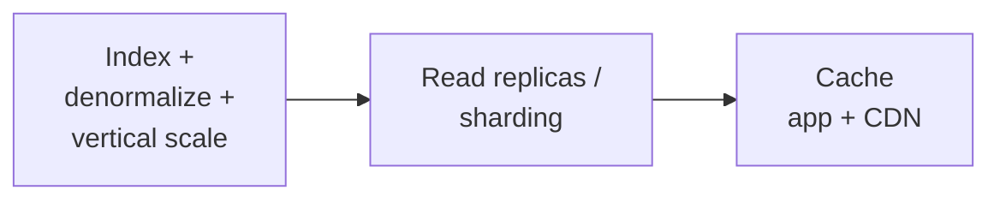
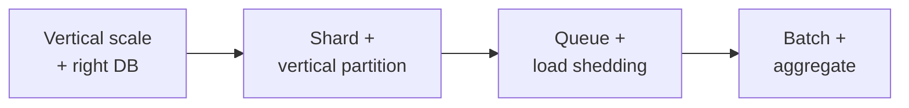
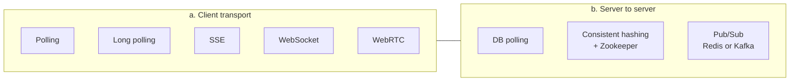
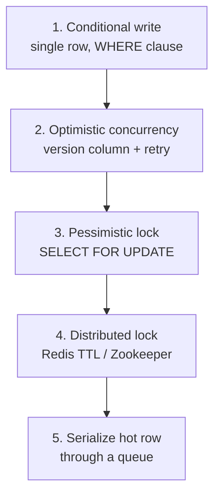
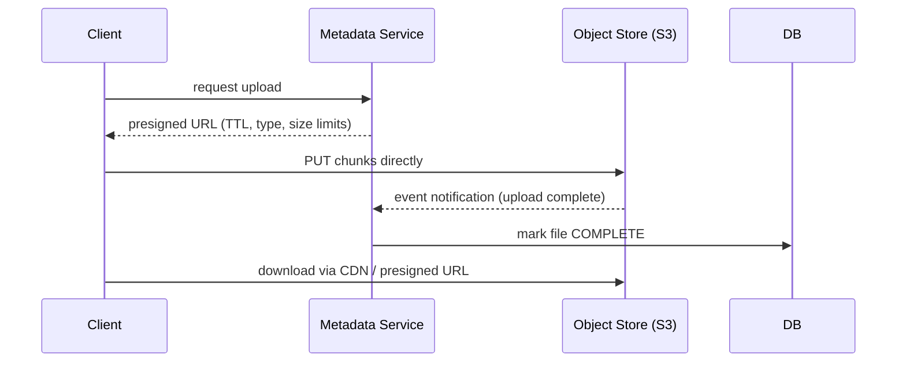
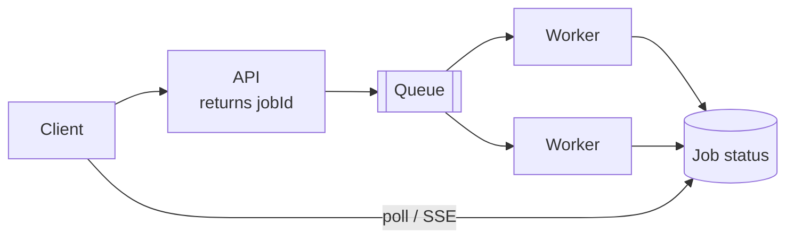

# HLD Cheatsheet — Solve Any System Design Problem

> One page playbook distilled from every note in this repo.
> **Rule #1:** There is no single right answer. You are graded on *navigation, design, technical depth, and communication* — not on a "correct" diagram.

---

## 0. The 60-Minute Script



| Interview type | Flow |
| --- | --- |
| **Product design** (Uber, WhatsApp, Twitter, Netflix) | Requirements → Entities → API → HLD → Deep dives |
| **Infra design** (Rate limiter, Message queue, LB, Metrics) | Requirements → **System Interface** (in/out) → **Data Flow** → HLD → Deep dives |

**Graded on:** Problem navigation · Solution design · Technical excellence · Communication.

---

## 1. Requirements (5 min)

### Functional — "Users should be able to…"
- Ask targeted questions like you're talking to a product owner: *"Does it need X?" "What happens if Y?"*
- Pick the **top 3** features. Explicitly park the rest as **out of scope**.

```text
TWITTER
- Users should be able to post tweets
- Users should be able to follow other users
- Users should be able to see tweets from users they follow
```

### Non-Functional — "The system should be…"
Always **quantify**. Walk the acronym **"SCALE For Cloud DesignS"**:

| Letter | Dimension | Ask yourself |
| --- | --- | --- |
| **S** | Scalability | Read or write heavy? Bursty? DAU? Fan-out? |
| **C** | Consistency | CAP — pick C or A (P is a given in distributed systems) |
| **A** | Availability | Uptime target? Degraded mode acceptable? |
| **L** | Latency | p99 budget? (<100 ms = "low latency") |
| **E** | Environment | Mobile, low bandwidth, browser limits, region |
| **F** | Fault tolerance | What can die? Is any component a SPOF? |
| **C** | Compliance | GDPR, PCI, data residency |
| **D** | Durability | Can we ever lose a write? |
| **S** | Security | AuthN/AuthZ, encryption, abuse |

```text
TWITTER
- Highly available, availability > consistency
- Scale to 100M+ DAU
- Feed renders in under 200ms
```

> **Same system can mix both:** feed = eventually consistent, payments/booking = strongly consistent. Say this out loud.

### CAP in one table

| Pick | Do this | Tools | Examples |
| --- | --- | --- | --- |
| **Consistency** | Distributed txns, single-node writes, consensus, accept latency | PostgreSQL, Spanner, DynamoDB (strong) | Ticketing, inventory, payments, auctions |
| **Availability** | Many replicas, eventual consistency, CDC | Cassandra, DynamoDB multi-AZ | Social feeds, streaming, analytics |

**Consistency flavours:** Strong → Causal (comments after post) → Read-your-writes → Eventual.

**Availability math:** 99.9% = **8.76 h/yr** down · 99.99% = 52.6 min · 99.999% = **5.26 min/yr**.
**SLO** = internal target. **SLA** = contractual promise.

---

## 2. Numbers to Know (capacity estimation)

| Storage | Latency | Throughput |
| --- | --- | --- |
| Memory / cache | ~100 ns (0.0001 ms) | millions reads/s |
| SSD | ~0.1 ms | ~100,000 IOPS |
| HDD | ~10 ms | 100–200 IOPS |

| Component | Single-instance capacity | **Scale when…** |
| --- | --- | --- |
| **Cache** (Redis) | ~1 ms, 100k+ ops/s, up to 1 TB RAM | hit rate < 80%, latency > 1 ms, memory > 80%, thrashing |
| **Database** | up to 50k TPS, 10–20k writes/s, 5–20k conns, <5 ms cached read, ~15 ms write, 64 TiB+ | writes > 10k TPS, uncached read > 5 ms, geo needs |
| **App server** | 100k+ concurrent conns, 25–50 Gbps, 8–64 cores, 64–512 GB RAM | CPU > 70%, latency > SLA, conns near 100k, mem > 80% |
| **Message broker** | ~1M msgs/s per broker, <5 ms, 50 TB | ~800k msgs/s, ~200k partitions, growing consumer lag |

**Back-of-envelope recipe** — *do this during design, not up front*:
1. `DAU × actions/user/day ÷ 86,400` → average RPS. Peak ≈ **2–10×** average.
2. `rows × bytes/row` → storage. *(1B URLs × 500 B = 500 GB → fits one machine + replicas!)*
3. Compare against the table above → **the number decides whether you shard, cache, or do nothing**.

> Example (Web Crawler): `200 Gbps ÷ 8 ÷ 2 MB/page ≈ 12,500 pages/s → ×30% real throughput ≈ 3,750/s → 10B pages ≈ 31 days on 1 machine → 8 machines ≈ 3.9 days.` *Math justifies the machine count.*

> **Modern systems: CPU is usually the bottleneck, not disk.**

---

## 3. Core Entities (2 min)

The nouns/actors exchanged in the system. Derive them straight from the FRs. Name them well; refine later.

```text
TWITTER → User, Tweet, Follow
UBER    → Rider, Driver, Ride, Fare, Location
```

---

## 4. API / System Interface (5 min)

### Protocol choice

| Paradigm | Use when | Cons |
| --- | --- | --- |
| **REST** *(default)* | CRUD over resources, public/web/mobile | over/under-fetching |
| **GraphQL** | Diverse clients, complex data-rich UIs, mobile bandwidth | POST-only + 200-always, N+1, caching is hard |
| **gRPC** | Internal service-to-service, perf critical, streaming, type safety | HTTP/2 needed, not human readable |
| **WebSocket / SSE** | Real-time features | stateful, infra support |

```text
Layer stack:  Paradigm (REST/GraphQL/RPC)  →  Protocol (HTTP/WS/TCP)  →  Serialization (JSON/Protobuf)
```

### Design rules
1. Resources = **core entities**, **plural nouns**, no verbs. Custom action → `POST /users/{id}/activate`.
2. **Path** = identity · **Query** = optional filter/sort/page · **Body** = payload.
3. **Never put `userId` in path/body** — it comes from the JWT / session header.
4. Required relationship → hierarchy `/users/{id}/orders`. Optional → query param.
5. Stateless. Idempotent where possible (use **idempotency keys** on POST/PUT).
6. Paginate: **offset** by default, **cursor** for real-time/high-volume feeds.
7. Version in URL (`/v1/...`) by default.
8. Consistent, actionable errors: `{"error":{"code":"SEAT_UNAVAILABLE","message":"..."}}`.

### HTTP method table

| Method | Purpose | Idempotent | Safe | Body |
| --- | --- | --- | --- | --- |
| GET | read | ✅ | ✅ | ❌ |
| POST | create / action | ❌ | ❌ | ✅ |
| PUT | replace | ✅ | ❌ | ✅ |
| PATCH | partial update | ❌* | ❌ | ✅ |
| DELETE | delete | ✅ | ❌ | ❌ |

\*can be made idempotent by design.

### Status codes worth naming
`200` OK · `201` Created · `204` No Content · `301/302` Redirect · `304` Not Modified · `400` Bad Request · `401` Unauthenticated · `403` Forbidden · `404` Not Found · `409` Conflict · `422` Validation · `429` Rate limited · `500` · `502` · `503` · `504`.

### Auth quick pick

| Need | Use |
| --- | --- |
| User-facing web/mobile | **JWT** (stateless, scalable; hard to revoke) or **Session + Redis** (revocable, stateful) |
| Service-to-service / 3rd-party devs | **API key** (+ request signing: timestamp + nonce + HMAC for payments) |
| Delegated access ("login with X") | **OAuth 2.0** (+ **OIDC** for identity) |
| Many apps, one login | **SSO** |
| Permissions | **RBAC** (default) · ABAC (flexible, complex) · ACL (granular, doesn't scale) |

Pattern: short-lived **access token** + long-lived **refresh token**.

---

## 5. Data Flow (5 min, optional)

Only for processing pipelines (crawler, metrics, analytics, video). List the steps input → output.

```text
WEB CRAWLER: seed URL → DNS → fetch HTML → parse text → store → extract links → repeat
```

---

## 6. High Level Design (10–15 min)

**Start simple. Satisfy one API at a time. Narrate the data flow.**



**Rules of thumb**
- One DB can serve several microservices — simpler, still fault tolerant via replication.
- **Split read and write services only when their scaling profiles differ.** Say why.
- Minimise DB hops. Stateless services scale horizontally — say that too.
- Add an API Gateway once you have >1 service.
- Document the important DB fields inline.

### Building blocks vocabulary

| Block | What it does |
| --- | --- |
| **Forward proxy** | client-side egress: caching, anonymity |
| **Reverse proxy** | server-side ingress: LB, CDN, SSL offload, firewall (Nginx) |
| **Load balancer** | distributes traffic + health checks. Algorithms: round-robin, least-connections, IP hash, weighted, **consistent hashing**, geo |
| **L4 vs L7 LB** | L4 = TCP/UDP, fast, used for **WebSockets**; L7 = HTTP-aware routing on URL/header/cookie |
| **API Gateway** | routing, authN, rate limiting, aggregation |
| **Controller** | bind → validate/transform → call service → respond |
| **Service** | business logic, HTTP-agnostic |
| **Repository** | single-purpose DB access |
| **Middleware** | cross-cutting: CORS, rate limit, auth, logging, compression, global error handling |
| **Object storage** | S3/GCS/Blob — flat namespace, immutable, durable. **Never store files in the DB** (bloat, costly replication, not optimised) |

**Avoid LB as SPOF:** redundant LBs + health checks/failover + autoscaling + DNS failover.

---

## 7. Deep Dives (10 min) — pick the pattern that matches the bottleneck



---

### Pattern 1 — Scaling Reads

**Order of attack (cheapest first):**



| Problem | Fix |
| --- | --- |
| Query slow | Add the right **index** (see index table) |
| Still slow, access is **skewed** | Add **cache** |
| Still slow, access is **uniform** | Add **read replicas** (mind replication lag) |
| Disk bound | HDD → **SSD** |
| **Cache stampede** (all miss at once) | **Request coalescing / single-flight**, cache warming, jittered TTL |
| **Hot key** | Shard the key across nodes (`key#1..N`) + **in-process fallback cache** |
| Stale cache after write | Delete key on write + **cache versioning** (replica may still serve old) |
| Concurrent cache fill race | Atomic `SET NX` or distributed lock |

**Caching strategies**

| Strategy | Write path | Best for |
| --- | --- | --- |
| **Cache-aside** *(default)* | write DB, invalidate cache | general |
| Write-through | cache + DB synchronously | read-heavy, frequently updated |
| Write-back | cache now, DB async | write-heavy (risk: loss) |
| Read-through | cache library loads on miss | read-heavy |
| Write-around | write DB only | write-heavy, rarely read |

**Where:** external Redis/Memcached *(default)* → in-process → CDN (static, edge) → client.
**Invalidation:** TTL · tag-based · delete-on-write · async queue. **Eviction:** LRU (default), LFU, FIFO, TTL.
**CDN:** pull-based (cache on first request) vs push-based (origin pushes).

---

### Pattern 2 — Scaling Writes

**Order of attack:**



- **DB choice:** write-heavy → **Cassandra** (LSM, append-only commit log; reads suffer). Postgres rewrites a B-tree on every insert.
- **Shard** by the primary access pattern; **vertically partition** columns into specialised stores.
- **Queue** absorbs bursty/short-lived spikes → trades **eventual consistency**.
- **Load shedding:** drop low-value writes; newer update overwrites older.
- **Batch/aggregate** at the app layer or in a stream processor, then flush → trades **latency** and needs recovery on loss.

| Deep dive | Answer |
| --- | --- |
| Add shards without downtime | new DB in parallel → **dual write** → backfill history → cut over |
| Hot shard/key | split onto its own shard or add a suffix; **re-aggregate on read** |

**Sharding**

| Strategy | Idea | Watch out |
| --- | --- | --- |
| **Range** | key ranges per shard | hot shards |
| **Hash** | `hash(key) % N` | resharding moves everything |
| **Consistent hashing** *(default)* | hash ring + **virtual nodes** | needs good hash fn |
| **Directory** | lookup service maps key → shard | extra hop, SPOF |
| **Geographic** | by region | cross-region queries |

Good keys: `userId`, `productId`, `orderId` — **high cardinality, even distribution**.
Bad keys: timestamp, auto-increment, random-with-no-locality.
> **Shard by query pattern, not data volume. Only shard when one DB genuinely can't cope.**

| Sharding pain | Fix |
| --- | --- |
| Hot spot | dedicated shard for hot key, or composite key |
| Cross-shard query | align key to query pattern, cache results, denormalize |
| Cross-shard consistency | **2PC** (strong, slow) or **Saga** (eventual, flexible) |

**Replication:** master–slave (writes to master, reads scale out) vs master–master (both write, conflict risk).

---

### Pattern 3 — Real-Time Updates

Two independent decisions: **(a) client transport** and **(b) server-side propagation.**



| Transport | Direction | Use when |
| --- | --- | --- |
| **Polling** *(default)* | pull | seconds of latency acceptable; simple, stateless |
| **Long polling** | pull, held open | near-real-time, keep infra simple; bad for frequent updates |
| **SSE** | server → client | dashboards, notifications, live comments, token streaming. HTTP-based, **auto-reconnect via `Last-Event-ID`** |
| **WebSocket** | full duplex | chat, collab editing, games. Stateful → **L4 LB**, needs heartbeats |
| **WebRTC** | peer ↔ peer (UDP) | video/audio calls, gaming; needs signalling + NAT traversal |

| Propagation | Pros | Cons | Use when |
| --- | --- | --- | --- |
| **DB polling** | trivial, state in DB | high latency, wasted load | delay is fine |
| **Simple hashing** | predictable user→server | rescaling remaps everyone | stable server count |
| **Consistent hashing** | minimal remap on scale | needs Zookeeper/etcd; state lost on crash | persistent conns that must scale (collab editors) |
| **Pub/Sub** | clients hit *any* server, easy LB | extra hop; can be a bottleneck/SPOF | many clients want the same update (default) |

Redis Pub/Sub = simple, fast, **no durability**. Kafka = complex, durable, **replayable**.

| Deep dive | Answer |
| --- | --- |
| Connection drops | heartbeats + **sequence numbers** per user; client detects gap and re-syncs; per-user inbox queue |
| Celebrity with millions of followers | **batching + hierarchical fan-out** (tree of relays) |
| Message ordering across servers | funnel through one stamping point; vector clocks / logical timestamps; or accept minor disorder and sort client-side |
| Extreme fan-out (5k comments/s to millions) | **CDN snapshots**: publish a comment snapshot every second, clients pull from edge |

**Recipes:** live dashboard = polling or SSE+PubSub · chat = WebSocket+PubSub · collab editor = WebSocket+consistent hashing.

---

### Pattern 4 — Contention / Race Conditions

**Escalate only as far as you need:**



1. **Conditional write (start here).** DBs already do row-level locking; put the check in the `WHERE` clause so compare-and-set is **one** statement, not two. Multi-write txn? Make each write depend on the previous result.
   *Ticket with seat numbers → move the counter/lock down to seat level.*
2. **Optimistic concurrency** — read `version`, write only `WHERE version = v`. Conflicts rare. Needs retry.
   ⚠ **ABA problem** → use a **monotonic** version, not a reusable value.
3. **Pessimistic locking** — lock rows for the duration. Use when collisions are frequent. `Transaction + pessimistic lock` = serialization.
   ⚠ **Deadlocks** → always grab locks in a **deterministic order** (modern DBs also detect + retry).
4. **Distributed lock** when the lock must outlive a DB transaction (e.g. "hold this seat for 10 minutes"):
   - **Redis + TTL** (default: fast, auto-expiring), DB lock column, or **Zookeeper** (safest, ops overhead).
5. **Write skew** — reads and writes on *different* rows conflict (e.g. "delete my row if nobody else is here"). Fix with `SERIALIZABLE` isolation, but it's expensive → better to **collapse two rows into one** and do a conditional write.
6. **Everyone wants the same row** → throughput is capped. Serialize through a queue if strong consistency is required.

---

### Pattern 5 — Multi-Step Processes (workflows)

Problem: a single node doing step1 → step2 → step3 **crashes halfway**.

| Approach | How | Pros | Cons |
| --- | --- | --- | --- |
| **Saga + compensation** | sequential local txns; on failure run compensations in reverse | no distributed txn | compensations can fail → need their own retry + idempotency |
| **Choreography** | append events to a durable log (**Kafka**); workers react to state | workers scale independently; implicit workflow | inserting a step later = many changes; hard to see the whole flow |
| **Orchestration** | **Temporal / AWS Step Functions**. *Workflow* = deterministic code; *Activities* = idempotent actions; history in DB, replayable | explicit, resumable, built-in retries/timeouts | extra infra |

| Deep dive | Answer |
| --- | --- |
| Changing a live workflow | **versioning** + patching |
| Exactly-once step | **idempotency key**, re-check state before replaying |
| History grows forever | keep activity payloads small; **continue-as-new** with current state |

---

### Pattern 6 — Handling Large Blobs

**Never proxy big files through your app servers.**



- **Presigned URLs** — temporary, restricted direct upload/download.
- **Resumable uploads** — client-side **chunking** + upload-session id; track chunks via **checksum/ETag**; `CompleteMultipartUpload` stitches them. On failure, re-send only failed chunks.
- **State sync problem** — file is in S3, metadata is in the DB → races, orphaned files, malicious clients. Fix with **S3 event notifications** + a **periodic reconciliation job**.
- **Fast downloads** — CDN, parallel chunks, HTTP **Range** requests, compression.
- **Abuse** — run a processing/scanning pipeline before the file is downloadable.
- **Don't use** for files < 10 MB, or when you need synchronous validation/inspection.

---

### Pattern 7 — Long-Running Tasks

Split the request: **return a jobId immediately**, process async.



**Pros:** fast response, independent scaling, durable jobs, fault isolation.
**Cons:** complexity, eventual consistency, status-tracking infra, monitoring.

| Queue | Notes |
| --- | --- |
| **Kafka** *(default at scale)* | append-only log, huge throughput, order **per partition**, replay, fan-out |
| Redis + BullMQ | simple and fast, **not durable** on crash |
| AWS SQS | managed, 1 MB msgs, visibility timeout, built-in exponential backoff |
| RabbitMQ | smart broker, routing/DLQ, self-hosted |

**Workers:** plain servers *(default)* · serverless (autoscale, pay-per-use; **cold starts**, time limits) · containers + K8s (flexible, more ops).

| Deep dive | Answer |
| --- | --- |
| Worker crashes | job redelivered — detect via **heartbeat** (SQS visibility timeout / Kafka session timeout / RabbitMQ heartbeat) |
| Job keeps failing | retries with exponential backoff → **DLQ** |
| Duplicate work | **idempotency keys** |
| Producers faster than consumers | autoscale consumers · **backpressure** (reject when queue near full) · alert on **consumer lag** |
| Mixed workloads | separate queues + worker pools: small tasks → many small workers; long tasks → few big workers |
| Job dependencies | simple: worker enqueues next step. Complex: **Step Functions / Temporal** |

**Delivery guarantees:** at-most-once (may lose) · **at-least-once (practical default → be idempotent)** · exactly-once (dedup + txns, expensive).
**Partitions:** consumer group parallelism; `partition key` decides ordering; consumers > partitions = idle consumers.
**Queue durability:** replication across brokers + disk persistence (Kafka does both).

**Kafka vs RabbitMQ**

| | RabbitMQ | Kafka |
| --- | --- | --- |
| Model | broker + queues, push | distributed append-only log, pull/batch |
| Smarts | smart broker, dumb consumer | dumb broker, smart consumer (offsets) |
| Ordering | per queue | per partition |
| Retention | deleted after ACK | until expiry, **replayable** |
| Throughput / Latency | lower / very low | very high / higher |
| Use | task queues, routing, moderate scale | high volume, replay, many readers, event sourcing |

---

### Pattern 8 — Proximity / Search

| Need | Index | Tech |
| --- | --- | --- |
| Nearby places | **Geohash** (2D → prefix-matched string in a B-tree), **Quadtree**, **R-tree** *(modern, PostGIS)* | PostGIS, Elasticsearch geo |
| Real-time location (write-heavy) | in-memory geo store | **Redis GEO** — 100k–1M ops/s; persist via snapshots + **Sentinel** failover |
| Full-text search | **Inverted index** | Elasticsearch (sync from DB via **CDC**) |
| Everything else | B-tree | Postgres |

> Plain lat/long B-tree indexes fail: searching one dimension returns a thin strip spanning the globe.
> Small scale? `Postgres + PostGIS + pg_trgm` beats bolting on Elasticsearch.

---

## 8. Data Modeling Cheat Sheet

**Pick the model**

| Model | Use when | Tech |
| --- | --- | --- |
| **Relational** *(default)* | structured data, ACID, strong consistency | PostgreSQL, MySQL |
| **Document** | nested/evolving schema, denormalized reads | MongoDB, CosmosDB |
| **Key-Value** | cache, sessions, flags, flat + fast | Redis, DynamoDB |
| **Wide-Column** | massive writes, time series, telemetry/logs/IoT | Cassandra, HBase |
| **Time-Series** | metrics at 5M WPS, rollups, compression | InfluxDB, TimescaleDB, VictoriaMetrics |
| **Graph** | relationship traversal | Neo4j *(avoid in interviews)* |
| **OLAP / columnar** | analytics aggregation queries | Redshift, Snowflake, BigQuery |

**Then:** tables & keys (PK/FK) → relationships (1:1, 1:M, M:N) → constraints (`NOT NULL`, `UNIQUE`, `CHECK`) → indexes → normalize/denormalize → shard key.

> **Enforce constraints as close to the persistence layer as possible** (e.g. `UNIQUE (user_id, business_id)` for "one review per business") — not in application code.
> Normalize the DB by default; denormalize in the **cache** or read-optimised store.

**Index selection**

| Index | Good at | Notes |
| --- | --- | --- |
| **B-tree** *(default)* | equality + **range** + sort | Postgres PK/unique; ~8 KB pages |
| **Hash** | exact match only | no ranges; more space |
| **LSM tree** | **write-heavy**, time series | Cassandra; reads slower → **bloom filters**, sparse index, compaction |
| **Inverted** | full-text search | Elasticsearch |
| **Geospatial** | proximity (geohash/quadtree/R-tree) | PostGIS |
| **Bitmap** | low-cardinality columns | data warehousing |
| **Composite** | multi-column filter+sort | **column order matters** |
| **Covering** | query served entirely from index | `INCLUDE (col)`; bigger index |

```sql
-- WHERE user_id = ? AND created_at > ? ORDER BY created_at DESC
CREATE INDEX idx_user_time ON posts(user_id, created_at);              -- composite
CREATE INDEX idx_user_time_likes ON posts(user_id, created_at) INCLUDE (likes); -- covering
```

> Indexes speed reads, **slow writes**, cost storage. Worth it above ~10k rows on real query patterns.

---

## 9. Reliability & Operations Toolkit

| Concern | Answer |
| --- | --- |
| **Network failures** | timeouts + retries with **exponential backoff + jitter** (avoids thundering herd), idempotent APIs, **circuit breakers** |
| **Circuit breaker** | Closed → (threshold hit) Open → (after cooldown) Half-open → test → Closed. Fails fast, lets the dependency recover |
| **SPOF** | redundancy, replication, health checks + failover, multi-AZ, autoscaling |
| **Graceful shutdown** | SIGTERM → stop accepting new conns → drain in-flight → release resources (SIGINT = Ctrl-C, SIGKILL = hard stop) |
| **Validation** | validate at the boundary (controller): syntactic (regex/required), semantic (business rules), type. Client-side too, for UX |
| **Error handling** | global error middleware, error boundaries, consistent shape, fallbacks, retries, health checks |
| **Observability** | Logs (structured JSON; debug/info/warn/error/fatal) + Metrics + **Traces**. OpenTelemetry, Prometheus, Grafana, Datadog |
| **Alerting** | thresholds → page the on-call; monitor the monitoring system from a **separate** system |
| **Config** | env vars, files, Redis/etcd, cloud key vaults; feature flags |
| **Regionalization** | regional servers, geo-partitioned data, replication, CDN, keep DB near the app |
| **Security** | HTTPS, authN/authZ, input validation, rate limiting, CORS, encryption in transit + at rest, no secrets in code |
| **Auditability** | DB + **CDC** → event stream (better than a hand-rolled audit table) |
| **Correctness at scale** | **Lambda architecture**: speed layer (Flink) for latency + batch layer (Spark) for correctness, plus periodic **reconciliation** |

---

## 10. Problem Playbooks

| Problem | Core pattern | Key moves |
| --- | --- | --- |
| **Bitly** (URL shortener) | Scaling reads | Base62-encoded **global counter** (not hash → collisions) · 302 redirect · cache + CDN · stateless read service, counter shared by write service · 1B×500 B = 500 GB (one DB + replicas) |
| **Dropbox** (file sync) | Large blobs | Presigned URL, client chunking, resume via saved state + **ETag** verification, `CompleteMultipartUpload`, share table, sync via `GET /changes?since=`, compression, encryption at rest/in transit |
| **YouTube** | Large blobs + long tasks | Upload → queue → transcoding workers → **adaptive bitrate** segments + **manifest** · codec/container/bitrate · resumable multipart upload · CDN · metadata sharded/replicated · view counts in Redis |
| **Ticketmaster** | Contention | **Redis distributed lock + TTL** to reserve seats (not a DB status column — goes stale) · **virtual queue** over SSE/WS backed by Redis · Elasticsearch for search + query/edge caching · heavy read caching for event pages |
| **Auction** | Contention + real-time | Cache max bid on the auction row · conditional write with **optimistic** (or pessimistic) locking · **Kafka** for durability/ordering/buffering · **SSE** for live high bid · **Pub/Sub** so any bid server can notify any viewer |
| **News Feed** | Scaling reads/writes | **Fan-out on write** precomputes feeds · **hybrid**: skip precompute for celebrities, merge at read time · async workers · **sharded + replicated post cache** (LRU) to kill hotspots · cursor pagination on timestamp |
| **WhatsApp** | Real-time | **WebSocket** + **Redis Pub/Sub** (partition by user for 1:1, by chat for groups) · **inbox DB** for offline messages (30 d) · per-device delivery/ACK tracking · heartbeats + **sequence numbers** to detect gaps · server-side timestamps (accept minor disorder) · media via object store · last-seen from connection state, not DB writes |
| **FB Live Comments** | Real-time | **SSE** (one-way, HTTP, auto-reconnect) over WebSockets · cursor pagination for history · **L7 LB + consistent hashing** to co-locate viewers, or a **Dispatcher** + Zookeeper · mega-streams → **CDN comment snapshots every second** · `Last-Event-ID` for missed events |
| **Uber** | Proximity + contention | **Redis geospatial** for driver locations (persistence + Sentinel) · **adaptive location update interval** · **Redis distributed lock + TTL** so one request per driver · matching queue with dynamic scaling · **Temporal/Step Functions** for retry/timeout on unresponsive drivers · **geo-sharding** + read replicas |
| **Yelp** | Proximity + search | **Elasticsearch** (inverted + geo + B-tree), synced via **CDC** — or **Postgres + PostGIS + pg_trgm** at modest scale · sync-update average rating with **optimistic locking** (no queue needed) · `UNIQUE(user_id, business_id)` DB constraint · polygon tables for city/neighbourhood search |
| **Ad Click Aggregator** | Scaling writes / streaming | Server-side redirect to capture clicks · **Kafka/Kinesis → Flink** (windowed aggregation, exactly-once, checkpointing) → **OLAP** · shard stream by adId, **suffix hot ads** and recombine · **signed impression id** as idempotency key against click fraud · pre-aggregate daily/weekly rollups · **Lambda architecture** reconciliation |
| **Metrics Monitoring** | Scaling writes / time series | **Agent-based collection with local buffering** + batching (Protobuf) → Kafka → **TSDB** (LSM, time-partitioned, columnar, rollups) · dashboards via **rollups + Redis cache + query splitting** (sliding window, compute only the missing range) · alerts: polling → **Flink streaming** for <1 min · **cardinality explosion** → policy DB of allowed labels + Redis cardinality tracker · monitor the monitor externally |
| **Web Crawler** | Long-running tasks | Frontier queue → fetcher → **separate parser stage** (fault isolation) · **SQS visibility timeout for exponential backoff** (Kafka needs a manual retry topic) → DLQ · crawler restart safe via offsets/visibility · **robots.txt** + Redis rate limiter **with jitter** · dedupe URLs (DB) and content (**hash / bloom filter**) · max depth for traps · DNS caching + round-robin providers · headless browser for JS pages |
| **LeetCode** | Long-running tasks | Submissions → queue → **sandboxed Docker/serverless** runners (read-only FS, CPU/mem caps, timeouts, no network, no syscalls) · **Redis sorted set** leaderboard updated on write · autoscaling workers for 100k-user contests · language-agnostic test-case serialization |
| **Notification System** | Multi-step + isolation | Bulk campaign **fans out into single notifications** reusing one pipeline · resolve user prefs at **send time**, not store time · separate **suppression** table for opt-outs · durable queue, single-claim + ACK · **deterministic idempotency key** for dedupe · mark sent **only after provider ACK** · **isolate critical traffic (OTPs) from bulk at every layer** |
| **Payment System** | Multi-step + integrity | `PaymentIntent` then transactions · **API key + request signing** (timestamp + nonce + HMAC) · **iframe on the payment domain + RSA encryption** so card data never touches the merchant · **DB + CDC → event stream** for durability/audit · pending states + **event-driven reconciliation worker** for async networks · Kafka partitioned by `paymentIntentId` for ordering, RF=3 · webhooks service consumes the stream · archive old txns to S3 |

---

## 11. Communication Rules (this is half your score)

**Do**
- Drive the conversation; propose, then invite feedback.
- **Always justify:** *"Stateless read services, so horizontal scaling is trivial and any instance can serve any request."*
- Frame every choice as **BAD → GOOD → GREAT** and explain the trade-off you're buying.
- Do the math before declaring something a bottleneck. Often **one Postgres box is enough** — say so.
- Proactively name edge cases and failure modes; leave room for the interviewer to probe.

**Don't**
- Vague claims with no explanation ("we'll just add a cache").
- Scale numbers without context ("it handles a lot of traffic").
- Jumping to Kafka/microservices/sharding before the simple design is shown to break.
- Silently redesigning — narrate.

**Universal closing checklist:** availability (replicas, multi-AZ, no SPOF) · latency (cache, CDN, index) · consistency (where strong vs eventual) · durability (replication, WAL, backups) · security (authN/Z, encryption, rate limiting) · cost · observability (logs/metrics/traces/alerts).
