# HLD Cheatsheet — Solve Any System Design Problem

> One revision sheet for high level design. Framework → patterns → toolbox → Azure stack → problem playbooks.
> **Rule #1:** There is no single right answer. You are graded on *problem navigation, solution design, technical depth and communication* — not on a "correct" diagram.

## Contents

| Part | Sections |
| --- | --- |
| **I — Framework** | [0. The 60 Minute Script](#0-the-60-minute-script) · [1. Requirements](#1-requirements) · [2. Numbers to Know](#2-numbers-to-know) · [3. Core Entities](#3-core-entities) · [4. API Design](#4-api-design) · [5. Data Flow](#5-data-flow) · [6. High Level Design](#6-high-level-design) |
| **II — Patterns** | [7. The Eight Core Patterns](#7-the-eight-core-patterns) — reads · writes · real-time · contention · multi-step · blobs · long-running · proximity |
| **III — Toolbox** | [8. Data Modeling and Indexes](#8-data-modeling-and-indexes) · [9. Rate Limiting](#9-rate-limiting) · [10. Unique ID Generation](#10-unique-id-generation) · [11. Probabilistic Data Structures](#11-probabilistic-data-structures) · [12. Distributed Coordination](#12-distributed-coordination) · [13. Event Driven Patterns](#13-event-driven-patterns) · [14. Networking Essentials](#14-networking-essentials) · [15. Reliability and Operations](#15-reliability-and-operations) |
| **IV — Stack** | [16. Azure Tech Map](#16-azure-tech-map) · [17. Azure Messaging and Cosmos Deep Dive](#17-azure-messaging-and-cosmos-deep-dive) |
| **V — Practice** | [18. Problem Playbooks](#18-problem-playbooks) · [19. Communication Rules](#19-communication-rules) |

---

# PART I — THE FRAMEWORK

## 0. The 60 Minute Script

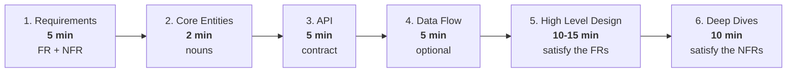

| Interview type | Flow |
| --- | --- |
| **Product design** (Uber, WhatsApp, Twitter, Netflix) | Requirements → Entities → API → HLD → Deep dives |
| **Infra design** (Rate limiter, Message queue, LB, Metrics) | Requirements → **System Interface** (in/out) → **Data Flow** → HLD → Deep dives |

**Graded on:** Problem navigation · Solution design · Technical excellence · Communication.

---

## 1. Requirements

### Functional — "Users should be able to…"
- Ask targeted questions like you're talking to a product owner: *"Does it need X?" "What happens if Y?"*
- Pick the **top 3** features. Explicitly park the rest as **out of scope**.

```text
TWITTER
- Users should be able to post tweets
- Users should be able to follow other users
- Users should be able to see tweets from users they follow
```

### Non-Functional — "The system should be…"
Always **quantify**. Walk the acronym **"SCALE For Cloud DesignS"**:

| Letter | Dimension | Ask yourself |
| --- | --- | --- |
| **S** | Scalability | Read or write heavy? Bursty? DAU? Fan-out ratio? |
| **C** | Consistency | CAP — pick C or A (P is a given in distributed systems) |
| **A** | Availability | Uptime target? Is degraded mode acceptable? |
| **L** | Latency | p99 budget? (<100 ms = "low latency") |
| **E** | Environment | Mobile, low bandwidth, browser limits, region |
| **F** | Fault tolerance | What can die? Is any component a SPOF? |
| **C** | Compliance | GDPR, PCI-DSS, HIPAA, data residency |
| **D** | Durability | Can we ever lose a write? RPO / RTO? |
| **S** | Security | AuthN/AuthZ, encryption, abuse prevention |

```text
TWITTER
- Highly available, availability > consistency
- Scale to 100M+ DAU
- Feed renders in under 200ms
```

> **The same system can mix both:** feed = eventually consistent, payments/booking = strongly consistent. Say this out loud.

### CAP / PACELC

**CAP:** on a network **P**artition, choose **C** or **A**.
**PACELC** (the bit CAP misses): *else* (no partition) choose **L**atency or **C**onsistency — this is the trade-off you actually make 99.9% of the time.

| Pick | Do this | Tools | Examples |
| --- | --- | --- | --- |
| **Consistency** | Distributed txns, single write region, consensus, accept latency | Azure SQL, PostgreSQL, Spanner, **Cosmos DB (Strong)** | Ticketing, inventory, payments, auctions |
| **Availability** | Many replicas, eventual consistency, CDC | Cassandra, **Cosmos DB multi-region write**, DynamoDB | Social feeds, streaming, analytics |

**Consistency levels** (strongest → weakest) — Cosmos DB exposes exactly these as a dial:

| Level | Guarantee | Cost |
| --- | --- | --- |
| **Strong** | Linearizable; every read sees the latest write | Highest latency, single write region |
| **Bounded staleness** | Lag bounded by *K* versions or *T* seconds | Tunable |
| **Session** *(default)* | **Read-your-own-writes** per client | Cheap, the pragmatic default |
| **Consistent prefix** | Never see writes out of order | Cheap |
| **Eventual** | Converges, no order guarantee | Cheapest, lowest latency |

**Availability math:** 99.9% = **8.76 h/yr** down · 99.95% = 4.4 h · 99.99% = 52.6 min · 99.999% = **5.26 min/yr**.
**SLI** = the measurement · **SLO** = internal target · **SLA** = contractual promise (with penalties).
> Availability multiplies in series: three 99.9% services chained = **99.7%**. Redundancy in parallel is what buys nines.

---

## 2. Numbers to Know

| Storage | Latency | Throughput |
| --- | --- | --- |
| L1/L2 cache | ~1 ns | — |
| RAM / Redis in-process | **~100 ns** (0.0001 ms) | millions reads/s |
| SSD | **~0.1 ms** | ~100,000 IOPS |
| HDD | **~10 ms** | 100–200 IOPS |
| Network same DC round trip | ~0.5 ms | — |
| Cross-region round trip (US↔EU) | ~80–150 ms | — |

| Component | Single-instance capacity | **Scale when…** |
| --- | --- | --- |
| **Cache** (Redis) | ~1 ms, 100k+ ops/s, up to 1 TB RAM | hit rate < 80%, latency > 1 ms, memory > 80%, thrashing |
| **Database** | up to 50k TPS, 10–20k writes/s, 5–20k conns, <5 ms cached read, ~15 ms write, 64 TiB+ | writes > 10k TPS, uncached read > 5 ms, geo needs |
| **App server** | 100k+ concurrent conns, 25–50 Gbps, 8–64 cores, 64–512 GB RAM | CPU > 70%, latency > SLA, conns near 100k, mem > 80% |
| **Message broker** | ~1M msgs/s per broker, <5 ms, 50 TB | ~800k msgs/s, ~200k partitions, growing consumer lag |

**Back-of-envelope recipe** — *do this during design, not up front*:

| Step | Formula | Handy constants |
| --- | --- | --- |
| 1. RPS | `DAU × actions/day ÷ 86,400` | **86,400 s/day** · 1M DAU × 10 actions ≈ **116 RPS avg** |
| 2. Peak | `avg × 2…10` | peak factor 2× (steady) to 10× (bursty/event-driven) |
| 3. Storage | `rows × bytes/row × replication × retention` | 1 KB × 1B rows = **1 TB** · ×3 replicas = 3 TB |
| 4. Bandwidth | `RPS × payload size` | 10k RPS × 100 KB = **1 GB/s** |
| 5. Compare | against the capacity table above | **the number decides** whether you shard, cache, or do nothing |

> **1B URLs × 500 B = 500 GB → fits on one machine with replicas.** Don't shard just because the problem sounds big.
> Example (Web Crawler): `200 Gbps ÷ 8 ÷ 2 MB/page ≈ 12,500 pages/s → ×30% real throughput ≈ 3,750/s → 10B pages ≈ 31 days on 1 machine → 8 machines ≈ 3.9 days.` *Math justifies the machine count.*

> **Modern systems: CPU is usually the bottleneck, not disk.**

---

## 3. Core Entities

The nouns/actors exchanged in the system. Derive them straight from the FRs. Name them well; refine later.

```text
TWITTER → User, Tweet, Follow
UBER    → Rider, Driver, Ride, Fare, Location
```

---

## 4. API Design

### Protocol choice

| Paradigm | Use when | Cons |
| --- | --- | --- |
| **REST** *(default)* | CRUD over resources, public/web/mobile | over/under-fetching |
| **GraphQL** | Diverse clients, complex data-rich UIs, mobile bandwidth | POST-only + always 200, N+1 problem, caching is hard |
| **gRPC** | Internal service-to-service, perf critical, streaming, type safety | needs HTTP/2, not human readable, browser needs a proxy |
| **WebSocket / SSE** | Real-time features | stateful, infra support required |

```text
Layer stack:  Paradigm (REST/GraphQL/RPC)  →  Protocol (HTTP/WS/TCP)  →  Serialization (JSON/Protobuf)
```

**gRPC streaming modes:** unary · server-streaming · client-streaming · bidirectional.

### Design rules
1. Resources = **core entities**, **plural nouns**, no verbs. Custom action → `POST /users/{id}/activate`.
2. **Path** = identity · **Query** = optional filter/sort/page · **Body** = payload.
3. **Never put `userId` in path/body** — it comes from the JWT / session header.
4. Required relationship → hierarchy `/users/{id}/orders`. Optional → query param.
5. Stateless. Idempotent where possible (use **idempotency keys** on POST/PUT).
6. Paginate: **offset** by default, **cursor** for real-time/high-volume feeds.
7. Version in URL (`/v1/...`) by default.
8. Consistent, actionable errors: `{"error":{"code":"SEAT_UNAVAILABLE","message":"..."}}`.

### HTTP method table

| Method | Purpose | Idempotent | Safe | Body |
| --- | --- | --- | --- | --- |
| GET | read | ✅ | ✅ | ❌ |
| POST | create / action | ❌ | ❌ | ✅ |
| PUT | replace | ✅ | ❌ | ✅ |
| PATCH | partial update | ❌* | ❌ | ✅ |
| DELETE | delete | ✅ | ❌ | ❌ |

\*can be made idempotent by design.

### Status codes worth naming
`200` OK · `201` Created · `202` Accepted (async job) · `204` No Content · `301/302` Redirect · `304` Not Modified · `400` Bad Request · `401` Unauthenticated · `403` Forbidden · `404` Not Found · `409` Conflict · `412` Precondition Failed (ETag) · `422` Validation · `429` Rate limited · `500` · `502` · `503` · `504`.

### Caching headers
`Cache-Control: max-age|no-cache|no-store|private` · `ETag` + `If-None-Match` → **304** · `Last-Modified` + `If-Modified-Since`.
**`If-Match` + ETag = optimistic concurrency over HTTP** (Cosmos DB uses exactly this).

### Auth quick pick

| Need | Use |
| --- | --- |
| User-facing web/mobile | **JWT** (stateless, scalable; revocation is hard) or **session + Redis** (revocable, stateful) |
| Service-to-service | **mTLS**, **API key + request signing** (timestamp + nonce + HMAC), or **Managed Identity** on Azure |
| Delegated access ("login with X") | **OAuth 2.0** (+ **OIDC** for identity) — Microsoft Entra ID |
| Many apps, one login | **SSO** |
| Permissions | **RBAC** (default) · ABAC (flexible, complex) · ACL (granular, doesn't scale) |

Pattern: short-lived **access token** (~15 min) + long-lived **refresh token** (rotating).
JWT = `header.payload.signature`. Never put secrets in the payload — it's only Base64, not encrypted.

---

## 5. Data Flow

Only for processing pipelines (crawler, metrics, analytics, video). List the steps input → output.

```text
WEB CRAWLER: seed URL → DNS → fetch HTML → parse text → store → extract links → repeat
```

---

## 6. High Level Design

**Start simple. Satisfy one API at a time. Narrate the data flow.**

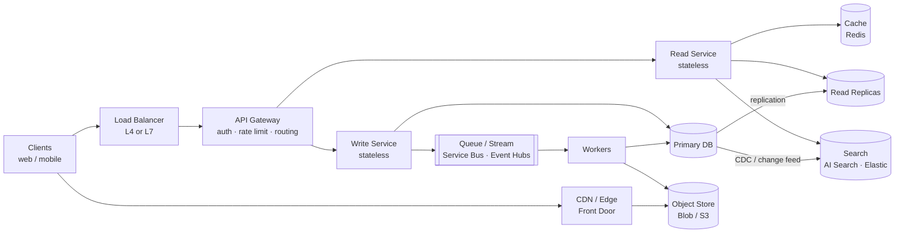

**Rules of thumb**
- One DB can serve several microservices — simpler, still fault tolerant via replication.
- **Split read and write services only when their scaling profiles differ.** Say why.
- Minimise DB hops. Stateless services scale horizontally — say that too.
- Add an API Gateway once you have >1 service.
- Document the important DB fields inline.

### Building blocks vocabulary

| Block | What it does |
| --- | --- |
| **Forward proxy** | client-side egress: caching, anonymity |
| **Reverse proxy** | server-side ingress: LB, CDN, SSL offload, firewall (Nginx) |
| **Load balancer** | distributes traffic + health checks. Algorithms: round-robin, least-connections, IP hash, weighted, **consistent hashing**, geo |
| **L4 vs L7 LB** | L4 = TCP/UDP, fast, used for **WebSockets**; L7 = HTTP-aware routing on URL/header/cookie |
| **API Gateway** | routing, authN, rate limiting, aggregation, versioning |
| **Service discovery** | services register and find each other (DNS, Consul, etcd, K8s Service) |
| **Service mesh** | sidecar proxies handle mTLS, retries, circuit breaking, tracing (Istio, Linkerd) |
| **Controller** | bind → validate/transform → call service → respond |
| **Service** | business logic, HTTP-agnostic |
| **Repository** | single-purpose DB access |
| **Middleware** | cross-cutting: CORS, rate limit, auth, logging, compression, global error handling |
| **Object storage** | Blob/S3/GCS — flat namespace, immutable, durable. **Never store files in the DB** (bloat, costly replication, not optimised) |
| **Scheduler** | cron/delayed work: Quartz, K8s CronJob, Service Bus scheduled messages, Durable Functions timers |

**Avoid LB as SPOF:** redundant LBs + health checks/failover + autoscaling + DNS failover.

---

# PART II — THE PATTERNS

## 7. The Eight Core Patterns

Pick the pattern that matches the **bottleneck**, then walk its escalation ladder.

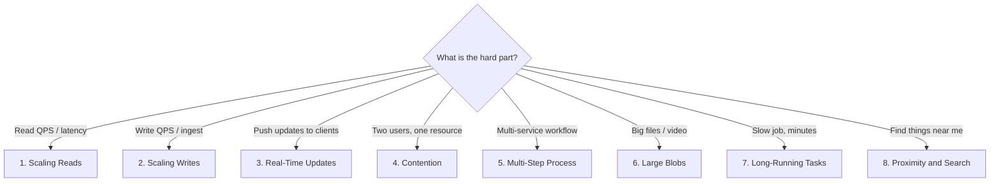

---

### Pattern 1 — Scaling Reads

**Order of attack (cheapest first):**

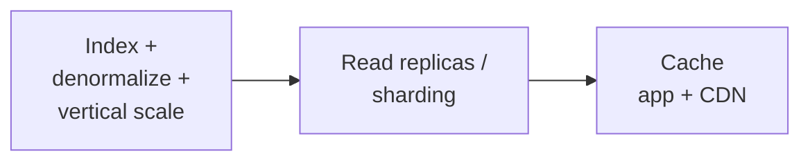

| Problem | Fix |
| --- | --- |
| Query slow | Add the right **index** (see index table) |
| Still slow, access is **skewed** | Add **cache** |
| Still slow, access is **uniform** | Add **read replicas** (mind replication lag) |
| Disk bound | HDD → **SSD** |
| **Cache stampede** (all miss at once) | **Request coalescing / single-flight**, cache warming, **jittered TTL** |
| **Hot key** | Shard the key across nodes (`key#1..N`) + **in-process fallback cache** |
| Stale cache after write | Delete key on write + **cache versioning** (a replica may still serve old) |
| Concurrent cache fill race | Atomic `SET NX` or a distributed lock |
| Read-your-own-writes broken by replica lag | Route that user's reads to the primary, or use **session consistency** |

**Caching strategies**

| Strategy | Write path | Best for |
| --- | --- | --- |
| **Cache-aside** *(default)* | write DB, invalidate cache | general |
| Write-through | cache + DB synchronously | read-heavy, frequently updated |
| Write-back | cache now, DB async | write-heavy (risk: loss) |
| Read-through | cache library loads on miss | read-heavy |
| Write-around | write DB only | write-heavy, rarely read |

**Where:** external Redis/Memcached *(default)* → in-process → CDN (static, edge) → client.
**Invalidation:** TTL · tag-based · delete-on-write · async queue. **Eviction:** LRU (default), LFU, FIFO, TTL, random.
**CDN:** pull-based (cache on first request) vs push-based (origin pushes). Cache static assets, and API GETs with short TTLs.

---

### Pattern 2 — Scaling Writes

**Order of attack:**

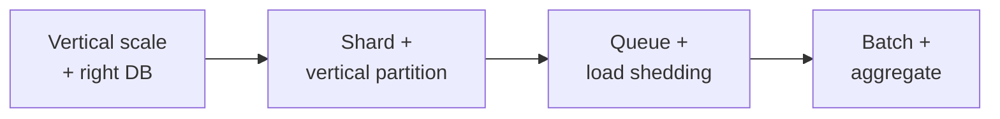

- **DB choice:** write-heavy → **Cassandra / Cosmos DB** (LSM, append-only commit log; reads suffer). Postgres rewrites a B-tree on every insert.
- **Shard** by the primary access pattern; **vertically partition** columns into specialised stores.
- **Queue** absorbs bursty/short-lived spikes → trades **eventual consistency**.
- **Load shedding:** drop low-value writes; a newer update overwrites an older one.
- **Batch/aggregate** at the app layer or in a stream processor, then flush → trades **latency** and needs recovery on loss.

| Deep dive | Answer |
| --- | --- |
| Add shards without downtime | new DB in parallel → **dual write** → backfill history → verify → cut over |
| Hot shard/key | split onto its own shard or add a random suffix; **re-aggregate on read** |

**Sharding**

| Strategy | Idea | Watch out |
| --- | --- | --- |
| **Range** | key ranges per shard | hot shards (timestamps!) |
| **Hash** | `hash(key) % N` | resharding moves nearly everything |
| **Consistent hashing** *(default)* | hash ring + **virtual nodes** | needs a good hash fn |
| **Directory** | lookup service maps key → shard | extra hop, SPOF |
| **Geographic** | by region | cross-region queries |

Good keys: `userId`, `productId`, `orderId` — **high cardinality, even distribution, matches the query**.
Bad keys: timestamp, auto-increment, low-cardinality enums (status, country).
> **Shard by query pattern, not data volume. Only shard when one DB genuinely can't cope.**

| Sharding pain | Fix |
| --- | --- |
| Hot spot | dedicated shard for the hot key, or a composite/hierarchical key |
| Cross-shard query | align key to query pattern, cache results, denormalize, or fan-out + merge |
| Cross-shard consistency | **2PC** (strong, blocking, slow) or **Saga** (eventual, flexible) |

**Replication:** single-leader (writes to primary, reads scale out) · multi-leader (both write, conflict resolution needed) · leaderless/quorum (Dynamo-style).
**Sync vs async replication:** sync = no data loss, higher latency; async = fast, **RPO > 0**.

---

### Pattern 3 — Real-Time Updates

Two independent decisions: **(a) client transport** and **(b) server-side propagation.**

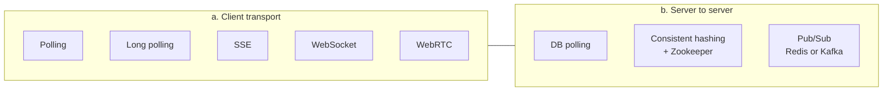

| Transport | Direction | Use when |
| --- | --- | --- |
| **Polling** *(default)* | pull | seconds of latency acceptable; simple, stateless |
| **Long polling** | pull, held open | near-real-time, keep infra simple; bad for frequent updates |
| **SSE** | server → client | dashboards, notifications, live comments, token streaming. HTTP-based, **auto-reconnect via `Last-Event-ID`** |
| **WebSocket** | full duplex | chat, collab editing, games. Stateful → **L4 LB**, needs heartbeats |
| **WebRTC** | peer ↔ peer (UDP) | video/audio calls, gaming; needs signalling + STUN/TURN for NAT |

| Propagation | Pros | Cons | Use when |
| --- | --- | --- | --- |
| **DB polling** | trivial, state in DB | high latency, wasted load | delay is fine |
| **Simple hashing** | predictable user→server | rescaling remaps everyone | stable server count |
| **Consistent hashing** | minimal remap on scale | needs Zookeeper/etcd; state lost on crash | persistent conns that must scale (collab editors) |
| **Pub/Sub** | clients hit *any* server, easy LB | extra hop; can be a bottleneck/SPOF | many clients want the same update (default) |

Redis Pub/Sub = simple, fast, **no durability**. Kafka / Event Hubs = complex, durable, **replayable**.
*Azure managed option:* **SignalR Service** handles WebSocket/SSE fan-out and connection state for you.

| Deep dive | Answer |
| --- | --- |
| Connection drops | heartbeats + **sequence numbers** per user; client detects a gap and re-syncs; per-user inbox queue |
| Celebrity with millions of followers | **batching + hierarchical fan-out** (tree of relay nodes) |
| Message ordering across servers | funnel through one stamping point; vector clocks / logical timestamps; or accept minor disorder and sort client-side |
| Extreme fan-out (5k comments/s to millions) | **CDN snapshots**: publish a comment snapshot every second, clients pull from edge |
| Thundering herd on reconnect | **jittered** reconnect backoff |

**Recipes:** live dashboard = polling or SSE+PubSub · chat = WebSocket+PubSub · collab editor = WebSocket+consistent hashing.

---

### Pattern 4 — Contention / Race Conditions

**Escalate only as far as you need:**

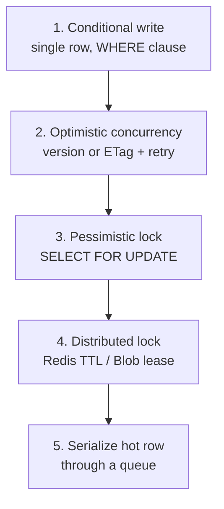

1. **Conditional write (start here).** DBs already do row-level locking; put the check in the `WHERE` clause so compare-and-set is **one** statement, not two. Multi-write txn? Make each write depend on the previous result.
   *Ticket with seat numbers → move the counter/lock down to seat level.*
2. **Optimistic concurrency** — read `version`, write only `WHERE version = v`. Best when conflicts are rare; needs retry.
   *Azure:* **Cosmos DB `ETag` + `If-Match`** / HTTP `412 Precondition Failed`.
   ⚠ **ABA problem** → use a **monotonic** version, never a reusable value.
3. **Pessimistic locking** — `SELECT ... FOR UPDATE` holds rows for the txn. Use when collisions are frequent.
   ⚠ **Deadlocks** → always grab locks in a **deterministic order** (modern DBs also detect + retry).
4. **Distributed lock** when the lock must outlive a DB transaction (e.g. "hold this seat for 10 minutes"):
   - **Redis `SET NX PX`** *(default: fast, auto-expiring)* · **Azure Blob lease** (15–60 s, renewable — the Azure-native lock) · **Zookeeper/etcd** (safest, ops overhead).
   - ⚠ A TTL lock can expire **while you're still working** → use **fencing tokens** (monotonic number checked by the resource) for correctness.
5. **Write skew** — reads and writes on *different* rows conflict (e.g. "delete my row if nobody else is here"). Fix with `SERIALIZABLE` isolation, but it's expensive → better to **collapse two rows into one** and do a conditional write.
6. **Everyone wants the same row** → throughput is capped by lock hold time. Serialize through a queue if strong consistency is required.

**Isolation levels:** Read Uncommitted → Read Committed *(default in Postgres/SQL Server)* → Repeatable Read → **Serializable**.
Anomalies they prevent: dirty read → non-repeatable read → phantom read / write skew.

---

### Pattern 5 — Multi-Step Processes (workflows)

Problem: a single node doing step1 → step2 → step3 **crashes halfway**.

| Approach | How | Pros | Cons |
| --- | --- | --- | --- |
| **Saga + compensation** | sequential local txns; on failure run compensations in reverse | no distributed txn | compensations can fail → need their own retry + idempotency |
| **Choreography** | append events to a durable log (**Kafka / Event Hubs**); workers react to state | workers scale independently | inserting a step later = many changes; hard to see the whole flow |
| **Orchestration** | **Temporal / AWS Step Functions / Azure Durable Functions**. *Workflow* = deterministic code; *Activities* = idempotent actions; history in storage, replayable | explicit, resumable, built-in retries/timeouts | extra infra |
| **2PC** | coordinator prepares then commits all participants | strong atomicity | blocking, coordinator SPOF — avoid at scale |

| Deep dive | Answer |
| --- | --- |
| Changing a live workflow | **versioning** + patching |
| Exactly-once step | **idempotency key**, re-check state before replaying |
| History grows forever | keep activity payloads small; **continue-as-new** with current state |
| Dual write to DB + queue | **Outbox pattern** (see §13) — never write to two systems without it |

---

### Pattern 6 — Handling Large Blobs

**Never proxy big files through your app servers.**

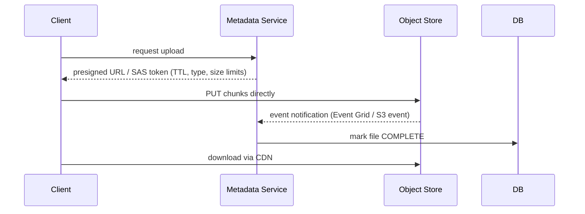

- **Presigned URL** (S3) / **SAS token** (Azure Blob) — temporary, scoped direct upload/download.
- **Resumable uploads** — client-side **chunking** + an upload-session id; track chunks via **checksum/ETag**; `CompleteMultipartUpload` / `Put Block List` stitches them. On failure, re-send only the failed chunks.
- **State sync problem** — the file is in Blob storage, the metadata is in the DB → races, orphaned files, malicious clients. Fix with **storage event notifications** (**Event Grid `BlobCreated`**) + a **periodic reconciliation job**.
- **Fast downloads** — CDN, parallel chunks, HTTP **Range** requests, compression.
- **Abuse** — run a scanning/processing pipeline before the file becomes downloadable.
- **Lifecycle** — tiering (Hot → Cool → Archive) and expiry policies to control cost.
- **Don't use** for files < 10 MB, or when you need synchronous validation/inspection.
- **Claim-check pattern** — too big for a message queue? Put the payload in Blob, send only the pointer.

---

### Pattern 7 — Long-Running Tasks

Split the request: **return a jobId immediately** (`202 Accepted`), process async.

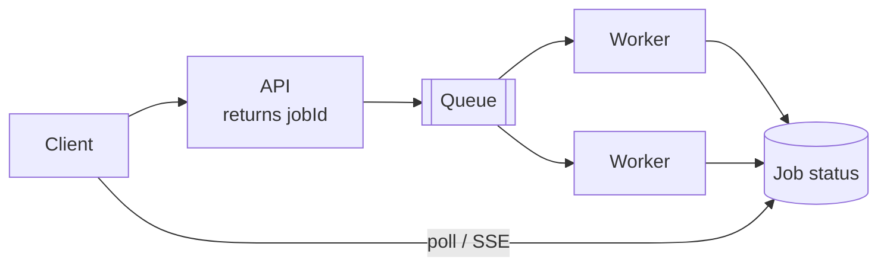

**Pros:** fast response, independent scaling, durable jobs, fault isolation.
**Cons:** complexity, eventual consistency, status-tracking infra, monitoring overhead.

| Queue | Notes | Azure equivalent |
| --- | --- | --- |
| **Kafka** *(default at scale)* | append-only log, huge throughput, order **per partition**, replay, fan-out | **Event Hubs** (Kafka-protocol compatible) |
| RabbitMQ | smart broker, routing, DLQ, per-queue ordering | **Service Bus** |
| AWS SQS | managed, 1 MB msgs, visibility timeout, built-in backoff | **Service Bus** / **Storage Queues** |
| Redis + BullMQ | simple and fast, **not durable** on crash | Azure Cache for Redis |

**Workers:** plain servers *(default)* · serverless (autoscale, pay-per-use; **cold starts**, time limits) · containers + K8s (flexible, more ops).

| Deep dive | Answer |
| --- | --- |
| Worker crashes | job redelivered — detect via **heartbeat** (SQS/Service Bus **lock or visibility timeout**, Kafka session timeout) |
| Job keeps failing | retries with exponential backoff → **DLQ** (Service Bus auto-DLQs after `MaxDeliveryCount`, default **10**) |
| Duplicate work | **idempotency keys** (Service Bus has native **duplicate detection**, window up to 7 days) |
| Producers faster than consumers | autoscale consumers · **backpressure** (reject when queue near full) · alert on **consumer lag / queue depth** |
| Mixed workloads | separate queues + worker pools: small tasks → many small workers; long tasks → few big workers |
| Job dependencies | simple: the worker enqueues the next step. Complex: **Durable Functions / Step Functions / Temporal** |
| Delayed retry / timeout | **scheduled messages** (Service Bus) or a delay queue |

**Delivery guarantees:** at-most-once (may lose) · **at-least-once (practical default → be idempotent)** · exactly-once (dedup + transactions, expensive; usually "effectively once").
**Partitions:** consumer-group parallelism; the `partition key` decides ordering; consumers > partitions = idle consumers.
**Queue durability:** replication across brokers + disk persistence (Kafka and Event Hubs do both).

**Kafka/Event Hubs vs RabbitMQ/Service Bus**

| | RabbitMQ · Service Bus | Kafka · Event Hubs |
| --- | --- | --- |
| Model | broker + queues, **push** to consumer | distributed append-only log, consumer **pulls** batches |
| Smarts | smart broker (routing, retries, DLQ), dumb consumer | dumb broker, smart consumer (tracks offsets) |
| Ordering | per queue / per session | per partition |
| Retention | deleted after ACK | until expiry, **replayable** |
| Throughput / latency | lower / very low | very high / higher |
| Use for | task queues, routing, transactions, moderate scale | high-volume telemetry, replay, many independent readers |

---

### Pattern 8 — Proximity and Search

| Need | Index | Tech |
| --- | --- | --- |
| Nearby places | **Geohash** (2D → prefix-matched string in a B-tree), **Quadtree**, **R-tree** *(modern, PostGIS)* | PostGIS, Elasticsearch geo, **Azure AI Search** geo |
| Real-time location (write-heavy) | in-memory geo store | **Redis GEO** — 100k–1M ops/s; persist via snapshots + **Sentinel** failover |
| Full-text search | **Inverted index** | Elasticsearch / **Azure AI Search**, synced from the DB via **CDC / change feed** |
| Everything else | B-tree | Postgres, Azure SQL |

> Plain lat/long B-tree indexes fail: searching one dimension returns a thin strip spanning the globe.
> Small scale? `Postgres + PostGIS + pg_trgm` beats bolting on a separate search cluster.
> **Search relevance:** TF-IDF / BM25 scoring, analyzers, synonyms, fuzzy matching, faceting.

---

# PART III — THE TOOLBOX

## 8. Data Modeling and Indexes

**Pick the model**

| Model | Use when | OSS / AWS | **Azure** |
| --- | --- | --- | --- |
| **Relational** *(default)* | structured data, ACID, joins, strong consistency | PostgreSQL, MySQL | **Azure SQL DB**, DB for PostgreSQL |
| **Document** | nested/evolving schema, denormalized reads | MongoDB | **Cosmos DB (NoSQL / Mongo API)** |
| **Key-Value** | cache, sessions, flags, flat + fast | Redis, DynamoDB | **Azure Cache for Redis**, Cosmos DB (Table) |
| **Wide-Column** | massive writes, time series, telemetry/logs/IoT | Cassandra, HBase | **Cosmos DB (Cassandra API)** |
| **Time-Series** | metrics at millions WPS, rollups, compression | InfluxDB, TimescaleDB | **Azure Data Explorer (Kusto)** |
| **Search** | full text, facets, geo | Elasticsearch | **Azure AI Search** |
| **OLAP / columnar** | analytics aggregation | Redshift, Snowflake, BigQuery | **Synapse / Microsoft Fabric** |
| **Graph** | relationship traversal | Neo4j | Cosmos DB (Gremlin) *(avoid in interviews)* |

**Then:** tables & keys (PK/FK) → relationships (1:1, 1:M, M:N) → constraints (`NOT NULL`, `UNIQUE`, `CHECK`) → indexes → normalize/denormalize → shard/partition key.

> **Enforce constraints as close to the persistence layer as possible** (e.g. `UNIQUE (user_id, business_id)` for "one review per business") — not in application code.
> Normalize the DB by default; denormalize in the **cache** or a read-optimised projection.
> **ACID** (relational) vs **BASE** (Basically Available, Soft state, Eventual consistency — NoSQL).

**Index selection**

| Index | Good at | Notes |
| --- | --- | --- |
| **B-tree** *(default)* | equality + **range** + sort | Postgres PK/unique; ~8 KB pages |
| **Hash** | exact match only | no ranges; more space |
| **LSM tree** | **write-heavy**, time series | Cassandra, Cosmos; reads slower → **bloom filters**, sparse index, compaction |
| **Inverted** | full-text search | Elasticsearch, AI Search |
| **Geospatial** | proximity (geohash/quadtree/R-tree) | PostGIS |
| **Bitmap** | low-cardinality columns | data warehousing |
| **Composite** | multi-column filter+sort | **column order matters** (leftmost prefix rule) |
| **Covering** | query served entirely from the index | `INCLUDE (col)`; bigger index |

```sql
-- WHERE user_id = ? AND created_at > ? ORDER BY created_at DESC
CREATE INDEX idx_user_time ON posts(user_id, created_at);                        -- composite
CREATE INDEX idx_user_time_likes ON posts(user_id, created_at) INCLUDE (likes);  -- covering
```

> Indexes speed reads, **slow writes**, cost storage. Worth it above ~10k rows on real query patterns.
> Read the **query plan** before adding one. Watch for full scans and sorts.

---

## 9. Rate Limiting

Protects against abuse, cost blowouts and cascading overload. Ask for it in **any** public API design.

| Algorithm | How it works | Trade-off |
| --- | --- | --- |
| **Fixed window counter** | count per `key:minute`, reset each window | Simplest. **2× burst at the window boundary** |
| **Sliding window log** | store each request timestamp in a sorted set, drop old | Exact, but memory grows with traffic |
| **Sliding window counter** | weighted blend of previous + current window | Good accuracy, cheap — **great default** |
| **Token bucket** *(most common)* | bucket of `b` tokens refilling at `r`/s; request takes one | **Allows controlled bursts**; used by Stripe/AWS |
| **Leaky bucket** | queue drains at a fixed rate | **Smooths** traffic to a constant outflow; adds latency |

**Implementation**
- Store counters in **Redis** (`INCR` + `EXPIRE`, or a Lua script for atomicity; sorted sets for the log variant).
- Enforce at the **API gateway / middleware**, before business logic.
- Respond **`429 Too Many Requests`** + `Retry-After` + `X-RateLimit-Limit/Remaining/Reset`.
- Key by user, API key, IP, or tenant. Different tiers → different buckets.
- **Distributed:** one central Redis is exact but a hotspot; per-node local limits are fast but approximate (`limit / N`).
- *Azure:* **API Management** rate-limit/quota policies, **Front Door WAF** rate limiting.

> Related defences: **load shedding** (drop low-priority work first), **quotas** (daily caps), **circuit breakers** (protect *downstream*), **backpressure** (protect *upstream*).

---

## 10. Unique ID Generation

| Method | Sortable | Coordination | Notes |
| --- | --- | --- | --- |
| **DB auto-increment** | ✅ | single DB | simple; SPOF, painful to shard |
| **UUID v4** | ❌ | none | 128-bit random; **poor B-tree locality** (random inserts) |
| **UUID v7 / ULID** | ✅ | none | timestamp prefix + random — **modern default**, index friendly |
| **Snowflake (Twitter)** | ✅ | machine id only | 64-bit: `41 bits ms timestamp + 10 bits node + 12 bits sequence` ≈ **4096 ids/ms/node**; needs clock sync (beware NTP rewind) |
| **Ticket / range server** | ✅ | occasional | each node reserves a block (e.g. 1000 ids) then hands them out locally — **Bitly's counter** |
| **Hash of content** | ❌ | none | dedupe-friendly; **collisions** must be handled |

**Encoding:** Base62 (`0-9a-zA-Z`) → 7 chars ≈ 3.5 trillion combos, ideal for short URLs.
**Rule:** don't leak sequential business IDs publicly (enumeration attack) — expose an opaque id.

---

## 11. Probabilistic Data Structures

Trade a little accuracy for a *lot* of memory. Interview gold for "top K", "unique count", "seen before".

| Structure | Answers | Error | Use case |
| --- | --- | --- | --- |
| **Bloom filter** | "Is X *definitely not* in the set?" | false positives, **never** false negatives | crawler URL dedupe, LSM/SSTable read skipping, cache-miss avoidance |
| **HyperLogLog** | "How many *unique* items?" | ~0.8% in ~12 KB for billions | unique visitors, unique viewers (Redis `PFADD`/`PFCOUNT`) |
| **Count-Min Sketch** | "How often did X occur?" (over-estimates) | tunable | trending topics, heavy hitters, per-key rate limiting |
| **Redis sorted set (ZSET)** | exact top-N, ranges | exact | leaderboards, sliding-window rate limits, delayed queues |

---

## 12. Distributed Coordination

| Concept | What it means |
| --- | --- |
| **Quorum** | `N` replicas, `W` write acks, `R` read acks. **`W + R > N` ⇒ strong consistency.** `W=1,R=N` write-optimised; `W=N,R=1` read-optimised; `W=R=⌈(N+1)/2⌉` balanced |
| **Consensus** | **Raft** (understandable) / **Paxos** — elect a leader + replicate a log. Needs a **majority** (2f+1 nodes tolerate f failures) |
| **Coordination services** | **ZooKeeper** (ZAB), **etcd** (Raft), Consul — config, service registry, leader election, distributed locks |
| **Leader election** | ZK ephemeral znodes · etcd lease · **Azure Blob lease** · DB row with a TTL |
| **Split brain** | two nodes both think they're leader → use **fencing tokens** (monotonic), quorum, and short lock TTLs |
| **Failure detection** | heartbeats (simple) vs **gossip** (scales, eventually consistent membership) |
| **Clocks** | wall clocks drift → use **Lamport timestamps** (causal order) or **vector clocks** (detect concurrency/conflicts) |
| **Idempotency** | client sends a unique key; server records `key → result` and replays the stored result on retry |

> **Interview line:** "I'd avoid rolling my own consensus — I'd lean on etcd/ZooKeeper, or a managed service, and keep the coordination surface as small as possible."

---

## 13. Event Driven Patterns

| Pattern | Problem it solves | How |
| --- | --- | --- |
| **Outbox** | **Dual-write**: DB commit succeeds, publish to queue fails (or vice versa) | Write the business row **and** an `outbox` row in **one transaction**; a relay/CDC process publishes and marks it sent. At-least-once → consumers must be idempotent |
| **Inbox / dedupe** | duplicate consumption | Record processed `messageId`s; skip repeats (Service Bus does this natively) |
| **CDC** | keep search/cache/analytics in sync without dual writes | Read the DB log: Debezium, SQL Server CDC, **Cosmos DB change feed** |
| **CQRS** | reads and writes need different models/scale | Separate write model from read projections (materialized views), updated via events |
| **Event sourcing** | audit, time-travel, rebuild state | Store the **event log** as the source of truth; state = fold over events. Add **snapshots** to bound replay |
| **Materialized view** | expensive joins/aggregations on read | Precompute and maintain a denormalized read table (news feed, ratings, leaderboards) |
| **Fan-out** | one event, many consumers | Topic + subscriptions (Service Bus) or consumer groups (Event Hubs/Kafka) |

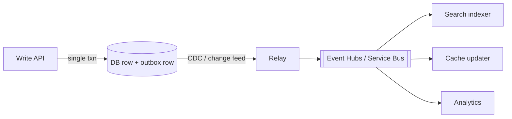

---

## 14. Networking Essentials

| Topic | What to know |
| --- | --- |
| **DNS** | name → IP. Recursive resolver → root → TLD → authoritative. **TTL** controls caching. GeoDNS / **Traffic Manager** routes by region; **anycast** routes to the nearest POP. DNS failover is slow (TTL-bound) |
| **TCP vs UDP** | TCP = reliable, ordered, 3-way handshake, congestion control (APIs, DB). UDP = fire-and-forget, low latency (video, gaming, DNS, **WebRTC**, QUIC) |
| **HTTP/1.1** | keep-alive, one request in flight per connection → **head-of-line blocking**; browsers open ~6 conns/host |
| **HTTP/2** | binary framing, **multiplexing** over one TCP conn, header compression — what **gRPC** runs on |
| **HTTP/3** | HTTP over **QUIC/UDP** — no TCP head-of-line blocking, 0-RTT resume, better on lossy mobile networks |
| **TLS** | handshake (~1–2 RTT), terminate at the CDN/LB; **mTLS** for service-to-service identity |
| **CORS** | browser same-origin policy; server opts in via `Access-Control-Allow-*`; preflight `OPTIONS` |
| **WAF / DDoS** | filter injection/bot traffic at the edge; rate limit + geo-block (Front Door WAF, Azure DDoS Protection) |
| **Compression** | gzip/**brotli** for text; don't recompress images/video |

---

## 15. Reliability and Operations

| Concern | Answer |
| --- | --- |
| **Network failures** | timeouts + retries with **exponential backoff + jitter** (avoids thundering herd), idempotent APIs, **circuit breakers** |
| **Circuit breaker** | Closed → (failure threshold) **Open** → (cooldown) **Half-open** → test → Closed. Fails fast, sheds load, lets the dependency recover |
| **Bulkhead** | isolate resource pools per dependency/tenant so one hot path can't starve the rest (see: notification system critical vs bulk traffic) |
| **Retry safety** | only retry **idempotent** or **keyed** operations; cap attempts; never retry 4xx |
| **SPOF** | redundancy, replication, health checks + failover, multi-AZ / availability zones, autoscaling |
| **Graceful shutdown** | SIGTERM → stop accepting new conns → drain in-flight → release resources (SIGINT = Ctrl-C, SIGKILL = hard stop) |
| **Validation** | validate at the boundary (controller): syntactic (regex/required), semantic (business rules), type. Client-side too, for UX |
| **Error handling** | global error middleware, error boundaries, consistent shape, fallbacks, health checks (liveness vs readiness) |
| **Observability** | **Logs** (structured JSON; debug/info/warn/error/fatal) + **Metrics** (RED: rate, errors, duration · USE: utilization, saturation, errors) + **Traces** (correlation id end-to-end). OpenTelemetry, Prometheus/Grafana, **Application Insights** |
| **Alerting** | alert on **symptoms** (SLO burn rate), not every metric; page on user-visible impact; monitor the monitoring from a **separate** system |
| **Config** | env vars, files, Redis/etcd, **Key Vault / App Configuration**; feature flags |
| **Deployment** | rolling · **blue-green** (instant rollback) · **canary** (1% → 100% with metric gates) · feature flags to decouple deploy from release |
| **Regionalization / DR** | active-active (multi-region writes, conflict handling) vs active-passive (failover). Define **RPO** (data loss window) and **RTO** (downtime window) |
| **Security** | HTTPS everywhere, authN/authZ, input validation, rate limiting, CORS, encryption in transit + at rest, secrets in a vault, least privilege, **never secrets in code** |
| **Auditability** | DB + **CDC** → event stream (better than a hand-rolled audit table) |
| **Correctness at scale** | **Lambda architecture**: speed layer (Flink/Stream Analytics) for latency + batch layer (Spark) for correctness, plus periodic **reconciliation** |
| **Cost** | storage tiering, TTL/retention, autoscale to zero, right-size RU/s and cache, egress is expensive — cache at the edge |

---

# PART IV — THE STACK

## 16. Azure Tech Map

Say the generic concept first, then name the Azure service. *"I need a durable, partitioned log — on Azure that's **Event Hubs**, which also speaks the Kafka protocol."*

| Need | **Azure** | AWS | OSS |
| --- | --- | --- | --- |
| Global L7 LB + CDN + WAF | **Front Door** | CloudFront + ALB | Nginx + Varnish |
| Regional L7 LB | **Application Gateway** | ALB | Nginx, HAProxy |
| L4 LB | **Azure Load Balancer** | NLB | HAProxy, LVS |
| DNS-based geo routing | **Traffic Manager** | Route 53 | GeoDNS |
| API gateway | **API Management (APIM)** | API Gateway | Kong, Envoy |
| Compute — PaaS | **App Service**, **Container Apps** | ECS/Fargate, Beanstalk | — |
| Compute — orchestration | **AKS** | EKS | Kubernetes |
| Compute — serverless | **Azure Functions** | Lambda | Knative |
| Relational DB | **Azure SQL DB**, **DB for PostgreSQL** | RDS, Aurora | PostgreSQL, MySQL |
| NoSQL / multi-model | **Cosmos DB** | DynamoDB | MongoDB, Cassandra |
| Cache | **Azure Cache for Redis** | ElastiCache | Redis, Memcached |
| Object storage | **Blob Storage / ADLS Gen2** | S3 | MinIO |
| Search | **Azure AI Search** | OpenSearch | Elasticsearch |
| Time series / telemetry analytics | **Azure Data Explorer (Kusto)** | Timestream | InfluxDB, Prometheus |
| Data warehouse / OLAP | **Synapse / Microsoft Fabric** | Redshift | ClickHouse, Druid |
| **Message broker (queue/topic)** | **Service Bus** | SQS + SNS | RabbitMQ |
| **Event stream (log)** | **Event Hubs** | Kinesis, MSK | Kafka, Pulsar |
| **Event routing (reactive)** | **Event Grid** | EventBridge | CloudEvents + webhooks |
| Simple queue | **Storage Queues** | SQS | Redis lists |
| Stream processing | **Stream Analytics**, Databricks | Kinesis Analytics | **Flink**, Spark Streaming |
| Batch processing | **Databricks / Synapse Spark** | EMR | Spark |
| Workflow orchestration | **Durable Functions**, **Logic Apps** | Step Functions | **Temporal**, Airflow |
| Real-time push to clients | **SignalR Service**, **Web PubSub** | API Gateway WebSockets, IoT | Socket.IO |
| Identity / OAuth2 / OIDC | **Microsoft Entra ID** | Cognito | Keycloak |
| Secrets | **Key Vault** | Secrets Manager | Vault |
| Service-to-service identity | **Managed Identity** | IAM roles | mTLS / SPIFFE |
| Observability | **Azure Monitor**, **App Insights**, Log Analytics (KQL) | CloudWatch, X-Ray | OpenTelemetry, Grafana |
| Distributed lock | **Blob lease**, Redis `SET NX` | DynamoDB conditional write | Redis, ZooKeeper, etcd |
| Config / feature flags | **App Configuration** | AppConfig | Unleash, LaunchDarkly |

---

## 17. Azure Messaging and Cosmos Deep Dive

### Which messaging service?

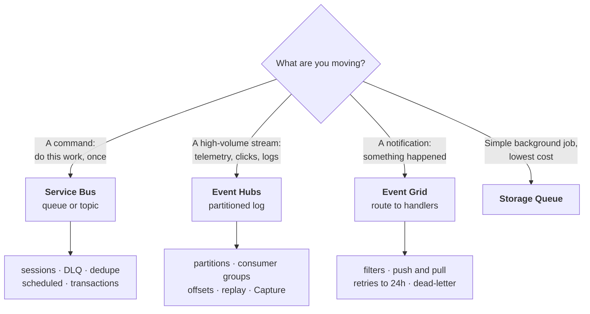

| | **Service Bus** | **Event Hubs** | **Event Grid** | Storage Queue |
| --- | --- | --- | --- | --- |
| Analogy | RabbitMQ / SQS+SNS | **Kafka** | EventBridge / SNS | basic SQS |
| Unit | Message (a **command**) | Event (a **datapoint** in a stream) | Event (a **fact/notification**) | Message |
| Model | Queue (1:1) + Topic/Subscription (1:N) | Partitioned append-only log | Push/pull routing with filters | Queue |
| Consumption | Broker **pushes**, consumer locks + completes | Consumer **pulls** by **offset**, checkpoints | Delivered to handlers (webhook, Functions, Service Bus, Event Hubs) | Poll + delete |
| Ordering | **FIFO per session** | **per partition** (via partition key) | none | best effort |
| Replay | ❌ (removed after completion) | ✅ **retention 1–7 d (Std), up to 90 d (Premium)** | ❌ | ❌ |
| Max size | **256 KB** Std · **100 MB** Premium (AMQP) | 1 MB | **1 MB** | 64 KB |
| Scale unit | Messaging units (Premium) | **TU** = 1 MB/s in, 2 MB/s out; ≤32 partitions Std | serverless, millions/s | storage account |
| Killer features | sessions, **duplicate detection (≤7 d)**, **DLQ**, **scheduled messages**, transactions, auto-forward, SQL filters | **Kafka-compatible endpoint**, **Capture** → Blob/ADLS, consumer groups, checkpointing | **filters**, CloudEvents 1.0, **retry w/ exponential backoff up to 24 h**, dead-letter to Blob, MQTT (namespaces) | dirt cheap, huge queues |
| Use for | orders, payments, workflow steps, per-entity ordering | clicks, IoT, logs, metrics, ingest for analytics | "blob uploaded → process", resource events, glue between services | simple background jobs |
| Avoid for | millions of events/s | request/response commands, per-message DLQ | ordered or transactional work | anything needing ordering/DLQ |

**Reliability details worth quoting**
- **Service Bus:** `PeekLock` (lock → process → `Complete`; `Abandon` on failure) vs `ReceiveAndDelete`. Lock renewal for long work. After **`MaxDeliveryCount` (default 10)** → **auto dead-letter**. Duplicate detection on `MessageId` gives you idempotency for free.
- **Event Hubs:** at-least-once; the consumer owns the **offset/checkpoint** (stored in Blob). A crashed consumer resumes from the last checkpoint → reprocessing is possible, so **be idempotent**. Partition count is **fixed at creation** (Standard) — choose for peak parallelism. **Capture** auto-archives the raw stream to Blob = free **batch/replay layer** for a Lambda architecture.
- **Event Grid:** at-least-once, **not ordered**, ≤1 MB. Retries with exponential backoff (10 s → 30 s → … up to **24 h TTL**, configurable attempts), then dead-letters to a Blob container. Perfect for the **blob-upload → metadata reconcile** step in file/video systems.

### Cosmos DB in one box

| Aspect | What to say |
| --- | --- |
| **What it is** | Globally distributed, multi-model, **partitioned** NoSQL. APIs: NoSQL (native), MongoDB, Cassandra, Gremlin, Table |
| **Throughput** | **RU/s** — one 1 KB point read = **1 RU**. Provisioned / **autoscale** / serverless. Min 400 RU/s |
| **Partitioning** | Choose a **partition key**: high cardinality, even distribution, and **present in your hot query**. Logical partition cap = **20 GB** and **10k RU/s** → use **hierarchical (sub)partition keys** to go beyond |
| **Consistency** | The 5-level dial: Strong → Bounded Staleness → **Session (default)** → Consistent Prefix → Eventual. *Tunable per request* |
| **Geo** | Replicate to any region; **multi-region writes** (not with Strong). Up to **99.999%** read SLA, **<10 ms P99** point reads/writes |
| **Change feed** | Built-in ordered CDC per partition → drives materialized views, search indexing, **outbox**, event-driven workers (Azure Functions trigger) |
| **Concurrency** | **ETag + `If-Match`** = optimistic concurrency (→ `412` on conflict). Your contention pattern, built in |
| **TTL** | Per-item auto-expiry — sessions, tokens, reservations, short-lived cache |
| **Gotchas** | **`429` = RU throttling** → backoff + retry; cross-partition (fan-out) queries are expensive; **hot partitions** are the #1 design failure; indexing every property costs write RUs |

> **Interview framing:** "Cosmos gives me a tunable consistency dial, so I'd run the feed on **Session** consistency for low-latency reads, and the payment ledger on **Strong** in a single write region."

---

# PART V — PRACTICE

## 18. Problem Playbooks

| Problem | Core pattern | Key moves |
| --- | --- | --- |
| **Bitly** (URL shortener) | Scaling reads | Base62-encoded **global counter** (not a hash → collisions) · 302 redirect · cache + CDN · stateless read service, counter block shared by the write service · 1B×500 B = 500 GB (one DB + replicas) |
| **Dropbox** (file sync) | Large blobs | Presigned URL / SAS, client chunking, resume via saved state + **ETag** verification, `CompleteMultipartUpload`, share table, sync via `GET /changes?since=`, compression, encryption at rest/in transit |
| **YouTube** | Large blobs + long tasks | Upload → queue → transcoding workers → **adaptive bitrate** segments + **manifest** · codec/container/bitrate · resumable multipart upload · CDN · metadata sharded/replicated · view counts in Redis |
| **Ticketmaster** | Contention | **Redis distributed lock + TTL** to reserve seats (not a DB status column — it goes stale) · **virtual queue** over SSE/WS backed by Redis · search via Elasticsearch/AI Search + query and edge caching · heavy read caching for event pages |
| **Auction** | Contention + real-time | Cache max bid on the auction row · conditional write with **optimistic** (or pessimistic) locking · **Kafka/Event Hubs** for durability, ordering and buffering · **SSE** for the live high bid · **Pub/Sub** so any bid server can notify any viewer |
| **News Feed** | Scaling reads/writes | **Fan-out on write** precomputes feeds · **hybrid**: skip precompute for celebrities, merge at read time · async workers · **sharded + replicated post cache** (LRU) to kill hotspots · cursor pagination on timestamp |
| **WhatsApp** | Real-time | **WebSocket** + **Redis Pub/Sub** (partition by user for 1:1, by chat for groups) · **inbox DB** for offline messages (30 d) · per-device delivery/ACK tracking · heartbeats + **sequence numbers** to detect gaps · server-side timestamps (accept minor disorder) · media via object store · last-seen from connection state, not DB writes |
| **FB Live Comments** | Real-time | **SSE** (one-way, HTTP, auto-reconnect) over WebSockets · cursor pagination for history · **L7 LB + consistent hashing** to co-locate viewers, or a **Dispatcher** + Zookeeper · mega-streams → **CDN comment snapshots every second** · `Last-Event-ID` for missed events |
| **Uber** | Proximity + contention | **Redis geospatial** for driver locations (persistence + Sentinel) · **adaptive location update interval** · **Redis distributed lock + TTL** so one request goes to one driver · matching queue with dynamic scaling · **Durable Functions / Temporal** for retry+timeout on unresponsive drivers · **geo-sharding** + read replicas |
| **Yelp** | Proximity + search | **Elasticsearch / AI Search** (inverted + geo + B-tree), synced via **CDC** — or **Postgres + PostGIS + pg_trgm** at modest scale · sync-update average rating with **optimistic locking** (no queue needed) · `UNIQUE(user_id, business_id)` DB constraint · polygon tables for city/neighbourhood search |
| **Ad Click Aggregator** | Scaling writes / streaming | Server-side redirect to capture the click · **Kafka/Event Hubs → Flink/Stream Analytics** (windowed aggregation, exactly-once, checkpointing) → **OLAP** · shard the stream by adId, **suffix hot ads** and recombine · **signed impression id** as the idempotency key against click fraud · pre-aggregate daily/weekly rollups · **Lambda architecture** reconciliation |
| **Metrics Monitoring** | Scaling writes / time series | **Agent-based collection with local buffering** + batching (Protobuf) → Kafka/Event Hubs → **TSDB / Azure Data Explorer** (LSM, time-partitioned, columnar, rollups) · dashboards via **rollups + Redis cache + query splitting** (sliding window, compute only the missing range) · alerts: polling → **stream processing** for <1 min · **cardinality explosion** → policy DB of allowed labels + Redis cardinality tracker · monitor the monitor externally |
| **Web Crawler** | Long-running tasks | Frontier queue → fetcher → **separate parser stage** (fault isolation) · **visibility/lock timeout for exponential backoff** (Kafka needs a manual retry topic; Service Bus/SQS have it built in) → DLQ · restart-safe via offsets/locks · **robots.txt** + Redis rate limiter **with jitter** · dedupe URLs (DB) and content (**hash / bloom filter**) · max depth for traps · DNS caching + round-robin providers · headless browser for JS pages |
| **LeetCode** | Long-running tasks | Submissions → queue → **sandboxed containers/serverless** runners (read-only FS, CPU/mem caps, timeouts, no network, no syscalls) · **Redis sorted set** leaderboard updated on write · autoscaling workers for 100k-user contests · language-agnostic test-case serialization |
| **Notification System** | Multi-step + isolation | Bulk campaigns **fan out into single notifications** reusing one pipeline · resolve user prefs at **send time**, not store time · separate **suppression** table for opt-outs · durable queue, single-claim + ACK · **deterministic idempotency key** for dedupe · mark sent **only after provider ACK** · **bulkhead: isolate critical traffic (OTPs) from bulk at every layer** |
| **Payment System** | Multi-step + integrity | `PaymentIntent` then transactions · **API key + request signing** (timestamp + nonce + HMAC) · **iframe on the payment domain + RSA encryption** so card data never touches the merchant · **DB + CDC → event stream** for durability/audit (event sourcing) · pending states + **event-driven reconciliation worker** for async networks · Kafka partitioned by `paymentIntentId` for ordering, RF=3 · webhook service consumes the stream · archive old txns to Blob/S3 |

---

## 19. Communication Rules

This is half your score.

**Do**
- Drive the conversation; propose, then invite feedback.
- **Always justify:** *"Stateless read services, so horizontal scaling is trivial and any instance can serve any request."*
- Frame every choice as **BAD → GOOD → GREAT** and name the trade-off you're buying.
- Do the math before declaring something a bottleneck. Often **one Postgres box is enough** — say so.
- Name the generic concept, *then* the product: *"a partitioned durable log — Kafka, or Event Hubs on Azure."*
- Proactively surface edge cases and failure modes; leave room for the interviewer to probe.

**Don't**
- Vague claims with no explanation ("we'll just add a cache").
- Scale numbers without context ("it handles a lot of traffic").
- Jumping to Kafka/microservices/sharding before the simple design is shown to break.
- Silently redesigning — narrate as you erase.

### Universal closing checklist

| Dimension | Did I cover it? |
| --- | --- |
| **Availability** | replicas, multi-AZ/region, health checks, no SPOF |
| **Latency** | cache, CDN, index, connection reuse, right region |
| **Consistency** | which parts are strong, which are eventual, and why |
| **Durability** | replication, WAL, backups, RPO/RTO |
| **Scalability** | stateless services, shard key, partition count, autoscale triggers |
| **Failure modes** | retries + backoff + jitter, circuit breaker, DLQ, idempotency |
| **Security** | authN/authZ, encryption, rate limiting, secrets, input validation |
| **Observability** | logs, metrics, traces, alerts on SLO burn |
| **Cost** | storage tiering, retention/TTL, egress, right-sized throughput |
