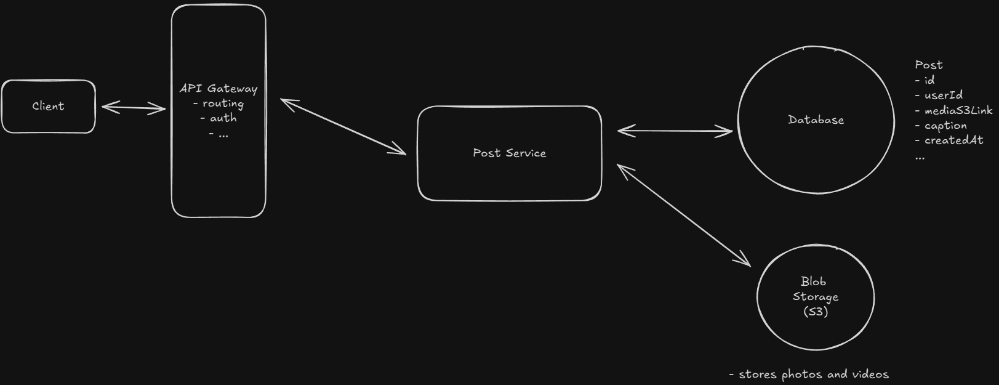
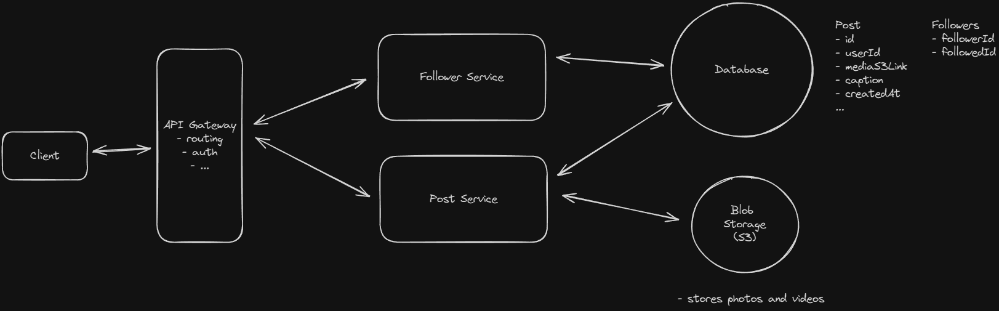
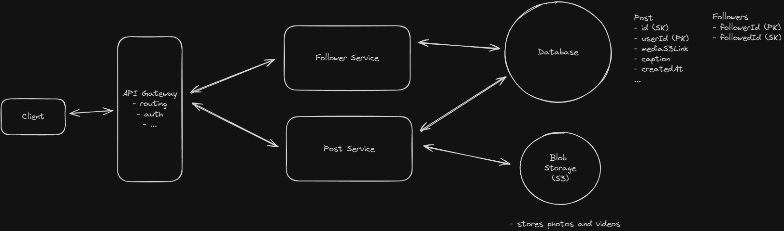
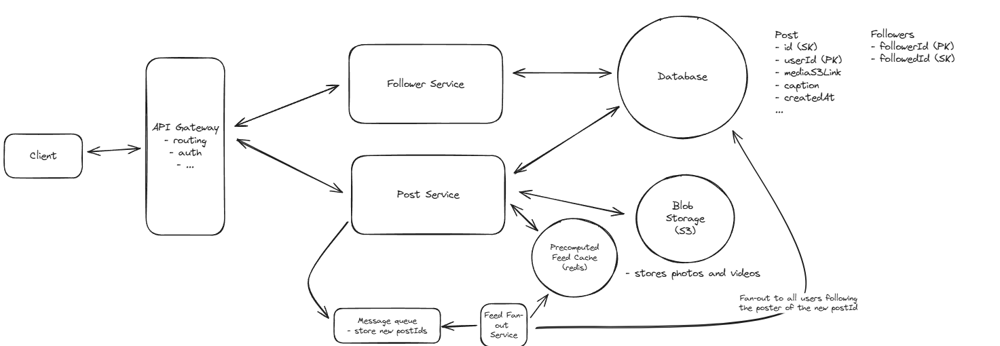
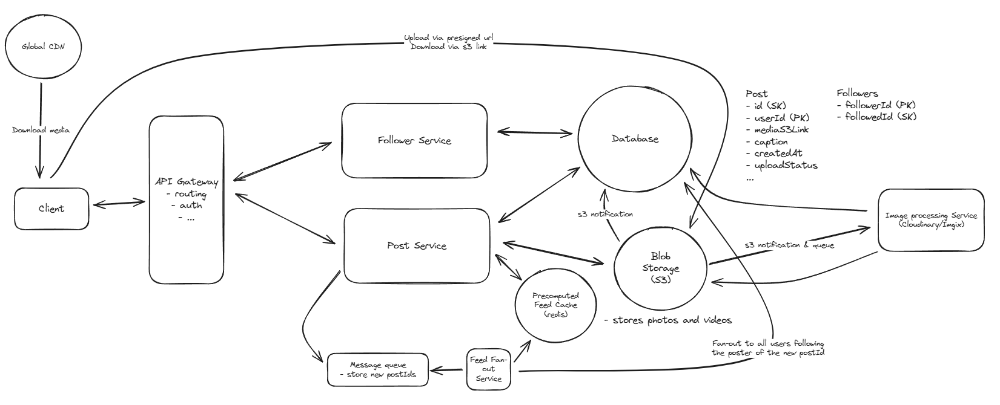
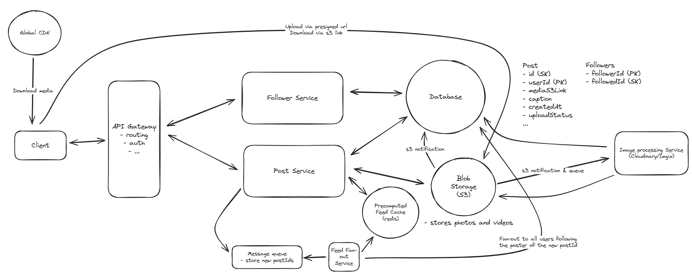

# Instagram

Instagram is a social media platform primarily focused on visual content, allowing users to share photos and videos with their followers.

## Requirements


## Core Entities

```
User
Post
Media
Follow
```

## API

```
POST /posts -> postId
{
  "media": {photo or video bytes},
  "caption": "My cool photo!",
}

POST /follows
{
  "followedId": "123"
}

GET /feed?cursor={cursor}&limit={page_size} -> Post[]
```

## HLD

### Users should be able to create posts featuring photos, videos, and a simple caption



### Users should be able to follow other users



### Users should be able to see a chronological feed of posts from the users they follow



PK - Primary Key
SK - Sort Key (Partition Key)
Unique = PK + SK

## Deep Dives

### The system should deliver feed content with low latency (< 500ms )

Fan Out on write for non popular users
Fan Out on read for popular users
Parallel query for both



### The system should render photos and videos instantly, supporting photos up to 8mb and videos up to 4GB



### The system should be scalable to support 500M DAU

- Pre computed feed
- CDNs
- Chunked Uploads
- Database and Indexing

## Final Design


