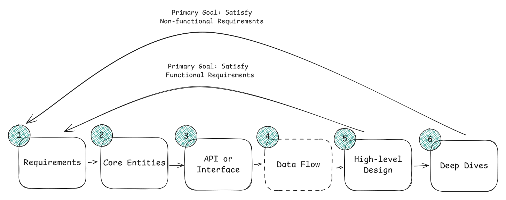
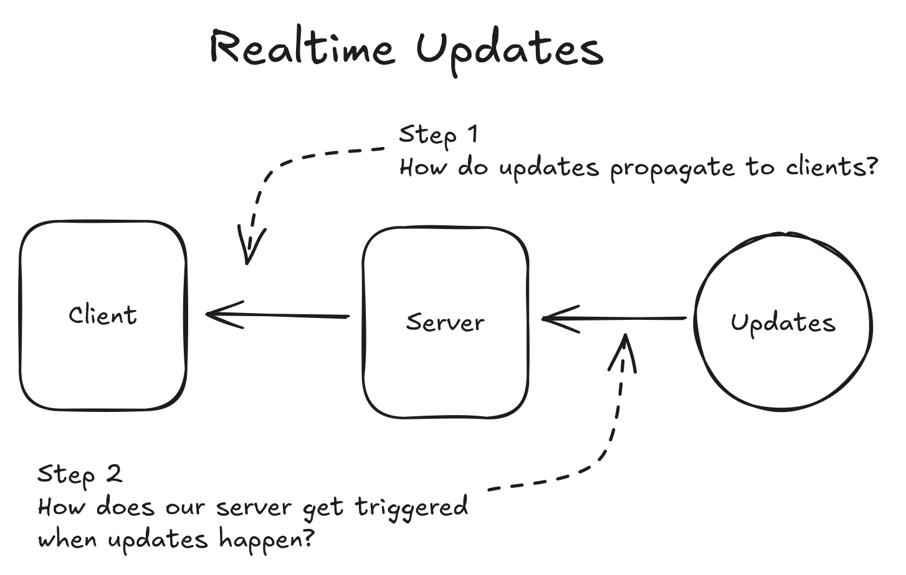

# ⚡ Quick Revision — Read This in the Last 60 Minutes

> Everything below is a *reminder*, not a lesson. If a line doesn't ring a bell, follow the link and come back.

---

## 1. The script (memorise this, not answers)

| Min | Phase | Say / draw |
|---|---|---|
| 0-5 | **Requirements** | 3 functional bullets. 3-5 **quantified** non-functional bullets. Name what's out of scope. |
| 5-7 | **Core entities** | Bulleted nouns. Nothing more. |
| 7-12 | **API** | 4-6 REST endpoints, plural nouns, user from the auth token. |
| 12-25 | **High-level design** | Endpoint by endpoint. Simple. *Finish it.* Verbally park complexity. |
| 25-40 | **Deep dives** | One per non-functional requirement + the obvious bottleneck. |
| 40-45 | **Wrap** | Recap tradeoffs, name the weakest part of your design first. |

**Opening line:** *"Let me confirm the requirements first, then I'll sketch a simple end-to-end design and harden it against the non-functional requirements."*
**Estimation line:** *"I'll skip upfront math and do it inline where it changes a decision."*

---

## 2. Numbers (2026 hardware — do not quote 2015)

| Component | Capability | Scale trigger |
|---|---|---|
| **Cache (Redis)** | < 1 ms, 100k-200k ops/s/instance, up to ~1 TB RAM | > 1 TB working set, > 100k ops/s, hit rate < 80% |
| **SQL DB** | 64 TiB (Aurora 256 TiB), 50k read TPS, **10-20k write TPS**, 1-5 ms cached reads, 5-30 ms disk, 5-15 ms commit | > 50 TiB, > 10k write TPS, geo-distribution, backup windows |
| **App server** | 100k+ concurrent connections, 8-64 cores, 64-512 GB RAM, 30-60 s container start | CPU > 70%, memory > 80%, latency > SLA |
| **Kafka broker** | ~1M msgs/s, 1-5 ms e2e, up to 50 TB, weeks of retention | ~800k msgs/s, growing consumer lag, ~200k partitions/cluster |

**Latency ladder:** memory ns → Redis/SSD ~1 ms → same-AZ < 1 ms → cross-AZ 1-2 ms → cross-region 50-150 ms.
**Bandwidth:** 25 Gbps standard instance, 50-100 Gbps high-perf.
**Handy:** 1 day ≈ 86,400 s ≈ **100k s**. 1M/day ≈ 12/s. 1B/day ≈ 12k/s. 1 KB × 1B rows = 1 TB.

**The three estimation mistakes:** premature sharding (10M × 1 KB = 10 GB — don't shard!), overestimating SSD/indexed-lookup latency, adding a queue for "high" write loads that are actually 5k WPS.

📄 [Full numbers](03-CoreConcepts.md)

---

## 3. Patterns — trigger phrase → pattern

| The prompt says | Pattern | The one decision |
|---|---|---|
| "live / realtime / instantly see" | **Realtime Updates** | Poll → SSE → WebSocket; pub/sub vs stateful partitioned servers |
| "last ticket / highest bid / don't double-charge" | **Contention** | One DB transaction > distributed lock; optimistic vs pessimistic; reserve-with-TTL |
| "upload/watch video, photos, files" | **Large Blobs** | Presigned URL direct to S3 + CDN; never proxy bytes |
| "transcode / crawl / generate / email blast" | **Long-Running Tasks** | Queue + workers + job status; idempotency; DLQ |
| "checkout / fulfilment / payment flow" | **Multi-Step Processes** | Status machine → orchestrator (Temporal/Step Functions); sagas + compensation |
| "millions read the same content" | **Scaling Reads** | Index → denormalize → replicas → cache → CDN → shard |
| "millions of events/sec" | **Scaling Writes** | Batch → vertical partition → queue → shard → LSM store |
| "near me / within X km" | **Proximity** | Geohash/quadtree/PostGIS; skip the index under ~100k items |
| "trending / top K / counters" | **Stream aggregation** | Kafka + Flink windows; count-min sketch + heap |

📄 [All patterns](04-Patterns.md)

---

## 4. Technology one-liners

| Tech | Use it for | Don't |
|---|---|---|
| **Postgres** | Default source of truth; ACID; `FOR UPDATE`; PostGIS; GIN/JSONB | > 10-20k WPS on one primary |
| **DynamoDB** | Predictable key access at any scale; single-digit ms; GSIs | Ad-hoc queries; cross-partition transactions |
| **Cassandra** | Write-heavy, wide rows, multi-DC, tunable quorum | Reads by anything but the partition key |
| **Redis** | Cache, counters, leaderboards (ZSET), locks, rate limits, pub/sub, geo, streams | The durable source of truth |
| **Kafka** | Event log, replay, buffering bursts, fan-out to many consumers | Per-message retry/DLQ semantics |
| **Flink** | Stateful stream aggregation, windows, exactly-once sinks | Simple one-off async jobs |
| **Elasticsearch** | Full-text, faceted, geo, relevance | System of record |
| **ZooKeeper/etcd** | Leader election, membership, config, fencing | Anything a DB row can do |
| **S3 + CDN** | Blobs, static assets, data lake | Low-latency mutable state |
| **API Gateway** | Auth, rate limiting, routing, SSL termination at the edge | As a place to put business logic |

📄 [Tech cheat sheets](05-Technologies.md)

---

## 5. Tradeoff one-liners (say these out loud)

- **Fan-out write vs read** — push to followers' feeds for fast reads; pull for celebrities. *Hybrid is the senior answer.*
- **Strong vs eventual** — strong only where an invariant would break (money, seats, uniqueness); eventual everywhere else.
- **Replication ≠ sharding** — replicas buy availability and read scale; shards buy write and storage scale.
- **Optimistic vs pessimistic locking** — rare conflicts → optimistic version/CAS; frequent → `SELECT … FOR UPDATE`.
- **At-least-once + idempotent consumer = effectively-once.** Exactly-once delivery does not exist.
- **Queue vs log** — SQS deletes after ack and retries per message; Kafka retains, orders per partition, replays.
- **Cache-aside vs write-through** — lazy fill is the default; write-through when stale reads are unacceptable.
- **L4 vs L7** — WebSockets need L4/sticky; L7 for TLS, routing, auth, rate limiting.
- **CP vs AP per subsystem**, never for the whole system.
- **Denormalize to make reads cheap; pay for it with write amplification and a consistency story.**

---

## 6. Deep-dive prompts that always exist

Pick from these when the interviewer says "what else?":
1. **Hot key / celebrity problem** → shard the key, replicate, local cache.
2. **Thundering herd** on cache miss → single-flight lock, jittered TTL.
3. **Idempotency** on retried writes → idempotency key table, unique constraint.
4. **Read-your-own-writes** under replication lag → pin to primary or read from write cache.
5. **Backpressure** → bounded queues, load shedding, priority tiers, 429s.
6. **Failure mid-workflow** → status machine + sweeper + compensations.
7. **Connection state** for WebSockets → registry (Redis), heartbeats, reconnect + backfill by cursor.
8. **Rebalancing** when a node joins → consistent hashing with virtual nodes.
9. **Data lifecycle** → TTL, tiering hot→cold, archive to S3.
10. **Multi-region** → latency SLO or compliance only; then confront write conflicts.

---

## 7. Problem archetypes (all 32 map to one of these)

| Archetype | Ask yourself | Examples |
|---|---|---|
| Contention & correctness | Where is the invariant, and what transaction protects it? | Ticketmaster, FlashSale, Auction, PaymentSystem, Robinhood |
| Realtime & stateful connections | Who owns the socket, and what happens on reconnect? | WhatsApp, GoogleDocs, LiveComments, OnlineChess, ChatGPT |
| Feeds & social graphs | Fan-out on write, read, or hybrid? | FBNewsFeed, Instagram, Tinder, Strava, NewsAggregator |
| Blobs & media | How do I keep bytes out of my app servers? | Dropbox, YouTube |
| Search & geo | Which index, and do I even need one? | Yelp, Uber, LocalDelivery, FacebookPostSearch |
| Streams & counting | Windowed aggregation, skew, double-counting | AdClickAggregator, YoutubeTopK, MetricMonitoring |
| Infrastructure primitives | I'm building what others assume exists | RateLimiter, DistributedCache, JobScheduler, NotificationSystem, WebCrawler, Bitly, PriceTracker, Leetcode |

📄 [All 32 problems with their key decisions](06-Problems.md)

---

## 8. Final checklist before you walk in

- [ ] Can you draw the **6-phase timeline** from memory?
- [ ] Can you quote **Postgres write TPS, Redis ops/s, Kafka msgs/s** without hesitating?
- [ ] Can you explain **fan-out on write vs read** and when to go hybrid?
- [ ] Can you explain **optimistic vs pessimistic locking** with a concrete example?
- [ ] Can you draw the **presigned-URL upload flow**?
- [ ] Can you justify **not** using a cache/queue/shard?
- [ ] Do you have **3 quantified non-functional requirements** ready for any product?

**When stuck:** go back to a requirement and ask "what is the simplest thing that satisfies this, and where does it break?" Then design the fix. That *is* the interview.
