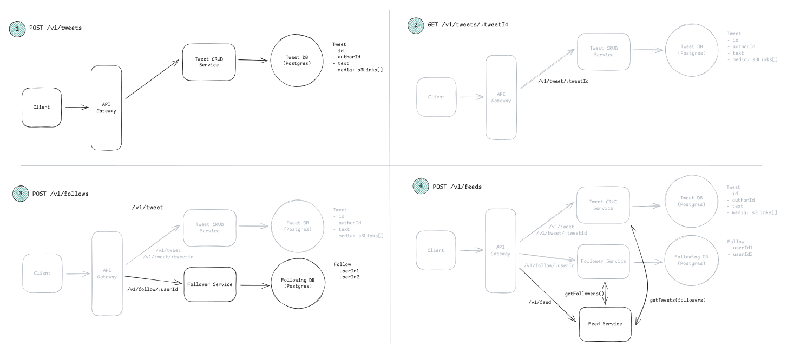
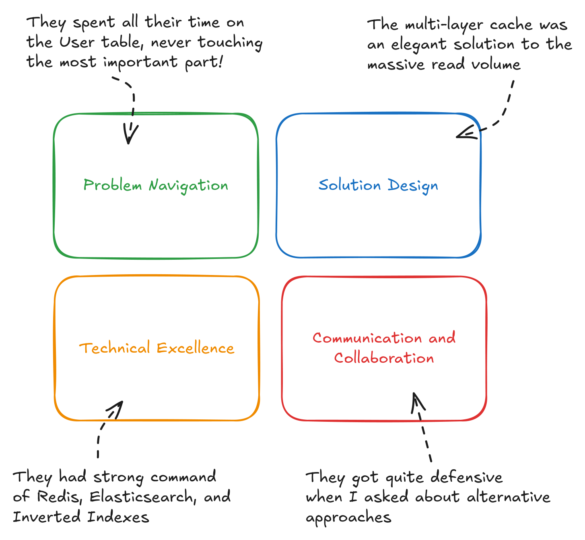

# The Delivery Framework — How to Run the 45 Minutes

> **Sources:** [Introduction](../1-InAHurry/1-Intro.md) · [Delivery Framework](../1-InAHurry/2-DeliveryFramework.md)

## TL;DR
- Most candidates fail on **time management**, not knowledge. A fixed track prevents that.
- Order: **Requirements → Core Entities → API → [Data Flow] → High-Level Design → Deep Dives**.
- Build a *simple* design that satisfies the **functional** requirements first. Add complexity in deep dives to satisfy the **non-functional** requirements.
- Skip upfront capacity math unless a number will *change a decision*. Do math inline, when it matters.
- Seniority = who drives the deep dives. Mid-level answers probes; senior leads them.

---

## The clock


| Phase | Time | Output on the board | Fail mode if you overrun |
|---|---|---|---|
| 1. Requirements | ~5 min | 3 functional bullets + 3-5 quantified non-functional bullets | Designing the wrong system |
| 2. Core Entities | ~2 min | Bulleted noun list | Premature schema bikeshedding |
| 3. API / Interface | ~5 min | 4-6 endpoints | Endpoints that don't map to requirements |
| 4. *(Optional)* Data Flow | ~5 min | Numbered pipeline steps | Only for data-processing systems |
| 5. High-Level Design | ~10-15 min | Boxes + arrows satisfying every endpoint | Layering complexity too early → never finishing |
| 6. Deep Dives | ~10 min | 2-4 hardened sub-designs | Talking over the interviewer |

> **Rule:** at minute 25 you must have a complete, working (if naive) system end-to-end. Everything after that is hardening.

---

## Phase 1 — Requirements (~5 min)

### Functional: "Users should be able to…"
- Ask targeted product questions: *"Does it need X?"*, *"What happens if Y?"*
- **Prioritise the top 3.** A long list hurts you — many FAANG rubrics explicitly score prioritisation.
- Write out-of-scope items down too; it buys you credit and protects you from scope creep.

### Non-functional: "The system should be…"
Quantify or don't bother. *"Low latency"* is worthless; *"feed renders < 200 ms p99"* is a design constraint.

**Checklist — pick the 3-5 that actually bite:** CAP (consistency vs availability) · environment constraints (mobile, bandwidth) · scalability (bursty? read:write ratio?) · latency (which operation, how fast?) · durability (can we lose data?) · security · fault tolerance · compliance.

**Soundbite:** *"I'll prioritise availability over strong consistency everywhere except the booking path, where double-selling a seat is unacceptable — so that path gets a transaction."*

### Capacity estimation — usually skip it
Say this out loud: *"I'd like to skip upfront estimation and do the math inline where it changes a decision."* Then actually do it when it matters, e.g.:
- Does the working set fit in one cache? (→ shard or not)
- Does write throughput exceed ~20k TPS? (→ queue/shard or not)
- Can a min-heap for Top-K live on one box? (→ completely different design)

---

## Phase 2 — Core Entities (~2 min)
A bulleted noun list — `User`, `Tweet`, `Follow`. Generate it by asking: who are the **actors**, and what **resources** do the functional requirements need?

Don't write the full schema yet. Flesh out columns later, next to the database box, and only the *interesting* ones (nobody needs to see `User.email`).

---

## Phase 3 — API (~5 min)

| Protocol | Use when | Notes |
|---|---|---|
| **REST** | Default for ~90% of interviews | Plural noun resources: `POST /v1/tweets` |
| **GraphQL** | Diverse clients, over/under-fetching is a stated problem | Rarely needed; justify it |
| **RPC / gRPC** | Internal service-to-service, performance critical | Say it for internal hops, not the public edge |
| **WebSocket / SSE** | Realtime push is a requirement | Layer *on top* of the core API — design REST first |

```http
POST /v1/tweets            body: { text }
GET  /v1/tweets/{tweetId}  -> Tweet
POST /v1/follows           body: { followee_id }
GET  /v1/feed              -> Tweet[]
```

**Two free points:**
- Plural resource names.
- **Never** take `userId` from the body/path — derive the caller from the auth token. Say it explicitly.

---

## Phase 4 — *(Optional)* Data Flow (~5 min)
Only for data-processing systems (crawler, aggregator, ETL). A numbered list is enough:
`Fetch seed URLs → Parse HTML → Extract URLs → Store → Repeat`

---

## Phase 5 — High-Level Design (~10-15 min)



**Method: go endpoint by endpoint.** For each one, trace the request from client to persistence and back, narrating *what state changes*.

Do:
- Keep it simple enough to finish. Client → LB/API Gateway → Service → DB is a fine skeleton.
- Note the interesting columns next to the DB box as they emerge.
- Verbally flag complexity you're deferring: *"There's an obvious hot-key problem here; I'll come back to it in deep dives."* Write a sticky note and move on.

Don't:
- Add caches, queues and shards now. That is the single most common reason candidates never deliver a working system.
- Document every field. Types are inferable.

---

## Phase 6 — Deep Dives (~10 min)
Harden the design against the non-functional requirements from Phase 1. Sources of deep dives, in priority order:

1. **Each non-functional requirement** → "how does this design actually deliver 200 ms feeds?"
2. **Bottlenecks** → hot keys, single writers, fan-out amplification, thundering herds.
3. **Edge cases** → failures mid-workflow, duplicate requests, clock skew, cold start.
4. **Interviewer probes** → follow them; they have signals to collect.

Leave silence. Talking over the interviewer costs you the Communication score even when the content is right.

---

## What is actually being scored



| Competency | What good looks like | How candidates fail |
|---|---|---|
| **Problem Navigation** | Decompose, prioritise, keep moving | Thin requirements; rabbit-holing on trivia; never finishing |
| **Solution Design** | Coherent components, scaling reasoned about | Weak fundamentals; "spaghetti design"; ignoring performance |
| **Technical Excellence** | Right tech, current patterns, real numbers | Unknown tech; 2015-era hardware assumptions; pattern-blind |
| **Communication** | Clear, collaborative, non-defensive | Lecturing; arguing with feedback; getting lost in weeds |

### Level expectations
| Level | Expectation |
|---|---|
| Mid | Covers the basics well end-to-end; interviewer drives the deep dives |
| Senior | Basics fast, then **leads** 2-3 deep dives with real tradeoff reasoning |
| Staff+ | Frames the problem/business tradeoffs, picks the battles, discusses org/ops/migration impact |

> Interviewers actively probe for memorised answers: they will doubt your choice and ask you to defend it. Depth of *reasoning* is the defence, not recall.

---

## Universal red flags
- Jumping to sharding/microservices/queues before the math justifies them.
- Unquantified non-functional requirements.
- Taking `userId` from the request body.
- A design that doesn't actually satisfy an endpoint you wrote down.
- Silence while drawing — narrate state changes.
- Refusing to consider an alternative the interviewer suggests.
- Using 2015 hardware numbers (see [Numbers & Estimation](03-CoreConcepts.md)).

## Universal green flags
- *"Let me do quick math to check whether we need that."*
- *"The simple version is X. It breaks at Y. Here's how I'd fix it when we get there."*
- *"I'm trading Z for W here because the requirement says…"*
- Explicitly naming the failure mode of your own design before the interviewer does.
