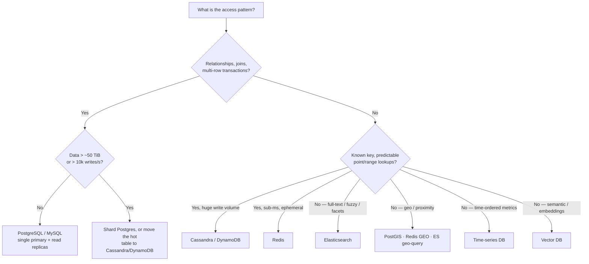
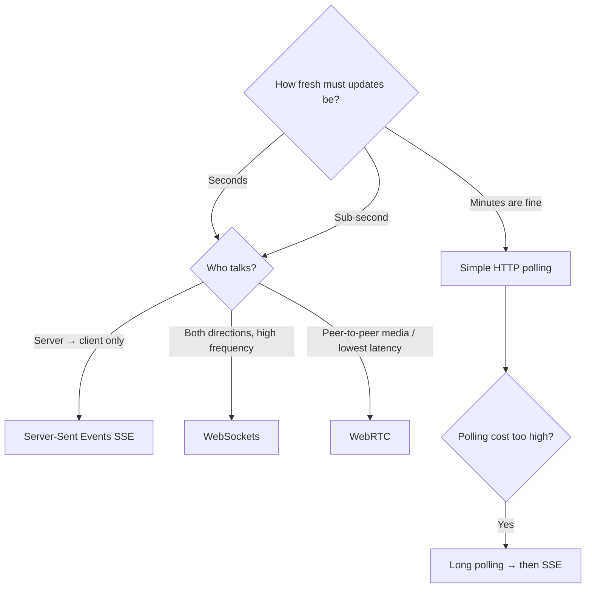
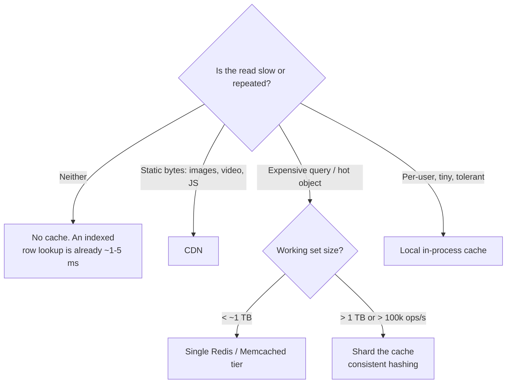
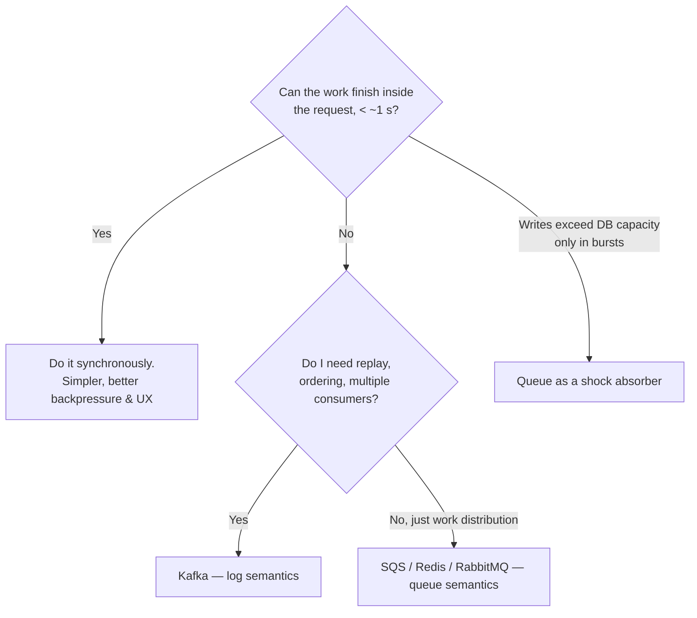
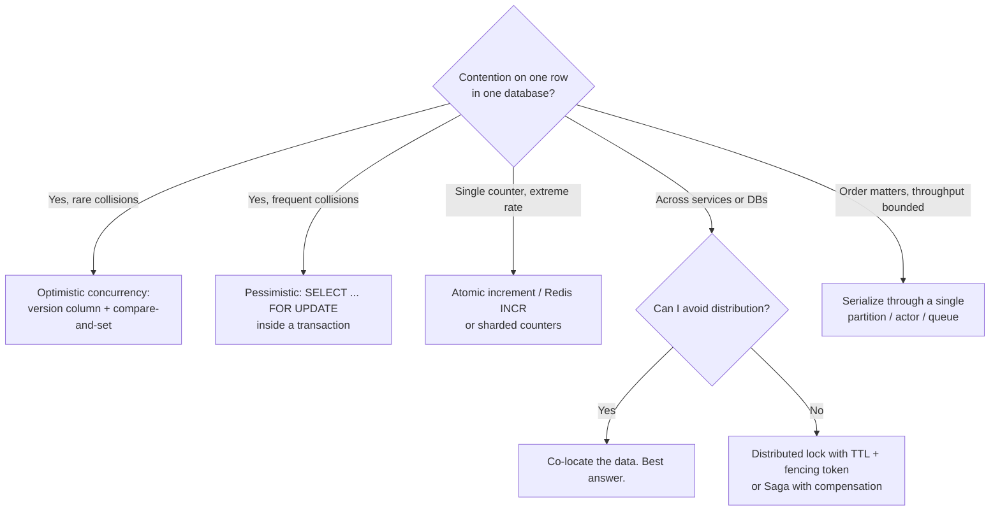
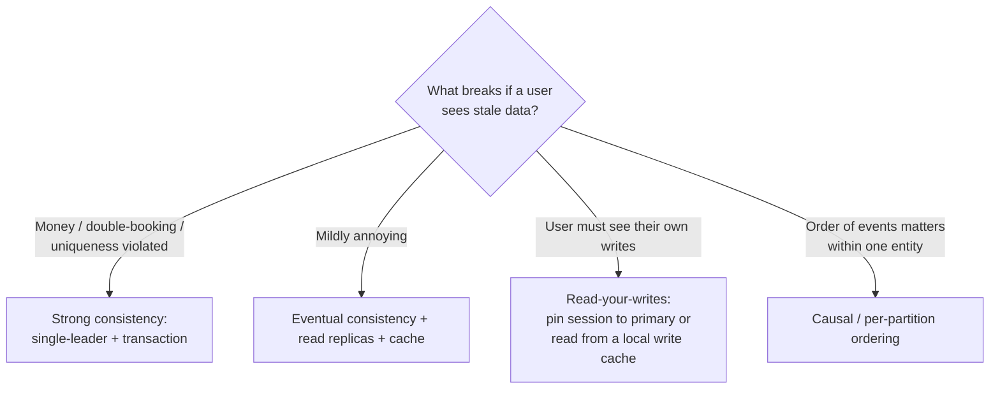

# Master Decision Trees — "When Do I Use What?"

> One page per decision. Use this as the lookup table during practice, and as the last thing you skim before the interview.
> Deeper reasoning lives in [Core Concepts](03-CoreConcepts.md), [Patterns](04-Patterns.md) and [Technologies](05-Technologies.md).

**Golden rule that governs every tree below:** start with the simplest thing that satisfies the *functional* requirements, then add exactly the complexity that a *quantified non-functional* requirement demands. Justify every box you draw.

---

## 1. Which database?

| Need | Default pick | Why | Don't pick when |
|---|---|---|---|
| Transactional truth (orders, bookings, payments, balances) | **PostgreSQL** | ACID, constraints, `SELECT … FOR UPDATE`, rich indexes (B-tree, GIN, GiST, PostGIS) | Sustained > 10-20k writes/s on one primary |
| Massive key-addressable writes (messages, events, feeds, time-series rows) | **Cassandra / DynamoDB** | LSM-tree writes, linear horizontal scale, tunable consistency | You need joins, ad-hoc queries, or multi-partition transactions |
| Sub-ms reads, counters, leaderboards, locks, rate limits, sessions, pub/sub | **Redis** | In-memory, atomic ops, rich types (sorted sets, HLL, GEO, streams) | Durability is non-negotiable (it's a cache, say so) |
| Full-text, fuzzy, faceted, relevance-ranked search | **Elasticsearch** | Inverted index + BM25 + aggregations | It's your system of record — always index *from* a source DB |
| Event log, replay, decoupling, buffering bursts | **Kafka** | Ordered per-partition, retained, replayable, ~1M msgs/s/broker | You need per-message ack/retry semantics → use SQS-style queue |
| Coordination: leader election, membership, distributed locks, config | **ZooKeeper / etcd** | Consensus + ephemeral nodes + watches | Anything you can do with a DB row or a Redis lock |

**Soundbite:** *"I'll keep the source of truth in Postgres because I need a transaction on the booking path, and replicate into Elasticsearch via CDC for search. I don't want two systems both claiming to be the truth."*

---

## 2. SQL vs NoSQL — the honest version

| Claim you hear | Reality to state in the interview |
|---|---|
| "NoSQL scales, SQL doesn't" | Postgres does 64 TiB and 10-20k writes/s on one node. Most interview systems never leave it. |
| "NoSQL is schemaless" | It has a schema — you just have to commit to it at *design* time, encoded in the partition + sort key. |
| "NoSQL is faster" | Only because it forbids the expensive things (joins, cross-partition transactions). |

**Choose NoSQL when you can name the access pattern up front and it is always "by this key".** Choose SQL when queries are unknown, varied, or need to be consistent across entities.

---

## 3. Realtime updates — which transport?

| Option | Use when | Cost / gotcha |
|---|---|---|
| **Short polling** | Low update frequency, small user base, simplicity wins | Wasted requests; latency = poll interval. **Start here and say so.** |
| **Long polling** | Seconds-fresh, want to keep plain HTTP | Holds a connection/thread; timeouts/proxies |
| **SSE** | One-way server push (feeds, notifications, live comments, LLM token streaming) | HTTP/1.1 connection limits per domain; text only; auto-reconnect is built in |
| **WebSockets** | Bidirectional and chatty (chat, collaborative editing, games, trading) | Stateful servers → LB stickiness, connection state, reconnect/backfill, scaling by connection count |
| **WebRTC** | Media / P2P | Signalling server, NAT traversal, rarely the point of the interview |

**The hard part is never the protocol — it's the server side.** Two routing models:

| Model | How | Use when |
|---|---|---|
| **Pub/Sub (stateless-ish)** | Connection servers subscribe to topics in Redis/Kafka; publishers just publish | Fan-out is broad and processing is light (WhatsApp, live comments, notifications) |
| **Stateful partitioned servers** | Consistent-hash the entity to a server that owns it in memory | Per-entity state/coordination is heavy (Google Docs, games, auctions, Figma) |

---

## 4. Do I need a cache? Where?

| Strategy | How | Use when | Risk |
|---|---|---|---|
| **Cache-aside (lazy)** | App checks cache, on miss reads DB and fills | Default. Read-heavy, tolerant of slightly stale | Thundering herd on miss; stale until TTL |
| **Read-through** | Cache library owns the fill | Same, cleaner code | Same staleness issues |
| **Write-through** | Write cache + DB synchronously | Reads must never be stale | Slower writes |
| **Write-back** | Write cache, flush later | Extreme write throughput, loss-tolerant | Data loss on node failure |

**Invalidation:** TTL (simple, default) → explicit delete on write (fresher, more code) → versioned keys (`post:123:v7`, no invalidation race).
**Hot key fix:** replicate the key across N shards (`key:{0..N}`), or add a small local cache in front with a short TTL.
**Stampede fix:** request coalescing / single-flight lock, or jittered TTLs.

> **Anti-pattern to avoid saying:** "I'll add Redis to make it fast." A primary-key lookup on an indexed Postgres row is already 1-5 ms. Cache *expensive* things, not cheap ones.

---

## 5. Do I need a queue?

| Reason to add a queue | Legit? |
|---|---|
| Task takes > a few seconds (transcode, crawl, report, LLM call) | ✅ |
| Guaranteed delivery across a downstream failure | ✅ |
| Burst absorption above DB capacity (> ~20k WPS on one Postgres) | ✅ |
| Decoupling producers/consumers, event sourcing, fan-out to N consumers | ✅ |
| "5k writes/s is a lot" | ❌ Postgres does 20k+. Do the math first. |

**Queue vs Log:**

| | **Queue** (SQS, RabbitMQ, Redis list) | **Log** (Kafka, Kinesis) |
|---|---|---|
| Message life | Deleted after ack | Retained for days/weeks, replayable |
| Ordering | Best-effort / per-group | Strict per partition |
| Consumers | Compete for messages | Independent consumer groups, own offsets |
| Retry | Per-message, visibility timeout, DLQ | Offset management; a poison message blocks the partition |
| Pick it for | Job/work distribution | Event streaming, replay, multi-subscriber, high throughput |

---

## 6. Handling contention (two people, one seat)

| Technique | Use when | Cost |
|---|---|---|
| **DB transaction + row lock** | Everything lives in one DB. The default and usually the right answer. | Lock waits, deadlocks, doesn't cross DBs |
| **Optimistic (version / CAS)** | Collisions are rare | Retries, user-visible conflicts under high contention |
| **Status + expiry ("reserve for 10 min")** | Ticketing, inventory, checkout holds | Needs cleanup of expired holds (cron, TTL row, or lazy check) |
| **Distributed lock (Redis/ZooKeeper)** | Coordination across services | Lock expiry vs. long work → **fencing tokens**; Redis locks are not perfectly safe — say so |
| **Saga + compensation** | Multi-service business transaction | No isolation; you must design the undo for each step |
| **2PC** | Rarely — strong atomicity across stores | Blocking, coordinator failure, poor availability |
| **Single-writer partition** | Auctions, order books, game state | Throughput capped by one node; needs failover |

**Soundbite:** *"I'd rather keep both sides of this invariant in one database and use one transaction than build a distributed lock. Splitting the data means re-solving what the database already solved."*

---

## 7. Scaling ladders

**Reads:** index → denormalize/precompute → read replicas → cache → CDN → shard.
**Writes:** batch → vertical partition → queue as shock absorber → shard → load shed → LSM engine.

Climb only as far as a quantified requirement forces you. Details and failure modes: [Patterns](04-Patterns.md).

---

## 8. Picking a shard key

| Good key | Bad key | Why |
|---|---|---|
| High cardinality, uniform distribution | `status`, `country`, boolean | Hot shards |
| Matches the dominant query (all reads hit one shard) | Random UUID when queries are "by user" | Scatter-gather on every read |
| Keeps a related unit together (`userId`, `chatId`, `docId`) | Timestamp for time-ordered writes | The newest shard takes 100% of writes |

- **Celebrity/hot partition fix:** composite key (`userId#bucket`), or split that entity's data across sub-partitions.
- **Resharding:** use **consistent hashing** (virtual nodes) so adding a node moves `1/N` of keys, not all of them.

---

## 9. Consistency model

**CAP in one line:** during a partition you must choose — **CP** (reject writes, stay correct: payments, inventory, bookings) or **AP** (accept writes, reconcile later: feeds, likes, presence, analytics). Say which one and why, per subsystem — not for the whole system.

---

## 10. Search, geo & counting

| Need | Pick |
|---|---|
| Keyword / relevance / typo tolerance / facets | Elasticsearch (inverted index, BM25) |
| "Within 5 km of me", < 100k items | Just scan/bounding-box in Postgres — an index is overkill |
| Millions of geo items | Geohash, quadtree, PostGIS (R-tree/GiST), Redis GEO, ES geo_distance |
| Semantic / "similar to this" | Vector DB + ANN (HNSW / IVF) |
| Top-K / trending over a stream | Count-min sketch + heap, or Flink windowed aggregation |
| "Have I seen this before?" at huge scale | Bloom filter |
| Cardinality ("unique viewers") | HyperLogLog |

---

## 11. Multi-step / long-running workflows

| Approach | Use when | Cost |
|---|---|---|
| Synchronous in one service | Few fast steps, one DB | Doesn't survive crashes mid-way |
| **Status column + background worker** | Simple async job (most interviews) | You own retries, timeouts, stuck-job sweeps |
| **Event-driven choreography** | Loosely coupled services | Hard to see the whole flow; debugging pain |
| **Orchestrator** (Temporal, Step Functions) | Many steps, long waits, must survive failures, audit trail | Extra infra; great senior-level answer |

Non-negotiables to mention: **idempotency keys**, **retries with backoff + jitter**, **dead-letter queue**, **compensating actions**.

---

## 12. Rapid-fire "X vs Y"

| Question | Answer |
|---|---|
| Fan-out on write vs read | Write = fast reads, expensive for celebrities. Read = cheap writes, slow feeds. **Hybrid: push for normal users, pull for celebrities.** |
| Sync vs async | Sync unless the work exceeds ~1 s or must survive downstream failure. |
| Replication vs sharding | Replication = availability + read scale. Sharding = write + storage scale. Different problems. |
| Optimistic vs pessimistic locking | Rare conflicts → optimistic. Frequent conflicts → pessimistic. |
| Push vs pull notifications | Push for latency/battery; pull for simplicity and to avoid connection state. |
| L4 vs L7 load balancer | L4 = fast, TCP-level, needed for WebSocket. L7 = routing/TLS/ratelimit/auth at the edge. |
| API Gateway vs plain LB | Gateway when you need auth, rate limiting, routing, aggregation at the edge. |
| Single-region vs multi-region | Multi-region only if latency SLO or compliance demands it — then confront write conflicts. |
| Exactly-once | Doesn't exist over a network. At-least-once delivery + idempotent consumer = effectively once. |
| Monolith vs microservices | In a 45-min interview, split by *scaling profile* (e.g. separate the WebSocket tier), not by org chart. |

> **Which pattern is this?** See the trigger-phrase lookup table at the top of [Patterns](04-Patterns.md).
