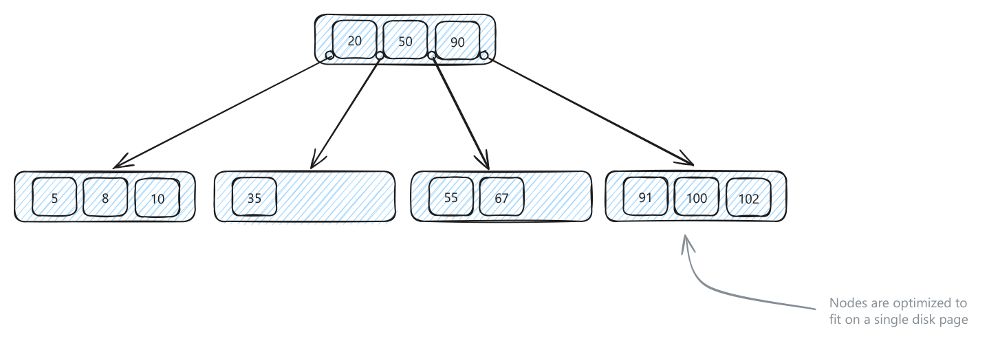
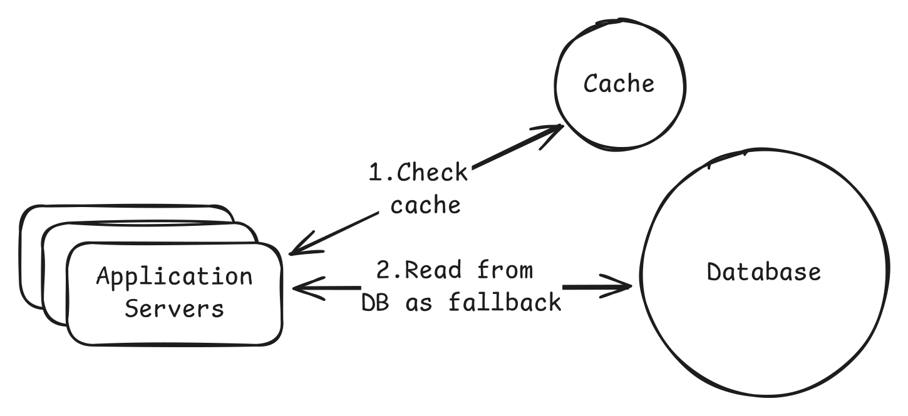
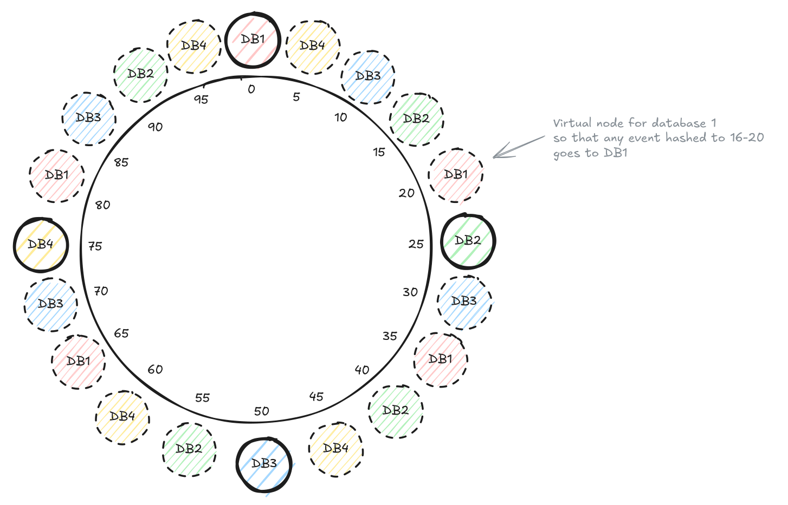
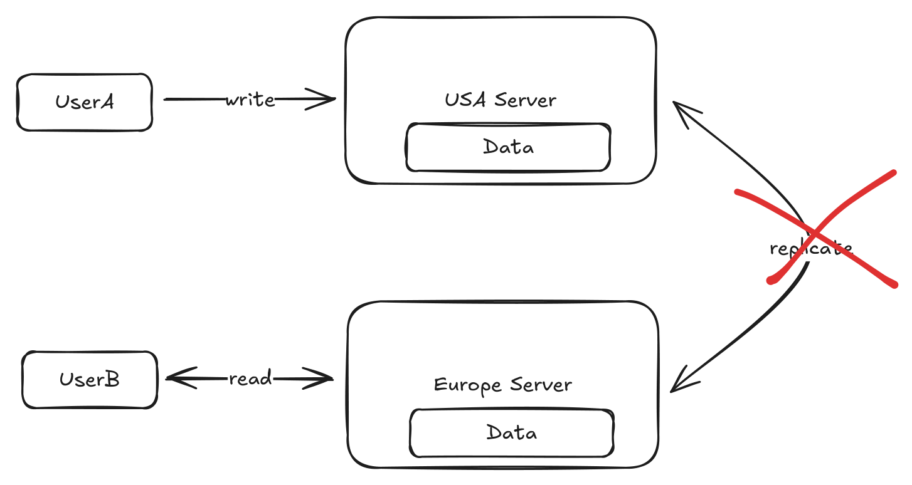
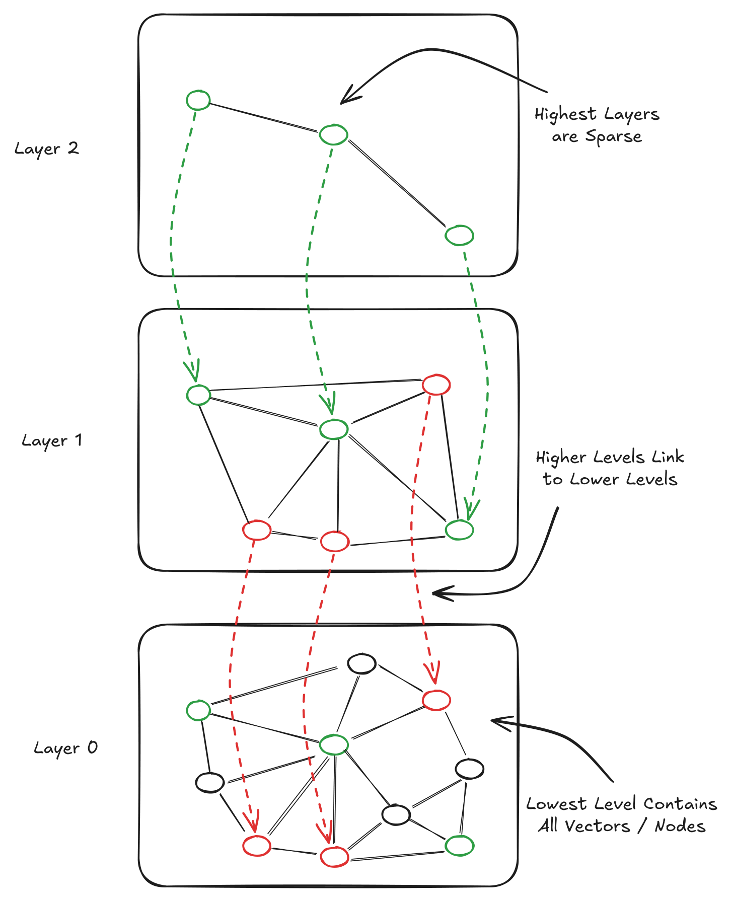
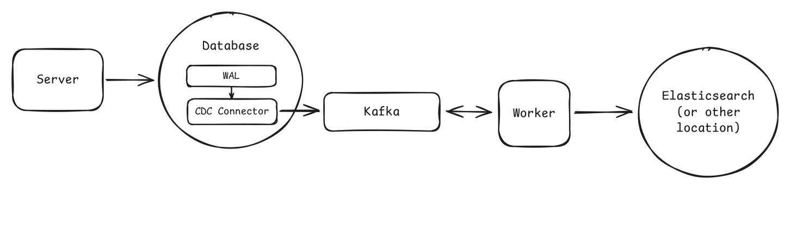

# Core Concepts

> One-file reference for the mechanics behind every design. Deep versions: see `../2-CoreConcepts/` and `../5-AdvanceTopics/` in the source library.

## Contents
- [1. Networking](#1-networking)
- [2. API Design](#2-api-design)
- [3. Data Modeling](#3-data-modeling)
- [4. Indexing](#4-indexing)
- [5. Caching](#5-caching)
- [6. Sharding & Consistent Hashing](#6-sharding--consistent-hashing)
- [7. Consistency, CAP & Locking](#7-consistency-cap--locking)
- [8. Numbers & Estimation](#8-numbers--estimation)
- [9. Specialized Data Systems](#9-specialized-data-systems)
  - [9.1 Proximity / geospatial search](#91-proximity--geospatial-search)
  - [9.2 Probabilistic structures](#92-probabilistic-structures-bloom-count-min-hyperloglog-etc)
  - [9.3 Vector databases](#93-vector-databases)
  - [9.4 Time-series databases](#94-time-series-databases)
  - [9.5 Change Data Capture](#95-change-data-capture)

---

## 1. Networking

**Default:** HTTPS + REST over TCP for public/user-facing APIs; switch only when the requirement forces realtime, lossy media, or internal binary RPC.

| Need | Use | Avoid / what breaks |
|---|---|---|
| Correct, ordered delivery | TCP | Adds handshake, ACKs, retransmits, connection state; bad for late realtime media. |
| Lowest-latency lossy packets | UDP | No delivery/order/duplicate guarantees; app must handle loss; browser support mostly via WebRTC. |
| HTTP/3 awareness | QUIC | Usually protocol trivia unless network latency is a bottleneck. |
| Normal web/mobile endpoint | HTTP/HTTPS | Request/response is awkward for persistent bidirectional streams. |
| Public CRUD API | REST | JSON/chattiness; action-like URLs mean poor resource modeling. |
| Diverse client-selected shape | GraphQL | N+1 resolvers, auth per field, caching and query limits become backend work. |
| Internal typed high-throughput calls | gRPC/RPC | Poor public/browser ergonomics; stronger coupling to schemas and generated clients. |
| One-way server push | SSE | Proxies/LBs can close or buffer; client cannot push frequently on same stream. |
| Bidirectional realtime | WebSockets | Stateful connections complicate LB, failover, capacity, and backpressure. |
| Browser audio/video P2P | WebRTC | NAT traversal is hard; TURN relay can become the media path. |
| HTTP routing by path/header/cookie | L7 load balancer | More CPU; terminates/inspects requests. |
| Persistent TCP/WebSocket routing | L4 load balancer | Cannot route by URL/header/cookie. |
| Global static/cacheable data | CDN | Invalidation, privacy, and freshness rules become design constraints. |
| Any downstream call | Timeout + retry + exponential backoff + jitter + circuit breaker | Retrying non-idempotent writes or overloaded services amplifies failure. |

**Numbers:** UDP header 8B; TCP 20-60B. Protobuf example 15B vs JSON 40B. gRPC can show ~10x REST/JSON throughput in benchmarks. Fiber ≈200,000 km/s; NY-London RTT physics ≈56ms; real cross-region is tens-150ms+. Hardware LBs can reach hundreds of millions RPS.

| Tradeoff | REST/HTTP | gRPC | SSE | WebSockets | WebRTC |
|---|---|---|---|---|---|
| Best fit | Public APIs | Internal services | Notifications/live scores | Chat/games/collab | Calls/conferencing |
| State | Stateless request | Call/stream | Long response | Persistent conn | Peer session + signaling |
| Main risk | Chattiness/JSON | Tooling/public fit | buffering/reconnects | stateful infra | NAT/TURN complexity |

> **Say:** "Start boring: HTTPS/REST for public APIs, gRPC for internal performance, SSE before WebSockets unless clients must talk back continuously."
> **Trap:** Retrying unsafe writes without idempotency keys, backoff/jitter, or overload protection.

## 2. API Design

**Default:** spend minutes, not the interview, on APIs. Model resources as plural nouns, define inputs, paginate growing collections, make dangerous retries idempotent, and separate authn from authz.

| Decision | Use | Avoid / what breaks |
|---|---|---|
| Public user API | REST | Overdoing GraphQL/gRPC when resource CRUD is enough. |
| Client needs arbitrary nested shape | GraphQL | N+1, cache invalidation, query cost limits, field-level authorization. |
| Internal high-performance typed calls | RPC/gRPC | Public clients lose simple JSON/HTTP tooling. |
| Required resource identity | Path param `/events/{id}` | Optional filters in paths create rigid over-nesting. |
| Optional filter/sort/page | Query params | Required identity as query weakens clarity. |
| Create / non-idempotent command | POST | Double charge/book/order unless idempotency key stores first result. |
| Full replacement | PUT | Missing fields may be erased. |
| Partial change | PATCH | Patch semantics may not be idempotent. |
| Remove/cancel | DELETE | Domains often need reversible state, not physical deletion. |
| Simple stable pages | Offset pagination | Inserts/deletes cause duplicates/missing rows; high offsets get slow. |
| Feeds/live lists | Cursor pagination | Harder UX; no natural jump to page N. |
| Public breaking changes | URL versioning `/v1` | Duplicated route logic; header versioning is cleaner but less obvious. |
| Service/app identity | API keys | Act like passwords; weak user context/revocation. |
| User session | JWT | Hard server-side revocation; still must check resource ownership. |
| Permission classes | RBAC + ownership checks | Roles alone let users act on resources they do not own. |
| Abuse/scalping | Rate limit by user/IP/endpoint/client | False throttles; return `429` and design bypass/admin rules. |

**Concrete contract:** request bodies for complex creates/updates; validate server-side IDs/authorization fields; return stable error envelope `{code,message,details}`; common status codes `200/201/400/401/404/429/500`.

| If you need ... | Pick ... | Because ... |
|---|---|---|
| Growing collection | pagination always | "Return all" eventually breaks. |
| Changing collection | cursor | Stable under new inserts. |
| Payment/booking/order retry | idempotency key | Same key, same stored result. |
| 90% interview API | REST | Familiar, fast, enough. |
| Different mobile/web payloads | GraphQL | Avoid endpoint explosion when backend cost is acceptable. |

**Numbers:** API sketch should fit ~5 minutes. Example limits: 1000 req/hour authenticated user, 100/hour unauthenticated IP, 10 booking attempts/minute.

> **Say:** "Default to REST, paginate every growing list, and protect retryable creates with idempotency keys."
> **Trap:** Treating authentication as authorization; every resource operation still needs ownership/permission checks.

## 3. Data Modeling

**Default:** start from requirements → core entities → stable system IDs → relationships/constraints → access patterns. Use SQL unless a requirement forces a specialized model.

| Model / choice | Use when | Avoid / what breaks |
|---|---|---|
| Relational SQL | Structured entities, joins, FKs, constraints, ACID transactions | Joins/constraints/indexes can bottleneck hot paths; still plan access patterns. |
| Document DB | Varying schema, nested reads, backend-controlled denormalization | Updating duplicated fields and enforcing relationships get harder. |
| Key-value | Cache, sessions, feature flags, exact ID lookup | No joins/ad-hoc queries; duplicate keys create consistency work. |
| Wide-column | Huge append-heavy telemetry/log/time-series/range-by-partition | Must model by known queries; duplicates across families. |
| Graph DB | Specific graph traversal dominates and simpler stores fail | Usually overkill in interviews; operational complexity. |
| System-generated PK | Durable references across rows/services | Mutable email/phone as PK breaks updates and joins; add unique constraints separately. |
| Foreign keys/constraints | Storage-layer correctness matters | Add write validation cost; app must handle constraint failures. |
| Normalize | Correctness, simple updates, one fact owner | Hot reads may pay joins/fetches. |
| Denormalize | Hot read path, analytics, immutable snapshots, search/read models | Propagation lag, write fanout, stale copies. |
| Cache read model | Need fast joined/aggregated view without corrupting source | Freshness/invalidation/failure path required. |
| Shard by access pattern | Single DB cannot meet storage/throughput | Cross-shard joins/transactions become expensive. |

**Decision:** choose SQL for clear relationships/transactions; document only for volatile/nested records; KV as helper/cache; wide-column for massive partitioned appends; graph only when traversal is the product.

| Access pattern | Schema move | What breaks if ignored |
|---|---|---|
| `GET /users/{id}/posts?sort=-created_at` | index `(user_id, created_at)` | Scan/sort on every profile/feed read. |
| Feed likes can lag | denormalize `like_count` | Expensive aggregate on hot path. |
| Orders/payments | normalized + transaction boundary | Duplicate/partial financial state. |
| User-scoped workload | shard by `user_id` later | Global shard key makes common reads fan out. |
| Global leaderboard/search | precompute/search index | User-sharding forces query-all-shards. |

**Numbers:** the modeling chapter gives no fixed capacity numbers; use Section 8 before claiming sharding. Practical drivers: data volume, access patterns, consistency.

> **Say:** "Start normalized in SQL, then denormalize only for a named hot read path or immutable snapshot."
> **Trap:** Picking Mongo/Cassandra/Neo4j to sound advanced instead of tying the store to access patterns.

## 4. Indexing

**Default:** every index must pay rent by serving a specific frequent predicate, sort, uniqueness check, or lookup; every index costs storage and writes.

| Index / structure | Use when | Avoid / what breaks |
|---|---|---|
| Sequential scan | Small tables, rare queries, write speed dominates | Linear scan over millions becomes painful. |
| B-tree | Equality, range, `ORDER BY`, PK, unique, default DB index | Not text/spatial; each write maintains the tree. |
| LSM storage | 100k-ish write/sec ingest, metrics/audit/IoT/events | Reads check memtables/SSTables; compaction/write amplification. |
| Hash index | Exact match only, usually in-memory/simple | No ranges, prefixes, sort; B-tree nearly always flexible enough. |
| Composite index | Same multi-column filter/sort repeatedly | Prefix order matters: `(user_id, created_at)` weak for `created_at` only. |
| Covering index | Very hot read returns few columns | Niche; extra storage/write overhead for included columns. |
| Inverted index | Full-text over posts/docs/logs/code | Tokenization/stemming/ranking updates; B-tree cannot do `LIKE '%word%'`. |
| Geohash | Simple point proximity via prefix/range + neighbor cells | Boundary misses; distortion; final distance filter still required. |
| R-tree/GiST | Production points/lines/polygons, containment/intersection | Overlapping rectangles force multiple branch visits. |
| Quadtree | Explain adaptive 2D partitioning/in-memory maps | Not typical production DB index; pointer-heavy disk behavior. |
| External index | Elasticsearch/PostGIS-style search/spatial when DB lacks it | Async sync lag and rebuild/reconciliation paths. |

| Query | Index | Why |
|---|---|---|
| `id = ?`, `email = ?` | B-tree/unique B-tree | Equality plus constraint. |
| `created_at BETWEEN ... ORDER BY created_at` | B-tree | Maintains order. |
| `WHERE user_id=? ORDER BY created_at DESC` | `(user_id, created_at)` | Filter and sort in one structure. |
| Nearby lat/lng | geohash/S2/H3/R-tree | Spatial locality is not two independent B-trees. |
| Search words | inverted index | Terms point to docs. |

**Numbers:** DB pages often ~8KB; B-tree lookup may hit 2-3 pages; LSM example motivation 100k writes/sec; quadtree split threshold 4-8 points/square; geohash examples: 5 chars ≈5km, 9 chars ≈5m.

> **Say:** "B-trees are the safe default; switch only for write-heavy LSM, full-text inverted indexes, or real spatial indexes."
> **Trap:** Adding indexes without naming the exact query and write/storage cost they introduce.

## 5. Caching

**Default:** external Redis/Memcached + cache-aside for shared hot reads; CDN for static/global; in-process only for tiny rarely changing values.

| Cache / pattern | Use when | Avoid / what breaks |
|---|---|---|
| External cache | Many app servers share hot DB rows/results | Network hop, Redis availability, memory limit, hot keys. |
| CDN | Static media/assets/public cacheable APIs near users | Private/fresh dynamic data; purge rules and leaks matter. |
| Client cache | Offline/repeated assets/local state | Server cannot reliably invalidate. |
| In-process cache | Config/reference/tiny hot values | Diverges per instance; no shared capacity/invalidation. |
| Cache-aside | Default read-heavy app caching | Slow first miss; app owns miss and invalidation paths. |
| Write-through | Fresh reads after writes, slow writes acceptable | Dual-write complexity, higher write latency, cache pollution. |
| Write-behind | Extreme writes, eventual consistency/loss acceptable | Cache crash before flush loses data; never for money/inventory/bookings. |
| Read-through | CDN/specialized cache owns load-on-miss | Less common with Redis; service/library complexity. |
| LRU + TTL | Most workloads | TTL alone is not eviction; expiry can stampede. |
| LFU | Long-lived popularity dominates | Frequency counters can stale/approximate. |
| FIFO | Very simple cache | Evicts old hot items; rarely right. |
| Invalidate on write | Stale data after writes is harmful | Race windows and partial failures remain. |
| Short TTL | Staleness acceptable | Users see old data until expiry. |
| Request coalescing/single flight | Hot key expiry would stampede DB | Locks need timeout/fallback; waiters add latency. |
| Cache warming | Predictable hot keys | Wastes work if demand shifts. |
| Hot-key replication/local copy | One key overloads a shard | More copies to update; staleness across replicas. |

**Cache plan checklist:** item, key format, value size, TTL, eviction, invalidation/update rule, miss path, Redis-down fallback, stampede/hot-key plan, freshness guarantee.

| Decision | Pick | Why |
|---|---|---|
| Expensive DB read repeated | cache-aside Redis | Shared, simple, interview-default. |
| Static worldwide content | CDN | 20-40ms edge vs 250-300ms origin example. |
| Needs fresh write visibility | DB write then delete/update cache, or write-through | Stop serving old value. |
| Can lag 60s | TTL cache | Simpler than synchronous invalidation. |
| One expired key causes 1000 DB hits | single flight + stale-while-revalidate if allowed | Protect source. |

**Numbers:** Redis read ~1ms or under 2ms; DB profile read example 50ms, a 50x win. Caching hot queries can cut DB load 70-80%. 200M daily reads is enough to discuss caching. CDN origin Virginia→India 250-300ms vs edge 20-40ms.

> **Say:** "Do not just add Redis: name the key, TTL, invalidation, failure fallback, and stampede protection."
> **Trap:** Caching data that changes every request or ignoring the Redis-down path that hammers the DB.

## 6. Sharding & Consistent Hashing

**Default:** do not shard until numbers prove one well-tuned DB plus indexes, replicas, caches, and vertical scale is insufficient.

| Split / routing choice | Use when | Avoid / what breaks |
|---|---|---|
| Vertical partitioning | Hot/cold or large columns slow common reads | Does not add machine-level capacity. |
| Horizontal partitioning | One DB needs pruning/maintenance by rows | Still one machine/resource pool. |
| Sharding | Storage/write/read capacity exceed one DB | Routing, resharding, cross-shard queries/transactions. |
| Shard key | High-cardinality, even, aligned with common queries | Low-cardinality/skewed keys create hot shards/fanout. |
| Range sharding | Tenant/range queries and ranges balance | `created_at`/hot ranges overload one shard. |
| Hash sharding | Even distribution default | Range scans poor; modulo remaps most data when N changes. |
| Directory sharding | Custom placement/hot-key isolation | Extra lookup latency and critical dependency. |
| Modulo hashing | Fixed cluster only | `hash(key) % N` changes almost every mapping as N changes. |
| Consistent hashing | Elastic caches/DBs/brokers/server pools | Routes ownership; does not move TBs automatically or fix hot traffic. |
| Virtual nodes | Smooth ring imbalance/add-remove movement | More metadata/ops. |
| Hot-key isolation | Celebrity/event key dominates traffic | Often needs directory, replicas, salting, or manual placement. |
| Compound/salted key | One key needs spreading over time/buckets | Reads become multi-shard. |
| Dynamic chunk splitting | Managed DB supports it | Mechanics differ; do not imply magic. |
| Cache/precompute global aggregates | Leaderboards/trending tolerate lag | Stale; refresh/rebuild path. |
| Saga | Multi-shard workflow can be eventual | Compensation logic and partial states. |
| 2PC | Atomic cross-shard update is unavoidable | Slow, fragile, can block during failures. |

| Access pattern | Shard key / pattern | What breaks |
|---|---|---|
| User profile/orders/feed | `user_id` hash | Global queries need precompute/fanout. |
| Tenant-local ranges | tenant/range | Hot tenants require splitting/isolation. |
| Time-series hot writes | not raw timestamp alone; bucket/hash time | Latest range hotspot. |
| Limited inventory/seat | keep atomic item on one shard | Cross-shard lock/2PC pain. |
| Elastic cache nodes | consistent hashing + vnodes | Modulo rehash churn. |

**Numbers:** Aurora cited up to 256TiB. Example 500M users × 5KB = 2.5TB: maybe still single DB, but 10x growth may shard. 50k writes/sec can justify discussion. Ring hash space often `0..2^32-1`; adding a node in source moved ~15% not nearly all. Redis Cluster uses 16,384 slots. Source example starts with 64 shards.

> **Say:** "A shard key is almost permanent: choose high-cardinality, even, and query-aligned, then say which queries now fan out."
> **Trap:** Introducing sharding before capacity math, then using a hot/low-cardinality key like boolean, country, or raw timestamp.

## 7. Consistency, CAP & Locking

**Default:** in distributed systems partition tolerance is mandatory; the real choice during partitions is whether each feature favors consistency or availability.

| Choice / model | Use when | Avoid / what breaks |
|---|---|---|
| CP path | Stale data causes money loss, oversell, double-book, fraud, bad matching | Users may see errors/latency during partition. |
| AP path | Old data is better than error: feeds, profiles, reviews, analytics, descriptions | Conflicts/stale reads require reconciliation. |
| Strong consistency | Bank balance, inventory, booking transaction | Highest coordination latency, lower availability. |
| Single-node/shard truth | Critical data fits one transaction boundary | Limits horizontal/geographic writes. |
| Async replicas | Read scale/availability with tolerated lag | Replica lag serves stale data. |
| Read-your-own-writes | User must see own profile/social edit immediately | Needs routing/session stickiness/freshness tracking. |
| Causal consistency | Dependent events must appear in order, e.g., post then comment | More coordination than eventual. |
| Eventual consistency | Feeds, DNS-like data, metrics, reviews | Seconds/minutes of staleness visible. |
| Feature-level consistency | Mixed browse + transactional system | More complex flows; each path needs explicit guarantee. |
| Distributed transaction/2PC | Cross-store atomicity mandatory | Latency/fragility; prefer redesign to single shard. |
| Saga | Multi-step workflow can compensate | Partial progress visible; compensation must be correct. |
| CDC | Replicate source state to cache/search/warehouse | Downstream lag; not business intent. |
| Request coalescing lock | Popular cache key rebuild would stampede | Lock timeout/fallback needed; waiters block. |
| Idempotency key | Retried POST can duplicate side effects | Store key/result/in-flight state. |

| Product path | Consistency call | Reason |
|---|---|---|
| Book a ticket/seat | CP/strong/single-shard transaction | Two owners is catastrophic. |
| Browse event details | AP/eventual | Old description beats outage. |
| Profile update | RYOW + eventual for others | User trusts save; global freshness not required. |
| Comments after post | causal | Logical order matters. |
| Feed ranking/metrics | eventual | Lag is acceptable. |

**Numbers:** eventual consistency may be seconds or minutes; source says a review appearing after ~5s can be fine. Cross-region coordination costs tens-150ms+. Stampede can turn one cache refresh into hundreds/thousands of DB queries.

> **Say:** "I choose consistency for scarce resources and money, availability for browse/read paths, and I can mix both in one product."
> **Trap:** Saying CAP means "pick any two" without noting distributed systems cannot opt out of partitions.

## 8. Numbers & Estimation

**Default:** estimate only to decide architecture: shard/cache/queue/region/app servers. Use order-of-magnitude math and pick the simplest design that clears the bottleneck.

| Decision | Estimate | First move before complexity |
|---|---|---|
| Shard? | dataset, write TPS, backup/recovery window | single DB + indexes/replicas/cache/vertical scale. |
| Cache? | read QPS, hit rate, DB latency, freshness | cache only hot/expensive repeated reads. |
| Queue? | burst size, downstream failure, durability, lag | DB writes/pool/batch may handle 5k WPS. |
| App servers? | peak RPS, CPU/request, connections, SLA | add stateless app instances. |
| Regional deploy? | user geography, latency budget | CDN/cache/regional read replicas before global writes. |
| One cache/DB? | hot set/data growth/write rate | avoid sharding until ceilings/backups/geography force it. |

**Recipe:** state the decision → round numbers → storage `records * bytes * replicas/headroom` → traffic `users * actions / seconds * peak` → compare ceilings → identify bottleneck → choose simplest option → state tradeoff and 10x plan.

| Constant / latency | Number | Implication |
|---|---:|---|
| Day / hour | 86,400s ≈100k; 3,600s ≈4k | Daily/hourly to QPS. |
| Binary bridge | 2^10≈1k, 2^20≈1M, 2^30≈1B, 2^40≈1T | Fast storage math. |
| Redis/cache read | ~1ms, often <2ms | Good for hot expensive reads. |
| Cached/indexed DB read | 1-5ms cached; 5-30ms disk DB read | Do not cache every indexed lookup. |
| DB write commit | 5-15ms; simple Postgres 20k+ WPS possible | 5k WPS is not automatic Kafka. |
| Queue E2E | 1-5ms in-region if no backlog | Watch consumer lag. |
| Same AZ / cross-AZ | sub-1ms / 1-2ms | HA has latency cost. |
| Cross-region | 50-150ms; NY-London min ~56ms | Strong global coordination hurts. |
| CDN edge vs far origin | 20-40ms vs 250-300ms | Put cacheable data near users. |

| Component | Single-node mental model | Scale trigger |
|---|---|---|
| Cache | up to ~1TB; 100k-200k+ ops/sec | >80% memory, hit <80%, sustained 100k+ ops/sec, <0.5ms needed. |
| DB | many engines 64TiB; Aurora 256TiB; tens of thousands TPS | >50TiB, >10k writes TPS, <5ms uncached reads, geo writes, backup pain. |
| App server | 8-64 cores, 64-512GB, 100k+ connections possible | CPU/latency/memory/network/connections near limits. |
| Broker | up to ~1M msg/sec/broker; 1KB-10MB efficient; ~50TB storage | ~800k msg/sec, ~200k partitions, growing lag, cross-region replication. |
| Object storage | petabyte-scale managed primitive | do not custom-shard files first. |

| Example | Math | Takeaway |
|---|---:|---|
| 10M DAU ×20 reads/day | 200M/day ≈2k avg RPS | Cache if reads are expensive; peak still matters. |
| 50k RPS at 5k/server | ~10 servers + headroom | Stateless horizontal scale first. |
| Yelp businesses | 10M ×1KB = 10GB; reviews 10x ≈100GB | Not a sharding reason. |
| Leaderboard cache | 100k comps ×100k users ×40B ≈400GB | One large cache may fit. |
| 100k cache ops/sec | scale trigger | Consider cache cluster/replication/hot keys. |

> **Say:** "Slow down, do the math, and add the least distributed machinery that clears the measured bottleneck."
> **Trap:** Memorizing old limits and sharding/queuing at a few hundred GB or 5k writes/sec.

## 9. Specialized Data Systems

Use these when the access pattern is the product, not as default storage. Most return candidate IDs or aggregates; keep an authoritative source elsewhere unless the system is explicitly the source of truth.

### 9.1 Proximity / geospatial search

| Option | What it is | Guarantee / cost | Use when | Unlocks |
|---|---|---|---|---|
| Plain lat/lng B-tree | 1D indexes on 2D data | Big candidate strips; composite sorts mostly by first column | Only to reject for radius/nearest | Shows why spatial index exists. |
| Quadtree | Recursive 4-way 2D cells | Dense areas deepen; pointer-heavy on disk | In-memory map/tile/collision | Adaptive density explanation. |
| k-d / BKD | Alternating-dimension splits; BKD packs blocks | Good read-heavy disk chunks; poor constant updates | Elasticsearch geo/static points | Batch-indexed geo filters. |
| R-tree/R* | Hierarchy of bounding rectangles | Overlap causes multi-branch scans; exact geometry post-filter | Polygons, roads, zones, containment/intersection | Delivery zones, map shapes. |
| Geohash | Hierarchical string/cell key | Boundary misses; query 3×3 neighbors; exact distance filter | City-scale moving points/simple prefix scans | Nearby restaurants/drivers. |
| S2 | 64-bit spherical cell IDs on cube faces | Library complexity; handles antimeridian/poles better | Global sphere/polygons | Global location correctness. |
| H3 | 64-bit hex cells/rings | IDs not locality range-scannable; query cell sets | Dispatch, heat maps, surge rings | Rider cell + k-ring drivers. |

**Numbers:** geohash 5 chars ≈5km, 9 chars ≈5m; Redis geo uses 52-bit geohash integers; H3 dispatch examples often snap drivers to ~200m cells.

### 9.2 Probabilistic structures (bloom, count-min, HyperLogLog, etc.)

| Structure | What it is | Guarantee / cost | Use when | Unlocks |
|---|---|---|---|---|
| Bloom filter | Bit array + k hashes for membership | False positives only; no false negatives; standard filter cannot delete | Exact set too large and "maybe" is OK | Web crawler dedupe, cache guard. |
| Count-Min Sketch | 2D hashed counters | Upper-bound count; collisions inflate; cannot enumerate keys | Approx counts for known IDs over huge streams | Top K candidates, LFU-ish popularity. |
| HyperLogLog | Register sketch for cardinality | Approx uniques; error ~`1/sqrt(m)`; no identities/list | Distinct count, not exact users | DAU/MAU, unique visitors/IPs. |
| Bucket histograms | Counters per value range | Quantile error bounded by bucket width | p95/p99 over massive streams | SLOs, latency dashboards. |

**Numbers:** Bloom for 1B 4-byte items at 1% FP ≈1GB vs ≈5GB hash table. HLL: 1.5KB ≈2% error, 3KB ≈1.6%, 6KB ≈1.2%. Bloom filters around 10 bits/key can hit ~1% FP.

### 9.3 Vector databases

| Option | What it is | Guarantee / cost | Use when | Unlocks |
|---|---|---|---|---|
| Exact KNN | Compare query vector to all vectors | Exact but `O(n)`; 1M×1536 ≈6B ops/query | Small data or exact recall required | Baseline before ANN. |
| HNSW | Multi-layer neighbor graph | High recall/low latency; graph memory roughly doubles raw vectors; costly inserts | Read-heavy production ANN default | Semantic search/RAG/recs. |
| IVF | k-means clusters, search `nprobe` clusters | Recall vs work knob; lower memory/build cost | Clustering works and inserts matter | Large ANN with memory tradeoff. |
| LSH | Locality-sensitive hash buckets | Fast build/streaming; more tables/bits cost memory | Hamming/streaming/simple candidate generation | Near-duplicates. |
| Annoy | Random-projection tree forest | Static immutable mmap index; rebuild for updates | Batch/static catalogs | Shared file-backed search. |
| Hybrid/filtering | Vector + metadata/keyword | Post-filter may return <K; pre-filter may lose index benefit | "similar and in-stock", keyword+semantic | Two-stage retrieval/rerank. |
| Existing DB extension | pgvector/Elastic/Redis/S3 Vector | Simpler ops, fewer features/scale | Millions and stack already has DB/search | Avoid premature dedicated vector DB. |
| Purpose-built DB | Pinecone/Weaviate/Milvus/Qdrant/Chroma | Extra system/ops | ~100M+ vectors or vector product dominates | Managed scale/features. |

**Numbers:** embeddings commonly 128-1536 dims; `text-embedding-3-large` 3072. Float32 = 4B/dim; 1536-dim vector ≈6KB; 1M such vectors ≈6GB raw before index. Tuned systems can hit sub-10ms, 1-5ms common, 95%+ recall often acceptable.

### 9.4 Time-series databases

| Option | What it is | Guarantee / cost | Use when | Unlocks |
|---|---|---|---|---|
| General DB baseline | `(ts, host, metric, value)` rows | Flexible but index-heavy, repeated metadata, costly deletes | Moderate timestamped data | Start simple. |
| Append-only + LSM/SSTables | Sequential writes, memtable flush, compaction | High ingest; read/compaction amplification | Mostly immutable metrics/events | 50k+ points/sec ingest. |
| Compression | delta, delta-of-delta, varint, XOR | Decode complexity; works on ordered similar values | Regular timestamps/values | Cheap retention. |
| Time partitions | chunks by day/week/etc. | Cross-window queries hit partitions | Time-bounded queries and retention | Drop old partitions. |
| Bloom/block metadata | Absence/min/max per SSTable/block | False positives; helps point/series reads not broad scans | Many files/series lookups | Skip disk reads. |
| Rollups/downsampling | Precompute min/max/sum/count at coarser intervals | Extra writes/storage; old data loses detail | Recent raw, historical aggregate OK | Year-long dashboards. |
| Tags vs fields | Indexed dimensions vs measured values | High-cardinality tags explode in-memory series index | Low-cardinality filters | Fast tag/time queries. |

**Numbers:** 100k servers ×5 metrics/10s = 50k metrics/sec = 4.3B/day ≈30B/week. Vanilla rows 50-100B vs useful ts+float ~16B. HDD random ops 100-200/sec; SSDs prefer sequential and can do hundreds of thousands writes/sec. Gorilla timestamps ~1 bit/value; XOR floats ~1.37B/value. Rollups: 10s=8640/day, 1m=1440/day, 1h=24/day; 5m rollup is 288× less than 10s raw. Cardinality: 1000 hosts×50 metrics=50k series; add 10M users → 500B potential series.

### 9.5 Change Data Capture

| Option | What it is | Guarantee / cost | Use when | Unlocks |
|---|---|---|---|---|
| Dual write | App writes DB and target | Crash window/split-brain; retries/reconcile/idempotency | Truly independent or repairable writes | Simple non-critical sync. |
| Polling | Job scans changed rows since checkpoint | DB load, interval lag, hard deletes | Low change volume/loose freshness | Cheap small sync. |
| CDC | Read committed WAL/binlog into stream | Source-only atomicity; lag/offset/idempotent consumers/rebuild needed | Derived copy/projection, lag acceptable | Search index, warehouse, migration. |
| Derived search index | ES from Postgres rows | Search lags; source remains authoritative | Search projection can rebuild | Product/catalog search. |
| OLTP→warehouse | Stream changes to Snowflake/etc. | Lag/backfill ops | Analytics should not scan prod DB | Real-time-ish analytics. |
| Zero-downtime migration | Backfill then apply captured changes, cut over | Compatibility, catch-up, rollback complexity | Large DB move without pausing writes | Online migration. |
| Transactional outbox | Same DB tx writes state + business event | Relay/idempotent publish/event schema | Consumers need intent/side effect | `OrderShipped`, email, workflows. |
| Direct invalidation/TTL | Writer deletes known cache key or waits | Explicit invalidation/staleness | App already knows stale key | Simpler cache freshness. |
| Job/workflow | Durable work with retry/timers/state | Worker/workflow ops | Cleanup, delays, multi-step orchestration | Temporal/job queue patterns. |

**Decision:** CDC is for copying committed row state to rebuildable targets; use outbox for business events, direct invalidation for known cache keys, jobs/workflows for retries/timers, and polling only when tiny/loose.

> **Say:** "Specialized systems narrow candidates or approximate answers; the source of truth and exact final check usually live elsewhere."
> **Trap:** Using a specialized tool because it sounds advanced, then forgetting its stale/candidate/approximate failure mode.
