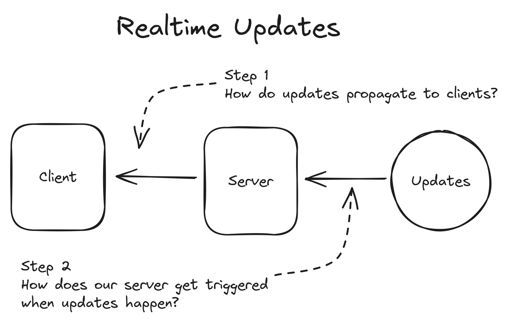
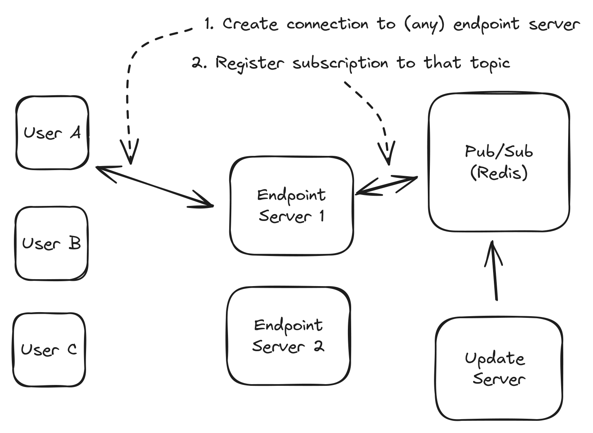
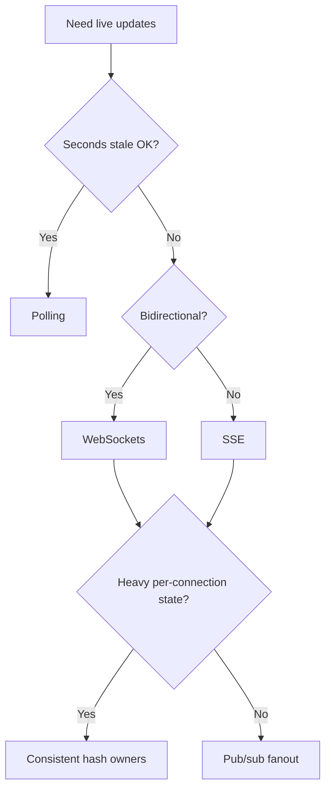
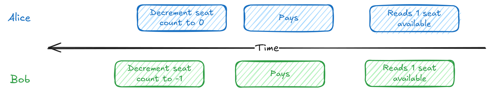
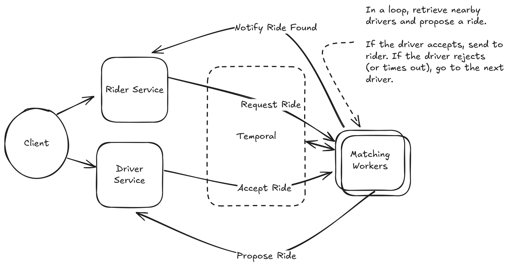
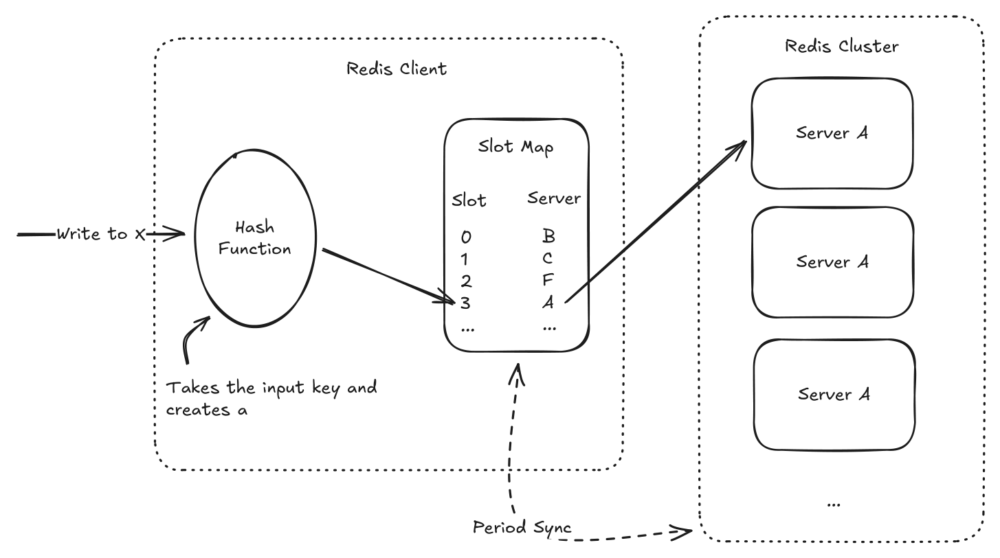
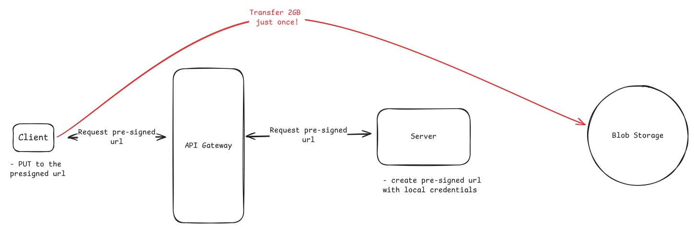
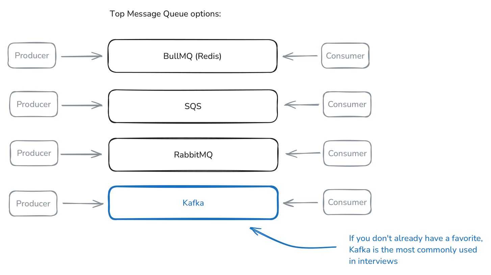
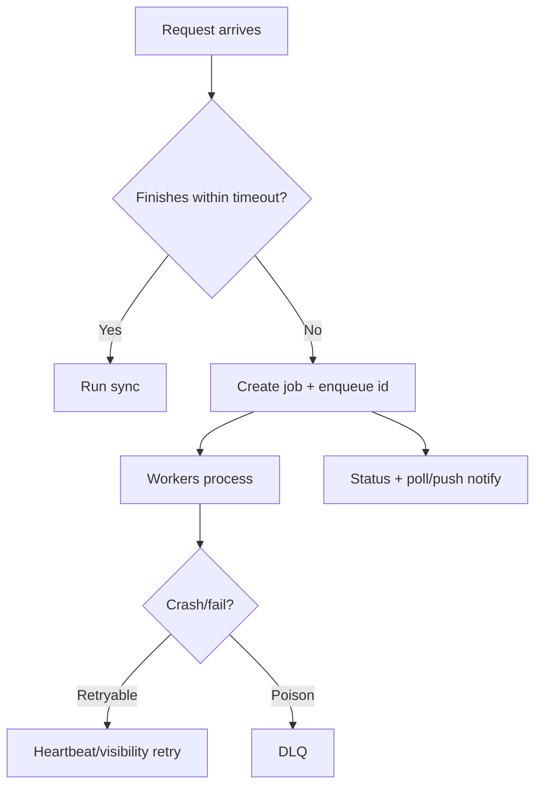

# Patterns

> Requirement phrasing → known solution shape. Deep versions: see `../3-Patterns/` in the source library.

## Pattern lookup
| The prompt says… | Pattern | The one decision that matters |
|---|---|---|
| "Push updates/live state to users" | [Realtime Updates](#1-realtime-updates) | Pick the client transport, then the event-source → connection-owner trigger path. |
| "Two actors may claim/change the same thing" | [Dealing with Contention](#2-dealing-with-contention) | Make the invariant visible to one authoritative row/key/transaction. |
| "One operation spans services and may need rollback" | [Multi-Step Processes](#3-multi-step-processes) | Decide whether choreography or an explicit workflow owner tracks durable progress. |
| "Reads are crushing the database" | [Scaling Reads](#4-scaling-reads) | Reduce work per read before adding replicas/caches/CDNs. |
| "Writes, bursts, hot keys, or fanout overwhelm one store" | [Scaling Writes](#5-scaling-writes) | Prove steady-state vs burst, then flatten writes across components. |
| "Users upload/download photos, videos, or files" | [Large Blobs](#6-large-blobs) | Keep bytes off app servers; store metadata separately from object bytes. |
| "The task takes seconds/minutes/hours" | [Long-Running Tasks](#7-long-running-tasks) | Return a job id and process asynchronously unless HTTP completion is safely fast. |

---

## 1. Realtime Updates
**Trigger:** users need updates within seconds/instantly; servers push live changes. **Appears in:** Ticketmaster, Uber, WhatsApp, Robinhood, Google Docs, Strava, Online Auction, FB Live Comments, Online Chess, ChatGPT, Flash Sale

*HTTP request/response is not enough; solve both hops: update source → connection owner → client.*

**Ladder (simplest → heaviest)**
| Option | Use when | Avoid when | Cost / what breaks |
|---|---|---|---|
| Polling | Seconds-stale UX is fine; realtime is not the crux | Huge client count or sub-second latency | Idle reads; latency ≤ poll interval |
| Long polling | Rare events should appear quickly | Frequent updates; proxy timeouts are messy | Hanging requests; reconnect churn; 15-30s timeout tuning |
| SSE | One-way server push: dashboards, AI tokens, progress | Client sends frequent messages on same channel | Reconnect gaps; buffering proxies; one-way only |
| WebSockets | Frequent bidirectional chat, games, collaboration, bidding | Occasional writes or one-way updates suffice | Stateful endpoints; heartbeats; deploy/reconnect handling |
| WebRTC | Audio/video/screen share/P2P is core | Ordinary server-to-client updates | Signaling, STUN/TURN, NAT failures, setup complexity |
| Pull from storage/log | Loose latency and durable cursor replay matter | True fanout latency or DB polling load is too high | Wasted reads; cursor/order design required |
| Consistent-hash owners | Connections hold expensive user/doc state | Endpoints only forward tiny messages | Ring changes, redirects, state loss, dual-route migration |
| Pub/sub fanout | Many lightweight endpoint servers forward messages | Pub/sub SPOF/bottleneck or heavy connection state | Extra hop; topic/subscription scaling |

**Then the interviewer asks:**
- **Missed updates:** reconnect with last event id/sequence and replay from per-user queue/log.
- **Ordering:** route related messages through one host/partition and stamp order there.
- **Backpressure:** bound client buffers; drop noncritical events or disconnect/replay slow clients.
- **Hot fanout:** batch, cache once, shard topics, or add hierarchical fanout.
> **Trap:** WebSockets solve only client transport; producers still need to find the socket holder.
> **Say:** "Realtime is two decisions: client protocol and server-side trigger path."

## 2. Dealing with Contention
**Trigger:** multiple users/processes compete for limited resources; avoid double-booking, double-charging, stale overwrites. **Appears in:** Ticketmaster, Rate Limiter, Online Auction, Online Chess, Flash Sale

*Lost updates come from read-decide-write races; make the datastore reject losers atomically.*

**Interview move:**
- Name the invariant and the exact row/key that enforces it.
- Define loser behavior before dependent writes.
- Keep external calls outside locks.

**Ladder (simplest → heaviest)**
| Option | Use when | Avoid when | Cost / what breaks |
|---|---|---|---|
| Conditional write | Predicate fits same row/key: `WHERE seats > 0`, `status='free'` | Choice spans rows or app logic | Zero affected rows must abort dependent work |
| Pessimistic lock | Must read a set, decide, then write under high conflict | One atomic update is enough; external calls needed | Blocking, deadlocks, short transactions only |
| OCC/version | Conflicts are rare but read-decide-write exists | Everyone fights for one item | Retry storms; wasted work; ABA if version is bad |
| Serializable/remodel | Invariant spans rows that do not collide | Same-row conflict is enough | Abort/retry cost; often better to materialize invariant row |
| Lease/reservation | Hold must survive user wait or external call | Work fits one DB transaction | TTL double-grant; coordination ops; hot lease rows |
| Queue per resource | One hot resource needs strict serialization | Per-resource throughput must exceed one worker | Latency/backlog; active worker becomes critical |

**Then the interviewer asks:**
- **Wrong guard:** a counter says "some seat exists"; the seat row says "A15 is free".
- **Deadlocks:** lock rows in global order and treat deadlock/serialization errors as retryable.
- **Payment inside lock:** reserve first, commit, then call external systems outside the transaction.
- **Hot partition:** sharding cannot split one authoritative row; queue it or change product semantics.
> **Trap:** Distributed locks do not replace source-of-truth validation.
> **Say:** "The database can only protect a conflict it can see."

## 3. Multi-Step Processes
**Trigger:** one user operation spans services/steps and must survive failures, retries, waits, or compensations. **Appears in:** Payment System, Uber, Notification System

*This is a distributed state machine, not one transaction; persist progress and plan undo paths.*

**Interview move:**
- Draw the happy path, then mark every step that can timeout, retry, or callback later.
- Persist progress before each side effect.
- Pick one place to own retries and compensation.

**Ladder (simplest → heaviest)**
| Option | Use when | Avoid when | Cost / what breaks |
|---|---|---|---|
| Single-server flow | Short, synchronous, low-risk, local steps | External services, callbacks, waits, compensation | Crash loses in-memory progress |
| DB-backed orchestration | Few steps; status rows and pollers are enough | Many branches/retries/visibility needs | You build locks, retries, recovery, dashboards |
| Saga + compensation | Local commits must be undone after later failure | True atomicity is required or one DB tx works | Temporary inconsistency; compensations can fail |
| Event choreography | Independent services react to durable events | Need one place to understand/change/debug flow | Implicit event maze; idempotent consumers required |
| Workflow orchestration | Branching, waits, retries, compensation, observability | Single async job is enough | New engine and activity/history overhead |
| Durable execution | Want code-native timers/signals/loops and replay | Team cannot operate deterministic workflow engine | Non-determinism and huge histories break replay |
| Managed workflows | Prefer cloud-managed state machine/integrations | Need rich code logic or payload/duration exceeds limits | Vendor limits; less expressive model |

**Then the interviewer asks:**
- **Coordinator crash:** recover from durable workflow history/status, not process memory.
- **Idempotency:** activities run at least once; side effects use keys and recorded results.
- **Compensation failure:** retry undo steps and provide human escalation.
- **Versioning/history:** old executions need deterministic paths; pass IDs, not huge payloads.
> **Trap:** A saga is not a distributed transaction; it accepts temporary inconsistency.
> **Say:** "When I start hand-rolling checkpoints, pollers, retries, and compensation, I need workflow orchestration."

## 4. Scaling Reads
**Trigger:** read traffic dwarfs writes; the same data is requested by many users; primary DB is read-bound. **Appears in:** Ticketmaster, Bitly, FB News Feed, Instagram, YouTube Top K, Yelp, Distributed Cache, Rate Limiter, FB Post Search, YouTube, Local Delivery Service, News Aggregator, Metrics Monitoring

*One write can create millions of reads; make each read cheaper, closer, or avoid it entirely.*

**Interview move:**
- Quote read/write ratio and freshness budget.
- Index the primary query shape before adding infrastructure.
- Separate correctness reads from cacheable convenience reads.
- Put public/shared data at the edge only when auth permits it.

**Ladder (simplest → heaviest)**
| Option | Use when | Avoid when | Cost / what breaks |
|---|---|---|---|
| Indexes | Filters/joins/sorts scan too many rows | Endpoint is cold or write cost dominates | Storage/write overhead; wrong compound order fails |
| Vertical scale | Math fits bigger RAM/SSD/CPU | Requirement clearly exceeds one node | Finite ceiling; can dodge horizontal design |
| Denormalized/materialized reads | Expensive joins/aggregates; writes are rarer | Immediate consistency across copies is mandatory | Duplicate/stale data; write fanout |
| Read replicas | Read QPS exceeds leader; dataset fits each node | Stale reads break correctness | Replica lag; read-your-writes routing |
| Shard/regionalize | Dataset/geography makes each node too big/far | Requests scatter to every shard | Routing, rebalancing, cross-shard reads |
| App cache | Hot shared objects tolerate bounded staleness | Per-user/private data has no hit rate | Stampede, hot keys, invalidation races |
| CDN/edge | Public/global content dominates | Private or instantly fresh data | Edge invalidation delay; signed URL/header mistakes |

**Then the interviewer asks:**
- **Replica lag:** route read-your-writes to primary or use bounded/synchronous freshness selectively.
- **Cache stampede:** coalesce rebuilds, early-refresh, background warm, or use short rebuild locks.
- **Invalidation race:** prefer versioned keys over in-place delete/update races.
- **Deleted/hidden content:** filter with small tombstone cache while feed/cache invalidations catch up.
> **Trap:** Redis before indexes is usually premature.
> **Say:** "Indexes first, then replicas/materialized views, then caches/CDN based on freshness."

## 5. Scaling Writes
**Trigger:** write throughput, bursts, hot keys, fan-in, or fan-out exceed one database/server. **Appears in:** YouTube Top K, Strava, Rate Limiter, Job Scheduler, Ad Click Aggregator, FB Post Search, Metrics Monitoring, Notification System, Flash Sale

*Writes need one authoritative commit path; reduce writes per component or relax what must be committed now.*

**Interview move:**
- Do quick math to separate burst smoothing from steady-state capacity.
- Choose the partition key by load variance, then discuss read locality.

**Ladder (simplest → heaviest)**
| Option | Use when | Avoid when | Cost / what breaks |
|---|---|---|---|
| Vertical/tune writes | Back-of-envelope fits bigger/tuned store | Math demands horizontal scale | Finite; fewer indexes can hurt reads/correctness |
| Write-optimized store | Pattern is append-heavy/time-series/analytics | Need rich relational queries/transactions | Query/consistency/ops tradeoffs |
| Horizontal sharding | Steady-state writes exceed one node; flat key exists | Reads scatter or one key is still hot | Routing, resharding, hot shards, cross-shard reads |
| Vertical partitioning | Entity mixes hot metrics and read-mostly content | Common ops now span many stores | Modeling/coordination complexity |
| Queue bursts | Spike is temporary and delay is acceptable | Steady-state sink cannot catch up | Backlog, status semantics, eventual commit |
| Load shedding | Writes are superseded or lower value | Payments/purchases/user-visible facts | Deliberate data loss/accuracy loss |
| Batching | Per-write overhead dominates and delay is safe | Sparse keys or immediate durability needed | Latency; crash recovery for acknowledged batches |
| Hierarchical aggregation | Massive fan-in/fan-out wants aggregate view | Every event must be immediately ordered/stored | Layer latency and merge complexity |
| Split hot keys | One aggregatable counter/key melts a shard | Atomic record/profile cannot be summed | Read amplification; subkey coordination |

**Then the interviewer asks:**
- **Partition key:** use stable high-cardinality IDs; avoid country/state/celebrity hot shards.
- **Resharding:** migrate gradually with dual writes and prefer reads from new placement.
- **Queue masking:** queues smooth bursts but expose steady overload as growing age/depth.
- **Dropped/batched writes:** make durability and product semantics explicit before shedding or acking.
> **Trap:** Read replicas do not remove primary write load.
> **Say:** "Flat partition load is the goal; bad keys just move the bottleneck."

## 6. Large Blobs
**Trigger:** users upload/download large photos, videos, documents, or media over roughly 10MB. **Appears in:** Instagram, Dropbox, YouTube

*Object storage handles bytes; your database handles metadata, authorization, and workflow state.*

**Interview move:**
- Authorize metadata first, issue a scoped URL, then let storage move bytes.
- Treat object-created events as truth.
- Decide when a blob is safe to serve.

**Ladder (simplest → heaviest)**
| Option | Use when | Avoid when | Cost / what breaks |
|---|---|---|---|
| API proxy | Small files or synchronous byte inspection/compliance | Large files, global users, long transfers | Double bandwidth; API saturation; timeouts |
| Presigned direct upload | One-shot upload fits URL expiry | Flaky/mobile/huge files or pre-storage scan needed | URL leakage until expiry; orphan pending rows |
| Signed direct download | Authorized user needs private object access | Tiny/private content with no offload value | Link leakage; auth/header mistakes |
| CDN delivery | Popular/global downloads need low latency | Rare downloads or must-never-cache data | Invalidation delay; preserve auth/range requests |
| Multipart/resumable | Large/flaky uploads need progress and retry | Small files where setup overhead dominates | Abandoned parts cost money; completion failure |
| Storage events + reconciliation | Direct uploads bypass app server truth | App proxies every byte and can update state directly | Delayed/lost events; periodic scans needed |
| Quarantine pipeline | Virus scan, moderation, transcoding, compliance | Immediate low-risk availability is more important | Delayed availability; worker/workflow complexity |

**Then the interviewer asks:**
- **99% upload failure:** list completed parts/ranges and retry only missing chunks.
- **Client lies:** storage-created events, not browser callbacks, mark upload complete.
- **Metadata:** create DB row/key before upload; query metadata in DB, not object tags.
- **Abuse:** sign size/type/key/expiry, generate keys server-side, quarantine unsafe content.
> **Trap:** App servers should be ticket booths, not gigabyte pipes.
> **Say:** "Bytes go to object storage; metadata and authorization stay in my database."

## 7. Long-Running Tasks
**Trigger:** operations take more than a few seconds, need special hardware, or should not hold an HTTP request open. **Appears in:** Instagram, LeetCode, Job Scheduler, ChatGPT

*Synchronous HTTP ties up web capacity and hides progress; accept fast, process elsewhere, expose status.*

**Ladder (simplest → heaviest)**
| Option | Use when | Avoid when | Cost / what breaks |
|---|---|---|---|
| Synchronous request | Work reliably finishes within timeout | Video/PDF/import/GPU/minute-scale work | Timeouts, blocked web workers, duplicate retries |
| Async worker pool | One independent background task after validation | User truly needs low-latency final result | Queue/job table/status endpoint; eventual result |
| Durable queue | Jobs must survive crashes and coordinate workers | In-memory loss is acceptable, rarely true | Vendor semantics: visibility, size, cost, replay |
| Worker runtime | Need independent scaling/special hardware | Serverless limits/cold starts/local storage conflict | Idle servers vs orchestration/runtime complexity |
| Reliable lifecycle | Users need `pending→processing→done/failed` status | Fire-and-forget is truly OK | Heartbeat tuning; stuck job recovery |
| Retry + DLQ | Transient failures and poison messages exist | Infinite retries are harmless, rare | DLQ monitoring and replay workflow |
| Idempotency/dedupe | Users click twice or workers retry side effects | Duplicate work has no external effect | Idempotency table and in-progress semantics |
| Backpressure/split queues | Queue depth grows or jobs have mixed durations | Homogeneous bounded workload | Busy responses; routing/capacity planning |
| Workflow dependencies | Job becomes branching/multi-step with waits | One independent job is enough | Workflow-engine complexity; see Multi-Step Processes |

**Then the interviewer asks:**
- **Worker crash:** visibility timeout/heartbeat lets another worker retry after lease expiry.
- **Duplicate side effects:** idempotency keys return existing job ids and guard emails/charges/files.
- **Backpressure:** cap queue depth, reject/defer, autoscale by depth and oldest age.
- **Mixed workloads/dependencies:** split fast/slow queues; graduate flowcharts to workflow orchestration.
> **Trap:** Queues should carry job IDs and durable metadata, not huge payloads.
> **Say:** "I accept the job quickly, process at least once, and make effects idempotent."
