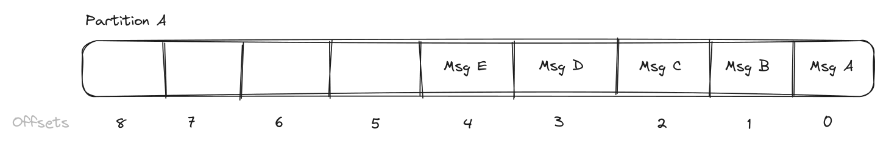
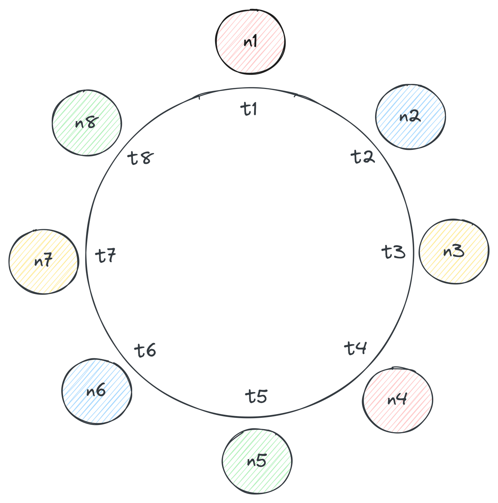
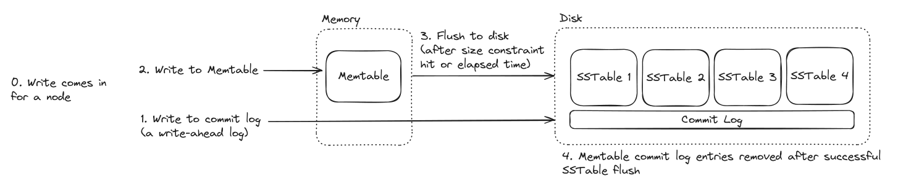
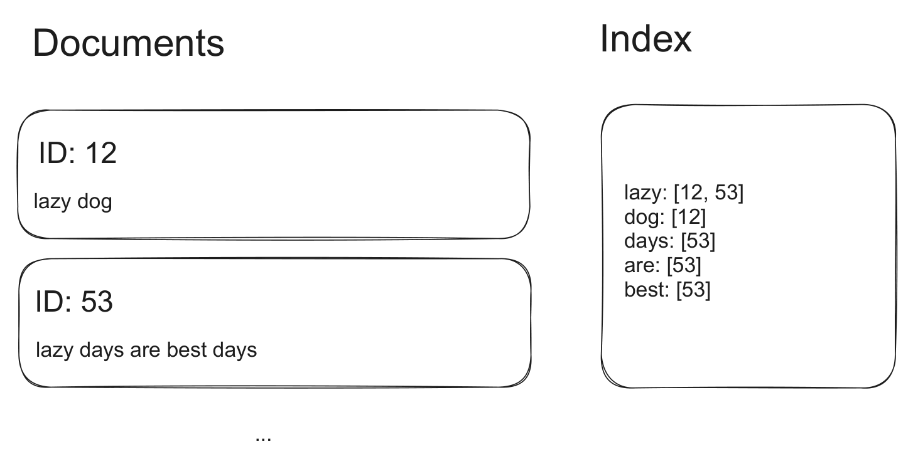
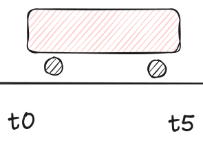

# Technologies

> Pick the simplest component that satisfies the requirement, then defend it. Deep versions: see `../4-KeyTechnologies/` in the source library.

## Selection matrix

| Need                   | Pick                   | Alternative                        | Why                                                                                                                        |
| ---------------------- | ---------------------- | ---------------------------------- | -------------------------------------------------------------------------------------------------------------------------- |
| Durable OLTP           | PostgreSQL             | DynamoDB                           | ACID, relationships, constraints, SQL, indexes, JSONB, PostGIS; DynamoDB only if access is predictable key-value/document. |
| Key-value at scale     | DynamoDB               | Cassandra                          | DynamoDB is managed AWS partition+sort-key scale; Cassandra is open-source write-heavy wide-column scale with more ops.    |
| Cache/leaderboard      | Redis                  | PostgreSQL materialized data / DAX | In-memory data structures, TTLs, counters, sorted sets, geo, pub/sub; not source of truth.                                 |
| Full-text & geo search | Elasticsearch          | PostgreSQL FTS + PostGIS           | Advanced relevance, fuzziness, faceting, ranking, distributed search, rich geo; Postgres first for simple/moderate search. |
| Event streaming/replay | Kafka                  | SQS / Redis Streams                | Durable partition logs, offsets, retention, replay, and many consumer groups; queues win for simple retries/DLQ.           |
| Stream aggregation     | Flink                  | Kafka consumer / batch job         | Stateful windows, watermarks, checkpoints, joins, exactly-once managed state; skip for stateless transforms.               |
| Coordination           | ZooKeeper              | etcd / Consul / cloud discovery    | ZNodes, watches, sessions, quorum-backed leader election/locks; managed/platform-native is simpler when available.         |
| Blob storage           | S3/GCS/Azure Blob      | Database metadata + CDN            | Store large bytes cheaply/durably; DB stores metadata, ownership, status, and blob URL.                                    |
| Fan-out                | Kafka consumer groups  | Redis Pub/Sub / per-consumer queue | Kafka for durable replayable fan-out; Redis Pub/Sub for online ephemeral fan-out; queues for worker distribution.          |
| Edge/API management    | API Gateway + LB + CDN | Direct service / service mesh      | One front door, auth/rate limits/routing, horizontal scale, edge cache; direct call is clearer for one simple backend.     |

## Default interview stack

- API Gateway + Load Balancer at the edge; CDN for public static/media/cacheable GETs.
- PostgreSQL as the first durable store; switch only for a named scale/access/consistency reason.
- Blob storage for files/videos/images; database row stores metadata, status, permissions, and URLs.
- Redis for cache, rate limiters, counters, leaderboards, and short-lived coordination with TTLs.
- Queue for simple async retries/DLQ; Kafka when replay, ordering by key, or many consumer groups matter.
- Elasticsearch only after PostgreSQL FTS/PostGIS cannot satisfy relevance, fuzzy/faceted, or distributed search.
- Flink only for recoverable stateful streaming; ZooKeeper only for infrastructure coordination not solved by the platform.

---

## Redis

**Pitch:** in-memory data-structure store. **Use when:** low-latency cache/counter/rate-limit/leaderboard/pub-sub/modest stream data can be rebuilt or stale. **Don't when:** it is the durable source of truth, needs rich queries, or needs long replay.
**Must be able to explain:**

- Key -> value type: strings, hashes, lists, sets, sorted sets, streams, geo; always name key shape, TTL, and eviction.
- Single-threaded command execution gives simple atomic commands; Lua scripts make multi-command logic atomic on one shard.
- Persistence is bounded: RDB can lose since snapshot; AOF defaults can lose about 1 second of acknowledged writes.
- Cluster has 16,384 hash slots; hash tags co-locate keys; async replicas can be stale or lose recent writes on failover.

| Capability                | Use it for                                     | Watch out for                                                          |
| ------------------------- | ---------------------------------------------- | ---------------------------------------------------------------------- |
| Cache with TTL/LRU        | Product pages, sessions, feed/query results    | TTL != correctness; eviction must be intentional.                      |
| Atomic counters / Lua     | Fixed or sliding-window rate limits, quotas    | Expire only once; hot keys overload one shard.                         |
| Sorted sets / geo         | Leaderboards, top posts, modest nearby search  | Memory growth; not full search/ranking.                                |
| Pub/Sub / Streams / locks | Online notifications, modest jobs, short locks | Pub/Sub loses offline messages; streams/locks are not Kafka/ZooKeeper. |

**Whiteboard rules:**

- Cache-aside: read Redis -> on miss DB -> `SET ... EX`; invalidate/update on writes or accept bounded staleness.
- Rate limiters: use `INCR` + first-expire for fixed windows, or sorted-set sliding window in Lua.
- Locks: `SET key token NX EX`; release with token-checking Lua, never blind `DEL`.
  **Scaling / failure:** A single node can be ~100k ops/sec interview-scale; cluster scales by key/slot, not arbitrary queries. Read-hot keys can use replicas/local cache/duplicates; write-hot keys need redesign. Locks need fencing or datastore checks for correctness.
  **Appears in:** Ticketmaster locks/cache, Uber driver matching, post-search leaderboards, live updates, dashboards, cron coordination.

> **Say:** "Redis is a data-structure cache: I will specify key, value type, TTL, eviction, and hot-key plan."
> **Trap:** Treating Redis as durable truth or assuming cluster size fixes one hot key.

## Kafka

**Pitch:** distributed commit log for durable event streaming. **Use when:** producers/consumers must be decoupled, events retained/replayed, or many consumer groups read the same stream. **Don't when:** payloads are huge, sub-500ms synchronous response is required, or built-in retries/DLQ matter more than replay.
**Must be able to explain:**

- Topic is logical; partitions are physical ordered logs and the unit of ordering, scale, and consumer parallelism.
- Key hashes to partition; same key preserves per-key order but there is no global order across partitions.
- Consumer groups divide partitions like a queue; independent groups replay the same topic independently by offsets.
- Durability needs replication factor (often 3), ISR, and producer `acks=all`; default delivery is at-least-once.
  
  | Capability | Use it for | Watch out for |
  |---|---|---|
  | Event log + replay | Audit logs, click streams, event sourcing, index rebuilds | Retention must cover replay window; duplicates happen. |
  | Queue-like workers | Transcoding, crawling, email/notifications | Commit offset only after durable side effect. |
  | Fan-out | Multiple analytics/search/notification pipelines | Each group multiplies downstream load. |
  | Ordered keyed processing | Ticket queues, per-game/per-user events | Bad keys create hot partitions; no global order. |
  **Whiteboard rules:**
- Name topic, key, value/schema, partition count, retention, and consumer groups.
- Partition keys: `game_id` for game events, `ticket_queue_id` for waiting room, salted/compound key for hot ads.
- Retry shape: main topic -> retry topic(s) -> DLQ; consumers idempotent, producer idempotence on with retries.
  **Scaling / failure:** Scale topics with enough partitions before brokers/consumers help; adding brokers cannot fix under-partitioning. Rough interview numbers: one good broker can reach very high throughput; source cites ~1M small messages/sec and ~1TB stored. Use batching/compression, monitor lag, retry topics + DLQ, idempotent consumers/producers.
  **Appears in:** YouTube processing pointers, Ticketmaster waiting room, ad-click aggregation, FB Live comments, web crawler, event-sourced systems.

> **Say:** "Kafka ordering is my message key contract, and offsets are committed only after the side effect is durable."
> **Trap:** Putting large blobs in Kafka or claiming exactly-once/global ordering without conditions.

## PostgreSQL

**Pitch:** default durable relational OLTP store. **Use when:** ACID, SQL, relationships, constraints, rich indexes, JSONB, FTS, or PostGIS help. **Don't when:** millions of writes/sec, active-active global writes, or pure key-value access dominates.
**Must be able to explain:**

- Tables/PK/FK/join tables model relationships; indexes are added for named access patterns, not every column.
- B-tree handles equality/range/sort; GIN handles FTS/JSONB; GiST/PostGIS handles spatial queries.
- WAL flush at commit gives durability; buffer cache/checkpoints write dirty pages later; each index amplifies writes.
- One primary writes; replicas scale reads but lag; row locks/isolation/optimistic versions solve races.
  | Capability | Use it for | Watch out for |
  |---|---|---|
  | ACID OLTP | Users, orders, payments, inventory, auth | Say the transaction/lock/isolation enforcing the invariant. |
  | Relationships + SQL | Posts/comments/follows, admin queries, reports | Joins and ad-hoc analytics can hit scale limits. |
  | Indexes / FTS / JSONB / PostGIS | Email lookup, feeds by user/date, simple search, nearby | Indexes slow writes; ES wins for advanced search. |
  | Replicas / partitioning / sharding | Read scale, time-series lifecycle, larger write scale | Replicas do not scale writes; sharding complicates cross-shard queries. |
  **Whiteboard rules:**
- Draw entities, PK/FK relationships, and only indexes that serve named reads or uniqueness constraints.
- Many-to-many needs a join table; large files stay in blob storage with DB metadata/URLs.
- Race control: known row uses `SELECT ... FOR UPDATE`; broader invariants use serializable+retry or optimistic version.
  **Scaling / failure:** Source estimates: simple inserts ~5k/sec/core, indexed updates ~1k-2k/sec/core, complex tx hundreds/sec; tables feel unwieldy around ~100M rows. Use indexes, batching, pooling/PgBouncer, read replicas, partitioning, then shard by common query key. Async replicas risk stale reads/data loss on failover; sync replicas add latency.
  **Appears in:** social apps, e-commerce, finance transfers/audits, CMS, auctions, location features.

> **Say:** "PostgreSQL is my default until a specific scale, distribution, or access-pattern requirement disqualifies it."
> **Trap:** Saying ACID without naming the race-control mechanism, or sharding before indexes/replicas/partitioning.

## DynamoDB

**Pitch:** AWS-managed key-value/document database. **Use when:** access patterns fit partition key + optional sort key and you want managed scale, replication, and per-read consistency. **Don't when:** joins, ad-hoc SQL/aggregation, vendor neutrality, or cheap extreme writes matter.
**Must be able to explain:**

- Table stores items up to 400KB; primary key is partition key or partition+sort key for range/sorted reads.
- `Query` uses a table/index key; `Scan` is the red flag at scale; ProjectionExpression saves bandwidth, not RCU.
- GSI is a separate async eventually-consistent access pattern; LSI shares partition key, is created with table, and can be strong.
- Consistency is per read: eventual default, `ConsistentRead=true` on base/LSI; partition has 3 AZ replicas, leader writes, quorum 2/3.
  | Capability | Use it for | Watch out for |
  |---|---|---|
  | Managed KV/document scale | Sessions, profiles, chat metadata, predictable product paths | Hot partition keys bottleneck despite auto-scaling. |
  | Sort-key ranges | Messages by `chat_id` + sortable `message_id` | Timestamps collide; use ULID/UUIDv7/Snowflake. |
  | GSIs/LSIs | Alternate reads like messages by `user_id` | GSI lag/no strong reads; LSIs must exist up front. |
  | Streams/DAX/Global Tables/transactions | CDC to search, microsecond read cache, regional apps, <=100 item tx | DAX bypasses strong reads; write units/cost can dominate. |
  **Whiteboard rules:**
- For every access pattern, state table PK/SK and whether `Query` hits base table, GSI, or LSI.
- Split large/hot attributes into separate items/tables; single-table design is optional, not a magic requirement.
- Correctness reads need base-table/LSI strong read or transaction; GSI results may be stale.
  **Scaling / failure:** Physical partition rough limit: 3,000 RCU or 1,000 WCU; 1 eventual RCU reads 4KB twice/sec, strong once/sec; 1 WCU writes 1KB/sec, rounded up. On-demand handles spikes; provisioned is cheaper if predictable. Large/hot items and GSIs multiply cost.
  **Appears in:** chat tables, Yelp-like metadata, booking/checkout strong reads, YouTube-scale counters cost discussion, Streams-to-search.

> **Say:** "With DynamoDB, I start from access patterns, then name PK, SK, indexes, consistency, and capacity."
> **Trap:** Designing scans/joins or assuming GSIs are strongly consistent.

## Cassandra

**Pitch:** open-source wide-column store for availability-biased, write-heavy scale. **Use when:** queries are known, denormalized tables are acceptable, and eventual/tunable consistency fits. **Don't when:** strict transactions, joins, ad-hoc aggregation, or normalized modeling are required.
**Must be able to explain:**

- Primary key = partition key for placement + clustering key for ordering within a bounded partition.
- Query-first modeling creates one table per access pattern; denormalization is expected and app-maintained.
- Ring/vnodes/consistent hashing distribute partitions; `NetworkTopologyStrategy` places replicas by rack/DC.
- LSM path: commit log -> memtable -> SSTables; reads use bloom filters/reconciliation; deletes create tombstones.
  
  
  | Capability | Use it for | Watch out for |
  |---|---|---|
  | High write throughput | Messages, activity streams, time-bucketed events | Reads/compaction/tombstones are the price. |
  | Horizontal availability | Always-on browse paths, multi-DC data | Strict consistency is not its natural shape. |
  | Ordered partition reads | Channel messages, event-section seats | Must bound partition size with buckets/sections. |
  | Tunable consistency | `ONE`, `QUORUM`, `ALL` per operation | Quorum overlap is not serializable ACID. |
  **Whiteboard rules:**
- Say the access pattern before the table; partition key matches equality predicate, clustering key matches sort/range.
- Bound partitions by time bucket, section, tenant, or another query-aligned dimension before the busy-case appears.
- Duplicate tables are maintained by app/outbox/materialized path; secondary indexes are not the core query plan.
  **Scaling / failure:** Any node can coordinate; RF=3 with `QUORUM` read+write overlaps on at least one replica. Gossip/failure detector, hinted handoff, read repair/rebuild handle failures; long outages need repair. Hot/large partitions are the classic failure: split by time bucket, section, or query-aligned dimension.
  **Appears in:** Discord messages, Ticketmaster browsing/sections, inbox search history, activity storage, multi-region/rack-aware systems.

> **Say:** "Cassandra data modeling is query-driven; the partition key is both access path and scaling unit."
> **Trap:** Modeling normalized entities and expecting joins, or allowing one unbounded busy partition.

## Elasticsearch

**Pitch:** distributed Lucene search/indexing engine. **Use when:** users need full-text, ranked, fuzzy, faceted, filtered, nested, or geospatial search beyond the primary DB. **Don't when:** it would be the authoritative database, data is tiny/simple, or fields update constantly.
**Must be able to explain:**

- JSON documents live in indices; mapping is the search schema, with `text`, `keyword`, `date`, numeric, nested, and geo fields.
- Primary/replica shards are Lucene indexes; coordinating node fans query to shards and merges results.
- Inverted index maps terms to doc IDs; doc values power sort/aggregation; `_source` fetch is a separate phase.
- Segments are immutable: updates are delete+insert, deletes persist until merge; search is eventually consistent with source.
  
  | Capability | Use it for | Watch out for |
  |---|---|---|
  | Full-text + relevance | Posts, events, products, books | CDC/replay/reconciliation keeps it synced. |
  | Filters/facets/geo | Yelp/Uber/event search with price/date/category/location | Mapping choices decide cost and correctness. |
  | Distributed search | Millions/billions of documents, replicas for read throughput | Shard count, field explosion, and replicas matter. |
  | Pagination/sorting | Infinite scroll with `search_after`/PIT | Deep `from/size` beyond ~10k-style depths is expensive. |
  **Whiteboard rules:**
- Design one denormalized, query-ready document; map only fields used for search/filter/sort/facet.
- Choose the CDC/outbox/stream source plus replay/backfill/reconciliation path; search is eventually consistent.
- Use `keyword` for exact filters/sorts, `text` for analysis, `geo_point`/`geo_shape` for location.
  **Scaling / failure:** Keep source of truth in Postgres/DynamoDB/Cassandra and feed ES via CDC/outbox/stream. Start with Postgres FTS/PostGIS for moderate/simple search (source says <~100k docs often fine). Avoid high-rate counters and frequent in-place updates; batch or store elsewhere.
  **Appears in:** Ticketmaster event search, social post search, Yelp/Uber geo search, product catalogs, DynamoDB/Postgres search replicas.

> **Say:** "Elasticsearch is my search index, not my system of record."
> **Trap:** Forgetting index drift/backfill or updating hot counters directly in Elasticsearch.

## Flink

**Pitch:** distributed dataflow engine for stateful low-latency stream processing. **Use when:** real-time data needs windows, keyed state, joins, enrichment, watermarks, or recoverable aggregation. **Don't when:** a Kafka consumer, cron/batch job, DB query, or Redis counter is enough.
**Must be able to explain:**

- Job is a graph: sources -> operators -> sinks; operators map/filter/window/join/aggregate and may hold state.
- Keyed state partitions counts/windows by key; bad keys create hot tasks just like hot Kafka partitions.
- Watermarks track event-time progress so windows close despite out-of-order data; very late data needs a policy/true-up.
- Checkpoint barriers snapshot state + source offsets; exactly-once covers Flink-managed state, not arbitrary external side effects.
  
  | Capability | Use it for | Watch out for |
  |---|---|---|
  | Stateful aggregation | Ad clicks, page views, delivery metrics | State size/backend/checkpoint storage are hard. |
  | Event-time windows | Tumbling/sliding/session windows over late mobile events | Latency vs completeness tradeoff. |
  | Joins/enrichment/CEP | Fraud velocity, alerts, stream ETL | Stateful joins can multiply memory. |
  | Fault tolerance | Kafka source + checkpoints + idempotent/transactional sink | Kafka retention must cover recovery rewind. |
  **Whiteboard rules:**
- Name source, key, window, allowed lateness, state backend, sink, and idempotency/transaction plan.
- Key by the entity whose aggregate is owned: ad, user, account, region, stream, or session.
- Add an offline true-up when events can arrive after the watermark grace period.
  **Scaling / failure:** JobManager schedules/checkpoints; TaskManagers run task slots; parallelism helps only with balanced keys. State backends: memory fast/small, filesystem, RocksDB large/slower. Sink writes must be idempotent or transactional to avoid duplicate external effects after restart.
  **Appears in:** ad-click aggregator, real-time dashboards, fraud detection, engagement streams, delivery-time metrics, any service otherwise holding critical in-memory stream state.

> **Say:** "I add Flink only when the stream computation has recoverable state, windows, or late-event correctness requirements."
> **Trap:** Calling a simple stateless Kafka transform a Flink problem or assuming exactly-once applies to every sink.

## ZooKeeper

**Pitch:** consensus-backed coordination metadata service. **Use when:** distributed components need configuration, discovery, leader election, locks, watches, or small strongly coordinated state. **Don't when:** you need high-volume storage, high-frequency locks, or platform/cloud primitives already solve it.
**Must be able to explain:**

- Hierarchical ZNodes store small metadata (typically <1MB), not records/files; persistent vs ephemeral vs sequential nodes matter.
- Watches notify clients of changes; clients re-read and update local caches rather than querying on every request.
- Ensemble is odd-sized (3/5/7); one leader handles writes, followers serve reads, quorum commits via ZAB.
- Sessions/heartbeats delete ephemeral nodes on expiration; follower reads may be stale unless `sync` is used.
  | Capability | Use it for | Watch out for |
  |---|---|---|
  | Config/discovery | Feature flags, service endpoints, broker registration | Use local watch cache; avoid per-request reads. |
  | Leader election | Scheduler/controller leader via sequential ephemeral nodes | Watch next-lower node to avoid herd effects. |
  | Distributed locks | Correctness-heavy, lower-frequency locks | Not for hundreds/sec tiny critical sections. |
  | Metadata quorum | Infrastructure systems, partitions, assignments | Leader/quorum writes limit throughput. |
  **Whiteboard rules:**
- Use persistent ZNodes for config, ephemeral for membership, sequential ephemeral for election/locks.
- Store server/partition metadata and update local caches via watches; never model every user/item as a ZNode.
- For lock/election, contenders watch the predecessor node, not the root, to avoid notification storms.
  **Scaling / failure:** 3 nodes tolerate 1 failure; 5 tolerate 2; no quorum means no writes, preventing split brain. Good fit is read-heavy (source mentions ~10:1 reads:writes); common session timeouts are 10-30s. Avoid hot watch nodes, swapping, and high-cardinality user state.
  **Appears in:** chat/server routing, distributed queues/schedulers, live comments smart routing, HBase/Solr/older Kafka-style metadata, hierarchical locks.

> **Say:** "ZooKeeper is for small watched coordination metadata, not application data."
> **Trap:** Storing bulk/high-cardinality state or using ZK locks where Redis/DB/platform discovery is simpler.

## Edge & Infrastructure (API Gateway · Load Balancers · CDN · Blob Store · Queues)

**Pitch:** edge/workflow primitives for entry, scale, global delivery, large files, and async workers. **Use when:** the design needs routing/middleware, horizontal fan-in, media delivery, direct upload/download, or burst buffering. **Don't when:** one simple service or a latency-critical synchronous path is clearer.
**Must be able to explain:**

- API Gateway path: validate -> auth/rate-limit/log/CORS/TLS -> route by path/method/header -> optional transform/cache.
- LB: L4 balances TCP and persistent websockets; L7 understands HTTP path/header/method and can route/canary at request level.
- CDN: edge cache hit returns near user; miss fetches origin; cache key, TTL, purge, and private/public rules prevent leaks/staleness.
- Blob store: bytes in S3/GCS/Azure Blob; metadata/status/permissions in DB; presigned URLs and multipart upload keep app servers out of file path.
- Queue: producer -> queue/topic -> workers -> durable side effect -> ack/delete; define FIFO/partition key, retry delay/count, DLQ, idempotency, backpressure.
  | Capability | Use it for | Watch out for |
  |---|---|---|
  | Gateway middleware | Central auth, rate limits, validation, routing, API versioning | Do not bury business logic or over-discuss it. |
  | Load balancing | Horizontally scaled stateless services, websockets, regional entry | Health checks; sticky/persistent connection behavior. |
  | CDN | Static assets, media, public deterministic GETs | Wrong cache key can leak private data; TTL/invalidation is the failure mode. |
  | Blob storage | Videos, images, documents, raw crawled pages | DB stores metadata/pointers; do not proxy huge files through app servers. |
  | Queues | Photo/video processing, email, crawlers, ride spikes | Backlog != capacity; retries/DLQ/idempotency are mandatory. |
  **Whiteboard rules:**
- Draw one Gateway+LB box unless edge behavior is central; put horizontally scaled services behind it.
- Upload flow: create pending DB row -> return presigned URL -> client uploads -> blob event marks complete.
- CDN checklist: origin, cache key, TTL/purge, public/private data, and auth/header/query handling.
- Queue checklist: payload pointer, FIFO/partition key, retry/DLQ, worker idempotency, and backpressure signal.
  **Scaling / failure:** Gateways are stateless and scale behind LBs; global setups use regional gateways + GeoDNS/config sync. CDNs reduce origin load but stale until TTL/purge. Queues smooth bursts but can violate synchronous latency; when replay/multiple groups matter choose Kafka, when managed retry/DLQ matters choose SQS-style queues.
  **Appears in:** nearly all interviews; YouTube/Instagram/Dropbox media, web crawlers, photo processors, ride-sharing spikes, live/chat websockets.

> **Say:** "Large binaries go to blob storage via presigned URLs; queues carry work or pointers, not giant files."
> **Trap:** Caching private responses, storing blobs in the DB, or inserting queues into a path that must respond immediately.
