# Problems

> 32 designs, compressed to the decisions that matter. Full worked breakdowns (requirements, APIs, full deep dives, all diagrams) are in `../7-Problems/<Name>.md`.

## How to use
Attempt one prompt on a whiteboard for 35-45 minutes before reading.
Diff your choices against these: datastore, consistency boundary, queue, cache, and failure mode.
Use the **Say** line as the interview soundbite, not as a memorized answer.

## Archetype index
| Archetype | Problems | The shared lesson |
|---|---|---|
| Contention & correctness | Ticketmaster, Flash Sale, Online Auction, Payment System, Robinhood | Put the invariant in one durable boundary; use TTL holds, queues, and idempotency around it. |
| Realtime/stateful connections | WhatsApp, FB Live Comments, Google Docs, Online Chess, ChatGPT | Own connection placement, replay/reconnect, and durable-vs-ephemeral state explicitly. |
| Feeds & social graphs | Facebook News Feed, Instagram, Tinder, Strava, News Aggregator | Choose fanout timing by skew; precompute the common path and special-case celebrities/hot users. |
| Blobs & media | Dropbox, YouTube | Keep bytes out of app servers; use presigned multipart upload, processing DAGs, and CDN delivery. |
| Search & geo | Yelp, Uber, Local Delivery, Facebook Post Search | Build the index that matches the query: spatial, inverted, live geo, or denormalized read model. |
| Streams & counting | Ad Click Aggregator, YouTube Top K, Metrics Monitoring | Aggregate before reads, partition by the natural key, and preserve raw input for replay/reconciliation. |
| Infrastructure primitives | Rate Limiter, Distributed Cache, Job Scheduler, Notification System, Web Crawler, Bitly, Price Tracker, LeetCode | Design the reusable primitive: sharding, leases, retries, eviction, isolation, and operational backpressure. |

## Technique -> where to see it done
| Technique | Best examples |
|---|---|
| Hybrid fan-out | Facebook News Feed, Instagram |
| Reservation TTL | Ticketmaster, Flash Sale, Local Delivery |
| Idempotency keys | Payment System, Notification System, Job Scheduler |
| Consistent hashing | Distributed Cache, Google Docs, Online Chess |
| Presigned URL + CDN | Dropbox, YouTube, Instagram, WhatsApp |
| Geo indexing | Uber, Yelp, Tinder, Local Delivery |
| Stream aggregation | Ad Click Aggregator, YouTube Top K, Metrics Monitoring |
| OT vs CRDT | Google Docs, Figma case study |
| Sandboxing | LeetCode |
| CDC read models | News Aggregator, Payment System, Facebook Post Search |
| Durable workflow | Payment System, YouTube, Job Scheduler, Uber |
| SSE streaming | ChatGPT, Live Comments, Robinhood |
| Hot-key mitigation | Distributed Cache, Facebook News Feed, Ad Click Aggregator |
| Approximate retrieval/counting | Facebook Post Search, Tinder, YouTube Top K |

---

## Ticketmaster
**Signal:** Keep seat purchase correct while event search and hot-sale viewing remain fast.
**Design:** Cached Event/Search services read PostgreSQL metadata and Elasticsearch via CDC.
Booking uses Redis TTL holds, PostgreSQL finalization, Stripe webhooks, and a waiting room for extreme events.
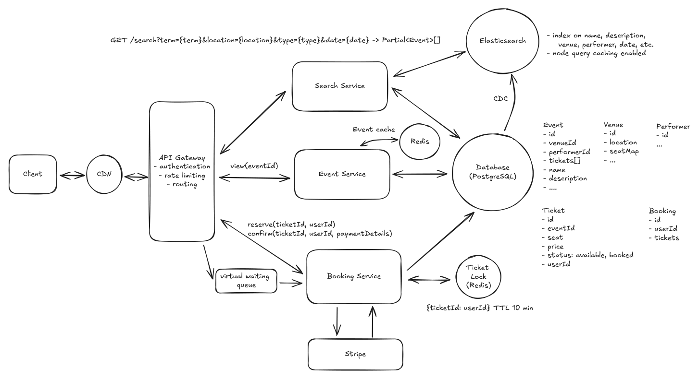
**Key decisions:**
| Decision | Chose | Over | Why |
|---|---|---|---|
| Service split | Event/Search/Booking services sharing PostgreSQL | Strict database-per-service split | Tightly coupled ticket data needs one ACID boundary. |
| Booking store | PostgreSQL transactions with row locks/OCC | Non-transactional booking store | Prevents two users buying the same ticket. |
| Seat holds | Redis `SET NX EX` TTL locks + Booking row | Long DB transaction during payment | Checkout time without holding row locks. |
| Hold visibility | Redis ZSET `event:{eventId}:reserved` scored by expiry | Plain Redis Set of locked seats | Expired holds disappear; no ghost reservations. |
| Payment finalization | Stripe.js token + idempotent webhook by `bookingId` | Server-handled raw cards; non-idempotent webhooks | PCI safer; Stripe retries cannot duplicate state. |
| Event reads | Read-through Redis/Memcached + TTL/invalidation | Every view hits PostgreSQL | Static event data handles huge read bursts. |
| Hot events | Admin-enabled virtual waiting queue + admitted TTL set | SSE seat-map updates for everyone | Controls access before overwhelming booking. |
| Search index | Elasticsearch fed from PostgreSQL by CDC | SQL `LIKE`/standard indexes | Fuzzy search needs inverted indexes and ranking. |
| Search caching | Elasticsearch query/request cache + CDN edge | App-only Redis result cache | Repeated, non-personalized queries avoid search load. |
**Breaks when:** Redis multi-seat locking is partial, tokens bypass Booking Service, or CDC/search freshness is trusted for final availability.
> **Say:** "Search and viewing can be eventually consistent, but the final ticket sale cannot."

## Flash Sale
**Signal:** Preserve a scarce-inventory invariant while millions of users arrive at once.
**Design:** Product launches pass through a waiting room, then Reservation Service claims units in PostgreSQL.
Reservation-unit rows, `FOR UPDATE SKIP LOCKED`, expiry reclaim, and Stripe settlement keep checkout short.
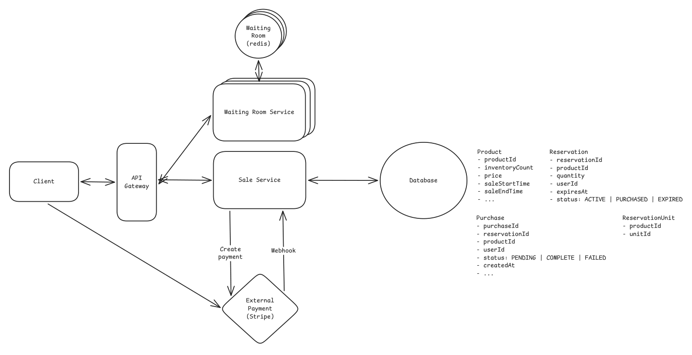
**Key decisions:**
| Decision | Chose | Over | Why |
|---|---|---|---|
| Reservation boundary | Short Reservation before Stripe payment | Holding inventory transaction through payment | Payment takes seconds; inventory claim must be quick. |
| Inventory model | `ReservationUnit` rows + `FOR UPDATE SKIP LOCKED` | Single `inventoryCount` row; Redis counter | Parallel claims stay in one database truth. |
| Claim transaction | Delete unit + insert Reservation atomically | Separate decrement then reservation write | Cannot lose inventory or create phantom reservations. |
| Expiry reclaim | On-demand batch reclaim of expired reservations | Cron cleanup or delayed SQS jobs | Avoids millions jobs; stock returns when needed. |
| Reclaim lock | Per-product advisory lock around reclamation | Many requests reclaiming simultaneously | One request refills pool; others retry fast. |
| Purchase status | Client polls `GET /purchases/:purchaseId` every second | SSE for few-second waits | Few reservation holders; polling is cheap. |
| Admission | Virtual Waiting Room Service + signed tokens | Gateway `429` rate limiting | Protects DB without retry thundering herd. |
| Admission rate | Controller admits ~8k/s for 10k TPS capacity | Let all waiting users reserve | Leaves headroom while using backend capacity. |
| Fairness | Pre-sale randomization, then FIFO after start | Pure FIFO by arrival time | Network latency and bots should not decide. |
| Queue integrity | Authenticated one active entry + CAPTCHA | Anonymous duplicate entries | Stops users and bots taking extra places. |
**Breaks when:** too many users open transactions, scans lack indexes, or admitted tokens are forgeable/reusable.
> **Say:** "The reservation is the product: payment can take seconds, so I take inventory off the table before Stripe."

## Online Auction
**Signal:** Serialize bids for one auction, retain audit history, and push current price updates.
**Design:** Bid Service appends to Kafka partitioned by `auctionId`, then updates SQL bid history and auction max price.
SSE servers subscribe through Pub/Sub so any connected watcher sees accepted high bids.
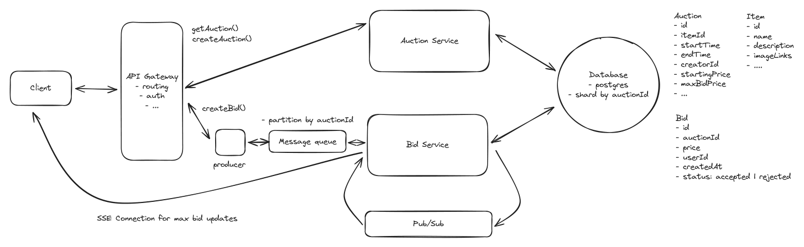
**Key decisions:**
| Decision | Chose | Over | Why |
|---|---|---|---|
| Service split | Dedicated Bidding Service | Auction Service handles bids too | Bid traffic is ~100x creation traffic. |
| Bid history | Append Bid rows with accepted/rejected status | Only overwriting `maxBidPrice` | Audit disputes; historical data is preserved. |
| Current price | Auction row stores max bid, updated transactionally | Locking all Bid rows; Redis max cache | One DB boundary without large locks. |
| Concurrency | OCC conditional update on `max_bid` | Pessimistic row locks everywhere | Avoids locks; retries only on conflicts. |
| Bid intake | Kafka durably persists submitted bids | Direct processing/drop/crash/over-provision | Crashes and surge periods do not lose bids. |
| Ordering | Kafka partitioned by `auctionId` | Unpartitioned async workers | Same-auction bids process in arrival order. |
| Realtime | SSE bid stream | Regular/long polling or WebSockets | One-way max-bid pushes are lighter. |
| Fanout | Pub/Sub to interested SSE servers | Server-local connections only | Updates reach watchers on other servers. |
| Shard key | Database sharded by `auctionId` | Single PostgreSQL instance | ~15K writes/s exceed one instance; no scatter-gather. |
| Dynamic ending | End-time update + cron; delayed scheduler when precise | — | Simple path is enough unless precision matters. |
**Breaks when:** a celebrity auction exceeds one row/partition, or backlog makes "bid received" misleading.
> **Say:** "The Auction row is the consistency boundary; bid history is the audit trail."

## Payment System
**Signal:** Preserve financial integrity when external payment networks are asynchronous and uncertain.
**Design:** Merchant PaymentIntents create internal Attempts/Charges before external calls.
Operational SQL state emits CDC to Kafka/object storage for audit, reconciliation, webhooks, and ledgers.
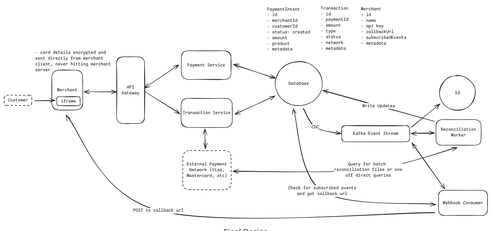
**Key decisions:**
| Decision | Chose | Over | Why |
|---|---|---|---|
| Payment model | PaymentIntent + polymorphic Transaction/Charge records | — | Multiple attempts stay linked to one merchant-facing lifecycle. |
| Merchant auth | Public API key + HMAC request signing, timestamp, nonce | Static API key alone | Rejects tampering and replayed requests. |
| Card collection | Hosted iframe + client-side public-key encryption | Merchant server collects cards; iframe-only | Card data bypasses merchants and leaves browser encrypted. |
| Network owner | Transaction Service owns records and payment-network calls | Extra service hops | Reduces complexity and unnecessary network hops. |
| Audit log | PostgreSQL commit -> CDC -> Kafka -> S3 archive | Current-state DB or app-written audit tables | No history loss; no application double-write. |
| Unknown outcomes | Attempt record before network call + automated reconciliation | Treat timeout as failure | Timeout is uncertainty, not denial. |
| Idempotency | Unique merchant idempotency key constraint | New charge on each retry | Prevents duplicate charges during retries. |
| Event partition | Kafka by `payment_intent_id`, 3-5 partitions, RF=3 | Single partition/unordered events | 10k TPS with per-intent ordering. |
| Data scale | Shard PostgreSQL by `merchant_id`; archive 3-6 months to S3/GCS | One operational database for ~180TB/year | Spreads writes and keeps hot DB small. |
| Merchant updates | CDC Webhook Service signs callbacks with exponential backoff | Merchant polling or client SSE/WebSockets | Server-to-server updates avoid high-frequency status checks. |
**Breaks when:** reference IDs are missing, CDC fails silently, webhooks are not idempotent, or secrets reach browsers.
> **Say:** "A timeout is an unknown financial state, not a failed payment."

## Robinhood
**Signal:** Minimize exchange connections while keeping live prices and order state consistent.
**Design:** Symbol Service proxies exchange market data once, caches it, and streams prices over SSE.
Order Service writes pending state, sends through a broker gateway/NAT, then reconciles trade-feed updates by external ID.
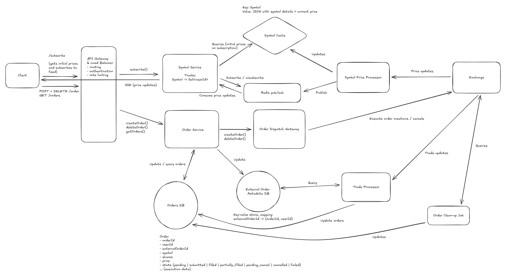
**Key decisions:**
| Decision | Chose | Over | Why |
|---|---|---|---|
| Price precision | Integer `priceInCents` | Floating-point `price` | Avoids financial precision errors. |
| Price feed | Symbol Service streams SSE from internal cache | Clients polling exchange directly | Under 200ms without duplicate exchange calls. |
| Price fanout | Redis Pub/Sub channels per symbol | Every Symbol Service receives every price | Servers get only subscribed-symbol updates. |
| Order path | Synchronous Order Gateway via AWS NAT/elastic IPs | Client direct exchange calls; queued dispatcher | Low latency and few exchange-facing IPs. |
| Order store | ACID relational Order DB partitioned by `userId` | Client-only order tracking | Reliable user reads hit one shard. |
| Trade lookup | RocksDB `externalOrderId` -> `(orderId,userId)` | Query user-sharded DB by external ID | Trade feed updates find the right shard. |
| Create workflow | Store `pending` order before exchange submission | Submit to exchange first | Client intent survives failures after exchange call. |
| Create recovery | Cleanup queries exchange by `clientOrderId` | Leave `pending` orders unresolved | Distinguishes submitted orders from failed submissions. |
| Cancel workflow | Mark `pending_cancel` before exchange cancel, then cleanup | Cancel first then update DB | Failed cancels can be resolved later. |
**Breaks when:** mapping writes fail, exchange references are unstable, or cleanup cannot distinguish lost response from not submitted.
> **Say:** "We are a broker proxying an exchange, not designing the exchange/order book."

## WhatsApp
**Signal:** Deliver messages quickly over sockets while guaranteeing eventual receipt across offline users and devices.
**Design:** WebSocket chat servers route live commands through Redis Pub/Sub, but every message writes durable Message and per-client Inbox rows first.
Media uses presigned blob references, and inbox entries clear only on client ACK.
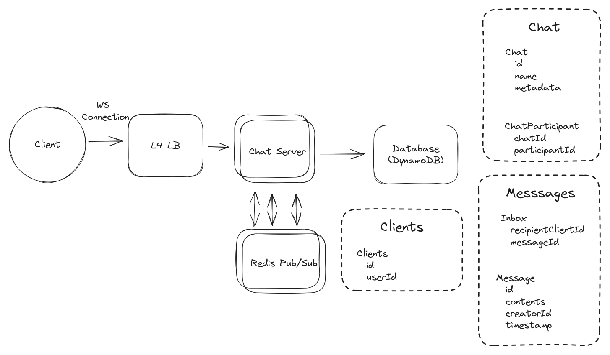
**Key decisions:**
| Decision | Chose | Over | Why |
|---|---|---|---|
| Protocol | WebSockets over TLS commands | REST request/response APIs | Bidirectional high-frequency messages need persistent sockets. |
| Chat metadata | DynamoDB ChatParticipant PK `chatId,participantId` + GSI by `participantId` | — | Efficient chat and user membership lookups. |
| Delivery state | Message row + Inbox TTL before Pub/Sub; ACK deletes | Socket send as success | Offline delivery works; server copies expire. |
| Media | Presigned blob upload/download URLs | Attachments in DB or proxied by Chat Server | Bytes bypass chat servers and databases. |
| Server routing | Sharded Redis Pub/Sub user channels; adaptive chat channels above 25 | Naive scale, Kafka per user, consistent hashing | Lightweight routing; durable Inbox handles Pub/Sub loss. |
| Multi-device | Clients table + per-client Inbox, 3-client limit | Per-user Inbox | Each device syncs independently without unbounded storage. |
| Connection health | Application heartbeats every 10-30s, 5s timeout | TCP timeouts or ACK-only detection | Dead sockets close within seconds, not minutes. |
| Missed messages | User sequence piggybacked on heartbeats + sync | Polling only or per-chat gap detection | Detects Pub/Sub drops within one heartbeat. |
| Ordering | Server receive timestamps with NTP | Delayed exact reordering | Immediate delivery beats perfect send order. |
| Last seen | Last disconnect table + active-connection query | DB writes on every heartbeat | Avoids millions of low-value writes per second. |
**Breaks when:** ACKs are not idempotent, TTL deletes early, Pub/Sub is treated as durable, or sequence gaps cannot sync.
> **Say:** "Redis Pub/Sub can be at-most-once because the delivery guarantee lives in the Inbox table."

## FB Live Comments
**Signal:** Pick the simplest push model for read-heavy comments, then scale one-stream fanout.
**Design:** Comment writes persist first, publish to partitioned Pub/Sub, then Realtime Messaging Servers fan out over SSE.
Viral streams switch to CDN snapshots/representative views plus reconnect catch-up by event ID.
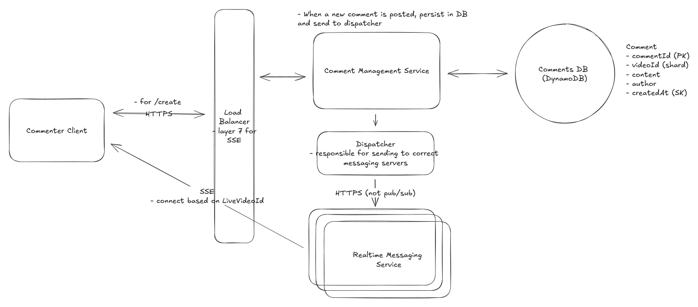
**Key decisions:**
| Decision | Chose | Over | Why |
|---|---|---|---|
| Comment store | DynamoDB comments keyed by `liveVideoId,commentId` | — | Simple comments need scale, not transactions. |
| User identity | JWT/session token in header | `userId` in request body | Prevents tampering and impersonation. |
| History paging | Cursor pagination by `last_comment_id` | Offset pagination | Stable and avoids scanning preceding rows. |
| Push channel | SSE for viewers, HTTP POST for comments | Polling or WebSockets | Read-heavy one-way stream fits SSE. |
| Service split | Comment Management + Realtime Messaging Servers | One service for writes and fanout | Read traffic scales independently from writes. |
| Fanout routing | Partitioned Pub/Sub + viewer co-location by `liveVideoId` | Every server processes every comment | Servers subscribe only to needed channels. |
| Pub/Sub tech | Redis Pub/Sub | Kafka dynamic subscriptions | Low-latency dynamic channels; DB persists comments. |
| Mega streams | CDN snapshots from 100-200 comment ring buffer | Perfect SSE delivery or sampling only | CDN serves millions; every comment is unreadable. |
| Mode switching | Flip to CDN above 100k viewers or 500 comments/s, with hysteresis | Static SSE-only mode | Avoids mega-stream overload and mode flapping. |
| Reconnect | SSE `Last-Event-ID` + client tracking + bounded Redis replay | Ignore disconnections | Catch-up without unbounded stale comment floods. |
**Breaks when:** viral streams overload assigned servers, replay cache is not shared, or `Last-Event-ID` catch-up is unbounded.
> **Say:** "At mega-stream scale, perfect delivery is less valuable than a readable representative experience."

## Google Docs
**Signal:** Make concurrent text edits converge while scaling stateful WebSocket ownership.
**Design:** REST handles metadata; WebSocket Document Service owns active `docId`s by consistent hash.
It applies OT, persists operations before ACK, broadcasts transformed edits, and compacts logs when idle.
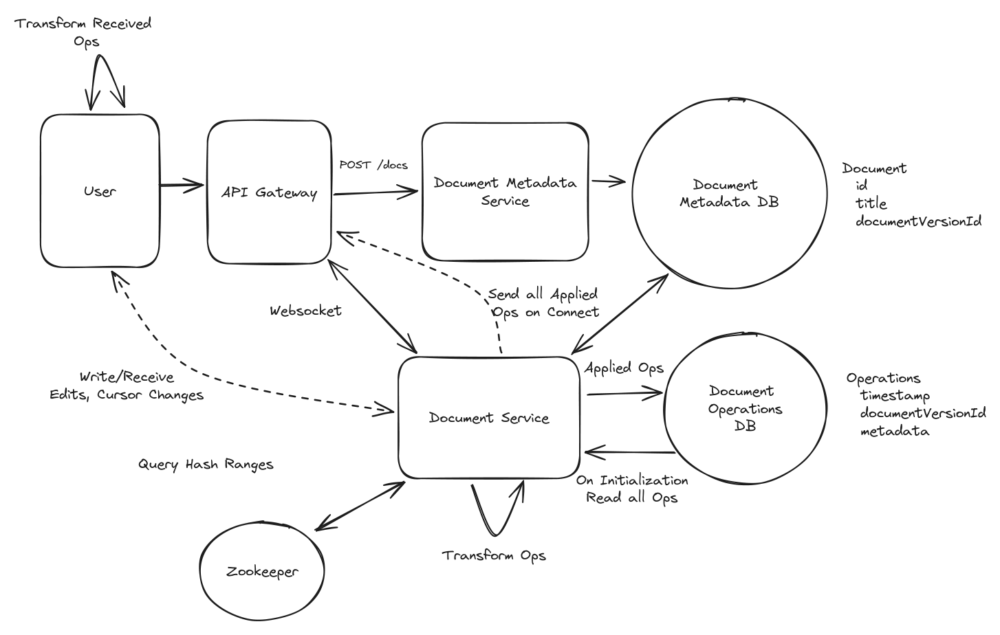
**Key decisions:**
| Decision | Chose | Over | Why |
|---|---|---|---|
| API split | REST for metadata, WebSocket messages for editing | REST for all editor traffic | Edits and cursor updates are bidirectional. |
| Metadata store | PostgreSQL metadata DB | — | Flexible queries; can partition and replicate later. |
| Edit payload | Send operations like insert/delete | Full document snapshots to blob storage | Avoids huge transfers and lost concurrent edits. |
| Convergence | Operational Transformation on central owner | CRDTs or last-write snapshots | Low memory; fits text and ≤100 editors. |
| Operation log | Cassandra append-only ops by `documentId`, server timestamp order | Mutable document-only storage | Fast writes and durable replay after restarts. |
| ACK boundary | Persist operation before acknowledging | — | Durable edits survive server restart. |
| Client updates | Server broadcasts transformed ops; clients also run OT | Server-only transform | Local optimistic edits still converge. |
| Presence | In-memory cursor/presence on Document Service | Store awareness in document data | Awareness is ephemeral with the connection. |
| Ownership | Consistent hash ring by `docId` via ZooKeeper redirects | Any-server document connections | One owner orders edits and broadcasts locally. |
| Compaction | Document Service compacts online when idle using new `documentVersionId` | Offline Compaction Service | Owner knows no clients; avoids coordination races. |
**Breaks when:** docs need heavy offline/P2P editing, one doc becomes hot, compaction races, or OT edge cases are wrong.
> **Say:** "Each edit is contextual, so the server must either transform it or make operations commutative."

## Online Chess
**Signal:** Keep two players on one authoritative game while scaling matchmaking, clocks, and ranks.
**Design:** A Redis sorted set per time control atomically matches players; Game Servers own board state in memory.
Moves append to a log before broadcast; routing uses consistent hashing, fencing, and reconnect replay.
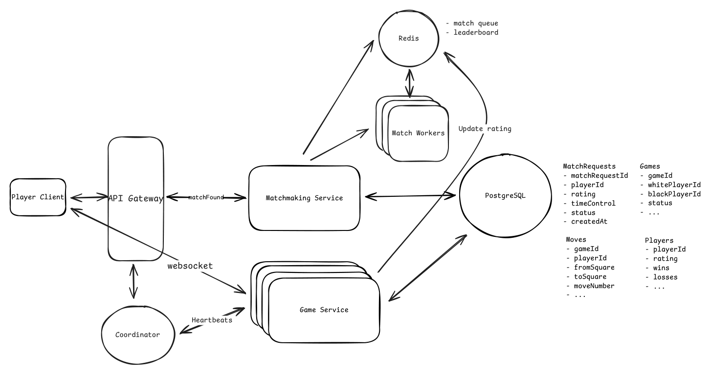
**Key decisions:**
| Decision | Chose | Over | Why |
|---|---|---|---|
| Gameplay transport | WebSocket scoped to game | REST polling or SSE | Both players send and receive continuously. |
| Matchmaking | Redis ZSET per time control + Lua | In-process pool or Postgres SKIP LOCKED | Atomic range claim avoids bloat and double-booking. |
| Pool scale/failover | Single Redis key with replicas/failover | Rating-band sharding | 50k ops/s fits; lost pending requests can resubmit. |
| Game state | Stateful in-memory owner + move-log replay | Shared Redis game state | Local validation; tiny move logs recover crashes. |
| Move ordering | Persist before broadcast | Broadcast then persist | Recovery cannot miss moves players already saw. |
| Server placement | Consistent hashing + ephemeral registry | Plain sticky hash by gameId | Membership changes remap small slices and detect dead nodes. |
| Fencing | Game generation guard on writes | Unfenced recovered owners | Zombie servers cannot mutate games after reassignment. |
| Clock fairness | Server clock + median RTT compensation cap | Client clock or no compensation | Prevents cheating while reducing high-latency clock tax. |
| Leaderboard rank | Redis sorted set with ZREVRANK | Postgres COUNT or bucketed counts | O(log n) exact ranks for 10M players. |
| Rating apply | Game-result source + idempotent gameId apply | Non-idempotent player/Redis updates | Retries correct drift without double-counting games. |
**Breaks when:** routing changes without fencing, RTT inflation is unchecked, or game-end ELO is not idempotent by `gameId`.
> **Say:** "The server owns rules and clocks; the database is a recovery log, not the move hot path."

## ChatGPT
**Signal:** Stream tokens quickly while scheduling scarce GPUs fairly and controlling context cost.
**Design:** Chat Service creates a Run, queues GPU work, receives worker tokens over gRPC streaming, and emits SSE to clients.
Redis Streams buffer live deltas for reconnect; Postgres stores final messages.
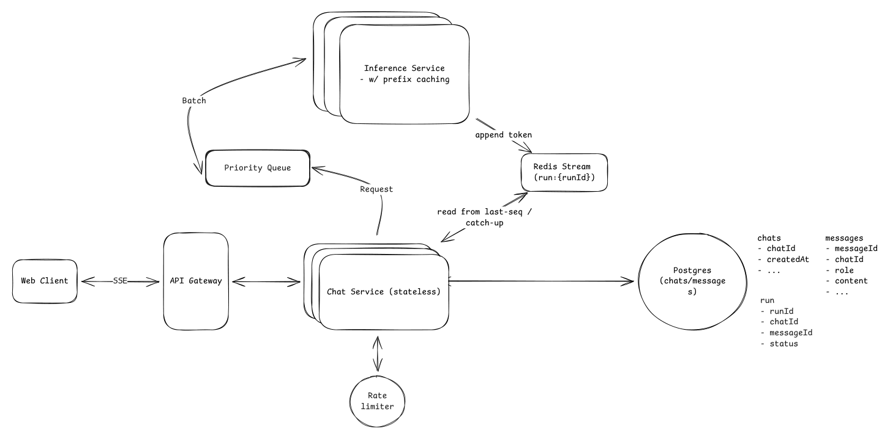
**Key decisions:**
| Decision | Chose | Over | Why |
|---|---|---|---|
| Service split | Stateless Chat Service + GPU Inference Service | Coupled chat/GPU tier | Cheap chat and expensive GPUs scale independently. |
| Worker streaming | Server-streaming gRPC | Request/response completion | Avoids buffering 30-second answers before first token. |
| Browser streaming | SSE EventSource GET | Polling or WebSockets | One-way token push without bidirectional overhead. |
| Run lifecycle | Run row returning runId | Synchronous POST returning Message | Queued, streaming, failed, cancelled attempts need lifecycle. |
| Stream replay | Redis Streams + final Postgres message | Pub/Sub or durable token chunks | Replays gaps without bloating history. |
| Stream retention | Delta tokens with MAXLEN + TTL | Snapshots or permanent chunk storage | Bounds memory and avoids quadratic bandwidth. |
| GPU scheduling | Bounded queue + continuous batching | Direct workers or unbounded queue | Keeps GPUs utilized and rejects honestly at capacity. |
| Fairness | Token quotas + tier-aware priority | Global or per-user request caps | Tokens reflect GPU cost; tiers get differentiated service. |
| Context cost | Prefix caching + rolling summary | Full history or truncation | Reuses stable prefixes while preserving long-chat memory. |
| Cancellation | Explicit cancel request + control channel | Treating disconnect as cancellation | Frees GPU without breaking reconnect semantics. |
**Breaks when:** Redis retention is too short, demand exceeds capacity for long periods, or quota ignores token/context cost.
> **Say:** "The Run is the unit of work; Message is the durable outcome."

## Facebook News Feed
**Signal:** Choose fanout-on-read, fanout-on-write, or hybrid under celebrity skew.
**Design:** Normal posts fan out asynchronously into bounded per-user Feed rows; celebrity posts are merged at read time.
Post metadata is cached redundantly for hot objects, and timestamp cursors page the materialized feed.
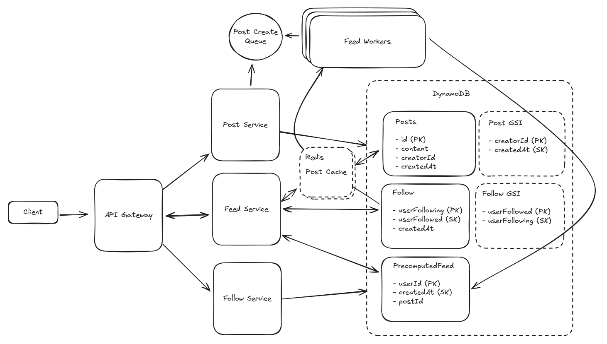
**Key decisions:**
| Decision | Chose | Over | Why |
|---|---|---|---|
| Post storage | DynamoDB Post table | — | Simple scalable key-value store for posts. |
| Follow graph | DynamoDB relation table + reverse GSI | Neo4j/triple store | No traversals; simple follow lookups suffice. |
| Follow API | Idempotent PUT follow | Non-idempotent action | Double-clicking follow should not fail. |
| Feed read path | PrecomputedFeed of ~200 postIds/user | Fanout-on-read across follows/posts | Avoids thousands of reads; 4TB is reasonable. |
| Cursoring | Oldest timestamp cursor | — | Reverse chronological scroll fetches older posts efficiently. |
| Fanout work | SQS async feed workers | Post Service blasts writes | 1-minute staleness permits smoothing millions of writes. |
| Celebrity skew | Hybrid fanout with non-precomputed follows | Fanout-on-write for every account | Avoids 90M writes for celebrity posts. |
| Hot posts | Redundant Redis post cache + long TTL/LRU | Sharded cache or direct DynamoDB | Viral keys spread across all cache instances. |
| Feed depth | Bound feeds to first ~200 IDs | Arbitrary deep feed history | Real users rarely page hundreds deep. |
**Breaks when:** users need deep complete history fast, too many follows are non-precomputed, or ranking/privacy enters scope.
> **Say:** "News feed is about choosing fanout timing: read, write, or hybrid by account type."

## Instagram
**Signal:** Separate feed-read latency from write amplification while serving global media cheaply.
**Design:** Post metadata lives in DB/cache; media uploads directly to S3 and delivers through CDN variants.
Feeds use Redis ZSET IDs: normal authors fan out on write, celebrities merge on read.
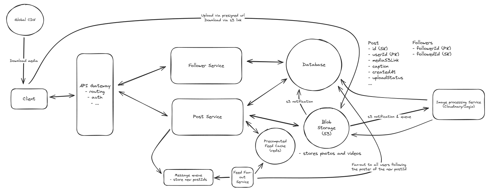
**Key decisions:**
| Decision | Chose | Over | Why |
|---|---|---|---|
| Metadata DB | DynamoDB posts/follows with indexes | Full table scans | Scale and eventual consistency fit simple relationships. |
| Media storage | S3 object store | App-server or DB byte storage | Blob store handles 200TB/day binary scale. |
| Feed model | Hybrid Redis precompute + celebrity merge | Fanout-on-read or pure fanout-on-write | Fast common reads without 100k+ follower write explosions. |
| Feed hydration | Redis ZSET IDs + HASH metadata cache | Full posts in feeds or DB per request | Balances memory, freshness, and BatchGet misses. |
| Redis durability | AOF + Sentinel/Cluster | Volatile Redis-only feeds | Failover recovers cache with minimal data loss. |
| Upload path | Presigned S3 multipart | Single POST or app-server upload | 4GB videos need chunks and server bypass. |
| Completion update | S3 event/Lambda backend update | Client-reported completion PATCH | Backend consistency beats trusting clients. |
| Media delivery | CloudFront CDN in front of S3 | Direct S3 serving | Edge caches cut global latency and S3 cost. |
| Media variants | Optimized image/video variants + adaptive streaming | Same high-res file for everyone | Device-specific bytes render faster. |
| Cold storage | Glacier/S3 tiering for old media/metadata | Keep 750PB hot | Infrequent access should move to cheaper storage. |
**Breaks when:** celebrity threshold is wrong, Redis durability is ignored, URL TTLs are long, or CDN variants lag viral demand.
> **Say:** "Media bytes should not flow through my application servers; metadata and bytes have different paths."

## Tinder
**Signal:** Serve nearby recommendations fast while detecting mutual likes exactly once and immediately.
**Design:** Profile/search indexes generate cached swipe stacks; high-volume swipes persist to Cassandra.
Redis Lua checks sorted pair keys for reciprocal likes and emits match notifications.
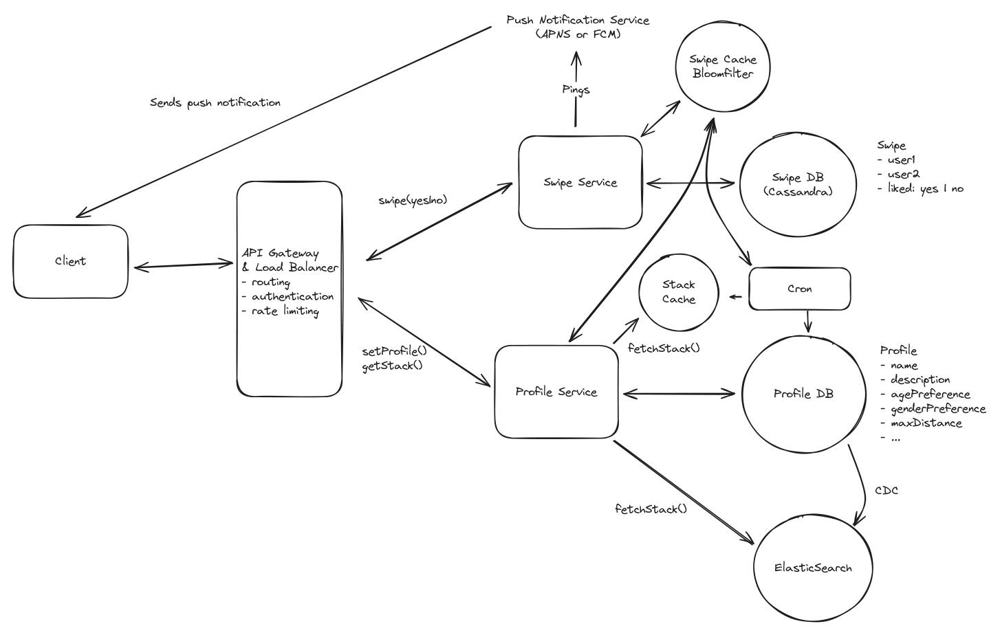
**Key decisions:**
| Decision | Chose | Over | Why |
|---|---|---|---|
| Service split | Dedicated Swipe Service + Cassandra DB | Profile service/database only | Swipe writes reach 200GB/day and scale differently. |
| Swipe storage | Cassandra partitioned swipe history | Relational/profile DB | Write-optimized storage absorbs massive swipe volume. |
| Pair key | Sorted user-pair key/shard | Separate A→B and B→A partitions | Reciprocal swipes must be checked atomically together. |
| Match detection | Redis Lua atomic hash + Cassandra history | Cassandra LWT or database polling | Immediate matches need low-latency atomicity. |
| Redis retention | Expire recent Redis swipes, flush to Cassandra | Keep all swipe history in Redis | Cassandra stores history; Redis memory stays bounded. |
| Match notification | In-app result + APNS/FCM push | Waiting for first swiper to reopen | First swiper may have liked weeks earlier. |
| Feed index | Elasticsearch/OpenSearch geospatial index | SQL bounding-box scan | Fast complex preference and location queries. |
| Feed generation | Precomputed cached stacks + indexed top-up | Live query or precompute-only | Instant app open; active users still get freshness. |
| Stale stacks | <1h TTL + location/filter refresh | Indefinite cached feeds | Cached profiles can stop matching filters. |
| Swipe dedupe | Backend contains + client cache/Bloom filter | DB contains check only | Avoid repeats despite replica lag and huge histories. |
**Breaks when:** Redis loses recent swipes before reconciliation, pair keys are inconsistent, or multi-device caches diverge.
> **Say:** "Cassandra is great for durable swipe volume, but Redis is the right place for the atomic real-time pair check."

## Strava
**Signal:** Realize the phone owns live tracking; scale backend around completed activity uploads.
**Design:** Mobile records GPS, distance, route, and timer offline with periodic local persistence.
Completion uploads metadata and route blobs/time-series; feeds and leaderboards are derived read models.
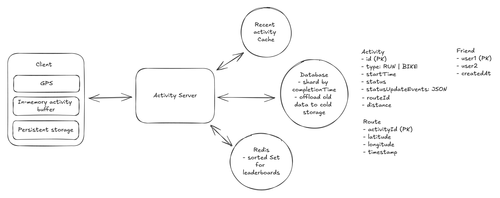
**Key decisions:**
| Decision | Chose | Over | Why |
|---|---|---|---|
| Pause timing | Status/timestamp event log | Single start timestamp | Excludes pauses and supports active versus total time. |
| Live tracking | Client GPS + Haversine local stats | Server-side per-point state | Works offline and stays accurate without network. |
| Local durability | Buffer + local storage every ~10s | Memory-only tracking | Unexpected shutdown loses at most about 10 seconds. |
| Sync boundary | Completed/chunked activity upload | Per-coordinate server writes | Cuts backend requests roughly 100x. |
| Service shape | Single horizontally scaled Activity Service | Many microservices | Client offload leaves no major path skew. |
| Activity storage | Shard by completion time | One huge activity database | Recent activities dominate queries. |
| Storage tiers | Hot/warm/cold route storage | Keep old routes hot | Older activities are rare; 547.5TB/year accumulates. |
| Realtime friends | 2–5s polling + 5–10s buffering | WebSockets/SSE live pub-sub | Predictable updates; friends do not need chat precision. |
| Leaderboards | Redis sorted sets incremented on completion | Naive DB aggregation or daily table | Efficient real-time top-N by activity totals. |
| Filtered ranks | Country sets + time zset/hash TTL cache | One global leaderboard only | Supports filters without scanning all activities. |
**Breaks when:** every activity requires live broadcast, route analytics become OLTP-wide scans, or feeds render full routes inline.
> **Say:** "The client is an active system component, not just a dumb terminal."

## News Aggregator
**Signal:** Separate publisher ingestion from feed delivery, then defend freshness and cursoring at 100M+ DAU.
**Design:** Webhooks/RSS/scrapers ingest articles and thumbnails; CDC updates regional Redis sorted-set feeds.
Clients page by monotonic article IDs; thumbnails live in S3/CloudFront with generated sizes.
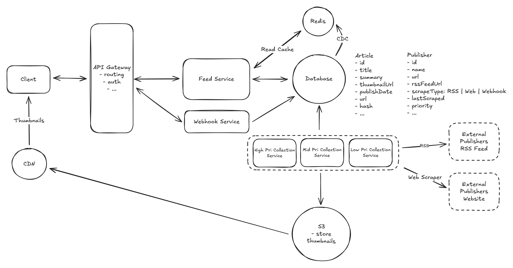
**Key decisions:**
| Decision | Chose | Over | Why |
|---|---|---|---|
| Service split | Data Collection + Feed Service | Single combined service | User reads and batch ingestion scale differently. |
| Thumbnail ownership | S3-generated thumbnails | Publisher image URLs or DB blobs | Publishers can be slow; databases hate blobs. |
| Cursoring | Monotonic article IDs | Offset, timestamp-only, composite cursors | Stable simple pagination avoids shifts and collisions. |
| Feed cache | Regional Redis ZSET feeds via CDC | DB query per page or TTL cache | Sub-200ms reads with immediate freshness. |
| Cache bounds | Latest 1k–2k articles via ZREMRANGEBYRANK | Unbounded Redis feeds | Enough scrolling while memory stays bounded. |
| Freshness | Publisher webhooks + RSS/scrape fallback | Polling or scraping only | Push gives seconds; fallback covers non-partners. |
| Webhook auth | Shared secrets/API keys | Unauthenticated publisher posts | Prevents spam and verifies content source. |
| Traffic spikes | Regional deployments + Redis read replicas | One global cache/database | Regional news lets hot regions scale independently. |
| Categories | In-memory filtering of cached regional JSON | DB filtering or 250 category caches | 1k cached articles filter fast without duplication. |
| Personalization | Preference-vector assembly from category feeds | Real-time scoring or per-user caches | 100x less memory while preserving sub-200ms responses. |
**Breaks when:** CDC lag is unmonitored, IDs are not time-ordered, publishers refuse integration, or personalization becomes deep per-user ranking.
> **Say:** "This is a read-scaling problem with a separate freshness pipeline."

## Dropbox
**Signal:** Keep application servers out of the 50GB file-data path while supporting sync and sharing.
**Design:** File Service authorizes metadata and presigned multipart URLs; clients send bytes directly to blob storage.
CDN signed URLs serve downloads, `SharedFiles` indexes sharing, and sync uses push plus polling and content-defined chunks.
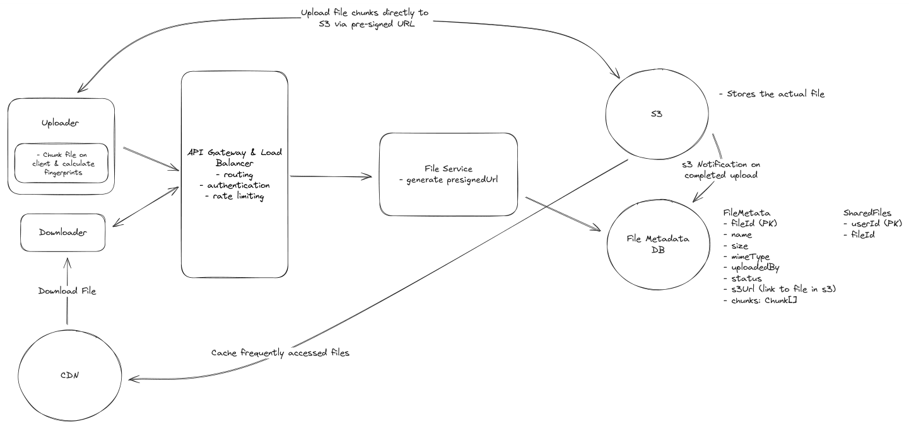
**Key decisions:**
| Decision | Chose | Over | Why |
|---|---|---|---|
| Metadata store | DynamoDB FileMetadata + SharedFiles | — | Loose schema and user-keyed file lookups fit NoSQL. |
| Upload path | Presigned direct S3 upload | File Service stores/relays bytes | Bypasses app bandwidth and server-loss risk. |
| Large uploads | 5–10MB S3 multipart chunks | Single 50GB POST | Enables progress, parallelism, and resume. |
| Chunk integrity | Server ETag ListParts verification | Trust client PATCH statuses | Trust but verify before marking uploaded. |
| File identity | Content and chunk fingerprints | Filename-based identity | Supports deduplication and resumable upload lookup. |
| Download security | CDN signed URLs + HTTPS/S3 encryption | File relay, direct S3, or long-lived URLs | Edges are fast; TTL limits bearer-link leaks. |
| Sharing index | SharedFiles table by userId,fileId | Metadata sharelist or cache mirror | Fast shared-with-me queries without sync drift. |
| Sync signals | WebSocket/SSE push + periodic polling | Polling-only or push-only | Near-instant changes; polling catches missed events. |
| Conflict policy | Remote truth + last-write-wins | Client truth or distributed merge | Keeps devices convergent without versioning scope. |
| Delta transfer | Content-defined chunks + selective compression | Fixed chunks, full reupload, compress-all | Inserts preserve fingerprints; only compressible bytes shrink. |
**Breaks when:** URLs live too long, multipart state is not reconciled, ACLs outgrow the model, or conflict history becomes required.
> **Say:** "The File Service is the control plane; blob storage/CDN are the data plane."

## YouTube
**Signal:** Move multi-GB video bytes without app-server bottlenecks, then transform them for playback.
**Design:** Clients upload multipart to blob storage; metadata stores `videoId` state separately.
A workflow DAG transcodes originals into codec/bitrate segments and manifests, then CDN serves adaptive playback.
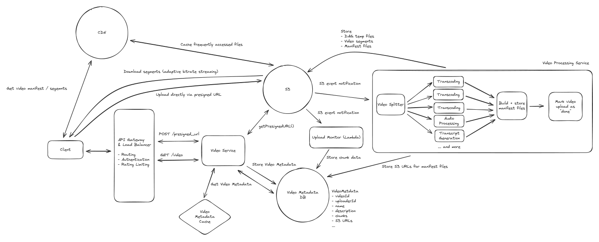
**Key decisions:**
| Decision | Chose | Over | Why |
|---|---|---|---|
| Metadata store | Cassandra partitioned by videoId | Relational single-node DB | 365M yearly records need highly available point lookups. |
| Upload path | S3 presigned multipart upload | App-server video upload | Multi-GB files bypass app servers and resume by chunks. |
| Completion | S3 CompleteMultipartUpload event | Client-triggered processing | Backend starts processing only after verified object completion. |
| Video storage | Segmented multi-format assets plus manifests | Raw upload or full-format files | Segments enable partial adaptive playback across devices. |
| Streaming | Adaptive bitrate via manifest | Full download or fixed segments | Client adapts quality to bandwidth without buffering. |
| Processing | Temporal DAG with ffmpeg workers | Monolithic processor | Dependencies, fan-out, and CPU-heavy transcodes need orchestration. |
| Worker handoff | S3 URLs for intermediate files | Passing blobs between workers | Avoids moving large files through worker queues. |
| Resumability | Chunk fingerprints plus ETag verification | Trust client progress | Server verifies S3 part state before marking uploaded. |
| Read scaling | LRU cache partitioned by videoId | Cassandra reads for every view | Popular metadata hotspots are absorbed before the DB. |
| Delivery | CDN-cached segments and manifests | Direct S3 streaming | Edge proximity reduces startup latency and buffering. |
**Breaks when:** processing is not idempotent, manifests/CDN are stale, viral metadata hotspots form, or backlog delays availability.
> **Say:** "The video service should move metadata, not video bytes."

## Yelp
**Signal:** Use the right indexes for local search/reviews without over-engineering a low-write system.
**Design:** Businesses and reviews start in PostgreSQL with PostGIS, trigram/full-text, B-tree category indexes, and denormalized rating counters.
Review writes synchronously update aggregates with optimistic locking and a unique user-business constraint.
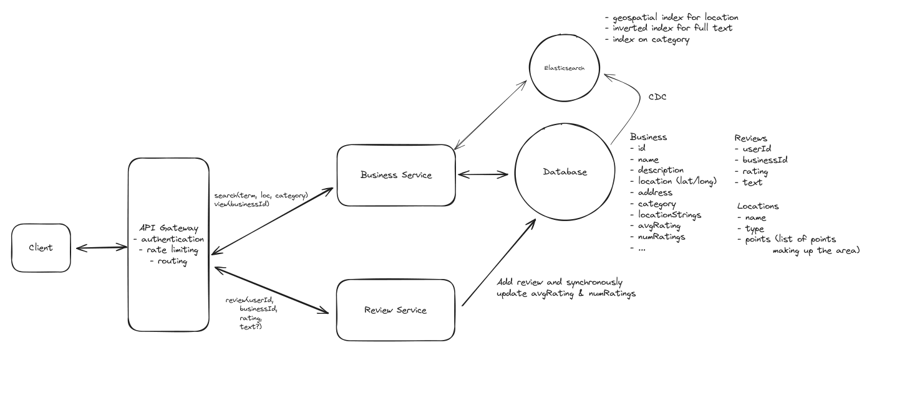
**Key decisions:**
| Decision | Chose | Over | Why |
|---|---|---|---|
| Service split | Business Service plus Review Service | One mixed service | Review writes and search reads scale differently. |
| Data coupling | Businesses and reviews in one Postgres DB | Separate service-owned databases | 1TB reviews are manageable and tightly coupled. |
| Search store | Postgres + PostGIS + pg_trgm | Elasticsearch secondary index | Small data avoids another service and sync complexity. |
| Search indexes | PostGIS, pg_trgm, and category B-tree | Lat/long B-tree plus LIKE scans | Each filter needs an index matching access pattern. |
| Rating update | Synchronous denormalized average with optimistic locking | On-demand AVG, cron, or queue | One write/s does not justify asynchronous complexity. |
| Review uniqueness | Unique constraint on user_id,business_id | Application-level check | Persistence-layer invariant survives races and new writers. |
| Read scaling | Read replicas and/or cache | Sharding | Small data and read-heavy traffic need simpler scaling. |
| Location names | Location table mapping names to polygons | Center-point radius | Cities and neighborhoods are not circular. |
| Location filtering | Precomputed location_names keyword field | Per-request geoshape filtering | Polygon membership is paid once at business creation. |
| Search order | Distance first, then name/category | Filtering full dataset | Distance usually shrinks the search space fastest. |
**Breaks when:** fuzzy relevance exceeds Postgres, review writes jump orders of magnitude, or sharding loses global uniqueness.
> **Say:** "At 10M businesses and about 1TB reviews, the hard part is indexing reads, not sharding writes."

## Uber
**Signal:** Match riders to nearby drivers quickly without double-assigning drivers or losing ride requests.
**Design:** Live driver location is ephemeral in Redis GEO/cells; ride state is durable in SQL/workflow queues.
Matching workers lock `driverId` with TTL, notify drivers, and commit assignment idempotently by region.
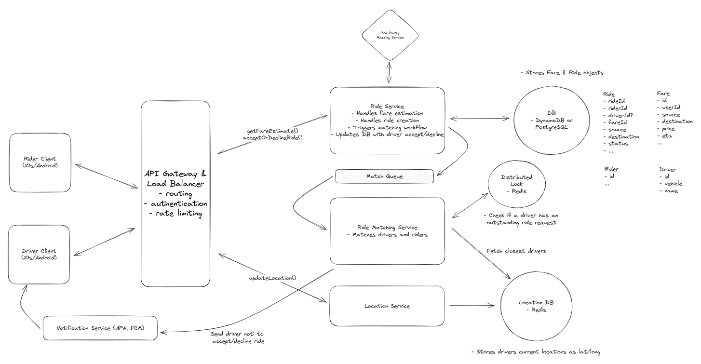
**Key decisions:**
| Decision | Chose | Over | Why |
|---|---|---|---|
| Fare estimate | Ride Service calls third-party Mapping API | Building routing in scope | Mapping complexity is abstracted outside the interview scope. |
| Location store | Redis GEO geohash sorted set | Direct DB writes or batched geospatial DB | 2M updates/s need real-time, disposable state. |
| Stale drivers | Timestamp sorted set cleanup after 30s | Durable every GPS point | Offline drivers disappear without costly permanent writes. |
| Update rate | Adaptive client location intervals | Fixed 5-second pings | Sensors reduce pings while preserving accuracy. |
| Driver lock | Redis distributed lock with 10s TTL | App locks or DB status timeout | TTL releases crashed or silent offers automatically. |
| Ride queue | Kafka/SQS queue with post-match offset commit | First-come handler without queue | Requests survive crashes and peak demand. |
| Queue partition | Geographic queue partitions | Global FIFO queue | Regional workers avoid boundary scatter and head-of-line blocking. |
| Workflow | Temporal or AWS Step Functions | Delay queue | Built-in timeouts and retries survive service restarts. |
| Notifications | APNs/FCM push Notification Service | — | Drivers need timely accept or decline prompts. |
| Scaling | Geo-sharding with read replicas | Vertical scaling | Reduces latency and scales services, queues, databases. |
**Breaks when:** offline drivers remain indexed, lock TTL differs from visible timeout, region boundaries cause scatter, or offsets commit early.
> **Say:** "Driver location is ephemeral; ride assignment is durable and must be exact."

## Local Delivery Service
**Signal:** Make browsing availability fast and approximate while order placement stays strictly consistent.
**Design:** Nearby Service prunes distribution centers, then availability aggregates cached/replica inventory for those candidates.
Order Service uses the leader PostgreSQL transaction to create order and reserve physical units at DCs.
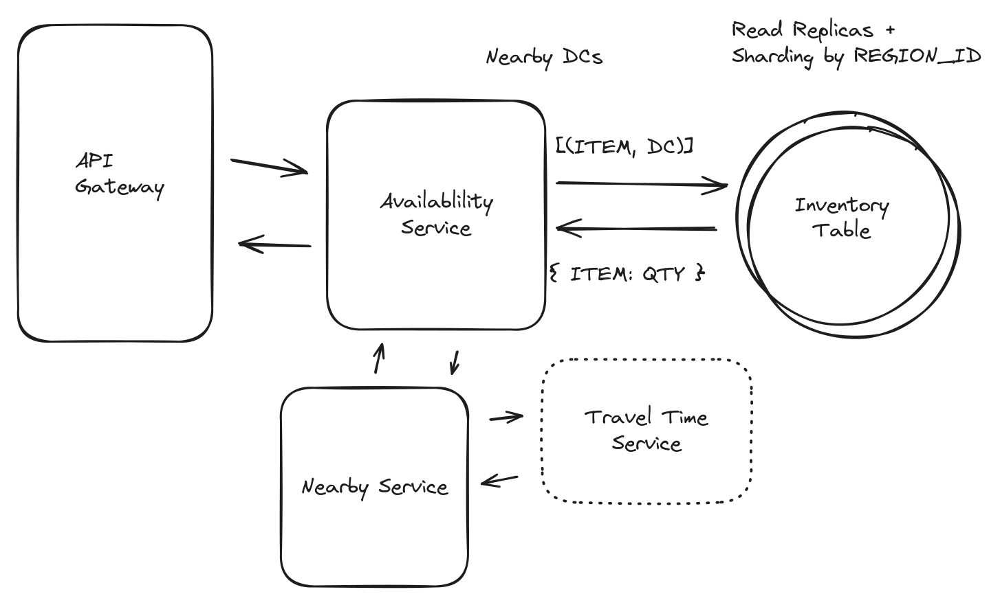
**Key decisions:**
| Decision | Chose | Over | Why |
|---|---|---|---|
| Inventory model | Physical Inventory per DC | Item-only catalog counts | Ordering must reserve actual physical products. |
| Availability path | Nearby Service then inventory union | Check all inventory | Only serviceable DCs matter for availability. |
| Catalog storage | Item and inventory in Postgres | Separate catalog search system | Search/catalog are out of scope; simplicity wins. |
| Order store | Single Postgres for orders and inventory | Two stores with distributed lock | ACID transaction avoids crash gaps and deadlocks. |
| Isolation | SERIALIZABLE leader transaction | Best-effort reservation | Competing orders make one commit fail. |
| Drive time | Radius prune then Travel Time Service | Simple SQL distance or all-DC travel calls | Road-time is accurate; pruning avoids excessive API calls. |
| Availability cache | Redis cache with 1-minute TTL | Direct DB lookup | 20k QPS availability reads need short-lived cached results. |
| Cache invalidation | Expire affected entries on order writes | TTL-only freshness | Checkout changes must not leave stale cached inventory. |
| Partitioning | Region ID from first 3 ZIP digits | Full inventory partitions | Nearby queries hit mostly one or two partitions. |
| Read consistency | Postgres read replicas for availability | Leader-only reads | Browsing tolerates staleness; checkout rechecks leader. |
**Breaks when:** leader write volume is exceeded, radius misses valid routes, stale reads cause unacceptable failures, or regions split service areas.
> **Say:** "Availability is an approximate, fast read model; ordering is the strongly consistent write path."

## Facebook Post Search
**Signal:** Build a fast searchable index without Elasticsearch while handling huge post and like writes.
**Design:** Kafka ingestion builds custom inverted indexes: keyword to capped post lists sorted by recency or likes.
Hot indexes live in Redis; cold tiers live in blob-backed storage with candidate reranking.
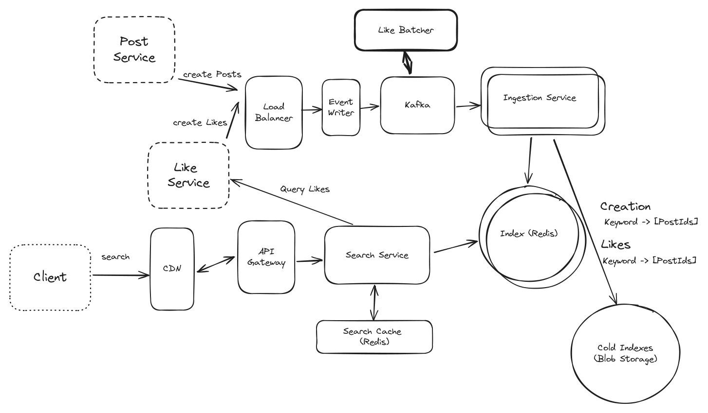
**Key decisions:**
| Decision | Chose | Over | Why |
|---|---|---|---|
| Scope | Custom search index without Elasticsearch | Search engine or pre-built full-text | Interview tests indexing fundamentals, not product engines. |
| Write intake | Single Ingestion Service initially | Split post and like ingestion | Operation is simple; note future scaling concern. |
| Inverted index | Redis keyword to postId lists | Sharded LIKE scans | Sharding only parallelizes the wrong algorithm. |
| Sort indexes | Creation lists plus Redis likes sorted sets | Request-time sorting | Pre-sorted indexes avoid huge payloads and lookups. |
| Search cache | Redis query cache with under-1-minute TTL | Recompute every duplicate query | No personalization and 1-minute freshness allow caching. |
| Edge cache | CDN cache-control on search responses | Only origin-side caching | Geographic edge hits return in tens of milliseconds. |
| Phrase queries | Bigram or shingle indexes | Intersection and filter only | Direct phrase lookup avoids massive intersections. |
| Post ingestion | Kafka fanout and keyword-sharded Redis | Single ingestion and index instance | Buffers bursts and spreads 100+ writes per post. |
| Like ranking | Milestone like updates plus fresh rerank | Per-like index writes or batching only | Writes drop exponentially while final order stays precise. |
| Cold storage | Cap lists 1k-10k; move cold indexes to S3/R2 | Keep all postings hot | Rare keywords get cheaper storage with small latency penalty. |
**Breaks when:** common keywords are uncapped, personalization/privacy enters scope, or candidate recall misses the true top N.
> **Say:** "Sharding an unindexed `LIKE` scan only parallelizes the wrong algorithm."

## Ad Click Aggregator
**Signal:** Turn raw click firehose data into accurate near-realtime advertiser metrics.
**Design:** Server-side `/click` verifies signed impressions, writes accepted events to Kafka/Kinesis, then returns `302`.
Flink aggregates by event time into OLAP minute rows, while raw archives feed batch reconciliation.
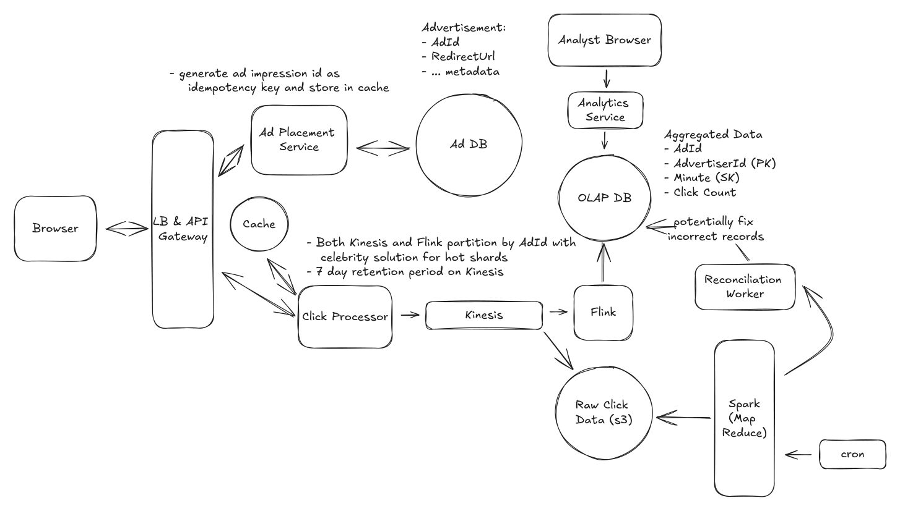
**Key decisions:**
| Decision | Chose | Over | Why |
|---|---|---|---|
| Redirect | Server-side /click returns 302 | Client-side redirect plus POST | Every redirect is tracked before leaving site. |
| Analytics path | Kafka/Kinesis plus Flink stream processing | Same DB queries or Spark batches only | Near-real-time metrics handle spikes better. |
| Processor | Flink event-time windows and watermarks | Raw Kafka consumers | Out-of-order events land in correct minute buckets. |
| Analytics store | OLAP warehouse or ClickHouse | TSDB or row database | High-cardinality multidimensional aggregations need columnar OLAP. |
| Stream key | Partition by adId | Random partitioning | Per-ad aggregation stays local and parallel. |
| Hot shards | adId:0-N suffix fanout | Plain adId partitioning | Viral ads need more than one shard. |
| Retention | Kafka/Kinesis 7-day retention plus replay | Flink checkpointing as primary recovery | Small windows replay from stream if processors fail. |
| Reconciliation | S3 data lake plus Spark batch repair | Trust speed layer only | Money metrics need slower source-of-truth correction. |
| Dedupe | HMAC-signed impression ID; stream then cache | userId+adId or cache-first | Per-impression counts; lost clicks cannot be recovered. |
| Query rollups | Daily or weekly OLAP pre-aggregates | Large-window raw minute scans | Common large windows trade storage for query speed. |
**Breaks when:** raw archive is incomplete, cache outage admits duplicates, hot suffixes cannot keep up, or aggregate schema lacks new dimensions.
> **Say:** "For money-moving metrics, I want fast delivery plus a slower reconciliation path that can correct the record."

## YouTube Top K
**Signal:** Turn a massive view-event firehose into precise top-K answers in milliseconds.
**Design:** View events arrive in Kafka by `videoId`; Flink aggregates by supported windows.
Sharded aggregate tables and cache hold precomputed top-K for hour/day/month/all-time.
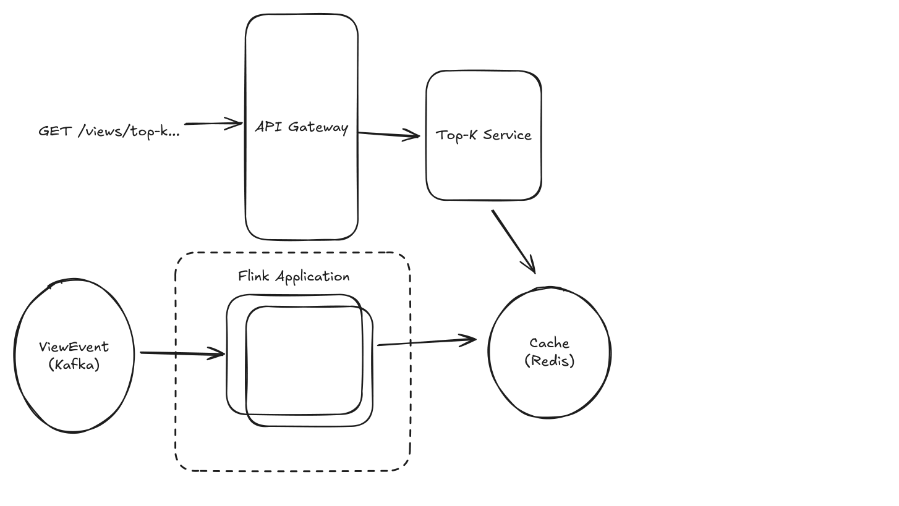
**Key decisions:**
| Decision | Chose | Over | Why |
|---|---|---|---|
| Windows | Tumbling 1h/day/month/all-time | Sliding or arbitrary ranges | Easier to precompute within 1-minute delay. |
| Precision | Exact aggregates | Count-Min Sketch approximation | Requirements demand precise top-K results. |
| Ingestion | Kafka ViewEvent partitioned by videoId | Dedicated view API | Existing stream avoids boilerplate and enables partitioning. |
| Read path | Cron-precomputed Redis cache | Database query per request or cache-on-miss | Cache hits meet tens-of-milliseconds SLA. |
| Stale fallback | Retain cache entries for hours | Empty result when cron is late | Stale top-K beats serving nothing. |
| Write scaling | VideoId-sharded consumers and DB | Single Postgres instance | 700k TPS requires spreading writes across shards. |
| DB writes | Flink batched tumbling aggregates | Per-view counter updates | Bulk per-video updates cut writes 2-100x. |
| Top-K tables | Per-window aggregate tables indexed by views | Coarse-grain cron rollups | Top-K reads directly from indexed current windows. |
| Sliding support | Increment newest minute, decrement expired minute | Flink native sliding windows | Native 1-minute slides multiply memory 43,200x. |
| Specialized DB | TimescaleDB continuous aggregates or OLAP rollups | InfluxDB or Prometheus | Billions of videoId series make top scans fail. |
**Breaks when:** precompute falls behind, hot videos skew partitions, sliding-window decrements are lost, or approximations replace required exactness.
> **Say:** "Top-K reads must be precomputed; otherwise every request asks the database to rediscover the same sorted list."

## Metrics Monitoring
**Signal:** Absorb massive metric writes while dashboards and alerts survive cardinality pressure.
**Design:** Agents batch metrics to collectors, Kafka buffers ingestion, and a TSDB stores time/series-hash partitions.
Rollups, query splitting, result cache, and alert evaluators share the pipeline with stricter paths for critical alerts.
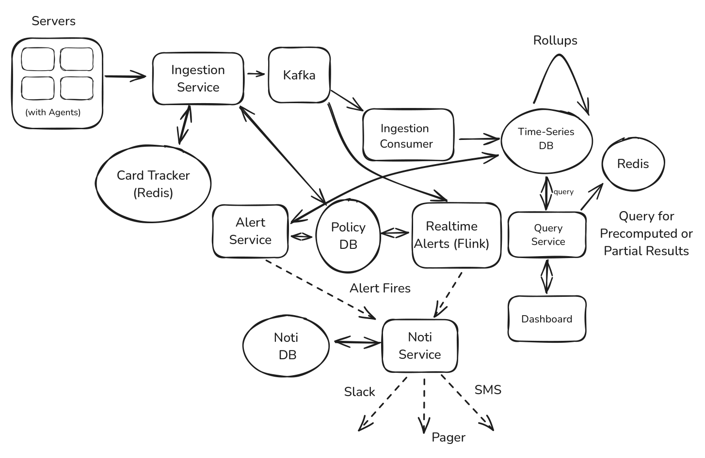
**Key decisions:**
| Decision | Chose | Over | Why |
|---|---|---|---|
| Ingest protocol | Agent-batched protobuf metrics | Servers direct JSON posts | Reduces central requests and wire overhead. |
| Buffer | Kafka partitioned by metric/series hash | Direct database writes | Absorbs spikes, persists metrics, enables parallel consumers. |
| Storage | Time-series DB partitioned by time and series hash | Postgres relational table | Append-only range queries need compression and rollups. |
| Query path | Separate PromQL-like query service | Combine with ingestion path | Expensive dashboard reads scale separately from writes. |
| Alert baseline | 1-minute polling alert evaluator | Flink/Spark for every rule | Most alerts are scheduled queries within 1-minute SLA. |
| Notifications | Alertmanager-style Notification Service | Direct Slack/PagerDuty calls | Prevents provider failures and alert storms. |
| Dashboard reads | Rollups plus Redis query splitting/cache | Raw 10-second 30-day scans | One 30-day panel otherwise reads about 25GB. |
| Critical alerts | Flink stream processing for critical alerts | Faster polling for everything | Seconds latency without querying storage for every rule. |
| HA | Local agent buffers, replicated Kafka, idempotent writes | Single-instance pipeline | Failures delay data instead of losing it. |
| Cardinality | Postgres policy store plus Redis series tracker | Arbitrary labels accepted | Caps prevent metric plus label-set series explosion. |
**Breaks when:** labels create unbounded series, Kafka retention expires before catch-up, rollups lose percentiles, or alerts overload storage.
> **Say:** "The hidden scaling unit is not metric points, it's series: metric name plus label set."

## Rate Limiter
**Signal:** Enforce useful limits at 1M req/s without adding more than about 10ms or creating an outage mode.
**Design:** API Gateway evaluates token buckets from user/IP/API-key context before app servers.
Redis Cluster shards by limit key, and Lua atomically refills/decrements with regional rule caches.
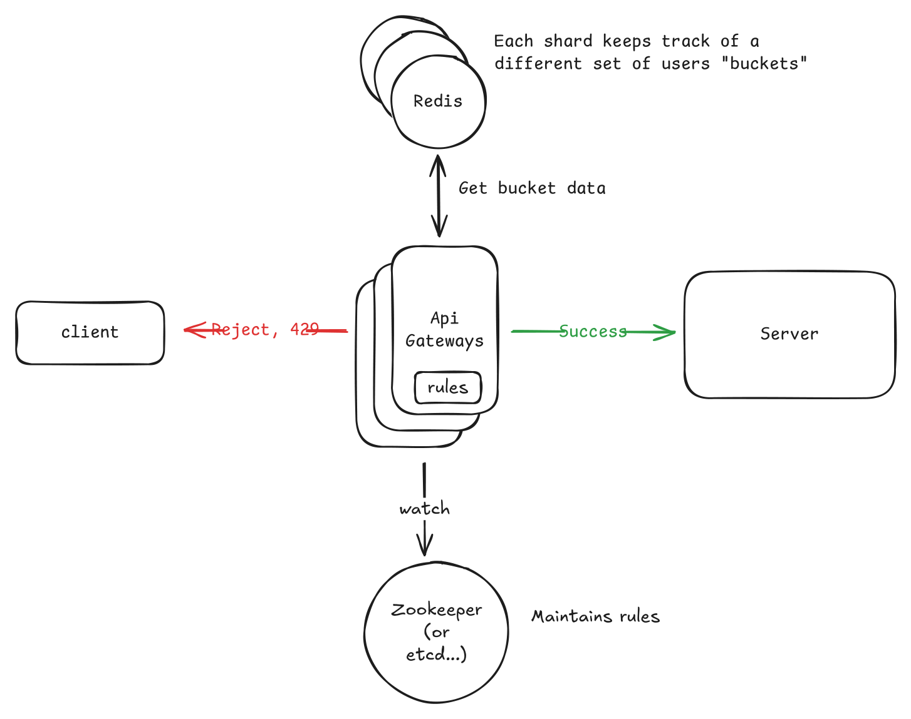
**Key decisions:**
| Decision | Chose | Over | Why |
|---|---|---|---|
| Placement | API Gateway/load-balancer limiter | In-process or dedicated service | Blocks early without extra app-server network hop. |
| Algorithm | Token bucket | Fixed window, sliding log, sliding counter | Balances simplicity, memory efficiency, and bursty API traffic. |
| State | Redis token buckets | Per-gateway memory buckets | Gateways share one source of truth for clients. |
| Atomicity | Redis Lua read-calculate-update | `HMGET` plus `MULTI/EXEC` writes | Atomic boundary includes entire bucket decision. |
| Rejection | HTTP 429 fail-fast headers | Queue excess requests | Avoids memory load, retries, and unpredictable response times. |
| Sharding | Redis Cluster hash slots | Single Redis instance | Ten shards at ~100k ops handle 1M req/s. |
| Failure | Fail-closed plus Redis replicas | Fail-open | Avoids cascade failures when spikes break Redis. |
| Latency | Connection pools and regional Redis | Per-request TCP or distant Redis | Avoids 20-50ms handshakes and cross-region latency. |
| Hot keys | Client-side limits, batching, blocklists, DDoS protection | Server-side limiter alone | Separates legitimate bursts from abuse before hot shards. |
| Rule updates | Push-based ZooKeeper config | 30-second polling | Updates security-critical limits within seconds. |
**Breaks when:** limit keys need app-only state, one client overloads a shard, Lua is too slow, or product risk favors availability.
> **Say:** "The atomic boundary is the entire token-bucket decision, not just the write."

## Distributed Cache
**Signal:** Move from O(1) single-node cache to low-latency distributed cache with sane eviction and hot-key behavior.
**Design:** Each node uses hash map + TTL metadata + LRU list; the cluster uses consistent hashing with async replication.
Hot reads replicate selected keys; decomposable hot writes use suffix sharding and batching.
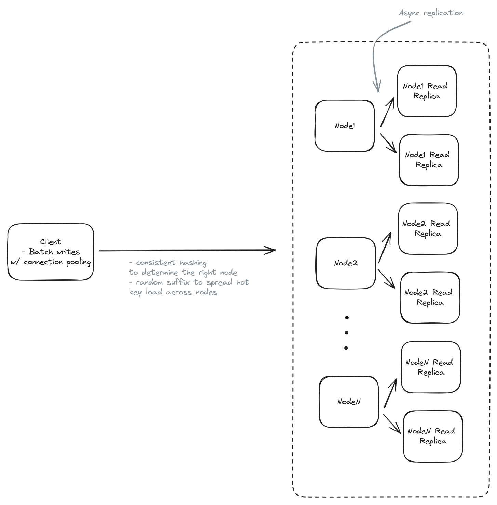
**Key decisions:**
| Decision | Chose | Over | Why |
|---|---|---|---|
| Storage | In-memory hash table | — | Provides O(1) gets, sets, deletes. |
| TTL | Expiry timestamp plus janitor | Lazy cleanup only | Removes expired entries nobody reads again. |
| Eviction | Hash map plus doubly linked LRU list | Hash table or list alone | O(1) lookup, updates, and eviction. |
| Replication | Asynchronous primary-replica replication | Synchronous replication | Prioritizes availability and write latency over strong consistency. |
| Cluster size | ~50 nodes by storage | Throughput-only eight nodes | 1TB requires more nodes than 100k req/s. |
| Sharding | Consistent hashing with MurmurHash ring | `hash(key) % N` modulo | Node changes remap only limited key ranges. |
| Hot reads | Copies of hot keys | Vertical scaling all nodes | Targets specific read hotspots without upgrading every node. |
| Hot writes | Suffix sharding | Single hot counter key | Decomposable writes spread across nodes. |
| Write batching | 50-100ms write batching | Per-write updates | Reduces hot-write pressure by an order of magnitude. |
| Performance | Client batching and connection pools | Per-request connections | Fewer round trips and lower p95/p99 latency. |
**Breaks when:** callers need strong reads from any replica, ring balance is poor, hot key is write-heavy and non-decomposable.
> **Say:** "Hot reads and hot writes are different problems; copying helps reads, suffix sharding helps decomposable writes."

## Job Scheduler
**Signal:** Combine durable scheduling with near-time execution precision and at-least-once retries.
**Design:** Job definitions create Execution rows by time bucket; schedulers move near-term work into SQS.
Container workers run idempotent tasks under visibility timeout, heartbeat, retry, and DLQ policies.
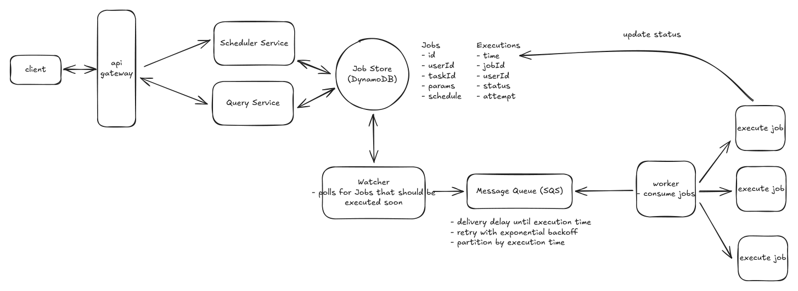
**Key decisions:**
| Decision | Chose | Over | Why |
|---|---|---|---|
| Storage | DynamoDB/Cassandra for Jobs and Executions | Postgres or MySQL | Few relationships; NoSQL scales writes easier. |
| Recurrence | Job definitions plus time-bucketed Executions | Single row with CRON | Query due work without evaluating every schedule. |
| Status | `user_id` GSI on Executions | Jobs scan plus per-job lookups | Supports user status queries and pagination. |
| Timing | 5-minute DB scan plus direct near-term SQS | 2-second DB polling or Kafka append | Reduces load while meeting 2s precision. |
| Queue | SQS delayed delivery | Redis ZSET or RabbitMQ delay queues | Native delay, visibility timeouts, DLQ, autoscaling. |
| Sharding | Random suffixes on time buckets | Single hourly partition | Avoids DynamoDB hot partition at 10k/sec. |
| Workers | ECS containers with auto-scaling | Lambda functions | Steady workload avoids cold starts and serverless cost. |
| Retries | SQS visibility timeout, heartbeat, DLQ | Health checks or DB leases | No extra monitor or 50k lease writes/sec. |
| Backoff | Exponential re-enqueue delays then DLQ | Indefinite retries | Stops poison jobs after three attempts. |
| Idempotency | Idempotent jobs with downstream keys | No controls or dedupe table | At-least-once duplicates become harmless. |
**Breaks when:** precision is treated as hard real-time, shard queries miss buckets, workers lack idempotency, or queue-depth scaling lags.
> **Say:** "A scheduler has two clocks: durable long-range state in the DB and precise near-term visibility in the queue."

## Notification System
**Signal:** Protect high-priority messages from campaign blasts while never dropping accepted work.
**Design:** API accepts to durable queues and returns `202`; workers deliver by channel/provider with stored outcomes.
Priority has separate queues, worker pools, provider token buckets, dedupe IDs, and retry/suppression states.
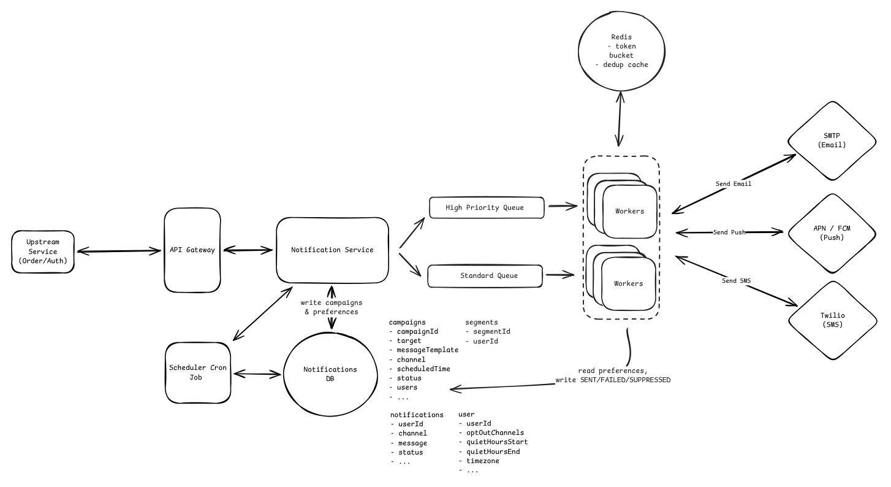
**Key decisions:**
| Decision | Chose | Over | Why |
|---|---|---|---|
| API | Separate `/notifications` and `/campaigns` | Overloaded notification endpoint | Avoids one endpoint creating two resource types. |
| Channel ownership | Provider APIs plus stored device tokens | Persistent phone sockets | APNs, Twilio, email own last-mile delivery. |
| Scheduling | Minute cron for scheduled sends | Seconds-precise cron for OTPs | Delayed sends tolerate minutes; OTPs stay immediate. |
| Campaign fan-out | Segment snapshot at fan-out | Live membership tracking | Marketing campaigns can miss mid-publish joiners. |
| Preferences | Dispatch-time checks plus SUPPRESSED rows | Silent drops | Shows why a user was not notified. |
| Acceptance | Publish first to SQS and return 202 | Synchronous retries or Postgres polling | Accepted work survives crashes without homemade queues. |
| Retry | SQS visibility, backoff, DLQ | Custom retry bookkeeping | Queue handles worker/provider failures. |
| Priority | Separate queues/workers plus Redis per-tier buckets | One queue or separate queues only | Reserves provider quota and compute for OTPs. |
| Brownout | Circuit breakers, bulkheads, provider router | Continuing 30-second provider calls | Sheds load and keeps high priority moving. |
| Dedupe | Stable IDs plus post-ack Redis sent cache | Pre-send `SET NX` locks | Pre-send locks turn worker crashes into drops. |
**Breaks when:** high-priority exceeds quota, providers brown out, outcome DB/dedupe is down, or campaign IDs are not idempotent.
> **Say:** "A priority queue without a provider budget still starves OTPs."

## Web Crawler
**Signal:** Crawl billions of pages without losing progress, hammering domains, or wasting work on duplicates.
**Design:** A multi-stage pipeline queues URL IDs, fetches HTML to blob storage, parses text/links, and updates crawl metadata.
SQS visibility timeouts, domain politeness locks, robots cache, URL dedupe, and content hashes control retries and traps.
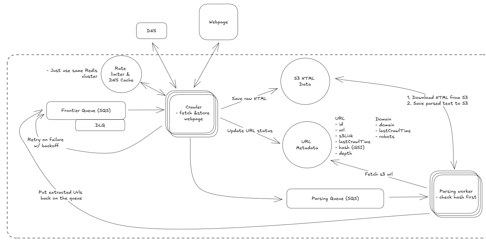
**Key decisions:**
| Decision | Chose | Over | Why |
|---|---|---|---|
| Output storage | S3 blob storage for text/HTML | HTML in queue messages | Queues are expensive for large payloads. |
| Pipeline | Fetcher and extraction stages | Monolithic crawler | Failed stages retry without losing other progress. |
| Metadata | DynamoDB URL and Domain tables | Queue-only state | Stores blob links, robots, dedupe, depth. |
| Queue | SQS visibility, backoff, DLQ | In-memory timers or Kafka manual retries | Managed retries; URLs survive crawler crashes. |
| Robots | Cached robots plus `ChangeMessageVisibility` delay | Ignoring Crawl-delay | Respects disallow rules and deferred in-flight URLs. |
| Politeness | Redis per-domain locks, sliding window, jitter | Local sleeps and synchronized retries | Enforces global 1 req/s without stampedes. |
| Scale | Eight network-optimized crawlers plus autoscaled parsers | One crawler machine | 10B pages finish in about 3.9 days. |
| DNS | Crawler DNS cache plus multiple providers | Automatic uncached single-provider DNS | DNS caused up to 70% elapsed time. |
| Dedupe | URL table plus content-hash DB index | URL-only dedupe or RedisBloom | Catches duplicate content with simpler indexing. |
| Traps | Max link-hop depth 15-20 | Unbounded link following | Prevents crawler traps from consuming crawl forever. |
**Breaks when:** visibility is too short, messages delete before persistence, canonicalization is weak, or domain diversity is low.
> **Say:** "Politeness is global per domain; with many workers, local sleep is not enough."

## Bitly
**Signal:** Guarantee short-code uniqueness while making the read-heavy redirect path fast and highly available.
**Design:** Create mappings with Redis batched counters encoded Base62 and DB `UNIQUE(shortCode)` as final guard.
Redirects use primary-key lookup, Redis/Memcached cache, edge/CDN workers for hot links, and 302 for mutable analytics/expiry.
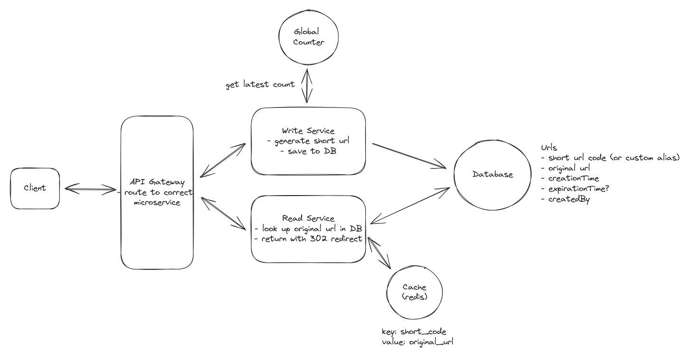
**Key decisions:**
| Decision | Chose | Over | Why |
|---|---|---|---|
| Code generation | Redis `INCR` plus DB `UNIQUE` plus Base62 | Prefixes, random IDs, SHA-256 truncation | Collision-free, compact; 1B fits six characters. |
| Encoding | Base62 | Base64 | Avoids `/` separators and `+` query-space ambiguity. |
| Counter allocation | Batched Redis counter ranges; disjoint regional ranges | Per-write or cross-region counter calls | Reduces coordination while preserving uniqueness. |
| Redirect | HTTP 302 | HTTP 301 | Keeps expiry, deletion, and analytics under server control. |
| Expiration | Cache TTL no longer than URL expiry | Indefinite cache entries | Avoids redirecting expired links from stale cache. |
| Lookup | Short code primary key/index | Full table scan | Finds mappings without scanning billions. |
| Cache | Redis/Memcached read cache | Direct DB every click | Handles ~600k read/sec peak redirects. |
| Edge | CDN plus Workers/Lambda@Edge | Origin-only redirects | Popular links never reach Primary Server. |
| Storage | Single Postgres with replication/backups | Immediate sharding | 500GB and ~1 write/sec fit modern SSDs. |
| Services | Separate Read and Write services | One primary server | Read-heavy workload scales independently. |
**Breaks when:** counter ranges overlap, cache TTL ignores expiration, edge invalidation is strict, or 301 leaks to browsers.
> **Say:** "This is not storage-hard at 500GB; it is redirect-read-hard at peak traffic."

## Price Tracker
**Signal:** Turn anti-scraping constraints into prioritized, validated price collection.
**Design:** Browser extension reports Amazon observations; crawlers selectively verify suspicious or uncovered products.
Price changes append to TimescaleDB/history and publish events to subscription notification workers.
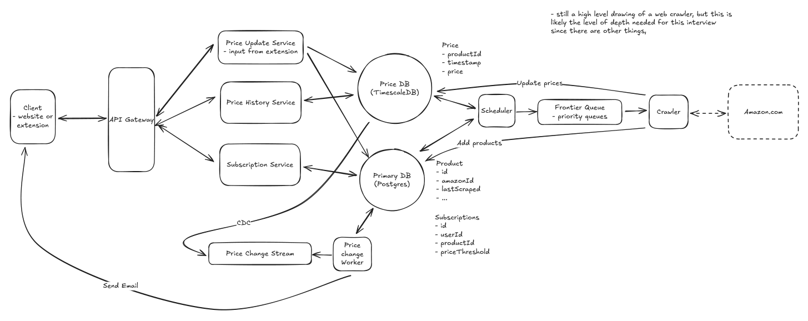
**Key decisions:**
| Decision | Chose | Over | Why |
|---|---|---|---|
| Services | Separate Price History, Crawler, Subscription services | One combined service | Read charts and crawling scale differently. |
| Storage | Primary DB plus TimescaleDB price history | One generic database table | Price history grows append-only to billions. |
| Collection | Chrome extension plus selective crawlers | Naive 500M-product crawl | Avoids 15-year single-crawler catalog pass. |
| Prioritization | User-interest crawl priority queues | Equal refresh for all products | Subscribed and searched products matter most. |
| Discovery | Extension-submitted unknown products | Crawler-only discovery | New products appear when users browse them. |
| Validation | Trust-but-verify priority crawls | Consensus-only validation | Immediate alerts with fast correction for suspicious reports. |
| Notifications | Kafka price-change events | Two-hour cron scans | Processes actual changes within one hour. |
| Charts | TimescaleDB `time_bucket` aggregations | Scheduled pre-aggregation or ClickHouse | Real-time charts with PostgreSQL operational simplicity. |
**Breaks when:** extension coverage is sparse, parser breaks, crawler verification is rate-limited, or DB/outbox diverges from events.
> **Say:** "The extension is not just a UI feature; it is the scalable data-collection plane."

## LeetCode
**Signal:** Run untrusted code safely with fast feedback without overengineering a modest product.
**Design:** API stores problems/submissions and queues judge work to warm per-language container pools.
Workers enforce sandbox limits, report results asynchronously, and Redis ZSETs serve contest leaderboards with polling.
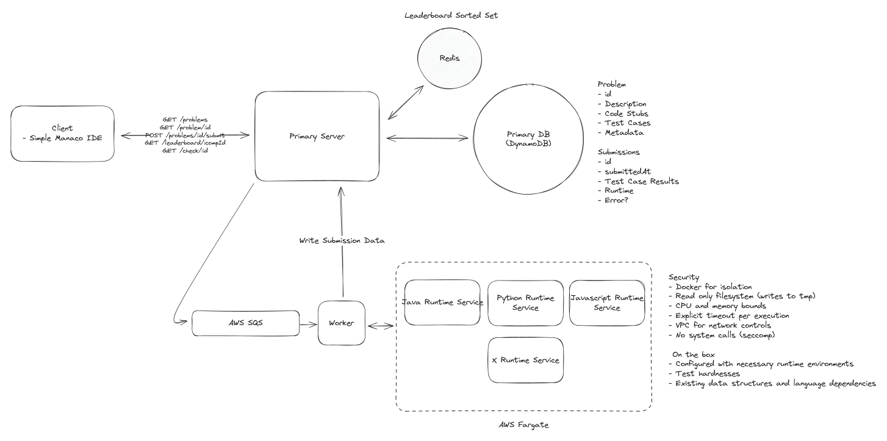
**Key decisions:**
| Decision | Chose | Over | Why |
|---|---|---|---|
| Architecture | Simple client-server monolith | Microservices architecture | Small product avoids service-management overhead. |
| Storage | DynamoDB Problem documents with test cases | SQL relational model | No complex queries; nest test cases. |
| API trust | Session/JWT userId, server timestamps | Client-supplied userId or timestamps | Client data is easy to manipulate. |
| Execution | Warm per-language Docker containers | API-process run, VM per submission, Lambda | Low latency with isolation and no cold starts. |
| Sandbox | Read-only FS, caps, timeout, no network, seccomp | Container boundary alone | Defense in depth for arbitrary code. |
| Queue | SQS submission queue | Direct container calls only | Buffers spikes and enables retries. |
| Scaling | ECS horizontal autoscaling per language | Vertical scaling | 1,667-core burst cannot fit one box. |
| Results | `GET /check/:id` 1s polling | WebSockets | LeetCode-scale feedback doesn't need persistent connections. |
| Leaderboard | Redis sorted set plus 5s polling | DB queries or 30s cache refresh | Fast enough without WebSocket complexity. |
| Test harness | Shared JSON cases with language harnesses | Per-language test cases | One suite runs across every language. |
**Breaks when:** sandbox policy misses language needs, pools are cold, queue latency exceeds UX, or Redis leaderboard cannot rebuild from submissions.
> **Say:** "The hard part is safely running untrusted code, not inventing a huge microservice mesh."

---

## Real-world case studies
| Company | Problem | What they did | Maps to |
|---|---|---|---|
| Shopify | Redis holds and MySQL inventory could not commit together | MySQL `reservation_units` rows plus `SELECT ... FOR UPDATE SKIP LOCKED` | Ticketmaster, Flash Sale, contention |
| Discord | Hot Cassandra message partitions and ops pain | ScyllaDB plus Rust services, consistent hashing, request coalescing | WhatsApp/chat storage, hot partitions |
| Slack | Redis job queue filled RAM and could not drain | Kafka disk backlog in front of Redis dispatch state | Job Scheduler, Notification System, burst queues |
| Figma | Live/offline browser design docs needed convergence | Central document process plus simplified CRDT and per-property LWW | Google Docs, collaborative editing |
| Spotify | Data lake scans were cheap but point queries were slow | Random Access Parquet index plus key-aware file layout | Search/read models, secondary indexes |

**Shopify SKIP LOCKED**
- The invariant was reserve-and-claim with the merchant ledger, so Redis could not be the source of truth.
- One counter row serialized every buyer; one row per reservable unit let concurrent buyers lock different rows.
- `SKIP LOCKED` plus a bounded pool made an old rejected MySQL design practical.

**Figma multiplayer**
- Figma avoided full OT by making one process own an open document and order edits centrally.
- Object properties were the merge unit, so independent edits like color and size could both survive.
- Last-writer-wins was acceptable because visual conflicts were visible and re-editable; text editors need stronger logic.
