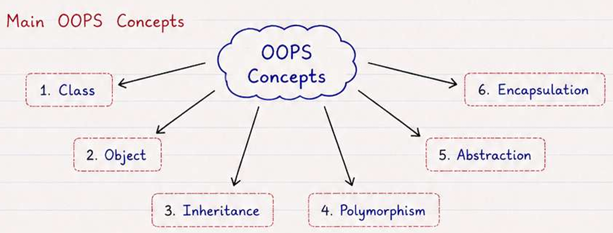
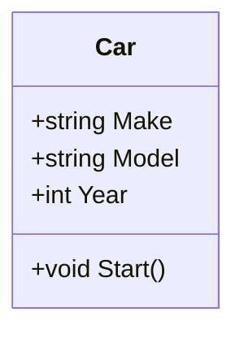
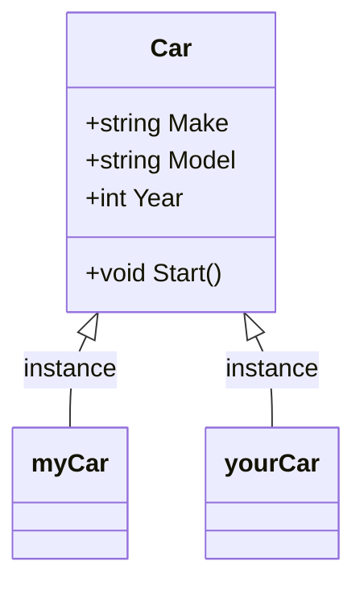
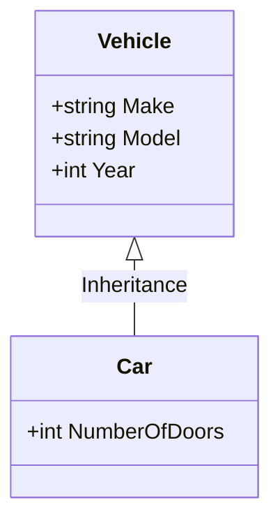

# Object Oriented Programming (OOPs)

Object-oriented programming (OOP) is a style of programming (paradigm) that focuses on using objects to design and build modular, reusable and scalable applications.

- Objects contain data in the form of fields _(attributes or properties)_ and functionality in the form of procedures _(methods)_.

> Think Classes > Create Objects > Build Applications

**Benefits of OOPs:**

- Makes programming easier to understand, modify and maintain.
- Helps model real-world entities and relationships.
- Supports code reusability through inheritance and polymorphism.
- Supports security through encapsulation and abstraction.



## Class

Class is a blueprint or template for creating objects. It defines the **attributes** and **methods** that the objects created from the class will have.

- Class is a user-defined data type that represents a real-world entity.
- Class do not occupy memory space, but objects created from the class do.
- Helps in achieving reusability and modularity in programming.

```cs
class Car {
    // Attributes (Fields)
    public string Make { get; set; } = string.Empty;
    public string Model { get; } = string.Empty;
    public int Year;

    // Method
    public void Start() {
        Console.WriteLine("Car is starting...");
    }
}
```



## Object

Object is an instance of a class. It is a real-world entity that has state (attributes) and behavior (methods).

- Objects are created from classes using the `new` keyword.
- Many objects can be created from a single class, each with its own unique state and behavior.
- Objects can interact with each other by calling methods and accessing attributes.
- Objects are created at runtime and occupy memory space.

```cs
<ClassName> <ObjectName> = new <ClassName>();

Car myCar = new Car();

var user = new User
{
    Name = "Abhishek",
    Age = 30
};
```



## Class Members

### Constructors

Constructor is a special method that is called when an object is created. It is used to initialize the attributes of the object.

- Same name as the class and does not have a return type.
- Automatically called when an object is created.
- Can be overloaded to provide different ways of initializing an object.
- Default constructor is provided by the compiler if no constructor is defined in the class.
- Runs only once when the object is created.

> new keyword used > Constructors are called > Object is created > Data is initialized

#### Types of Constructors

- Default Constructor
- Parameterized Constructor
- Copy Constructor

```cs
class Car {
    public string Make;
    public string Model;
    public int Year;
    // Default Constructor
    public Car() {
        Make = "Unknown";
        Model = "Unknown";
        Year = 0;
    }
    // Parameterized Constructor
    public Car(string make, string model, int year) {
        Make = make;
        Model = model;
        Year = year;
    }
    // Copy Constructor
    public Car(Car car) {
        Make = car.Make;
        Model = car.Model;
        Year = car.Year;
    }
}
```

### Methods

Method is a function defined inside a class that describes the behavior of an object. It can perform operations on the object's attributes and can be called to execute specific tasks.

- Methods can have parameters and return values.
- Methods are defined inside a class and can be called using the object of the class.
- Methods can access and modify the attributes of the object they belong to.
- Methods improve code reusability and modularity

```cs
class Car {
    // Method
    public void Start() {
        Console.WriteLine("Car is starting...");
    }
    // Method with parameters and return value
    public int CalculateAge(int currentYear) {
        return currentYear - Year;
    }
}
```

### Static Members

Static members belong to the type rather than an individual object and are shared by all instances. A static method cannot access instance members unless it has an object reference.

### Readonly Fields

```cs
private readonly IPaymentProcessor payment;
public Service(IPaymentProcessor payment)
{   // Can only be assigned in constructor
    this.payment = payment;
}
```

### Access Modifiers

Modifiers are keywords used to define the accessibility of classes, methods, and attributes.

| Access Modifier | Same Class | Derived Class, Same Assembly | Other Code, Same Assembly | Derived Class, Other Assembly | Other Code, Other Assembly |
| --------------- | ---------- | ---------------------------- | ------------------------- | ----------------------------- | -------------------------- |
| Public          | ✅         | ✅                           | ✅                        | ✅                            | ✅                         |
| Private         | ✅         | ❌                           | ❌                        | ❌                            | ❌                         |
| Protected       | ✅         | ✅                           | ❌                        | ✅                            | ❌                         |
| Internal        | ✅         | ✅                           | ✅                        | ❌                            | ❌                         |

## Four Pillars of OOP

| Pillar of OOPs | Key Point                                                 | Achieved through                      | Benefits                                    |
| -------------- | --------------------------------------------------------- | ------------------------------------- | ------------------------------------------- |
| Inheritance    | IS-A relationship                                         | Base and Derived Classes              | Code reusability, hierarchical relationship |
| Polymorphism   | Same method name, different behavior                      | Method Overloading and Overriding     | Code reusability, flexibility               |
| Encapsulation  | Bundling data and methods, restricting access             | Access Modifiers, Getters and Setters | Data hiding, security, maintainability      |
| Abstraction    | Hiding implementation details, showing essential features | Abstract Classes and Interfaces       | Reduces complexity, increases efficiency    |

### Inheritance

Inheritance is a mechanism that allows a class to inherit properties and methods from another class.

- **IS-A** relationship between classes.
- The class that inherits is called the **derived class** or **child class**
- The class being inherited from is called the **base class** or **parent class**.
- Subclasses can override methods of the base class to provide specific implementations.
- Subclasses can also add new attributes and methods that are not present in the base class.
- Inheritance promotes code reusability and establishes a hierarchical relationship between classes.
- Better organization of code and easier maintenance, extension, and modification of existing code.
- Private members of the base class are not accessible to the derived class, but protected members are.
- Constructors of the base class are called before the constructors of the derived class and are not inherited by the derived class.

Example: A `Car` **is a** type of `Vehicle`, so `Car` can inherit from `Vehicle`.

```cs
class Vehicle {
    public string Make;
    public string Model;
    public int Year;
}

class Car : Vehicle {
    public int NumberOfDoors;
}
```



**Tradoffs**

- Causes tight coupling. Changes in base class can break child
- Instead use Composition + Interface
- Inheritance can be used when we have STABLE and SHARED IMPLEMENTATION shared by multiple sub classes

### Polymorphism

Polymorphism is the ability of an object to take on many forms. It allows methods to have the same name but behave differently based on the object that is calling them.

- Prevents if-else or Switch statements
- Provides flexibility and extensibility but becomes harder to debug or follow code flow

- **Compile-time Polymorphism (Method Overloading)**: The method to be executed is determined at compile time based on the method signature (name and parameters).
  - Allows a class to have multiple methods with the same name but different parameters.

    ```cs
    class Calculator {
        // Method Overloading
        public int Add(int a, int b) {
            return a + b;
        }
        public double Add(double a, double b) {
            return a + b;
        }
    }
    ```

- **Run-time Polymorphism (Method Overriding)**: The method to be executed is determined at runtime based on the actual object type.
  - Allows a derived class to provide a specific implementation of a method that is already defined in its base class.
  - The base class method must be marked as `virtual`, and the derived class method must be marked as `override`.
  - Same method name and parameters, but different implementation in the derived class.

    ```cs
    class Animal {
        public virtual void Speak() {
            Console.WriteLine("Animal speaks");
        }
    }
    class Dog : Animal {
        public override void Speak() {
            Console.WriteLine("Dog barks");
            // Access Base
            base.Speak();
        }
    }
    ```

| Overloading                            | Overriding                        |
| -------------------------------------- | --------------------------------- |
| Compile-time polymorphism              | Run-time polymorphism             |
| Increases code readability             | Increases code reusability        |
| Same method name, different parameters | Same method name, same parameters |
| Can be achieved within the same class  | Achieved through inheritance      |
| Static binding (early binding)         | Dynamic binding (late binding)    |

### Encapsulation

Encapsulation is the process of bundling data (attributes) and methods (functions) that operate on the data into a single unit called a class. It restricts direct access to some of the object's components, which can prevent the accidental modification of data.

- Helps in achieving data hiding, validation and security.
- Class attributes are made **private** and can be accessed or modified through public methods (**getters and setters**).
- Improves code maintainability and flexibility

```cs
class BankAccount {
    private double balance;
    public double GetBalance() {
        return balance;
    }
    public void Deposit(double amount) {
        if (amount > 0) {
            balance += amount;
        }
    }
    public void Withdraw(double amount) {
        if (amount > 0 && amount <= balance) {
            balance -= amount;
        }
    }
}
```

> For getter on list, return a copy or immutable data

### Abstraction

Abstraction is the process of hiding the implementation details and showing only the essential features of an object. It allows the user to focus on what an object does instead of how it does it.

- Helps in reducing complexity and increasing efficiency.
- Can be achieved through abstract classes and interfaces.

#### Abstract Class

An abstract class is a class that cannot be instantiated and is meant to be inherited by other classes.
It can contain abstract methods (without implementation) and concrete methods (with implementation).

```cs
abstract class Shape {
    public abstract double Area();
    public void Display() {
        Console.WriteLine("This is a shape");
    }
}
class Circle : Shape {
    private double radius;
    public Circle(double radius) {
        this.radius = radius;
    }
    public override double Area() {
        return Math.PI * radius * radius;
    }
}
```

#### Interface

Interface is a contract that defines a set of methods and properties that a class must implement.

- It provides a way to achieve abstraction and multiple inheritance in C#.

```cs
interface IVehicle {
    void Start();
    void Stop();
}
class Car : IVehicle {
    public void Start() {
        Console.WriteLine("Car is starting...");
    }
    public void Stop() {
        Console.WriteLine("Car is stopping...");
    }
}
```

```cs
// Class can implement multiple interfaces
class Payment : IPaymentProcessor, IRefundProcessor {}
```

| Aspect                 | Abstract Class                  | Interface                                       |
| ---------------------- | ------------------------------- | ----------------------------------------------- |
| Methods                | Abstract and concrete methods   | Method declarations and default implementations |
| Fields and properties  | Instance fields and properties  | Properties; no instance fields                  |
| Constructors           | Instance constructors           | No instance constructors                        |
| Access modifiers       | Different access modifiers      | Abstract members are public by default          |
| Inheritance            | One abstract base class         | Multiple interfaces                             |
| Default implementation | Concrete method implementations | Default method implementations                  |
| Static members         | Supported                       | Supported                                       |

```
virtual   → can override
override  → overrides parent implementation
abstract  → MUST override
sealed class    → cannot be inherited
sealed override → cannot be overridden further
```

---

## Composition

Composition is a design principle in object-oriented programming where a class is composed of one or more objects from other classes.
It represents a "has-a" relationship between classes, allowing for greater flexibility and reusability of code.

```cs
class Engine {
    public void Start() {
        Console.WriteLine("Engine is starting...");
    }
}
class Car {
    private Engine engine;
    public Car() {
        engine = new Engine();
    }
    public void Start() {
        engine.Start();
        Console.WriteLine("Car is starting...");
    }
}
// Car HAS-A Engine, Inheritance avoided
```

| Aspect                  | Inheritance            | Composition        |
| ----------------------- | ---------------------- | ------------------ |
| Relationship            | IS-A                   | HAS-A              |
| Coupling                | Higher                 | Lower              |
| Flexibility             | Lower                  | Higher             |
| Runtime behavior change | Difficult              | Easy               |
| Reuse                   | Through hierarchy      | Through delegation |
| Parent changes          | Can affect children    | Usually isolated   |
| Multiple behaviors      | Can become complicated | Easy to combine    |
| Best for                | Stable type hierarchy  | Varying behavior   |
| Example                 | `Dog : Animal`         | `Car` has `Engine` |

### Prefer Composition over Inheritance

Composition provides loose coupling and allows behavior to be changed or combined independently, whereas inheritance creates a tighter compile-time relationship and can make changes to the base class affect the entire hierarchy. We prefer inheritance when there is a true IS-A relationship and the Liskov Substitution Principle holds; otherwise, we prefer composition, often with interfaces and dependency injection.

> Instead of inheriting from a class, we can create an interface and implement it in multiple classes. Then we can use dependency injection to inject the desired implementation into the class that needs it.

**Benefits of Composition over Inheritance:**

- Loose coupling
- Dependency injection
- Polymorphism
- Easy testing
- Easy extension
- Adherence to Open/Closed Principle

```
              Do I need reuse?
                   |
                 Yes
                   |
        Is there a true IS-A?
              /          \
            Yes           No
             |             |
      Inheritance      Composition
             |
    Is behavior variable?
       /           \
     Yes            No
      |              |
Interface +      Inheritance
Composition
```

#### Example of Composition with Interface and Dependency Injection

```cs
interface INotificationSender {
    void Send(string message);
}
class EmailSender : INotificationSender {
    public void Send(string message) { }
}
class SmsSender : INotificationSender {
    public void Send(string message) { }
}
class NotificationService {
    private readonly INotificationSender sender;
    public NotificationService(INotificationSender sender) {
        this.sender = sender;
    }
    public void Notify(string message) {
        sender.Send(message);
    }
}
// Usage
var emailService = new NotificationService(new EmailSender());
var smsService = new NotificationService(new SmsSender());
```

> Default to Composition + Interface

---

## Additional C# Concepts

### Enum

Predefined set of named values.

```cs
public enum OrderStatus
{
    Created,
    Confirmed,
    Shipped,
    Delivered,
    Cancelled
}
```

### Nullability

```cs
int? age = null;
name ??= "Unknown";
string result = name ?? "Unknown";
user?.Address?.City
```

### Records and Object Equality

Records represent immutable, value-like objects and support value equality by default.

```cs
public record Money(decimal Amount, string Currency);
Console.WriteLine(m1 == m2); // Compares values
```

Classes can define value equality by overriding `Equals` and `GetHashCode`.

```cs
public override bool Equals(object? obj)
{
    if (obj is not User other)
        return false;

    return Id == other.Id;
}

public override int GetHashCode()
{
    return Id.GetHashCode();
}
```

### Generics

```cs
public interface IRepository<T>
{
    void Add(T item);
    T? GetById(int id);
}
public class Repository<T>
{
    private readonly List<T> items = new();

    public void Add(T item)
    {
        items.Add(item);
    }

    public List<T> GetAll()
    {
        return items;
    }
}
// Usage
var repo = new Repository<User>();
```

### Async and Await

```cs
public async Task<User> GetUserAsync()
{
    var user = await repository.GetUserAsync();

    return user;
}
User user = await GetUserAsync();
```

### Exception Handling

```cs
try
{
    ProcessPayment();
}
catch (PaymentException ex)
{
    Console.WriteLine(ex.Message);
}
finally
{
    Cleanup();
}
```

## Concurrency

### Atomics

Thread safe operation on single variable without locks

```cs
using System.Threading;

int counter = 0;
Interlocked.Increment(ref counter);  // Thread-safe increment
```

### Locks (Mutexes)

Provides mutual exclusion. Only one thread can execute until lock is held

```cs
private readonly object _lock = new object();

lock (_lock)
{
    // Only one thread can be here at a time
    balance += amount;
}
```

### Semaphores

Counting locks, N permits.

```cs
using System.Threading;

var permits = new SemaphoreSlim(5);  // Allow 5 concurrent operations
await permits.WaitAsync();  // Block if no permits available
try
{
    DoWork();
}
finally
{
    permits.Release();  // Always release, even on exception
}
```

### Condition Variables

Thread wait efficiently for a condition to become true, release lock and sleeps otherwise.

```cs
using System.Threading;

private readonly object _lock = new object();

lock (_lock)
{
    while (!condition)
    {
        Monitor.Wait(_lock);  // Release lock and sleep
    }
    // Condition is now true
}
```

### Blocking Queues

Thread safe producer consumer handoff.

```cs
using System.Collections.Concurrent;

var queue = new BlockingCollection<Task>(boundedCapacity: 100);
queue.Add(task);     // Blocks if queue is full
var t = queue.Take();  // Blocks if queue is empty
```
