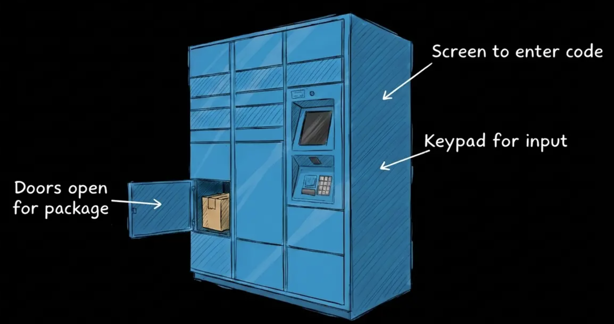
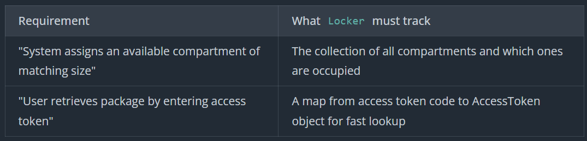
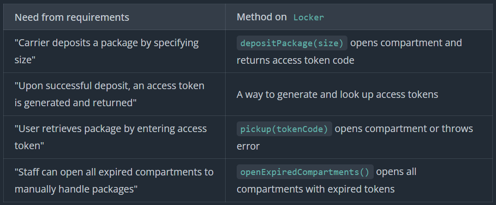
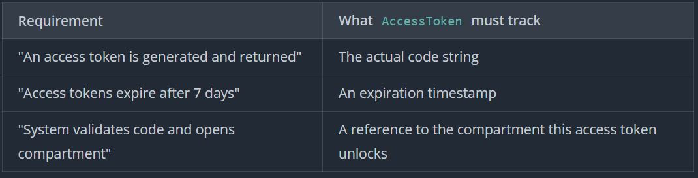
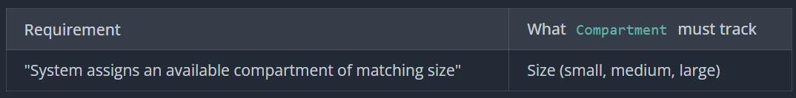

# Amazon Locker
Amazon Locker is a self-service package pickup system. A delivery driver deposits a package into an available compartment, the system generates an access token, and the customer uses that code to retrieve their package.



## Prompt
"Design a locker system like Amazon Locker where delivery drivers can deposit packages and customers can pick them up using a code."
## Requirement
> Ask Clarifying Questions Like

REQUIREMETS
- How does a Amazon Locker works
- Can one customer have many access codes

SCOPE
- Whats the scope of the system
- Are there different size compartments

ERROR CASES
- What happens if they are full
- Does the access code expires
- What happens after the code expires
- What if user enter invalid code multiple times

### Final Requirements
```
Requirements:
1. Carrier deposits a package by specifying size (small, medium, large)
   - System assigns an available compartment of matching size
   - Opens compartment and returns access token, or error if no space
2. Upon successful deposit, an access token is generated and returned
   - One access token per package
3. User retrieves package by entering access token
   - System validates code and opens compartment
   - Throws specific error if code is invalid or expired
4. Access tokens expire after 7 days
   - Expired codes are rejected if used for pickup
   - Package remains in compartment until staff removes it
5. Staff can open all expired compartments to manually handle packages
   - System opens all compartments with expired tokens
   - Staff physically removes packages and returns them to sender
6. Invalid access tokens are rejected with clear error messages
   - Wrong code, already used, or expired - user gets specific feedback

Out of scope:
- How the package gets to the locker (delivery logistics)
- How the access token reaches the customer (SMS/email notification)
- Lockout after failed access token attempts
- UI/rendering layer
- Multiple locker stations
- Payment or pricing
```

## Core Entities
Package: We only need package size, so class not needed
```
Locker : The Orchestrator
Compartment : Has id, size, tracks state
AccessToken : Has expiry, code
```
## Class Design




```csharp
class Locker:
    - compartments: Compartment[]
    - accessTokenMapping: Map<string, AccessToken>

    + Locker(compartments)
    + depositPackage(size) -> string | error
    + pickup(tokenCode) -> void | error
    + openExpiredCompartments() -> void

class AccessToken:
    - code: string
    - expiration: timestamp
    - compartment: Compartment

    + AccessToken(code, expiration, compartment)
    + isExpired() -> boolean
    + getCompartment() -> Compartment
    + getCode() -> string

class Compartment:
    - size: Size
    - occupied: boolean

    + Compartment(size)
    + getSize() -> Size
    + isOccupied() -> boolean
    + markOccupied() -> void
    + markFree() -> void
    + open() -> void

enum Size:
    SMALL
    MEDIUM
    LARGE
```
## Implementation
### PSEUDO CODE

LOCKER
```
depositPackage(size)
    compartment = getAvailableCompartment(size)
    if compartment == null
        throw Error("No available compartment of size " + size)

    compartment.open()
    compartment.markOccupied()
    accessToken = generateAccessToken(compartment)
    accessTokenMapping[accessToken.getCode()] = accessToken

    return accessToken.getCode()

pickup(tokenCode)
    if tokenCode == null || tokenCode.isEmpty()
        throw Error("Invalid access token code")

    accessToken = accessTokenMapping[tokenCode]
    if accessToken == null
        throw Error("Invalid access token code")

    if accessToken.isExpired()
        throw Error("Access token has expired")

    // Valid pickup - unlock door and clean up
    compartment = accessToken.getCompartment()
    compartment.open()
    clearDeposit(accessToken)

generateAccessToken(compartment)
    code = generateRandomCode()  // 6-digit number, UUID, whatever
    expiration = now() + 7.days()
    return AccessToken(code, expiration, compartment)

clearDeposit(accessToken)
    compartment = accessToken.getCompartment()
    compartment.markFree()
    accessTokenMapping.remove(accessToken.getCode())

openExpiredCompartments()
    for tokenCode, accessToken in accessTokenMapping
        if accessToken.isExpired()
            compartment = accessToken.getCompartment()
            compartment.open()
```
AccessToken
```
isExpired()
    return now() >= expiration

getCompartment()
    return compartment

getCode()
    return code
```
Compartment
```
getSize()
    return size

isOccupied()
    return occupied

markOccupied()
    occupied = true

markFree()
    occupied = false
```
### Verification
Deposit a medium package:
```
Initial: compartments=[A, B, C], accessTokenMapping={}

getAvailableCompartment(MEDIUM) → Compartment B (size matches, not occupied)
B.open() → triggers hardware unlock
B.markOccupied() → B.occupied = true
generateAccessToken(B) → AccessToken("ABC123", expiration=now+7days, compartment=B)
accessTokenMapping.put("ABC123", accessToken) → map now has entry

Result: "ABC123"
State: B.occupied=true, accessTokenMapping={"ABC123" → AccessToken}
```
Successful pickup:
```
accessTokenMapping.get("ABC123") → AccessToken exists
accessToken.isExpired() → now < expiration, returns false
accessToken.getCompartment() → returns B
B.open() → triggers hardware unlock
clearDeposit(accessToken):
  - accessToken.getCompartment() → returns B
  - B.markFree() → B.occupied = false
  - accessTokenMapping.remove("ABC123")

Result: void (compartment opened)
State: B.occupied=false, accessTokenMapping={}
```
Expired pickup attempt (8 days later):
```
accessTokenMapping.get("ABC123") → AccessToken still exists
accessToken.isExpired() → now > expiration, returns true
throw Error("Access token has expired")

Result: Error thrown (no compartment opened)
State: B.occupied=true, accessTokenMapping={"ABC123" → AccessToken (expired)}
```
### Actual Code
#### Locker

```cs
using System;
using System.Collections.Generic;

public class Locker
{
    private readonly Compartment[] _compartments;
    private readonly Dictionary<string, AccessToken> _accessTokenMapping;
    private readonly Random _random;

    public Locker(Compartment[] compartments)
    {
        _compartments = compartments;
        _accessTokenMapping = new Dictionary<string, AccessToken>();
        _random = new Random();
    }

    // Core logic:
    // Find an available compartment of the requested size
    // Generate an access token for that compartment
    // Mark the compartment as occupied
    // Store the access token in the lookup map
    //
    // Edge cases:
    // No compartment available of the requested size
    // Invalid size parameter
    public string DepositPackage(Size size)
    {
        var compartment = GetAvailableCompartment(size);
        if (compartment == null)
        {
            throw new InvalidOperationException($"No available compartment of size {size}");
        }

        compartment.Open();
        compartment.MarkOccupied();
        var accessToken = GenerateAccessToken(compartment);
        _accessTokenMapping[accessToken.Code] = accessToken;

        return accessToken.Code;
    }

    // Core logic:
    // Look up the access token by code
    // Validate the token (check expiry)
    // If valid, open the compartment and clean up
    // If invalid (expired or doesn't exist), throw a specific error
    // 
    // Edge cases:
    // Access token doesn't exist in the map
    // Access token exists but is expired
    // Access token code is null or empty
    public void Pickup(string tokenCode)
    {
        if (string.IsNullOrWhiteSpace(tokenCode))
        {
            throw new InvalidOperationException("Invalid access token code");
        }

        if (!_accessTokenMapping.TryGetValue(tokenCode, out var accessToken))
        {
            throw new InvalidOperationException("Invalid access token code");
        }

        if (accessToken.IsExpired())
        {
            throw new InvalidOperationException("Access token has expired");
        }

        var compartment = accessToken.GetCompartment();
        compartment.Open();
        ClearDeposit(accessToken);
    }

    public void OpenExpiredCompartments()
    {
        foreach (var accessToken in _accessTokenMapping.Values)
        {
            if (accessToken.IsExpired())
            {
                var compartment = accessToken.GetCompartment();
                compartment.Open();
            }
        }
    }

    private Compartment? GetAvailableCompartment(Size size)
    {
        foreach (var c in _compartments)
        {
            if (c.Size == size && !c.IsOccupied())
            {
                return c;
            }
        }
        return null;
    }

    private AccessToken GenerateAccessToken(Compartment compartment)
    {
        var code = _random.Next(0, 1_000_000).ToString("D6");
        var expiration = DateTime.UtcNow.AddDays(7);
        return new AccessToken(code, expiration, compartment);
    }

    private void ClearDeposit(AccessToken accessToken)
    {
        var compartment = accessToken.GetCompartment();
        compartment.MarkFree();
        _accessTokenMapping.Remove(accessToken.Code);
    }
}
```
#### Access Token
```cs
using System;

public class AccessToken
{
    public string Code { get; }
    public DateTime Expiration { get; }
    public Compartment Compartment { get; }

    public AccessToken(string code, DateTime expiration, Compartment compartment)
    {
        Code = code;
        Expiration = expiration;
        Compartment = compartment;
    }

    public bool IsExpired()
    {
        return DateTime.UtcNow >= Expiration;
    }

    public Compartment GetCompartment()
    {
        return Compartment;
    }
}
```
#### Compartment
```cs
public class Compartment
{
    public Size Size { get; }
    private bool _occupied;

    public Compartment(Size size)
    {
        Size = size;
        _occupied = false;
    }

    public bool IsOccupied()
    {
        return _occupied;
    }

    public void MarkOccupied()
    {
        _occupied = true;
    }

    public void MarkFree()
    {
        _occupied = false;
    }

    public void Open()
    {
    }
}
```
#### Size
```cs
public enum Size
{
    Small,
    Medium,
    Large
}
```
## Extensibility
### "How would you handle size fallback? Small size package can fit into larger compartments"
```
getAvailableCompartment(requestedSize)
    sizesInOrder = [SMALL, MEDIUM, LARGE]
    startIndex = sizesInOrder.indexOf(requestedSize)

    for i from startIndex to sizesInOrder.length
        size = sizesInOrder[i]
        for c in compartments
            if c.getSize() == size && !c.isOccupied()
                return c

    return null  // No compartment available
```
### "How would you handle compartments that are broken or under maintenance?"
```
enum CompartmentStatus:
    AVAILABLE
    OCCUPIED
    OUT_OF_SERVICE

class Compartment:
    - size: Size
    - status: CompartmentStatus

    + isAvailable() -> boolean
    + markOccupied()
    + markAvailable()
    + markOutOfService()
    + markInService()

getAvailableCompartment(size)
    for compartment in compartments
        if compartment.size == size and compartment.isAvailable()
            return compartment
    return null

// Compartment.isAvailable() implementation
isAvailable()
    return status == AVAILABLE
```
### "How would you ensure packages are actually deposited before generating access tokens?"
2 Phase Commit - Reserve to unlock compartment, confirm to deposit
```
class Locker:
    + reserveCompartment(size) -> reservationId
    + confirmDeposit(reservationId) -> tokenCode
    + cancelReservation(reservationId) -> void

class Compartment:
    - size: Size
    - status: CompartmentStatus  // AVAILABLE, RESERVED, OCCUPIED

enum CompartmentStatus:
    AVAILABLE
    RESERVED
    OCCUPIED
    OUT_OF_SERVICE

reserveCompartment(size)
    compartment = getAvailableCompartment(size)
    if compartment == null
        throw Error("No available compartment")

    compartment.markReserved()
    compartment.open()
    reservationId = generateReservationId()
    reservationMapping[reservationId] = compartment

    return reservationId

confirmDeposit(reservationId)
    compartment = reservationMapping[reservationId]
    if compartment == null
        throw Error("Invalid reservation")

    compartment.markOccupied()
    accessToken = generateAccessToken(compartment)
    accessTokenMapping[accessToken.getCode()] = accessToken
    reservationMapping.remove(reservationId)

    return accessToken.getCode()
```
