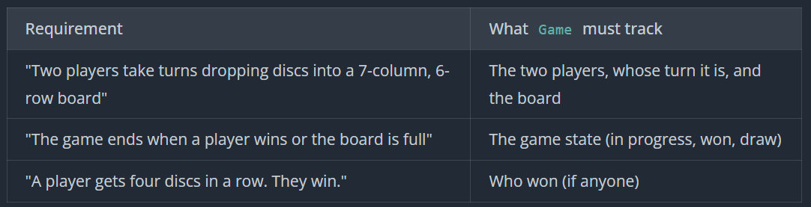
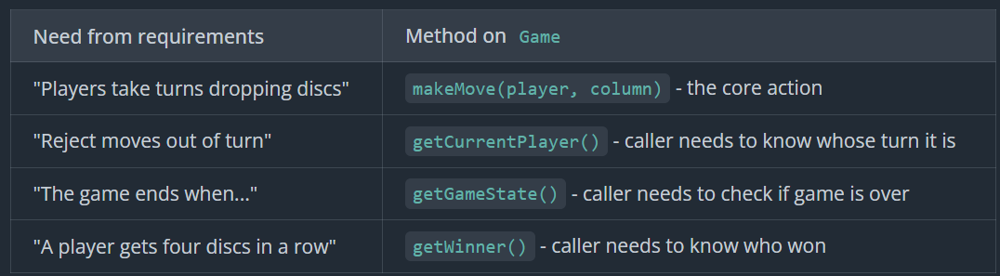
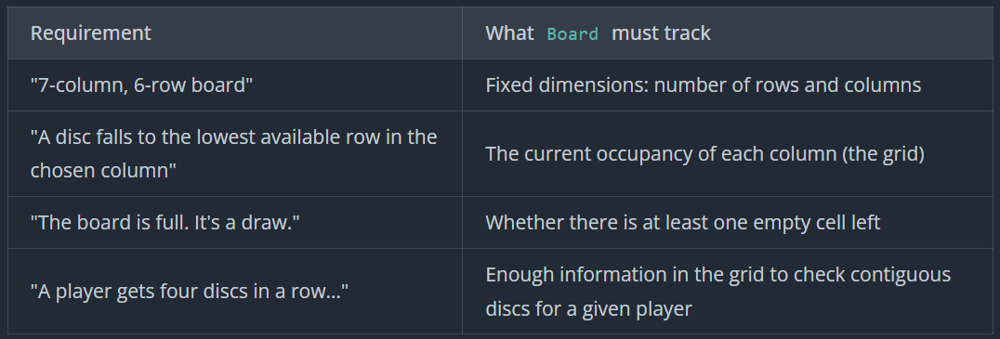
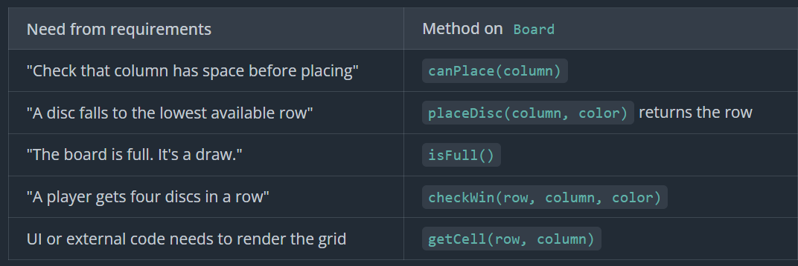
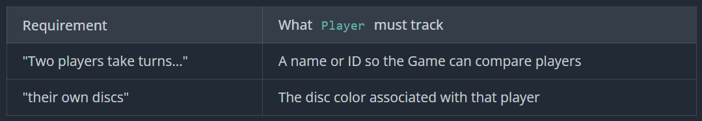

# Connect Four
Connect Four is a two-player connection game where the players take turns placing their pieces in a 7x6 grid. The first player to connect four of their pieces in a row, column, or diagonal wins.

## Prompt
"Build the object-oriented design for a two-player Connect Four game. Players take turns dropping discs into a 7-column, 6-row board. The first to align four of their own discs vertically, horizontally, or diagonally wins."
## Clarifying Question
- How do players interact with the game?
- What are all the ways a game can end?
- What if column full
- What if incorrect turn, color
- One or multiple concurrent games
- History or undo
- Board size fix
## Requirements
```
Requirements:
1. Two players take turns dropping discs into a 7-column, 6-row board
2. A disc falls to the lowest available row in the chosen column
3. The game ends when:
    - A player gets four discs in a row (vertical, horizontal, or diagonal). They win.
    - The board is full. It's a draw.
4. Invalid moves should be rejected clearly:
    - Dropping in a full column.
    - Moving out of turn.
    - Moving after the game is over.

Out of scope: 
- UI support
- Concurrent games
- Move history
- Undo
- Board size configuration
```
## Core Entities
```
Game : Orchestrator
Board : Grid state and placements
Player : Name and Color
```
## Class Design









```
class Game:
    - board: Board
    - player1: Player
    - player2: Player
    - currentPlayer: Player
    - state: GameState        // IN_PROGRESS, WON, DRAW
    - winner: Player?

    + Game(player1, player2)
    + makeMove(player, column) -> bool
    + getCurrentPlayer() -> Player
    + getGameState() -> GameState
    + getWinner() -> Player?
    + getBoard() -> Board

class Board:
    - rows: int = 6
    - cols: int = 7
    - grid: DiscColor?[rows][cols]

    + Board()
    + getRows() -> int
    + getCols() -> int
    + canPlace(column) -> bool
    + placeDisc(column, color) -> int
    + isFull() -> bool
    + checkWin(row, column, color) -> bool
    + getCell(row, column) -> DiscColor?

class Player:
    - name: string
    - color: DiscColor

    + Player(name, color)
    + getName() -> string
    + getColor() -> DiscColor

enum GameState:
    IN_PROGRESS
    WON
    DRAW

enum DiscColor:
    RED
    YELLOW
```
## Implementation
### Pseudo
#### Game
```
makeMove(player, column)
    if state != IN_PROGRESS
        return false
    if player != currentPlayer
        return false

    row = board.placeDisc(column, player.getColor())
    if row == -1
        return false

    if board.checkWin(row, column, player.getColor())
        state = WON
        winner = player
    else if board.isFull()
        state = DRAW
    else
        currentPlayer = (player == player1) ? player2 : player1 // switch turn
    return true
```
#### Board
```
placeDisc(column, color)
    if column < 0 || column >= cols
        return -1
    if !canPlace(column)
        return -1

    for row = rows - 1 down to 0
        if grid[row][column] == null
            grid[row][column] = color
            return row
    return -1

checkWin(row, col, color)
    if row < 0 || row >= rows || col < 0 || col >= cols
        return false
    if grid[row][col] != color
        return false

    directions = [[0,1], [1,0], [1,1], [-1,1]]
    for dr, dc in directions:
        count = 1
        count += countInDirection(row, col, dr, dc, color) # move in the direction
        count += countInDirection(row, col, -dr, -dc, color) # move in the opposite direction
        if count >= 4
            return true
    return false

countInDirection(row, col, dr, dc, color)
    count = 0
    r = row + dr
    c = col + dc
    while inBounds(r, c) && grid[r][c] == color
        count++
        r += dr
        c += dc
    return count

canPlace(column)
    if column < 0 || column >= cols
        return false
    return grid[0][column] == null    // top row empty means column has space

isFull()
    for c = 0 to cols - 1
        if canPlace(c)
            return false
    return true

inBounds(row, col)
    return row >= 0 && row < rows && col >= 0 && col < cols
```
### Verification
```
Initial state:
Row 5 (bottom): [RED, YELLOW, RED, _, _, _, _]
Row 4:          [RED, YELLOW, _, _, _, _, _]
currentPlayer = player1, state = IN_PROGRESS

Move 1: player1 → column 0
  placeDisc(0, RED) → row 3
  checkWin(3, 0, RED)?
    Check vertical: (4,0)=RED, (5,0)=RED → count = 3
    No win yet
  currentPlayer = player2

Move 2: player2 → column 1
  placeDisc(1, YELLOW) → row 3
  checkWin(3, 1, YELLOW)?
    Check vertical: (4,1)=YELLOW, (5,1)=YELLOW → count = 3
    No win yet
  currentPlayer = player1

Move 3: player1 → column 2
  placeDisc(2, RED) → row 4
  checkWin(4, 2, RED)?
    Check horizontal: (4,1)=YELLOW → no consecutive 4
    No win yet
  currentPlayer = player2

Move 4: player2 → column 3
  placeDisc(3, YELLOW) → row 5
  checkWin(5, 3, YELLOW)? No
  currentPlayer = player1

Move 5: player1 → column 0
  placeDisc(0, RED) → row 2
  checkWin(2, 0, RED)?
    Check vertical down: (3,0)=RED, (4,0)=RED, (5,0)=RED
    count = 1 + 3 = 4 ✓
    Returns true!
  state = WON, winner = player1

Move 6: player2 tries column 1
  state != IN_PROGRESS → returns false immediately
```
### Code
Game
```cs
public enum GameState
{
    InProgress,
    Won,
    Draw
}

public class Game
{
    private readonly Board _board;
    private readonly Player _player1;
    private readonly Player _player2;
    private Player _currentPlayer;
    private GameState _state;
    private Player? _winner;

    public Game(Player player1, Player player2)
    {
        _board = new Board();
        _player1 = player1;
        _player2 = player2;
        _currentPlayer = player1;
        _state = GameState.InProgress;
    }

    public bool MakeMove(Player player, int column)
    {
        if (_state != GameState.InProgress)
        {
            return false;
        }
        if (player != _currentPlayer)
        {
            return false;
        }

        var row = _board.PlaceDisc(column, player.Color);
        if (row == -1)
        {
            return false;
        }

        if (_board.CheckWin(row, column, player.Color))
        {
            _state = GameState.Won;
            _winner = player;
        }
        else if (_board.IsFull())
        {
            _state = GameState.Draw;
        }
        else
        {
            _currentPlayer = _currentPlayer == _player1 ? _player2 : _player1;
        }
        return true;
    }

    public Player CurrentPlayer => _currentPlayer;

    public GameState State => _state;

    public Player? Winner => _winner;

    public Board Board => _board;
}
```
Board
```cs
public enum DiscColor
{
    Red,
    Yellow
}

public class Board
{
    private const int Rows = 6;
    private const int ColsConst = 7;
    private readonly DiscColor?[,] _grid = new DiscColor?[Rows, ColsConst];

    public int RowsCount => Rows;
    public int Cols => ColsConst;

    public bool CanPlace(int column)
    {
        if (column < 0 || column >= ColsConst)
        {
            return false;
        }
        return _grid[0, column] == null;
    }

    public int PlaceDisc(int column, DiscColor color)
    {
        if (!CanPlace(column))
        {
            return -1;
        }

        for (var row = Rows - 1; row >= 0; row--)
        {
            if (_grid[row, column] == null)
            {
                _grid[row, column] = color;
                return row;
            }
        }

        return -1;
    }

    public bool CheckWin(int row, int column, DiscColor color)
    {
        if (!InBounds(row, column) || _grid[row, column] != color)
        {
            return false;
        }

        int[][] directions =
        {
            new[] { 0, 1 },
            new[] { 1, 0 },
            new[] { 1, 1 },
            new[] { -1, 1 }
        };

        foreach (var dir in directions)
        {
            var count = 1;
            count += CountInDirection(row, column, dir[0], dir[1], color);
            count += CountInDirection(row, column, -dir[0], -dir[1], color);
            if (count >= 4)
            {
                return true;
            }
        }

        return false;
    }

    public bool IsFull()
    {
        for (var c = 0; c < ColsConst; c++)
        {
            if (_grid[0, c] == null)
            {
                return false;
            }
        }
        return true;
    }

    public DiscColor? GetCell(int row, int column)
    {
        if (!InBounds(row, column))
        {
            return null;
        }
        return _grid[row, column];
    }

    private int CountInDirection(int row, int column, int dr, int dc, DiscColor color)
    {
        var count = 0;
        var r = row + dr;
        var c = column + dc;

        while (InBounds(r, c) && _grid[r, c] == color)
        {
            count++;
            r += dr;
            c += dc;
        }

        return count;
    }

    private bool InBounds(int row, int column)
    {
        return row >= 0 && row < Rows && column >= 0 && column < ColsConst;
    }
}
```
Player
```cs
public class Player
{
    public string Name { get; }
    public DiscColor Color { get; }

    public Player(string name, DiscColor color)
    {
        Name = name;
        Color = color;
    }
}
```
## Extensibility
### "How would you support different board sizes?"
```
Add row and col to constructor parameter of board
```
### "How would you add undo or move history?"
```
class Move:
    - player: Player
    - row: int
    - col: int

    + Move(player, row, col)

class Game:
    - moveHistory: Stack<Move>

makeMove(player, column)
    ...
    row = board.placeDisc(column, player.getColor())
    moveHistory.push(Move(player, row, column))
    ...

class Board:
    + clearCell(row, col)
        grid[row][col] = null
    
undoLastMove()
    if moveHistory.isEmpty()
        return false

    last = moveHistory.pop()

    // revert board state
    board.clearCell(last.row, last.col)

    // revert turn order
    currentPlayer = last.player

    // recompute state (simplest version)
    state = IN_PROGRESS
    winner = null

    return true
```
### "How would you add a computer opponent?"
```
class BotEngine:
    + chooseMove(game) -> int

chooseMove(game)
    board = game.getBoard()
    for col = 0 to board.getCols() - 1
        if board.canPlace(col)
            return col
    return -1   // no moves available

game = Game(humanPlayer, botPlayer)
bot = BotEngine()

while game.getGameState() == IN_PROGRESS
    current = game.getCurrentPlayer()

    if current == humanPlayer
        column = /* read from UI / input */
    else
        column = bot.chooseMove(game)

    game.makeMove(current, column)
```
