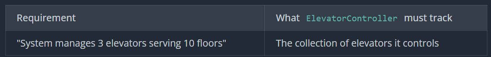
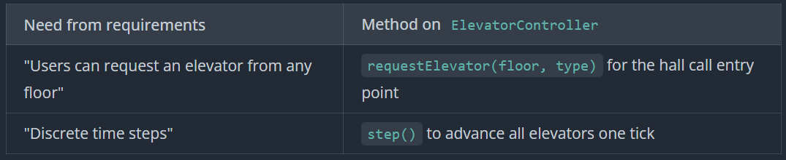
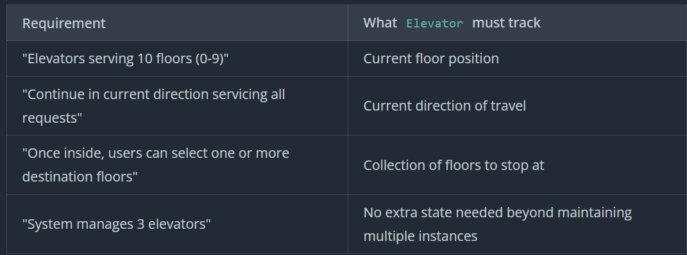
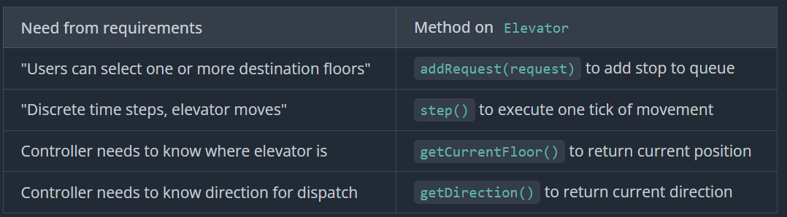

# Elevator
An elevator system manages multiple elevators serving different floors in a building. When someone requests an elevator, the system decides which one to dispatch. Once inside, passengers select their destination floors. The system needs to move elevators efficiently while handling multiple concurrent requests.
## Prompt
"Design an elevator control system for a building. The system should handle multiple elevators, floor requests, and move elevators efficiently to service requests."
## Clarifying Questions
- How many elevators and floors. Fixed or Variable
- Up / Down call on elevator or floor call
- Can we select multiple destinations
- Is there different types or stop, if from outside or inside call
- Invalid Requests
- Elevator capacity, overload
- Simulation or actual calls from external service
## Requirements
```
1. System manages 3 elevators serving 10 floors (0-9)
2. Users can request an elevator from any floor (hall call). System decides which elevator to dispatch.
3. Once inside, users can select one or more destination floors
4. Simulation runs in discrete time steps (e.g., a `step()` or `tick()` call advances time)
5. Elevator stops come in two types:
    - Hall calls: Request from a floor with direction (UP or DOWN)
    - Destination: Request from inside elevator (no direction specified)
6. System handles multiple concurrent pickup requests across floors
7. Invalid requests should be rejected (return false)
    - Non-existent floor numbers
8. Requests for the current floor are treated as a no-op / already served (doors out of scope)

Out of scope:
- Weight capacity and passenger limits
- Door open/close mechanics
- Emergency stop functionality
- Dynamic floor/elevator configuration
- UI/rendering layer
```
## Core Entities
Floor : No state or rules, Does not need to be entity
```
ElevatorController : Orchestrator
Elevator : Single Elevator
Request : Call
```
## Class Design







```
class ElevatorController:
    - elevators: List<Elevator>

    + ElevatorController()
    + requestElevator(floor, type) -> boolean
    + step() -> void

class Elevator:
    - currentFloor: int
    - direction: Direction        // UP, DOWN, IDLE
    - requests: Set<Request>

    + Elevator()
    + addRequest(request) -> boolean
    + step() -> void
    + getCurrentFloor() -> int
    + getDirection() -> Direction

class Request:
    - floor: int
    - type: RequestType

    + Request(floor, type)
    + getFloor() -> int
    + getType() -> RequestType

enum Direction:
    UP
    DOWN
    IDLE

enum RequestType:
    PICKUP_UP
    PICKUP_DOWN
    DESTINATION
```
## Implementation
### Pseudo Code
#### Elevator Controller

```
requestElevator(floor, type)
    // Validate
    if floor < 0 || floor > 9
        return false
    if type == DESTINATION
        return false  // hall calls only

    // Create Request at the boundary, pass it through the system
    request = Request(floor, type)
    best = selectBestElevator(request)
    return best.addRequest(request)

selectBestElevator(request)
    // Priority 1: Elevators moving toward the floor in the right direction
    best = findMovingToward(request)
    if best != null
        return best

    // Priority 2: Idle elevators (pick nearest)
    best = findNearestIdle(request.getFloor())
    if best != null
        return best

    // Priority 3: Any elevator (pick nearest)
    return findNearest(request.getFloor())

findMovingToward(request)
    floor = request.getFloor()
    direction = (request.getType() == PICKUP_UP) ? UP : DOWN
    nearest = null
    minDistance = Integer.MAX_VALUE

    for e in elevators
        if e.getDirection() != direction
            continue
        if (direction == UP && e.getCurrentFloor() > floor) ||
           (direction == DOWN && e.getCurrentFloor() < floor)
            continue

        distance = abs(e.getCurrentFloor() - floor)
        if distance < minDistance
            minDistance = distance
            nearest = e

    return nearest

step()
    for e in elevators
        e.step()
```
findMovingToward : It has an issue, if the selected elevator has a request in its queue that changes the direction, then that elevator will turn before selecting the current request. 
BETTER: Direction and Request Queue Analysis

#### Elevator
```
step()
    // Case 1: Nothing to do
    if requests.isEmpty()
        direction = IDLE
        return

    // Case 2: If idle, pick a direction based on nearest request
    if direction == IDLE
        // Find the nearest request to establish initial direction
        nearest = null
        minDistance = Integer.MAX_VALUE

        for req in requests
            distance = abs(req.getFloor() - currentFloor)
            if distance < minDistance ||
                (distance == minDistance && (nearest == null || req.getFloor() < nearest.getFloor()))
                minDistance = distance
                nearest = req

        direction = (nearest.getFloor() > currentFloor) ? UP : DOWN

    // Case 3: Check if we should stop at current floor
    // Check pickup requests matching our direction, plus any destination requests
    pickupType = (direction == UP) ? PICKUP_UP : PICKUP_DOWN
    pickupRequest = Request(currentFloor, pickupType)
    destinationRequest = Request(currentFloor, DESTINATION)

    if requests.contains(pickupRequest) || requests.contains(destinationRequest)
        requests.remove(pickupRequest)
        requests.remove(destinationRequest)
        // Note: If Request(currentFloor, PICKUP_DOWN) exists but we're going UP,
        // it survives and will be serviced on the return trip going DOWN.
        // This is correct - we only pick up passengers going our direction.

        if requests.isEmpty()
            direction = IDLE
        return  // we stopped this tick, don't move

    // Case 4: Reverse if no requests ahead
    if !hasRequestsAhead(direction)
        direction = (direction == UP) ? DOWN : UP
        return  // don't move this tick, let next tick check for stops

    // Case 5: Move one floor
    if direction == UP
        currentFloor++
    else if direction == DOWN
        currentFloor--

hasRequestsAhead(dir)
    for request in requests
        if dir == UP && request.getFloor() > currentFloor
            return true
        if dir == DOWN && request.getFloor() < currentFloor
            return true
    return false

addRequest(request)
    if request.getFloor() < 0 || request.getFloor() > 9
        return false
    if request.getFloor() == currentFloor
        return true  // already here; treat as no-op
    return requests.add(request)
```
### Verification
Elevator is on floor 3, going UP, with requests Request(5, PICKUP_UP) and Request(7, DESTINATION).
```
Tick 0: currentFloor=3, direction=UP, requests={Request(5, PICKUP_UP), Request(7, DESTINATION)}
  - Not at a stop, move up
Tick 1: currentFloor=4, direction=UP, requests={Request(5, PICKUP_UP), Request(7, DESTINATION)}
  - Not at a stop, move up
Tick 2: currentFloor=5, direction=UP, requests={Request(5, PICKUP_UP), Request(7, DESTINATION)}
  - At floor 5! Check for Request(5, PICKUP_UP) - found! Remove it
  - requests={Request(7, DESTINATION)}, still have requests ahead, stay UP
  - Don't move this tick (we just stopped)
Tick 3: currentFloor=5, direction=UP, requests={Request(7, DESTINATION)}
  - Not at a stop, move up
Tick 4: currentFloor=6, direction=UP, requests={Request(7, DESTINATION)}
  - Not at a stop, move up
Tick 5: currentFloor=7, direction=UP, requests={Request(7, DESTINATION)}
  - At floor 7! Check for Request(7, DESTINATION) - found! Remove it
  - requests={}, no more requests, go IDLE
  - Don't move this tick
Tick 6: currentFloor=7, direction=IDLE, requests={}
  - No requests, stay idle
```
Now someone on floor 2 presses the call button going DOWN.
```
Tick 7: currentFloor=7, direction=IDLE, requests={Request(2, PICKUP_DOWN)}
  - requests not empty, pick direction
  - nearest request is floor 2, which is < 7, so direction=DOWN
  - hasRequestsAhead(DOWN)? Yes, Request(2, PICKUP_DOWN) is below us
  - Move down
Tick 8: currentFloor=6, direction=DOWN, requests={Request(2, PICKUP_DOWN)}
  - Not at a stop, move down
Tick 9: currentFloor=5, direction=DOWN, requests={Request(2, PICKUP_DOWN)}
  - Not at a stop, move down
...continues until reaching floor 2...
```
### Code
Elevator
```cs
using System;
using System.Collections.Generic;
using System.Linq;

public enum Direction
{
    Up,
    Down,
    Idle
}

public class Elevator
{
    private int _currentFloor;
    private Direction _direction;
    private readonly HashSet<Request> _requests;

    public Elevator()
    {
        _currentFloor = 0;
        _direction = Direction.Idle;
        _requests = new HashSet<Request>();
    }

    public bool AddRequest(Request request)
    {
        if (request.GetFloor() < 0 || request.GetFloor() > 9)
        {
            return false;
        }
        if (request.GetFloor() == _currentFloor)
        {
            return true;
        }
        if (_requests.Contains(request))
        {
            return false;
        }
        _requests.Add(request);
        return true;
    }

    public void Step()
    {
        if (_requests.Count == 0)
        {
            _direction = Direction.Idle;
            return;
        }

        if (_direction == Direction.Idle)
        {
            // Find nearest request to establish initial direction (deterministic)
            Request nearest = null;
            int minDistance = int.MaxValue;
            
            foreach (var req in _requests)
            {
                int distance = Math.Abs(req.GetFloor() - _currentFloor);
                if (distance < minDistance || (distance == minDistance && (nearest == null || req.GetFloor() < nearest.GetFloor())))
                {
                    minDistance = distance;
                    nearest = req;
                }
            }
            
            _direction = nearest.GetFloor() > _currentFloor ? Direction.Up : Direction.Down;
        }

        var pickupType = _direction == Direction.Up ? RequestType.PICKUP_UP : RequestType.PICKUP_DOWN;
        var pickupRequest = new Request(_currentFloor, pickupType);
        var destinationRequest = new Request(_currentFloor, RequestType.DESTINATION);

        if (_requests.Contains(pickupRequest) || _requests.Contains(destinationRequest))
        {
            _requests.Remove(pickupRequest);
            _requests.Remove(destinationRequest);

            if (_requests.Count == 0)
            {
                _direction = Direction.Idle;
            }
            return;
        }

        if (!HasRequestsAhead(_direction))
        {
            _direction = _direction == Direction.Up ? Direction.Down : Direction.Up;
            return;
        }

        if (_direction == Direction.Up)
        {
            _currentFloor++;
        }
        else if (_direction == Direction.Down)
        {
            _currentFloor--;
        }
    }

    public bool HasRequestsAhead(Direction dir)
    {
        foreach (var request in _requests)
        {
            if (dir == Direction.Up && request.GetFloor() > _currentFloor)
            {
                return true;
            }
            if (dir == Direction.Down && request.GetFloor() < _currentFloor)
            {
                return true;
            }
        }
        return false;
    }

    public bool HasRequestsAtOrBeyond(int floor, Direction dir)
    {
        foreach (var request in _requests)
        {
            if (dir == Direction.Up && request.GetFloor() >= floor)
            {
                if (request.GetType() == RequestType.PICKUP_UP || request.GetType() == RequestType.DESTINATION)
                {
                    return true;
                }
            }
            if (dir == Direction.Down && request.GetFloor() <= floor)
            {
                if (request.GetType() == RequestType.PICKUP_DOWN || request.GetType() == RequestType.DESTINATION)
                {
                    return true;
                }
            }
        }
        return false;
    }

    public int CurrentFloor => _currentFloor;

    public Direction Direction => _direction;
}
```
Elevator Controller
```cs
using System;
using System.Collections.Generic;
using System.Linq;

public class ElevatorController
{
    private readonly List<Elevator> _elevators;

    public ElevatorController()
    {
        _elevators = new List<Elevator>
        {
            new Elevator(),
            new Elevator(),
            new Elevator()
        };
    }

    // Core logic
    // Validate the floor number
    // Pick which elevator should handle this request
    // Tell that elevator to add the floor to its stops
    // 
    // Edge cases
    // Floor out of bounds (less than 0 or greater than 9)
    // Invalid direction
    public bool RequestElevator(int floor, RequestType type)
    {
        if (floor < 0 || floor > 9)
        {
            return false;
        }
        if (type == RequestType.DESTINATION)
        {
            return false;
        }

        var request = new Request(floor, type);
        var best = SelectBestElevator(request);
        return best.AddRequest(request);
    }

    public void Step()
    {
        foreach (var elevator in _elevators)
        {
            elevator.Step();
        }
    }

    private Elevator SelectBestElevator(Request request)
    {
        var best = FindCommittedToFloor(request);
        if (best != null)
        {
            return best;
        }

        best = FindNearestIdle(request.GetFloor());
        if (best != null)
        {
            return best;
        }

        return FindNearest(request.GetFloor());
    }

    private Elevator? FindCommittedToFloor(Request request)
    {
        var floor = request.GetFloor();
        var direction = request.GetType() == RequestType.PICKUP_UP ? Direction.Up : Direction.Down;

        Elevator? nearest = null;
        var minDistance = int.MaxValue;

        foreach (var e in _elevators)
        {
            if (e.Direction != direction)
            {
                continue;
            }

            if ((direction == Direction.Up && e.CurrentFloor > floor) ||
                (direction == Direction.Down && e.CurrentFloor < floor))
            {
                continue;
            }

            if (!e.HasRequestsAtOrBeyond(floor, direction))
            {
                continue;
            }

            var distance = Math.Abs(e.CurrentFloor - floor);
            if (distance < minDistance)
            {
                minDistance = distance;
                nearest = e;
            }
        }

        return nearest;
    }

    private Elevator? FindNearestIdle(int floor)
    {
        Elevator? nearest = null;
        var minDistance = int.MaxValue;

        foreach (var e in _elevators)
        {
            if (e.Direction != Direction.Idle)
            {
                continue;
            }

            var distance = Math.Abs(e.CurrentFloor - floor);
            if (distance < minDistance)
            {
                minDistance = distance;
                nearest = e;
            }
        }

        return nearest;
    }

    private Elevator FindNearest(int floor)
    {
        var nearest = _elevators[0];
        var minDistance = Math.Abs(_elevators[0].CurrentFloor - floor);

        foreach (var e in _elevators)
        {
            var distance = Math.Abs(e.CurrentFloor - floor);
            if (distance < minDistance)
            {
                minDistance = distance;
                nearest = e;
            }
        }

        return nearest;
    }
}
```
Request
```cs
using System;

public enum RequestType
{
    PICKUP_UP,
    PICKUP_DOWN,
    DESTINATION
}

public class Request
{
    private readonly int floor;
    private readonly RequestType type;

    public Request(int floor, RequestType type)
    {
        this.floor = floor;
        this.type = type;
    }

    public int GetFloor()
    {
        return floor;
    }

    public RequestType GetType()
    {
        return type;
    }

    public override bool Equals(object obj)
    {
        if (obj == null || GetType() != obj.GetType())
        {
            return false;
        }

        Request request = (Request)obj;
        return floor == request.floor && type == request.type;
    }

    public override int GetHashCode()
    {
        return HashCode.Combine(floor, type);
    }
}
```
## Extensibility
### "How would you add priority floors or an express elevator?"
```
class ElevatorController:
    - elevators: List<Elevator>
    - expressElevator: Elevator  // NEW: track which elevator is express

class Elevator:
    - isExpress: bool
    - expressFloors: Set<int> = {0, 5, 9}

addRequest(request)
    if request.getFloor() < 0 || request.getFloor() > 9
        return false
    if request.getFloor() == currentFloor
        return true  // already here; treat as no-op

    // NEW: Reject non-express floors if this is an express elevator
    if isExpress && !expressFloors.contains(request.getFloor())
        return false

    return requests.add(request)

// In ElevatorController dispatch logic:
selectBestElevator(request)
    // NEW: For express floors, prefer the express elevator when it's idle; otherwise fall through to normal selection
    if request.getFloor() in {0, 5, 9} && expressElevator.getDirection() == IDLE
        return expressElevator
    // ... normal selection logic for regular elevators
```
### "How would you add undo to cancel a floor request?"
```
removeRequest(request)
    requests.remove(request)  // That's it - just remove from the set
```
### "What if multiple hall calls come in at the same time?"
Lock
```
requestElevator(floor, type)
    lock.acquire()
    ...
    lock.release()

step()
    lock.acquire()
    ...
    lock.release()
```
Concurrent Queue
```
addRequest(request)
    pendingRequests.enqueue(request)  // thread-safe queue

step()
    while !pendingRequests.isEmpty()
        activeRequests.add(pendingRequests.dequeue())
    // all logic uses activeRequests
    ...
```