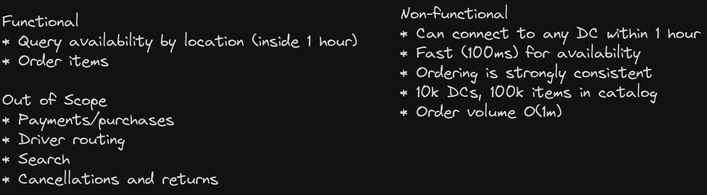
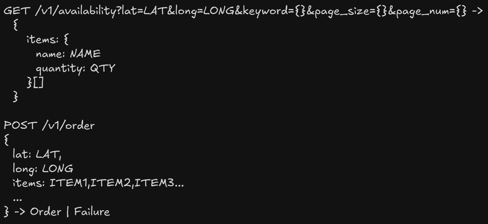
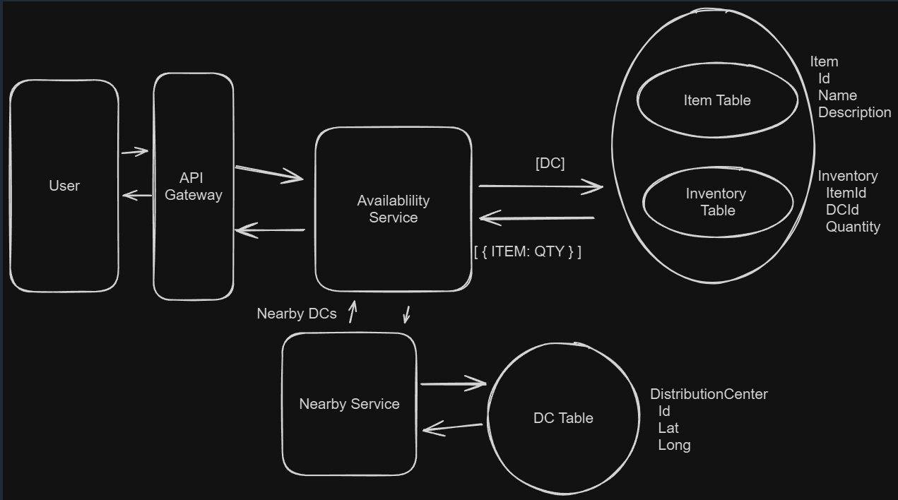
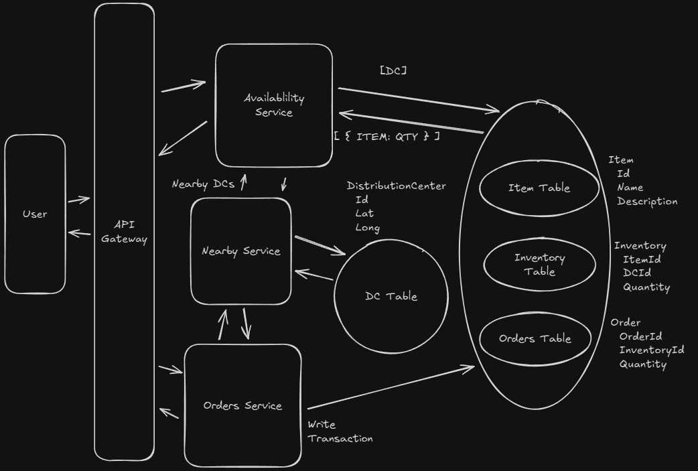
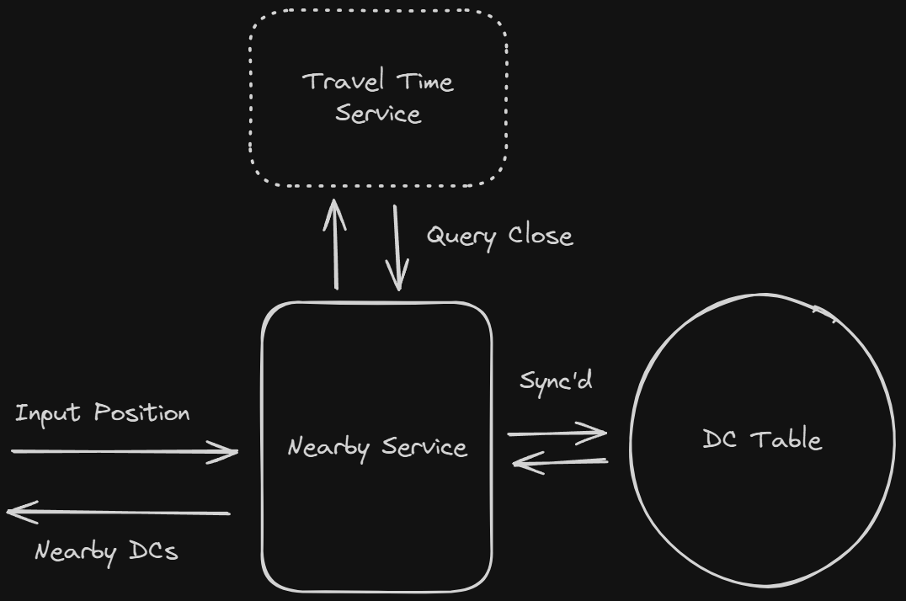
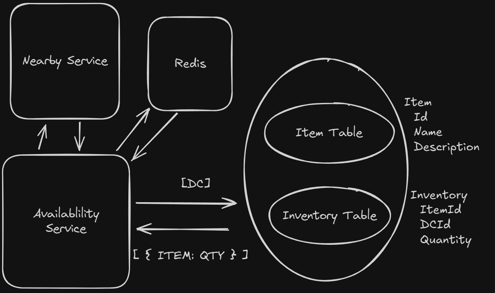
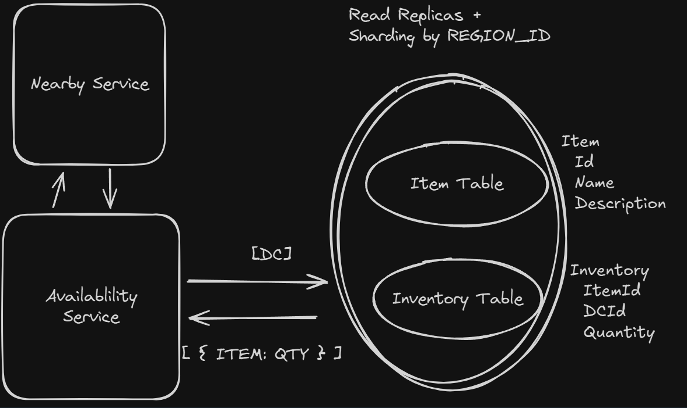

# Local Delivery Service

Gopuff delivers goods typically found in a convenience store via rapid delivery and 500+ micro distribution centers (DCs).

## Requirements



## Core Entities

```
Item
Inventory
Distribution Center
Order
OrderItem
```

## API



## HLD

### Customers should be able to query availability of items



### Customers should be able to order items

GOOD - 2 Data Stores with Distributed Lock

- Can cause deadlock or inconsistencies

BETTER - Single DB Transaction



## Deep Dive

### Make availability lookups incorporate traffic and drive time

BAD - Simple SQL Distance : Not realtime
BAD - Travel Time estimation across all DCs
GREAT - Travel Time estimation across nearby DCs



### Make availability lookups fast and scalable

GREAT - Redis for inventory



GREAT - DB Replication and Partitioning


