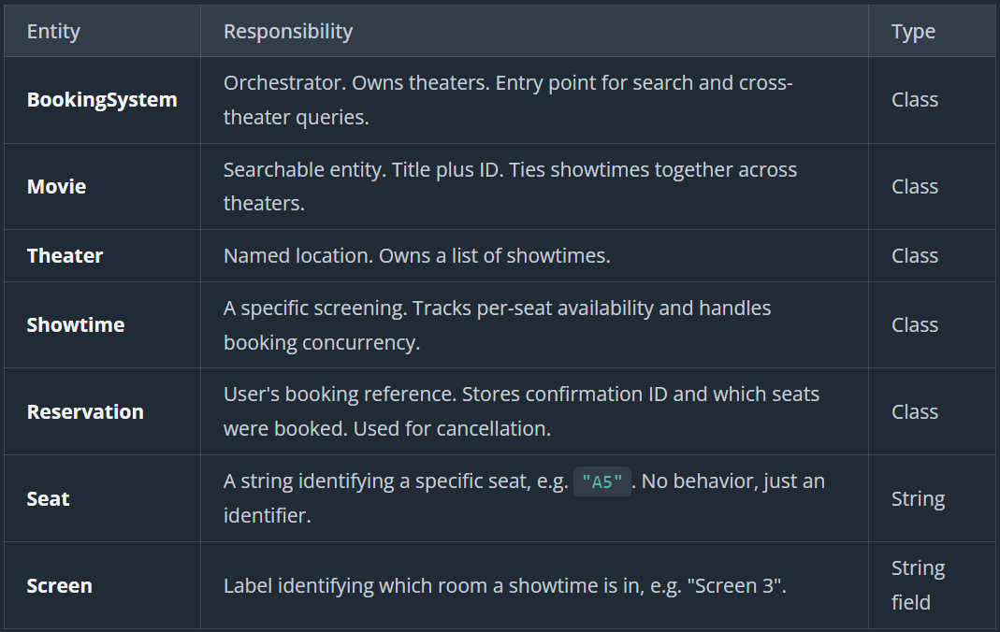
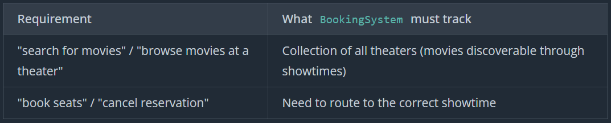
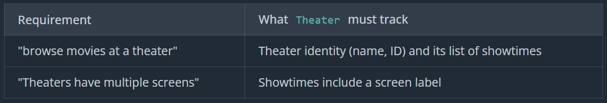
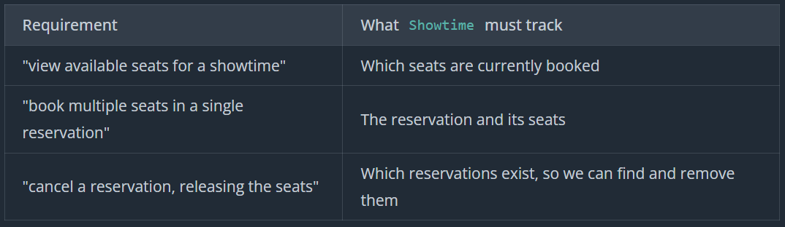
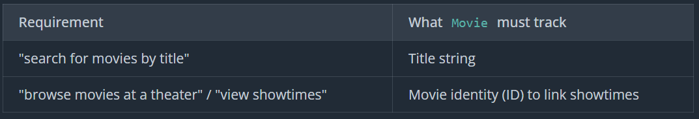
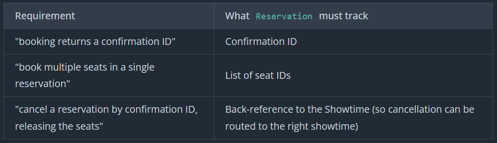

# Movie Booking System

A movie ticket booking system (like Fandango) lets users search for movies, browse theaters and showtimes, select specific seats from a seat map, and reserve tickets. The system manages seat availability across multiple theaters, each with multiple screens, and prevents two people from booking the same seat.

## Prompt

"Design a movie ticket booking system similar to BookMyShow that allows users to browse movies, select theaters and showtimes, book tickets, and manage reservations."

## Clarifying Question

- "When you say 'browse movies,' is that full-text search, fuzzy matching, or just simple title lookup?"
- "How does seat selection work? Does the user pick specific seats from a map, or does the system auto-assign? And can they book more than one seat at a time?"
- "Are we designing for a single theater or multiple? And do theaters have multiple screens?"
- "Do different screens have different seat configurations? Or can we standardize?"
- "What does 'manage reservations' include? Cancel, reschedule, modify?"
- "A couple of scoping questions: are there different seat types with different prices? And is payment processing in scope?"
- "What about concurrency? If two people try to book the same seat at the same time?"

## Requirements

```
Requirements:
1. Users can search for movies by title
2. Users can browse movies playing at a given theater
3. Theaters have multiple screens; all screens share the same seat layout (rows A-Z, seats 0-20)
4. Users can view available seats for a showtime and select specific ones
5. Users can book multiple seats in a single reservation; booking returns a confirmation ID
6. Concurrent booking of the same seat: exactly one succeeds
7. Users can cancel a reservation by confirmation ID, releasing the seats

Out of Scope:
- Payment processing (assume payment always succeeds)
- Variable seat layouts or seat types (all seats identical)
- Rescheduling (cancel and rebook instead)
- UI / rendering
```

## Core Entities and Relationship



```
BookingSystem → List<Theater>
Theater → List<Showtime>
Showtime → Theater (back-reference for navigation)
Showtime → Movie (reference)
Showtime → List<Reservation> (booking records for this showtime)
Reservation → Showtime (back-reference for cancellation routing)
Reservation → List<string> (e.g., ["A5", "A6"])
```

## Class Design











```cs
class BookingSystem:
    - theaters: List<Theater>

    + searchMovies(title: string) → List<Showtime>
    + getShowtimesAtTheater(theater: Theater) → List<Showtime>
    + book(showtimeId: string, seatIds: List<string>) → Reservation
    + cancelReservation(confirmationId: string)

class Theater:
    - id: string
    - name: string
    - showtimes: List<Showtime>

    + getShowtimes() → List<Showtime>
    + getShowtimesForMovie(movie: Movie) → List<Showtime>

class Showtime:
    - id: string
    - theater: Theater
    - datetime: DateTime
    - screenLabel: string
    - movie: Movie
    - reservations: List<Reservation>

    + getId() → string
    + getTheater() → Theater
    + getDatetime() → DateTime
    + getMovie() → Movie
    + isAvailable(seatId: string) → boolean
    + getAvailableSeats() → List<string>
    + book(reservation: Reservation)
    + cancel(reservation: Reservation)

class Movie:
    - id: string
    - title: string

    + getTitle() → string
    + getId() → string

class Reservation:
    - confirmationId: string
    - showtime: Showtime
    - seatIds: List<string>

    + getConfirmationId() → string
    + getSeatIds() → List<string>
    + getShowtime() → Showtime

Constants:
    SEAT_LAYOUT: rows A-Z, seats 0-20 (546 seats per showtime)
```

## Implementation

### Pseudocode

**BookingSystem**

```
BookingSystem(theaters)
    this.theaters = theaters
    this.moviesById = {}
    this.showtimesByMovieId = {}
    this.showtimesById = {}
    this.reservationsById = {}

    for theater in theaters
        for showtime in theater.getShowtimes()
            movie = showtime.getMovie()
            moviesById[movie.getId()] = movie
            showtimesById[showtime.getId()] = showtime

            if !showtimesByMovieId.contains(movie.getId())
                showtimesByMovieId[movie.getId()] = []
            showtimesByMovieId[movie.getId()].add(showtime)

searchMovies(title)
    if title == null or title is empty
        return []

    results = []
    searchLower = title.toLowerCase()
    now = currentTime()

    for movie in moviesById.values()
        if movie.getTitle().toLowerCase().contains(searchLower)
            // Add all future showtimes for this movie
            for showtime in showtimesByMovieId[movie.getId()]
                if showtime.getDatetime() > now
                    results.add(showtime)

    return results

getShowtimesAtTheater(theater)
    if theater == null
        return []

    results = []
    now = currentTime()

    for showtime in theater.getShowtimes()
        if showtime.getDatetime() > now
            results.add(showtime)

    return results

book(showtimeId, seatIds)
    if showtimeId == null or seatIds == null or seatIds.isEmpty()
        throw InvalidRequestException

    showtime = showtimesById[showtimeId]
    if showtime == null
        throw ShowtimeNotFoundException

    // Create the reservation up front (just a data object, no state change yet)
    reservation = Reservation(
        generateConfirmationId(),
        showtime,
        seatIds
    )

    // Hand to showtime for atomic validation + storage
    showtime.book(reservation)

    // Register in routing index so cancelReservation can find it by confirmation ID
    reservationsById[reservation.getConfirmationId()] = reservation

    return reservation

cancelReservation(confirmationId)
    if confirmationId == null or confirmationId is empty
        throw InvalidRequestException

    reservation = reservationsById[confirmationId]
    if reservation == null
        throw ReservationNotFoundException

    // Follow the back-reference to the correct showtime
    showtime = reservation.getShowtime()

    // Showtime removes the reservation and frees the seats atomically
    showtime.cancel(reservation)

    // Remove from routing index
    reservationsById.remove(confirmationId)
```

**Theatre**

```
class Theater:
    id: string
    name: string
    showtimes: List<Showtime>

    Theater(id, name)
        this.id = id
        this.name = name
        this.showtimes = []

    getShowtimes()
        return showtimes

    getShowtimesForMovie(movie)
        results = []
        for showtime in showtimes
            if showtime.getMovie().getId() == movie.getId()
                results.add(showtime)
        return results
```

**Showtime**

```
Showtime(id, theater, movie, datetime, screenLabel)
    this.id = id
    this.theater = theater
    this.movie = movie
    this.datetime = datetime
    this.screenLabel = screenLabel
    this.reservations = []

isAvailable(seatId)
    for reservation in reservations
        if reservation.getSeatIds().contains(seatId)
            return false
    return true

getAvailableSeats()
    booked = Set()
    for reservation in reservations
        for seat in reservation.getSeatIds()
            booked.add(seat)

    available = []
    for row in 'A' to 'Z'
        for num in 0 to 20
            seatId = row + num
            if !booked.contains(seatId)
                available.add(seatId)
    return available

book(reservation)
    synchronized(this)
        seatIds = reservation.getSeatIds()

        if seatIds == null or seatIds.isEmpty()
            throw InvalidRequestException("Must select at least one seat")

        // Validate all seats exist in the layout
        for seatId in seatIds
            if !isValidSeatId(seatId)
                throw InvalidSeatException(seatId)

        // Check all seats are available
        for seatId in seatIds
            if !isAvailable(seatId)
                throw SeatUnavailableException(seatId)

        // All checks passed - store reservation
        reservations.add(reservation)

isValidSeatId(seatId)
    row = seatId[0]
    num = parseInt(seatId.substring(1))
    return row >= 'A' && row <= 'Z' && num >= 0 && num <= 20

cancel(reservation)
    synchronized(this)
        reservations.remove(reservation)
```

**Movie**

```
class Movie:
    id: string
    title: string

    Movie(id, title)
        this.id = id
        this.title = title

    getId()
        return id

    getTitle()
        return title
```

**Reservation**

```
class Reservation:
    confirmationId: string
    showtime: Showtime
    seatIds: List<string>  // e.g., ["A5", "A6"]

    Reservation(confirmationId, showtime, seatIds)
        this.confirmationId = confirmationId
        this.showtime = showtime
        this.seatIds = copy(seatIds)  // Defensive copy

    getConfirmationId()
        return confirmationId

    getShowtime()
        return showtime

    getSeatIds()
        return copy(seatIds)  // Return copy to prevent modification
```

### Verification

Successful booking flow

```
Initial state:
  showtime.reservations = [] (empty)
  bookingSystem.reservationsById = {} (empty)

Operation: bookingSystem.book("showtime-123", ["A5", "A6"])

BookingSystem.book:
  1. Validate inputs → OK
  2. Look up showtime: showtimesById["showtime-123"] → found

  3. Create reservation:
       confirmationId = generateConfirmationId() → "BMS-X7Y2Z9K4"
       showtime = showtime
       seatIds = ["A5", "A6"]

  4. showtime.book(reservation):
       synchronized(this):
         Validate "A5": isValidSeatId → true ✓
         Validate "A6": isValidSeatId → true ✓
         Check "A5": isAvailable("A5") → true ✓
         Check "A6": isAvailable("A6") → true ✓
         Store: reservations.add(reservation)
       (returns without throwing)

  5. Register in routing index: reservationsById["BMS-X7Y2Z9K4"] = reservation
  6. Return reservation

Final state:
  showtime.reservations = [reservation] (contains seats "A5", "A6")
  bookingSystem.reservationsById = {"BMS-X7Y2Z9K4" → reservation}

Result: Reservation with confirmation "BMS-X7Y2Z9K4" ✓
```

Concurrent booking - exactly one succeeds

```
Initial state:
  showtime.reservations = [] (empty)

Thread A: bookingSystem.book("showtime-123", ["A5"])
Thread B: bookingSystem.book("showtime-123", ["A5"])

Both threads create their Reservation objects, then call showtime.book():

  Thread A: enters synchronized block
  Thread B: waits at synchronized block entrance

  Thread A (inside lock):
    Check "A5": isAvailable("A5") scans reservations → true ✓
    Store: reservations.add(reservation)
    Exit synchronized block

  Thread A (back in BookingSystem): registers in routing index

  Thread B (now enters lock):
    Check "A5": isAvailable("A5") scans reservations → false ✗ (Thread A's reservation claims it)
    Throw SeatUnavailableException("A5")

  Thread B (exception propagates to BookingSystem): reservation never registered

Result:
  Thread A: Returns reservation ✓
  Thread B: Throws SeatUnavailableException ✓

Exactly one thread succeeded. Requirement R6 satisfied.
```

Cancellation releases seats correctly

```
Initial state:
  showtime.reservations = [reservation] (reservation holds seats "A5", "A6")
  bookingSystem.reservationsById = {"BMS-X7Y2Z9K4" → reservation}
  reservation.showtime = showtime

Operation: bookingSystem.cancelReservation("BMS-X7Y2Z9K4")

BookingSystem.cancelReservation:
  1. Look up: reservationsById["BMS-X7Y2Z9K4"] → found
  2. Follow back-reference: reservation.getShowtime() → showtime

  3. showtime.cancel(reservation):
       synchronized(this):
         reservations.remove(reservation)

  4. Remove from routing index: reservationsById.remove("BMS-X7Y2Z9K4")

Final state:
  showtime.reservations = [] (empty, seats "A5" and "A6" now available)
  bookingSystem.reservationsById = {} (empty)

Result: Seats "A5" and "A6" are now available for new bookings ✓
```

Partial booking fails atomically

```
Initial state:
  showtime.reservations = [existing_reservation] (existing_reservation holds seat "A6")

Operation: bookingSystem.book("showtime-123", ["A5", "A6", "A7"])

BookingSystem.book:
  1. Look up showtime → found
  2. Create reservation with seatIds = ["A5", "A6", "A7"]

  3. showtime.book(reservation):
       synchronized(this):
         Validate "A5", "A6", "A7": all valid seat IDs ✓
         Check "A5": isAvailable("A5") → true ✓
         Check "A6": isAvailable("A6") → false ✗ (claimed by existing_reservation)
         Throw SeatUnavailableException("A6")

         // Never reaches the store step!

  4. Exception propagates to BookingSystem
  5. Reservation never registered in routing index

Final state:
  showtime.reservations = [existing_reservation] (unchanged!)

Result:
  Exception thrown ✓
  "A5" was NOT booked (all-or-nothing) ✓
  No reservation stored anywhere ✓
```

### Code

BookingSystem

```cs
using System;
using System.Collections.Generic;

public class BookingSystem
{
    private readonly List<Theater> _theaters;
    private readonly Dictionary<string, Movie> _moviesById = new();
    private readonly Dictionary<string, List<Showtime>> _showtimesByMovieId = new();
    private readonly Dictionary<string, Showtime> _showtimesById = new();
    private readonly Dictionary<string, Reservation> _reservationsById = new();

    public BookingSystem(List<Theater> theaters)
    {
        _theaters = theaters;

        foreach (var theater in theaters)
        {
            foreach (var showtime in theater.GetShowtimes())
            {
                var movie = showtime.Movie;
                _moviesById[movie.Id] = movie;
                _showtimesById[showtime.Id] = showtime;

                if (!_showtimesByMovieId.ContainsKey(movie.Id))
                {
                    _showtimesByMovieId[movie.Id] = new List<Showtime>();
                }
                _showtimesByMovieId[movie.Id].Add(showtime);
            }
        }
    }

    public List<Showtime> SearchMovies(string title)
    {
        if (string.IsNullOrEmpty(title))
        {
            return new List<Showtime>();
        }

        var results = new List<Showtime>();
        var searchLower = title.ToLower();
        var now = DateTime.Now;

        foreach (var movie in _moviesById.Values)
        {
            if (movie.Title.ToLower().Contains(searchLower))
            {
                if (_showtimesByMovieId.TryGetValue(movie.Id, out var movieShowtimes))
                {
                    foreach (var showtime in movieShowtimes)
                    {
                        if (showtime.Datetime > now)
                        {
                            results.Add(showtime);
                        }
                    }
                }
            }
        }

        return results;
    }

    public List<Showtime> GetShowtimesAtTheater(Theater theater)
    {
        if (theater == null)
        {
            return new List<Showtime>();
        }

        var results = new List<Showtime>();
        var now = DateTime.Now;

        foreach (var showtime in theater.GetShowtimes())
        {
            if (showtime.Datetime > now)
            {
                results.Add(showtime);
            }
        }

        return results;
    }

    public Reservation Book(string showtimeId, List<string> seatIds)
    {
        if (string.IsNullOrEmpty(showtimeId) || seatIds == null || seatIds.Count == 0)
        {
            throw new ArgumentException("Invalid booking request");
        }

        if (!_showtimesById.TryGetValue(showtimeId, out var showtime))
        {
            throw new KeyNotFoundException($"Showtime not found: {showtimeId}");
        }

        var reservation = new Reservation(
            Guid.NewGuid().ToString(),
            showtime,
            seatIds
        );

        showtime.Book(reservation);

        _reservationsById[reservation.ConfirmationId] = reservation;

        return reservation;
    }

    public void CancelReservation(string confirmationId)
    {
        if (string.IsNullOrEmpty(confirmationId))
        {
            throw new ArgumentException("Invalid confirmation ID");
        }

        if (!_reservationsById.TryGetValue(confirmationId, out var reservation))
        {
            throw new KeyNotFoundException($"Reservation not found: {confirmationId}");
        }

        var showtime = reservation.Showtime;
        showtime.Cancel(reservation);

        _reservationsById.Remove(confirmationId);
    }
}
```

Showtime

```cs
using System;
using System.Collections.Generic;

public class Showtime
{
    private readonly string _id;
    private readonly Theater _theater;
    private readonly DateTime _datetime;
    private readonly string _screenLabel;
    private readonly Movie _movie;
    private readonly List<Reservation> _reservations = new();
    private readonly object _lock = new();

    public Showtime(string id, Theater theater, Movie movie, DateTime datetime, string screenLabel)
    {
        _id = id;
        _theater = theater;
        _movie = movie;
        _datetime = datetime;
        _screenLabel = screenLabel;
    }

    public string Id => _id;
    public Theater Theater => _theater;
    public DateTime Datetime => _datetime;
    public Movie Movie => _movie;

    public bool IsAvailable(string seatId)
    {
        foreach (var reservation in _reservations)
        {
            if (reservation.SeatIds.Contains(seatId))
            {
                return false;
            }
        }
        return true;
    }

    public List<string> GetAvailableSeats()
    {
        var booked = new HashSet<string>();
        foreach (var reservation in _reservations)
        {
            foreach (var seat in reservation.SeatIds)
            {
                booked.Add(seat);
            }
        }

        var available = new List<string>();
        for (char row = 'A'; row <= 'Z'; row++)
        {
            for (int num = 0; num <= 20; num++)
            {
                var seatId = $"{row}{num}";
                if (!booked.Contains(seatId))
                {
                    available.Add(seatId);
                }
            }
        }
        return available;
    }

    public void Book(Reservation reservation)
    {
        lock (_lock)
        {
            var seatIds = reservation.SeatIds;

            if (seatIds == null || seatIds.Count == 0)
            {
                throw new ArgumentException("Must select at least one seat");
            }

            foreach (var seatId in seatIds)
            {
                if (!IsValidSeatId(seatId))
                {
                    throw new ArgumentException($"Invalid seat: {seatId}");
                }
            }

            foreach (var seatId in seatIds)
            {
                if (!IsAvailable(seatId))
                {
                    throw new InvalidOperationException($"Seat {seatId} is not available");
                }
            }

            _reservations.Add(reservation);
        }
    }

    public void Cancel(Reservation reservation)
    {
        lock (_lock)
        {
            _reservations.Remove(reservation);
        }
    }

    private static bool IsValidSeatId(string seatId)
    {
        if (string.IsNullOrEmpty(seatId) || seatId.Length < 2)
        {
            return false;
        }
        char row = seatId[0];
        if (!int.TryParse(seatId.AsSpan(1), out int num))
        {
            return false;
        }
        return row >= 'A' && row <= 'Z' && num >= 0 && num <= 20;
    }
}

```

Theatre

```cs
using System.Collections.Generic;

public class Theater
{
    private readonly string _id;
    private readonly string _name;
    private readonly List<Showtime> _showtimes;

    public Theater(string id, string name)
    {
        _id = id;
        _name = name;
        _showtimes = new List<Showtime>();
    }

    public string Id => _id;
    public string Name => _name;

    public List<Showtime> GetShowtimes()
    {
        return _showtimes;
    }

    public List<Showtime> GetShowtimesForMovie(Movie movie)
    {
        var results = new List<Showtime>();
        foreach (var showtime in _showtimes)
        {
            if (showtime.Movie.Id == movie.Id)
            {
                results.Add(showtime);
            }
        }
        return results;
    }
}
```

Movie

```cs
public class Movie
{
    private readonly string _id;
    private readonly string _title;

    public Movie(string id, string title)
    {
        _id = id;
        _title = title;
    }

    public string Id => _id;
    public string Title => _title;
}
```

Reservation

```cs
using System.Collections.Generic;

public class Reservation
{
    private readonly string _confirmationId;
    private readonly Showtime _showtime;
    private readonly List<string> _seatIds;

    public Reservation(string confirmationId, Showtime showtime, List<string> seatIds)
    {
        _confirmationId = confirmationId;
        _showtime = showtime;
        _seatIds = new List<string>(seatIds);
    }

    public string ConfirmationId => _confirmationId;
    public Showtime Showtime => _showtime;
    public List<string> SeatIds => new List<string>(_seatIds);
}

```

## Extensibility

### How would you support dynamically adding and removing showtimes, movies, and theaters?

```
addShowtime(theater, showtime)
    theater.getShowtimes().add(showtime)
    showtimesById[showtime.getId()] = showtime

    movie = showtime.getMovie()
    moviesById[movie.getId()] = movie

    if !showtimesByMovieId.contains(movie.getId())
        showtimesByMovieId[movie.getId()] = []
    showtimesByMovieId[movie.getId()].add(showtime)

removeShowtime(showtimeId)
    showtime = showtimesById[showtimeId]
    if showtime == null
        throw ShowtimeNotFoundException

    if showtime.getReservations() is not empty
        throw ShowtimeHasActiveReservationsException

    showtimesById.remove(showtimeId)

    // Remove from movie → showtimes index
    movie = showtime.getMovie()
    if showtimesByMovieId.contains(movie.getId())
        showtimesByMovieId[movie.getId()].remove(showtime)

    for theater in theaters
        theater.getShowtimes().remove(showtime)

    cleanupMovieIndex(movie)

cleanupMovieIndex(movie)
    for theater in theaters
        for showtime in theater.getShowtimes()
            if showtime.getMovie().getId() == movie.getId()
                return  // Still showing somewhere, keep it

    moviesById.remove(movie.getId())
    showtimesByMovieId.remove(movie.getId())
```

### How would you handle temporary seat holds during checkout?

```
class Showtime:
    - id: string
    - theater: Theater
    - datetime: DateTime
    - screenLabel: string
    - movie: Movie
    - reservations: List<Reservation>
    - holds: Map<string, SeatHold>

class SeatHold:
    - seatIds: List<string>
    - holdId: string
    - expiresAt: long

isAvailable(seatId)
    for reservation in reservations
        if reservation.getSeatIds().contains(seatId)
            return false

    now = currentTime()
    for hold in holds.values()
        if hold.expiresAt > now && hold.seatIds.contains(seatId)
            return false

    return true

holdSeats(seatIds, timeoutMs)
    synchronized(this)
        for seatId in seatIds
            if !isAvailable(seatId)
                throw SeatUnavailableException(seatId)

        hold = SeatHold(
            seatIds,
            generateHoldId(),
            currentTime() + timeoutMs
        )
        holds[hold.holdId] = hold
        return hold.holdId

confirmHold(holdId, reservation)
    synchronized(this)
        hold = holds[holdId]
        if hold == null
            throw HoldNotFoundException

        if currentTime() > hold.expiresAt
            holds.remove(holdId)
            throw HoldExpiredException

        // Hold is valid, convert to reservation
        holds.remove(holdId)
        reservations.add(reservation)

cleanupExpiredHolds()
    synchronized(this)
        now = currentTime()
        for holdId in holds.keys()
            if now > holds[holdId].expiresAt
                holds.remove(holdId)
```
