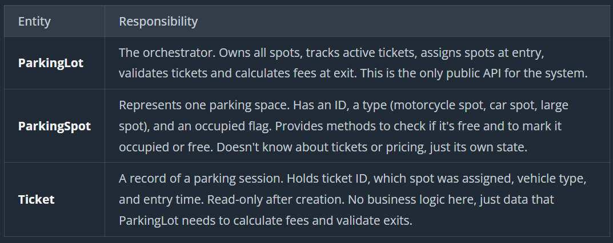
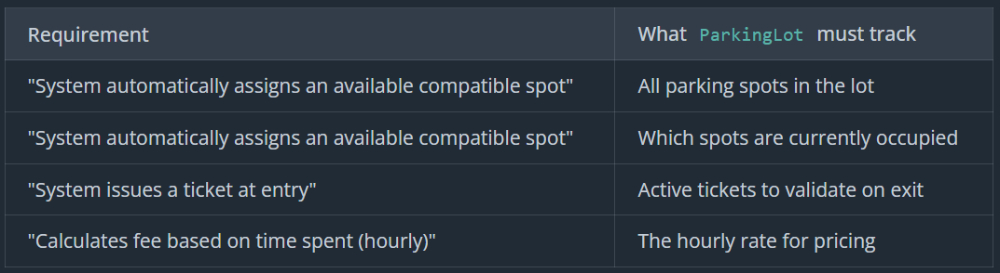
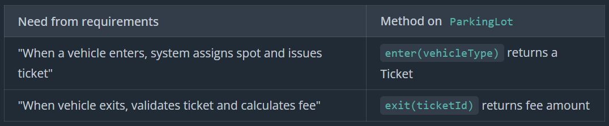
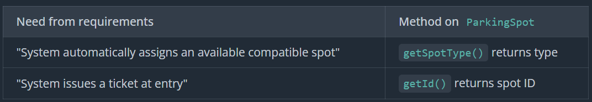
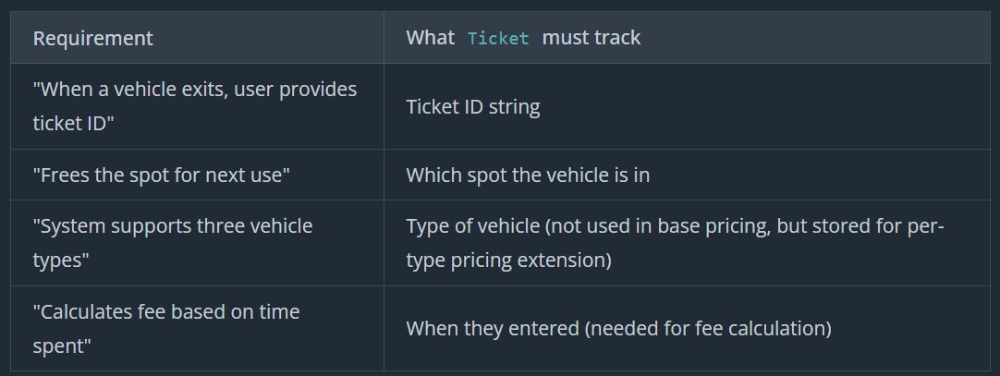
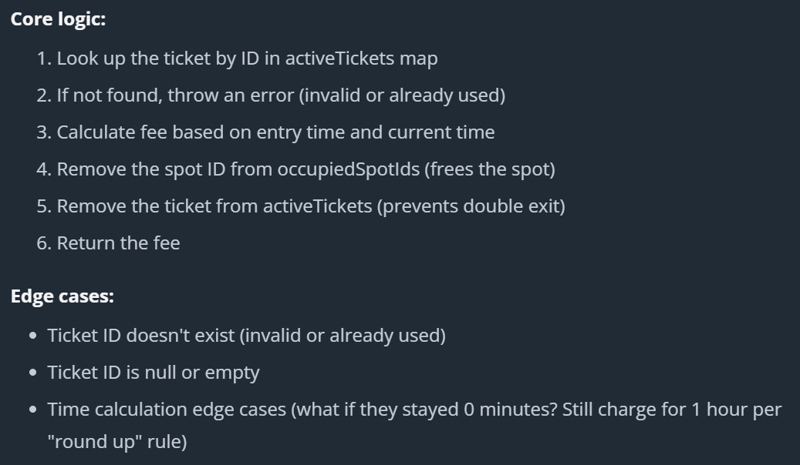
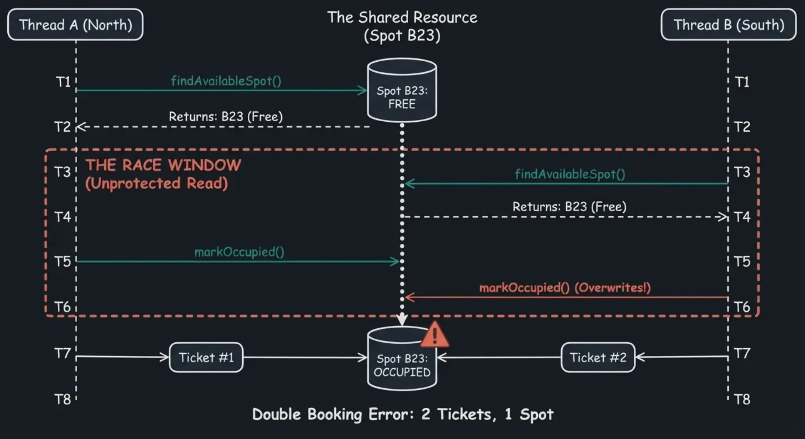

# Parking System

A parking lot system manages vehicle parking across multiple spots. When a vehicle enters, the system assigns an available spot matching the vehicle type and issues a ticket. When the vehicle exits, the system calculates the parking fee based on time spent and frees up the spot for the next customer.

## Prompt

"Design a parking lot system where different types of vehicles can park, and the system manages spot assignment and calculates fees upon exit."

## Clarifying Questions

```
"So when a vehicle enters, the system assigns it a specific spot automatically?"
"What types of vehicles does the system support? Just cars, or do we need motorcycles, trucks, that kind of thing?"
"What happens when the vehicle enters? Do they get a ticket, a code, or something else to prove they parked there?"
"How does pricing work? Is it hourly, flat rate, different rates for different vehicle types?"
"What happens if the lot is full when someone tries to enter? Or if they try to exit with an invalid ticket?"
"What if someone loses their ticket? Do we need to handle that case?"
"Last question. What's out of scope? Are we worrying about payment processing, entrance gates, cameras, that kind of infrastructure?"
```

## Requirements

```
Requirements:
1. System supports three vehicle types: Motorcycle, Car, Large Vehicle
2. When a vehicle enters, system automatically assigns an available compatible spot
3. System issues a ticket at entry.
4. When a vehicle exits, user provides ticket ID
   - System validates the ticket
   - Calculates fee based on time spent (hourly, rounded up)
   - Frees the spot for next use
5. Pricing is hourly with same rate for all vehicles
6. System rejects entry if no compatible spot is available
7. System rejects exit if ticket is invalid or already used

Out of scope:
- Payment processing
- Physical gate hardware
- Security cameras or monitoring
- UI/display systems
- Reservations or pre-booking
```

## Entities and Relations



## Class Design



Storing Occupancy

- BAD: Using boolean flag on spot
  - Redundant at spot and active tickets
- GOOD: Derive occupancy from tickets
- GOOD: Keep in occupancy index







Getting fees calculated

- GOOD - In ParkingLot
- GREAT - Strategy Pattern

```
interface PricingStrategy
    calculateFee(ticket, exitTime)

class HourlyPricing implements PricingStrategy
    - hourlyRateCents

    calculateFee(ticket, exitTime)
        // Same logic as before

class DynamicPricing implements PricingStrategy
    calculateFee(ticket, exitTime)
        // Complex logic: surge pricing, time of day, etc.

class ParkingLot
    - pricingStrategy

    exit(ticketId)
        ticket = activeTickets[ticketId]
        fee = pricingStrategy.calculateFee(ticket, currentTime())
        // ... rest of exit logic
```

FINAL CLASS DESIGN

```
class ParkingLot:
    - spots: List<ParkingSpot>
    - occupiedSpotIds: Set<String>
    - activeTickets: Map<string, Ticket>
    - hourlyRateCents: long

    + ParkingLot(spots, hourlyRateCents)
    + enter(vehicleType) -> Ticket
    + exit(ticketId) -> long

class ParkingSpot:
    - id: String
    - spotType: SpotType

    + ParkingSpot(id, spotType)
    + getSpotType() -> SpotType
    + getId() -> String

class Ticket:
    - id: String
    - spotId: String
    - vehicleType: VehicleType
    - entryTime: long

    + Ticket(id, spotId, vehicleType, entryTime)
    + getId() -> String
    + getSpotId() -> String
    + getVehicleType() -> VehicleType
    + getEntryTime() -> long

enum SpotType:
    MOTORCYCLE
    CAR
    LARGE

enum VehicleType:
    MOTORCYCLE
    CAR
    LARGE
```

## Implementation

### Pseudo

**ParkingLot**


```
exit(ticketId)
    if ticketId == null
        return error

    ticket = activeTickets[ticketId]
    if ticket == null
        return error

    exitTime = currentTime()
    fee = computeFee(ticket.entryTime, exitTime)

    occupiedSpotIds.remove(ticket.spotId)
    activeTickets.remove(ticketId)

    return fee

findAvailableSpot(vehicleType)
    requiredSpotType = mapVehicleTypeToSpotType(vehicleType)

    for spot in spots
        if spot.spotType == requiredSpotType and spot.id not in occupiedSpotIds
            return spot

    return null

mapVehicleTypeToSpotType(vehicleType)
    if vehicleType == MOTORCYCLE
        return MOTORCYCLE
    if vehicleType == CAR
        return CAR
    if vehicleType == LARGE
        return LARGE
    return

computeFee(entryTime, exitTime)
    durationMillis = exitTime - entryTime
    durationHours = durationMillis / (1000 * 60 * 60)

    // Round up to nearest hour (5 minutes becomes 1 hour)
    if durationMillis % (1000 * 60 * 60) > 0
        durationHours++

    return durationHours * hourlyRateCents
```

**ParkingSpot**

```
getSpotType()
    return spotType

getId()
    return id
```

**Ticket**

```
getId()
    return id

getSpotId()
    return spotId

getVehicleType()
    return vehicleType

getEntryTime()
    return entryTime
```

### Verification

Vehicle enters:

```
Initial: spots=[A, B, C], occupiedSpotIds={}, activeTickets={}

findAvailableSpot(CAR) → finds spot B (type matches, not in occupiedSpotIds)
occupiedSpotIds.add("B") → set now {"B"}
Generate ticket: id="T123", spotId="B", vehicleType=CAR, entryTime=1000000
activeTickets.put("T123", ticket) → map now {"T123" → ticket}

Return ticket T123
State: occupiedSpotIds={"B"}, activeTickets has T123
```

Vehicle exits 2.5 hours later:

```
activeTickets.get("T123") → ticket found
exitTime = 1000000 + (2.5 hours in millis) = 10000000
computeFee(1000000, 10000000):
  - duration = 2.5 hours
  - round up → 3 hours
  - fee = 3 * 500 = 1500 cents

occupiedSpotIds.remove("B") → set now empty
activeTickets.remove("T123") → map now empty

Return 1500 cents
State: occupiedSpotIds={}, activeTickets={}
```

Try to exit again with same ticket:

```
activeTickets.get("T123") → null (already removed)
throw Error("Ticket not found or already used")
```

Try to enter when lot is full:

```
All CAR spots are in occupiedSpotIds
findAvailableSpot(CAR) → returns null
throw Error("No available spots for vehicle type CAR")
```

### Code

**ParkingLot**

```cs
using System;
using System.Collections.Generic;

public class ParkingLot
{
    private readonly List<ParkingSpot> _spots;
    private readonly Dictionary<string, Ticket> _activeTickets;
    private readonly HashSet<string> _occupiedSpotIds;
    private readonly long _hourlyRateCents;

    public ParkingLot(List<ParkingSpot> spots, long hourlyRateCents)
    {
        _spots = spots;
        _activeTickets = new Dictionary<string, Ticket>();
        _occupiedSpotIds = new HashSet<string>();
        _hourlyRateCents = hourlyRateCents;
    }

    public Ticket Enter(VehicleType vehicleType)
    {
        ParkingSpot spot = FindAvailableSpot(vehicleType);
        if (spot == null)
        {
            throw new Exception($"No available spots for vehicle type {vehicleType}");
        }

        _occupiedSpotIds.Add(spot.GetId());

        string ticketId = Guid.NewGuid().ToString();
        long entryTime = DateTimeOffset.UtcNow.ToUnixTimeMilliseconds();
        Ticket ticket = new Ticket(ticketId, spot.GetId(), vehicleType, entryTime);

        _activeTickets[ticketId] = ticket;

        return ticket;
    }

    public long Exit(string ticketId)
    {
        if (string.IsNullOrEmpty(ticketId))
        {
            throw new Exception("Invalid ticket ID");
        }

        if (!_activeTickets.TryGetValue(ticketId, out Ticket ticket))
        {
            throw new Exception("Ticket not found or already used");
        }

        long exitTime = DateTimeOffset.UtcNow.ToUnixTimeMilliseconds();
        long fee = ComputeFee(ticket.GetEntryTime(), exitTime);

        _occupiedSpotIds.Remove(ticket.GetSpotId());
        _activeTickets.Remove(ticketId);

        return fee;
    }

    private ParkingSpot FindAvailableSpot(VehicleType vehicleType)
    {
        SpotType requiredSpotType = MapVehicleTypeToSpotType(vehicleType);

        foreach (ParkingSpot spot in _spots)
        {
            if (!_occupiedSpotIds.Contains(spot.GetId()) && spot.GetSpotType() == requiredSpotType)
            {
                return spot;
            }
        }

        return null;
    }

    private SpotType MapVehicleTypeToSpotType(VehicleType vehicleType)
    {
        if (vehicleType == VehicleType.MOTORCYCLE) return SpotType.MOTORCYCLE;
        if (vehicleType == VehicleType.CAR) return SpotType.CAR;
        if (vehicleType == VehicleType.LARGE) return SpotType.LARGE;
        throw new Exception("Unknown vehicle type");
    }

    private long ComputeFee(long entryTime, long exitTime)
    {
        long durationMillis = exitTime - entryTime;
        long durationHours = durationMillis / (1000 * 60 * 60);

        if (durationMillis % (1000 * 60 * 60) > 0)
        {
            durationHours++;
        }

        return durationHours * _hourlyRateCents;
    }
}
```

**ParkingSpot**

```cs
public enum SpotType
{
    MOTORCYCLE,
    CAR,
    LARGE
}

public class ParkingSpot
{
    private readonly string _id;
    private readonly SpotType _spotType;

    public ParkingSpot(string id, SpotType spotType)
    {
        _id = id;
        _spotType = spotType;
    }

    public SpotType GetSpotType() => _spotType;

    public string GetId() => _id;
}

```

**Ticket**

```cs
using System;

public enum VehicleType
{
    MOTORCYCLE,
    CAR,
    LARGE
}

public class Ticket
{
    private readonly string _id;
    private readonly string _spotId;
    private readonly VehicleType _vehicleType;
    private readonly long _entryTime;

    public Ticket(string id, string spotId, VehicleType vehicleType, long entryTime)
    {
        _id = id;
        _spotId = spotId;
        _vehicleType = vehicleType;
        _entryTime = entryTime;
    }

    public string GetId() => _id;

    public string GetSpotId() => _spotId;

    public VehicleType GetVehicleType() => _vehicleType;

    public long GetEntryTime() => _entryTime;
}
```

## Extensibility

### "How would you extend this to a multi-floor parking garage?"

```
class ParkingLot:
    - floors: List<ParkingFloor>
    - activeTickets: Map<String, Ticket>
    - hourlyRateCents

class ParkingFloor:
    - floorNumber
    - spots: List<ParkingSpot>

    + getAvailableSpotCount(spotType) -> int
    + findAvailableSpot(spotType) -> ParkingSpot

findAvailableSpot(vehicleType)
    requiredType = mapVehicleTypeToSpotType(vehicleType)

    for floor in floors
        spot = floor.findAvailableSpot(requiredType)
        if spot != null
            return spot
    return null

// Another Strategy
findAvailableSpot(vehicleType)
    requiredType = mapVehicleTypeToSpotType(vehicleType)

    // Find floor with most available spots of this type
    bestFloor = null
    maxAvailable = 0

    for floor in floors
        available = floor.getAvailableSpotCount(requiredType)
        if available > maxAvailable
            maxAvailable = available
            bestFloor = floor

    if bestFloor == null
        return null
    return bestFloor.findAvailableSpot(requiredType)
```

### "How would you add different pricing for different vehicle types?"

```
class ParkingLot:
  - spots: List<ParkingSpot>
  - activeTickets: Map<String, Ticket>
  - hourlyRates: Map<VehicleType, long>  // Change: map instead of single rate

computeFee(entryTime, exitTime, vehicleType)
    durationHours = calculateDuration(entryTime, exitTime)
    rate = hourlyRates[vehicleType]  // Look up rate by vehicle type
    return durationHours * rate
```

### "How would you handle multiple entrances with concurrent access?"


GOOD: Lock on Parking System
GREAT: Fine Grain Read Write Locking with Retry

```cs
class ParkingLot
{
    private readonly ReaderWriterLockSlim _rwLock = new();
    private readonly HashSet<string> _occupiedSpotIds = new();

    private ParkingSpot FindAvailableSpot(VehicleType vehicleType)
    {
        _rwLock.EnterReadLock();
        try
        {
            foreach (var spot in _spots)
            {
                if (spot.SpotType == vehicleType &&
                    !_occupiedSpotIds.Contains(spot.Id))
                {
                    return spot;
                }
            }
            return null;
        }
        finally
        {
            _rwLock.ExitReadLock();
        }
    }

    public Ticket Enter(VehicleType vehicleType)
    {
        while (true)
        {
            var spot = FindAvailableSpot(vehicleType);
            if (spot == null)
            {
                throw new Exception("No available spots");
            }

            _rwLock.EnterWriteLock();
            try
            {
                if (_occupiedSpotIds.Add(spot.Id))
                {
                    // ... create ticket
                    return ticket;
                }
            }
            finally
            {
                _rwLock.ExitWriteLock();
            }
            // Spot was claimed, retry
        }
    }
}
```
