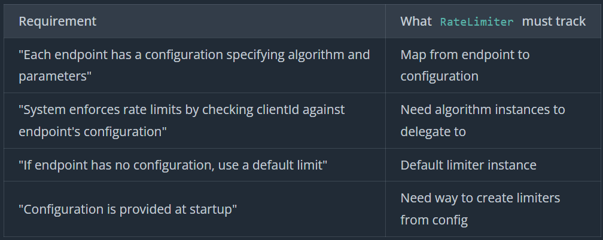
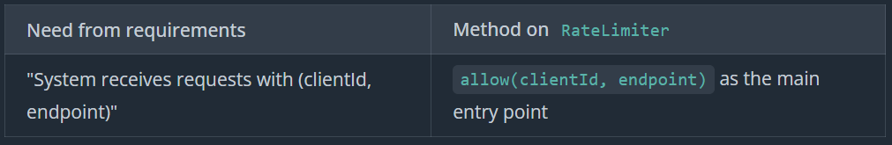
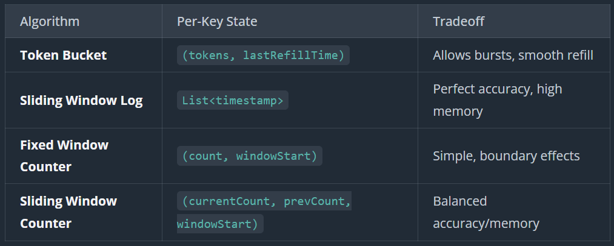

# Rate Limitter

## Prompt

```
"You're building an in-memory rate limiter for an API gateway. The system receives configuration from an external service that provides rate limiting rules per endpoint. Each endpoint can have its own limit with a specific algorithm. Here's an example configuration for one endpoint:

{
  "endpoint": "/search",
  "algorithm": "TokenBucket",
  "algoConfig": {
    "capacity": 1000,
    "refillRatePerSecond": 10
  }
}

This config allows bursts up to 1000 requests, refilling at 10 requests per second.
Your job is to build the in-memory rate limiter that enforces these rules."
```

## Questions

```
"I see the configuration includes algorithm-specific parameters. Are there different parameter sets for different algorithms?"
> Yes

"When a request comes in, what information do we receive? Client ID and endpoint, or something else?"
> Yes

"What should we return when checking a request? Just allowed/denied, or more detail?"
> Yes, Remaining quota, when can retry

"What happens if a request comes in for an endpoint we don't have configuration for?"
> Default

"Should the system handle concurrent requests from multiple threads?"
> Out of Scope

"Just to clarify scope, are we building distributed rate limiting across multiple servers, or single-process in-memory?"
> Single

"And the configuration, is it dynamic, or loaded once at startup?"
> At Startup
```

## Requirements

```
Requirements:
1. Configuration is provided at startup (loaded once)
2. System receives requests with (clientId: string, endpoint: string)
3. Each endpoint has a configuration specifying:
   - Algorithm to use (e.g., "TokenBucket", "SlidingWindowLog", etc.)
   - Algorithm-specific parameters (e.g., capacity, refillRatePerSecond for Token Bucket)
4. System enforces rate limits by checking clientId against the endpoint's configuration
5. Return structured result: (allowed: boolean, remaining: int, retryAfterMs: long | null)
6. If endpoint has no configuration, use a default limit

Out of scope:
- Distributed rate limiting (Redis, coordination)
- Dynamic configuration updates
- Metrics and monitoring
- Config validation beyond basic checks
```

## Core Entities

```
RateLimitter : Orchestrator
LimitterFactory : Factory
Limitter : Algo Specific
RateLimitResult : Result Object
```

## Class Design





```
class RateLimiter:
    - limiters: Map<string, Limiter>
    - defaultLimiter: Limiter

    + RateLimiter(configs, defaultConfig)
    + allow(clientId, endpoint) -> RateLimitResult

class LimiterFactory:
    + create(configData) -> Limiter

interface Limiter:
    + allow(key) -> RateLimitResult

class RateLimitResult:
    - allowed: boolean
    - remaining: int
    - retryAfterMs: long | null

    + RateLimitResult(allowed, remaining, retryAfterMs)
    + isAllowed() -> boolean
    + getRemaining() -> int
    + getRetryAfterMs() -> long | null

class TokenBucketLimiter implements Limiter:
    - capacity: int
    - refillRatePerSecond: int
    - buckets: Map<string, TokenBucket>

class TokenBucket:
    - tokens: double
    - lastRefillTime: long

class SlidingWindowLogLimiter implements Limiter:
    - maxRequests: int
    - windowMs: long
    - logs: Map<string, RequestLog>

class RequestLog:
    - timestamps: Queue<long>
```

## Implementation



LimitterFactory

```
create(externalConfig)
    algorithm = externalConfig["algorithm"]
    algoConfig = externalConfig["algoConfig"]

    switch algorithm
            case "TokenBucket":
            return new TokenBucketLimiter(
                algoConfig["capacity"],
                algoConfig["refillRatePerSecond"]
            )

        case "SlidingWindowLog":
            return new SlidingWindowLogLimiter(
                algoConfig["maxRequests"],
                algoConfig["windowMs"]
            )

        default:
            throw new IllegalArgumentException("Unknown algorithm: " + algorithm)
```

RateLimitter

```
RateLimiter(configs, defaultConfig)
    factory = new LimiterFactory()

    limiters = new HashMap()
    for externalConfig in configs
        endpoint = externalConfig["endpoint"]
        limiter = factory.create(externalConfig)
        limiters[endpoint] = limiter

    defaultLimiter = factory.create(defaultConfig)

allow(clientId, endpoint)
    limiter = limiters.get(endpoint)
    if limiter == null
        limiter = defaultLimiter

    return limiter.allow(clientId)
```

TokenBucketLimitter

```
class TokenBucketLimiter implements Limiter:
    capacity: int
    refillRatePerSecond: int
    buckets: Map<string, TokenBucket>

    TokenBucketLimiter(capacity: int, refillRatePerSecond: int)
        this.capacity = capacity
        this.refillRatePerSecond = refillRatePerSecond
        this.buckets = new HashMap()

    allow(key)
        bucket = getOrCreateBucket(key)

        now = currentTimeMillis()
        elapsed = now - bucket.lastRefillTime
        tokensToAdd = (elapsed * refillRatePerSecond) / 1000
        bucket.tokens = min(capacity, bucket.tokens + tokensToAdd)
        bucket.lastRefillTime = now

        if bucket.tokens >= 1
            bucket.tokens -= 1
            return new RateLimitResult(
                allowed: true,
                remaining: floor(bucket.tokens),
                retryAfterMs: null
            )
        else
            tokensNeeded = 1 + bucket.tokens
            retryAfterMs = ceil((tokensNeeded * 1000) / refillRatePerSecond)
            return new RateLimitResult(
                allowed: false,
                remaining: 0,
                retryAfterMs: retryAfterMs
            )

    getOrCreateBucket(key)
        if !buckets.contains(key)
            buckets[key] = new TokenBucket(capacity, currentTimeMillis())
        return buckets[key]

class TokenBucket:
    tokens: double
    lastRefillTime: long

    TokenBucket(initialTokens, time)
        this.tokens = initialTokens
        this.lastRefillTime = time
```

SlidingWindowLimitter

```
class SlidingWindowLogLimiter implements Limiter:
    maxRequests: int
    windowMs: long
    logs: Map<string, RequestLog>

    SlidingWindowLogLimiter(maxRequests: int, windowMs: long)
        this.maxRequests = maxRequests
        this.windowMs = windowMs
        this.logs = new HashMap()

    allow(key)
        log = getOrCreateLog(key)

        now = currentTimeMillis()
        cutoff = now - windowMs

        while log.timestamps.isNotEmpty() && log.timestamps.peek() < cutoff
            log.timestamps.poll()

        if log.timestamps.size() < maxRequests
            log.timestamps.add(now)
            return new RateLimitResult(
                allowed: true,
                remaining: maxRequests - log.timestamps.size(),
                retryAfterMs: null
            )
        else
            oldestTimestamp = log.timestamps.peek()
            retryAfterMs = (oldestTimestamp + windowMs) - now
            return new RateLimitResult(
                allowed: false,
                remaining: 0,
                retryAfterMs: retryAfterMs
            )

    getOrCreateLog(key)
        if !logs.contains(key)
            logs[key] = new RequestLog(new LinkedList())
        return logs[key]

class RequestLog:
    timestamps: Queue<long>

    RequestLog(queue)
        this.timestamps = queue
```

## Code

RateLimitter

```cs
using System.Collections.Generic;

public class RateLimiter
{
    private readonly Dictionary<string, ILimiter> _limiters = new();
    private readonly ILimiter _defaultLimiter;

    public RateLimiter(IEnumerable<Dictionary<string, object>> configs, Dictionary<string, object> defaultConfig)
    {
        var factory = new LimiterFactory();
        foreach (var config in configs)
        {
            if (!config.TryGetValue("endpoint", out var endpointObj))
            {
                continue;
            }

            var endpoint = endpointObj as string;
            if (string.IsNullOrEmpty(endpoint))
            {
                continue;
            }

            _limiters[endpoint] = factory.Create(config);
        }

        _defaultLimiter = factory.Create(defaultConfig);
    }

    public RateLimitResult Allow(string clientId, string endpoint)
    {
        var limiter = _limiters.TryGetValue(endpoint, out var match) ? match : _defaultLimiter;
        return limiter.Allow(clientId);
    }
}

```

RateLimitterResult

```cs
using System;

public class RateLimitResult
{
    public bool Allowed { get; }
    public int Remaining { get; }
    public long? RetryAfterMs { get; }

    public RateLimitResult(bool allowed, int remaining, long? retryAfterMs)
    {
        Allowed = allowed;
        Remaining = remaining;
        RetryAfterMs = retryAfterMs;
    }
}

```

ILimiter

```cs
public interface ILimiter
{
    RateLimitResult Allow(string key);
}

```

LimitterFactory

```cs
using System;
using System.Collections.Generic;

public class LimiterFactory
{
    public ILimiter Create(Dictionary<string, object> config)
    {
        var algorithm = config.GetValueOrDefault("algorithm") as string;
        var algoConfig = config.GetValueOrDefault("algoConfig") as Dictionary<string, object> ?? new();

        if (algorithm == "TokenBucket")
        {
            var capacity = Convert.ToInt32(algoConfig.GetValueOrDefault("capacity", 0));
            var refillRate = Convert.ToInt32(algoConfig.GetValueOrDefault("refillRatePerSecond", 0));
            return new TokenBucketLimiter(capacity, refillRate);
        }

        if (algorithm == "SlidingWindowLog")
        {
            var maxRequests = Convert.ToInt32(algoConfig.GetValueOrDefault("maxRequests", 0));
            var windowMs = Convert.ToInt64(algoConfig.GetValueOrDefault("windowMs", 0));
            return new SlidingWindowLogLimiter(maxRequests, windowMs);
        }

        throw new ArgumentException($"Unknown algorithm: {algorithm}");
    }
}

```

TokenBucketLimitter

```cs
using System;
using System.Collections.Generic;

public class TokenBucketLimiter : ILimiter
{
    private readonly int _capacity;
    private readonly int _refillRatePerSecond;
    private readonly Dictionary<string, TokenBucket> _buckets = new();

    public TokenBucketLimiter(int capacity, int refillRatePerSecond)
    {
        _capacity = capacity;
        _refillRatePerSecond = refillRatePerSecond;
    }

    public RateLimitResult Allow(string key)
    {
        var bucket = GetOrCreateBucket(key);

        var now = DateTimeOffset.UtcNow.ToUnixTimeMilliseconds();
        var elapsed = now - bucket.LastRefillTime;
        var tokensToAdd = (elapsed * _refillRatePerSecond) / 1000.0;
        bucket.Tokens = Math.Min(_capacity, bucket.Tokens + tokensToAdd);
        bucket.LastRefillTime = now;

        if (bucket.Tokens >= 1)
        {
            bucket.Tokens -= 1;
            var remaining = (int)Math.Floor(bucket.Tokens);
            return new RateLimitResult(true, remaining, null);
        }

        var tokensNeeded = 1 - bucket.Tokens;
        var retryAfterMs = (long)Math.Ceiling((tokensNeeded * 1000) / _refillRatePerSecond);
        return new RateLimitResult(false, 0, retryAfterMs);
    }

    private TokenBucket GetOrCreateBucket(string key)
    {
        if (!_buckets.TryGetValue(key, out var bucket))
        {
            bucket = new TokenBucket(_capacity, DateTimeOffset.UtcNow.ToUnixTimeMilliseconds());
            _buckets[key] = bucket;
        }
        return bucket;
    }

    private class TokenBucket
    {
        public double Tokens { get; set; }
        public long LastRefillTime { get; set; }

        public TokenBucket(double tokens, long lastRefillTime)
        {
            Tokens = tokens;
            LastRefillTime = lastRefillTime;
        }
    }
}

```

SlidingWindowLimitter

```cs
using System;
using System.Collections.Generic;

public class SlidingWindowLogLimiter : ILimiter
{
    private readonly int _maxRequests;
    private readonly long _windowMs;
    private readonly Dictionary<string, RequestLog> _logs = new();

    public SlidingWindowLogLimiter(int maxRequests, long windowMs)
    {
        _maxRequests = maxRequests;
        _windowMs = windowMs;
    }

    public RateLimitResult Allow(string key)
    {
        var log = GetOrCreateLog(key);

        var now = DateTimeOffset.UtcNow.ToUnixTimeMilliseconds();
        var cutoff = now - _windowMs;

        while (log.Timestamps.Count > 0 && log.Timestamps.Peek() < cutoff)
        {
            log.Timestamps.Dequeue();
        }

        if (log.Timestamps.Count < _maxRequests)
        {
            log.Timestamps.Enqueue(now);
            var remaining = _maxRequests - log.Timestamps.Count;
            return new RateLimitResult(true, remaining, null);
        }

        var oldestTimestamp = log.Timestamps.Peek();
        var retryAfterMs = (oldestTimestamp + _windowMs) - now;
        return new RateLimitResult(false, 0, retryAfterMs);
    }

    private RequestLog GetOrCreateLog(string key)
    {
        if (!_logs.TryGetValue(key, out var log))
        {
            log = new RequestLog();
            _logs[key] = log;
        }
        return log;
    }

    private class RequestLog
    {
        public Queue<long> Timestamps { get; } = new();
    }
}

```

## Extensibility

### "How would you add a new rate limiting algorithm?"

Factory

### "How would you handle dynamic configuration updates?"

GOOD: Reload and replace
GREAT: Atomic Updates with State Preservation

```
interface Limiter:
    allow(key) -> RateLimitResult
    updateConfig(configData)  // NEW
```

### "How would you handle thread safety for concurrent requests?"

Per Client Id Locking
`private readonly ConcurrentDictionary<string, TokenBucket> buckets = new();`

```
class TokenBucketLimiter implements Limiter:
    capacity: int
    refillRatePerSecond: int
    buckets: ConcurrentHashMap<string, TokenBucket>  // NEW - ConcurrentHashMap

    TokenBucketLimiter(capacity: int, refillRatePerSecond: int)
        this.capacity = capacity
        this.refillRatePerSecond = refillRatePerSecond
        this.buckets = new ConcurrentHashMap()  // NEW

    allow(key)
        // Atomically get or create bucket
        bucket = buckets.computeIfAbsent(key, k -> new TokenBucket(capacity, currentTimeMillis()))

        // Synchronize on the bucket object itself
        synchronized(bucket)
            now = currentTimeMillis()
            elapsed = now - bucket.lastRefillTime
            tokensToAdd = (elapsed * refillRatePerSecond) / 1000
            bucket.tokens = min(capacity, bucket.tokens + tokensToAdd)
            bucket.lastRefillTime = now

            // Calculate result values while holding lock
            allowed = bucket.tokens >= 1
            if allowed
                bucket.tokens -= 1
                remaining = floor(bucket.tokens)
                retryAfterMs = null
            else
                tokensNeeded = 1 - bucket.tokens
                remaining = 0
                retryAfterMs = ceil((tokensNeeded * 1000) / refillRatePerSecond)

        // Construct result object outside the lock
        return new RateLimitResult(allowed, remaining, retryAfterMs)
```

### "How would you handle memory growth from tracking many clients?"

Eviction Policy, Background Tread, LRU Cache, Redis with TTL
