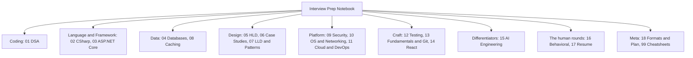
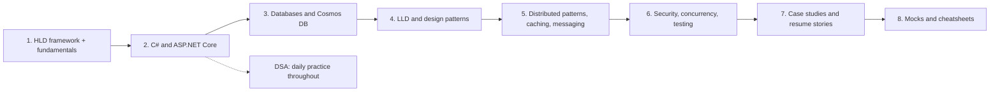

# Senior Software Engineer — Interview Prep Notebook

Complete, revision-ready notes for **Senior / Staff / Technical Lead backend** interviews.
Stack focus: **C# / .NET Core, Azure, Cosmos DB, Redis, Service Bus, event-driven distributed systems**, with React and AI/Agentic AI as secondary strengths.

Built from [`../Super-List-Interview-Prep.md`](../Super-List-Interview-Prep.md). Every note follows the same shape: **TL;DR -> core concepts -> diagrams -> comparison tables -> code -> trade-offs -> pitfalls -> interview Q&A -> quick recap**.

---

## How to use this notebook

| If you have… | Do this |
| ------------ | ------- |
| **2 days** | [18-Interview-Formats-and-Study-Plan/03-Two-Day-and-Two-Week-Revision-Plans.md](18-Interview-Formats-and-Study-Plan/03-Two-Day-and-Two-Week-Revision-Plans.md) — follow the emergency plan verbatim |
| **1–2 weeks** | Same file, 1-week / 2-week plans |
| **The night before a round** | The matching `99-Cheatsheets/` one-pager + that folder's `00-README.md` |
| **15 minutes** | [99-Cheatsheets/](99-Cheatsheets/00-README.md) |

Each folder has a `00-README.md` index with study order and revision time. Each note ends with **Interview Questions** and a **Quick Recap** — for a fast pass, read only those two sections.

---

## Priority map

| Priority | Meaning | Areas |
| -------- | ------- | ----- |
| **P0** | Must be flawless | System Design (HLD + LLD), C# internals, ASP.NET Core, distributed systems patterns, Cosmos DB / SQL, caching, security basics, behavioral & resume deep-dive |
| **P1** | Strong working knowledge | DSA (medium), microservices, design patterns, concurrency, testing, Azure, message queues, AI engineering |
| **P2** | Conceptual | React, OS/networking internals, DevOps tooling depth |

---

## Map of the notebook

---

## Contents

| # | Folder | Priority | Scope |
| - | ------ | -------- | ----- |
| 01 | [DSA](01-DSA/00-README.md) | P1 | Complexity, all core structures, every algorithm pattern, 100-problem list |
| 02 | [C# and .NET](02-CSharp-DotNet/00-README.md) | P0 | Type system, OOP/SOLID, LINQ, async/TPL, threading, GC, collections |
| 03 | [ASP.NET Core](03-AspNet-Core/00-README.md) | P0 | Pipeline, DI lifetimes, JWT/OAuth/OIDC, authorization, API design, hosting |
| 04 | [Databases](04-Databases/00-README.md) | P0 | SQL, indexing, transactions, modeling, sharding, NoSQL/CAP, Cosmos DB |
| 05 | [System Design — HLD](05-System-Design-HLD/00-README.md) | P0 | Framework, scalability, CAP, estimation, LB/gateway, queues, EDA/CQRS, distributed patterns, microservices |
| 06 | [System Design — Case Studies](06-System-Design-Case-Studies/00-README.md) | P0 | 12 end-to-end designs from URL shortener to AI moderation pipeline |
| 07 | [LLD and Design Patterns](07-LLD-and-Design-Patterns/00-README.md) | P0 | LLD framework, UML, GoF patterns, Clean/Hexagonal/DDD, 8 LLD case studies |
| 08 | [Caching](08-Caching/00-README.md) | P0 | Strategies, eviction, invalidation, stampede, Redis deep dive, CDN/HTTP caching |
| 09 | [Security](09-Security/00-README.md) | P0 | OAuth2/OIDC/JWT, RBAC/ABAC/JIT, OWASP Top 10, crypto, secrets, supply chain |
| 10 | [OS, Networking and Concurrency](10-OS-Networking-Concurrency/00-README.md) | P1/P2 | Processes, scheduling, memory, sync primitives, TCP/DNS, HTTP/gRPC/WebSockets |
| 11 | [Cloud, DevOps and Azure](11-Cloud-DevOps-Azure/00-README.md) | P1 | Azure services, Docker/K8s, CI/CD and release strategies, Terraform, observability, cost |
| 12 | [Testing and Debugging](12-Testing-and-Debugging/00-README.md) | P1 | Test pyramid, xUnit/Moq/integration tests, profiling, production incidents |
| 13 | [Engineering Fundamentals and Git](13-Engineering-Fundamentals-and-Git/00-README.md) | P1 | SDLC/Agile, clean code and refactoring, Git, code review and design docs |
| 14 | [Frontend / React](14-Frontend-React/00-README.md) | P2 | Hooks, state management, performance, TypeScript, web fundamentals |
| 15 | [AI Engineering](15-AI-Engineering/00-README.md) | P1 | LLM fundamentals, embeddings/RAG, agentic AI and MCP, AI in production |
| 16 | [Behavioral and Leadership](16-Behavioral-and-Leadership/00-README.md) | P0 | STAR method, 10-story bank, leadership, conflict, communication, design docs |
| 17 | [Resume Deep-Dive](17-Resume-Deep-Dive/00-README.md) | P0 | 9 project case studies and a per-bullet drilldown checklist |
| 18 | [Interview Formats and Study Plan](18-Interview-Formats-and-Study-Plan/00-README.md) | P0 | Round-by-round playbook, machine coding, 2-day / 1-week / 2-week plans |
| 99 | [Cheatsheets](99-Cheatsheets/00-README.md) | P0 | Latency numbers, system design one-pager, C# one-pager, DSA patterns, behavioral |

---

## Recommended study order

1. **System Design (HLD)** fundamentals, then 6–8 classic designs, then the resume case studies.
2. **C#/.NET internals** and **ASP.NET Core** — the primary-language bar.
3. **Databases** — SQL tuning plus Cosmos DB modeling.
4. **LLD, design patterns, Clean Architecture.**
5. **Distributed systems patterns, caching, messaging.**
6. **Security, concurrency, testing.**
7. **DSA** — steady daily practice throughout, never front-loaded alone.
8. **Leadership stories and resume deep-dive** — polish continuously.
9. **AI / Agentic AI** — consolidate existing production experience into crisp narratives.
10. **Mock interviews** (2–3 system design, 1–2 behavioral) in the final stretch.

---

## Conventions used in every note

- **TL;DR** at the top, **Quick Recap** at the bottom — enough for a 60-second re-read.
- **Comparison tables** wherever two or more comparable things exist (never prose-only).
- **Mermaid diagrams** for architectures, flows, state machines and class models.
- **C# by default** for code; SQL, YAML, TypeScript and Python where the topic demands it.
- **Interview Questions** ordered easy -> hard, including senior-level trade-off questions.
- Cross-links between folders so related topics are one click apart.
